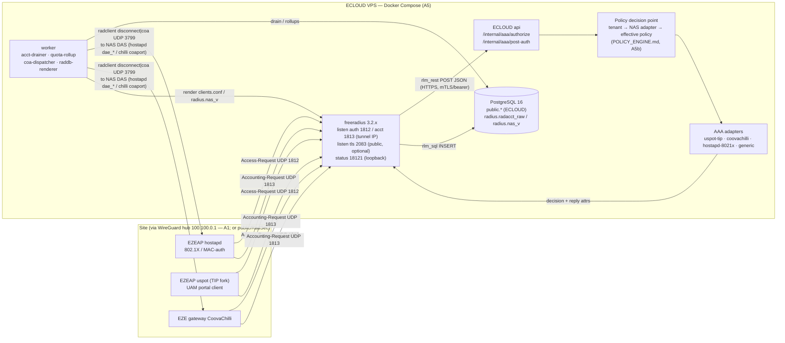
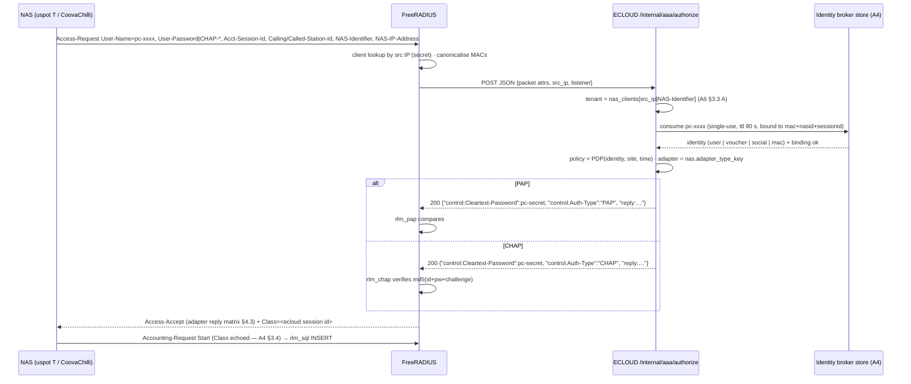

# AAA_ARCHITECTURE.md — ECLOUD AAA / RADIUS design (FreeRADIUS 3.2 front-end, ECLOUD as policy decision point)

Author: A3 (AAA / RADIUS Agent). Phase 2 — design + protocol validation only. Nothing was installed, deployed or changed on any host or device; no secrets are recorded (placeholders only).
Evidence labels: **VERIFIED FROM EXISTING CODE** (local path) · **VERIFIED FROM OFFICIAL DOCUMENTATION** (upstream URL) · **PROPOSED** · **UNKNOWN** · **REQUIRES DEVICE TEST**.
Verified inputs reused (not re-derived): `NETWORK_INTEGRATION.md` (A2), `CAPTIVE_PORTAL_ARCHITECTURE.md` (A4), `DATABASE_DESIGN.md` + `MULTITENANCY.md` (A6), `WIREGUARD_ARCHITECTURE.md` (A1), `DEPLOYMENT_ARCHITECTURE.md` (A5). FreeRADIUS facts come from the `v3.2.x` branch of `github.com/FreeRADIUS/freeradius-server` fetched 2026-10-07 into `/Users/danny/.claude/jobs/6ede8b14/tmp/p2/a3/fr/` (file `VERSION` = `3.2.11`; latest tagged release `release_3_2_10`; line numbers below refer to those copies).

## 0. Headline decisions (PROPOSED unless labelled)

1. **FreeRADIUS 3.2.x is a protocol front-end only.** Every Access-Request becomes one `rlm_rest` HTTPS call to ECLOUD `POST /internal/aaa/authorize`; ECLOUD resolves tenant → NAS adapter → policy and answers with a decision plus the reply attributes for *that* NAS type. No subscriber data, policy or secret lives in FreeRADIUS config except NAS client secrets (rendered) — A6 option (c) hybrid, confirmed here.
2. **Accounting goes through `rlm_sql` (PostgreSQL) insert-only** into `radius.radacct_raw` (A6), not through HTTP. The shipped `queries.conf` is per-status-type and editable, so insert-only is a configuration change, not a code change (§5). An ECLOUD worker drains the table.
3. **Password handling:** all captive-portal logins use the A4 identity-broker **portal credential** (random, ≤16 bytes, 90 s, single-use). FreeRADIUS never needs the subscriber's real password for PAP/CHAP; subscriber passwords stay Argon2-hashed in ECLOUD. Only 802.1X PEAP-MSCHAPv2 would need an NT-hash (or cleartext) — rlm_mschap can authenticate "via plain-text passwords (User-Password) or NT passwords (NT-Password)" (`man/man5/rlm_mschap.5` l.27-30, VERIFIED FROM OFFICIAL DOCUMENTATION). Recommendation: offer EAP-TTLS/PAP first; PEAP only for tenants that opt in to NT-hash storage (§2.6).
4. **Dynamic authorization is ECLOUD-initiated** by a `coa-dispatcher` worker using `radclient … disconnect|coa` (port 3799 default, `man/man1/radclient.1` l.134) over the WireGuard hub address; FreeRADIUS `originate-coa` is only usable when a packet is *being processed* (it is triggered from `update coa {}` in a request section, `sites-available/originate-coa` l.23-38) — useful for "reject-and-kick" cases, not for admin-initiated disconnects.
5. **BlastRADIUS (CVE-2024-3596):** `security { require_message_authenticator = yes; limit_proxy_state = auto }` globally (3.2.x default, `raddb/radiusd.conf.in` l.840, l.931); per-NAS relaxation to `auto`/`no` only where a device test shows the NAS does not send `Message-Authenticator`. RadSec (TCP 2083, `sites-available/tls`) for any NAS reached over the public internet.

## 1. Role of AAA in ECLOUD



| Layer | Owns | Must not do | Label |
|---|---|---|---|
| FreeRADIUS | packet parsing, client secrets/authentication of the NAS, EAP termination (TLS), attribute normalisation, SQL accounting insert, logging | policy decisions, user lookups, tenant logic | PROPOSED |
| ECLOUD api (`/internal/aaa/*`) | tenant resolution (A6 §3.3), identity verification (portal credential, MAC, voucher, 802.1X inner identity), policy evaluation, reply-attribute translation per NAS adapter, `auth_events` | emit attributes not verified for that NAS type | PROPOSED |
| worker | accounting drain → `sessions`/`usage_counters`, quota breach → disconnect, `coa-dispatcher`, raddb render + reload | — | PROPOSED |

Rule 4 of the brief (intent vs enforcement): policy intent is stored once; the adapter chosen by `nas_clients.adapter_type_key` (A6) decides which RADIUS attributes are emitted (§4.3). A policy field the adapter cannot express is reported as "not enforceable on this NAS" in `policy_translations` (A6), never silently dropped.

## 2. Authentication flows

### 2.1 Common FreeRADIUS request pipeline (virtual server `ecloud`, PROPOSED; module names VERIFIED in `raddb/sites-available/default` and `raddb/policy.d/*`)

```
authorize {
  filter_username                                # policy.d/filter (default l.311)
  rewrite_calling_station_id                     # policy.d/canonicalization → AA-BB-CC-DD-EE-FF
  rewrite_called_station_id                      # → Called-Station-Id MAC + Called-Station-SSID
  if (!EAP-Message) { update reply { Message-Authenticator := 0x00 } }   # freeradius.org/security BlastRADIUS guidance
  eap { ok = return }                            # 802.1X outer: hand to rlm_eap
  rest                                           # POST /internal/aaa/authorize → control:Auth-Type + reply attrs
}
authenticate { Auth-Type PAP { pap }  Auth-Type CHAP { chap }  Auth-Type MS-CHAP { mschap }  eap }
post-auth    { rest.post-auth (async-safe, 204)  linelog  Post-Auth-Type REJECT { attr_filter.access_reject  linelog } }
```
`rewrite_calling_station_id` / `rewrite_called_station_id` / `split_username_nai` exist as shipped policies (`raddb/policy.d/canonicalization`, VERIFIED FROM OFFICIAL DOCUMENTATION). `rlm_rest` sections `authorize`, `authenticate`, `preacct`, `accounting`, `post-auth`, `pre-proxy`, `post-proxy` each take `uri`, `method`, `body` (`none|post|json`), `data`, `force_to`, `tls`, `auth`, `timeout` (default 4.0 s), `chunk`, `do_xlat`, `is_json` (`raddb/mods-available/rest` l.85-125, l.252-307, VERIFIED FROM OFFICIAL DOCUMENTATION). Set `do_xlat = no` in every section — the file warns that response values are otherwise xlat-expanded, i.e. an API echoing untrusted input becomes an injection vector (rest l.200-225).

### 2.2 (a) UAM via portal-issued single-use credential — uspot (TIP) and CoovaChilli

Verified mechanics (A4 §3.3/§3.4/§4): NAS `/logon` does PAP (`User-Password`, XOR-encoded over the LAN hop when `uam_secret` is set) or CHAP (`CHAP-Password` + `CHAP-Challenge`); Access-Request carries `User-Name`, `Acct-Session-Id` (= UAM `sessionid`), `Calling-Station-Id`, `Called-Station-Id` (TIP: `nasmac:ssid`), `NAS-Identifier`, `NAS-IP-Address`, `NAS-Port-Type=19`, `Framed-IP-Address`, `WISPr-Logoff-URL`; CoovaChilli additionally `Message-Authenticator`, `Service-Type`, `CoovaChilli-Version/Lang/OriginalURL`.


Why the cleartext of the *portal credential* may be returned to FreeRADIUS: it is a random 90-second secret generated by ECLOUD, not the subscriber's password. `rlm_pap` needs a "known good" password in `control:` with one of the headers `{clear}|{crypt}|{md5}|{smd5}|{sha}|{ssha}|{sha2…}|{ssha…}|{nt}` (`man/man5/rlm_pap.5` l.40-91) — Argon2 is **not** in that list, so verifying real subscriber passwords inside FreeRADIUS would force a weaker hash. The broker approach avoids this entirely (PROPOSED). Alternative for direct username/password NAS logins (§2.5): `rlm_rest authenticate` section posts `User-Password` to ECLOUD, which verifies Argon2 itself (PAP only; CHAP needs a reversible or cleartext secret and is therefore only accepted for broker credentials).

### 2.3 (b) MAC authentication

| NAS path | Request shape | Verification | Label |
|---|---|---|---|
| hostapd `radius.authentication.mac-filter: true` (A2 §4) | `User-Name` = station MAC, password = MAC (format decided by hostapd) | A2: username/password format **REQUIRES DEVICE TEST** | VERIFIED CODE (schema) / REQUIRES DEVICE TEST |
| uspot (T) `mac-auth: true` | `User-Name = formatted MAC + mac_suffix`, `User-Password = mac_passwd || formatted MAC`, `Service-Type = 10` (Call-Check), comment cites `wiki.freeradius.org/guide/mac-auth` (`wlan-ap/feeds/ucentral/uspot/files/usr/share/uspot/handler.uc` l.23-27) | VERIFIED FROM OFFICIAL DOCUMENTATION (source) | |
| CoovaChilli `macauth` | `macpasswd` default `password`, `macsuffix` (A4 §4) | VERIFIED FROM OFFICIAL DOCUMENTATION | |

ECLOUD handling (PROPOSED): after `rewrite_calling_station_id`, the adapter treats a request as MAC-auth when `Service-Type == Call-Check` **or** `User-Name` (after stripping configured suffix) equals `Calling-Station-Id` normalised; lookup `(organization_id, mac)` in `client_devices` (A6); never compare the MAC "password" as a secret — it is public — so MAC-auth acceptance is gated on the NAS being a known client, the device being allow-listed/known and the policy allowing MAC login. Reply: `Auth-Type := Accept` (`control`) so no password check runs. Standard `Service-Type` value `Call-Check = 10` (`share/dictionary.rfc2865` l.70, VERIFIED).

### 2.4 (c) 802.1X WPA-Enterprise (PEAP / TTLS)

VERIFIED about EZEAP (A2 §4): hostapd EAP with `radius.authentication{host,port,secret,secondary,request-attribute[]}`, `radius.accounting{…,interval 60-600}`, `nas-identifier`, `chargeable-user-id`, `dynamic_vlan=1` always rendered, `dynamic-authorization` DAS; bandwidth attributes **not** honoured by hostapd (UNKNOWN/REQUIRES DEVICE TEST); `Session-Timeout` honouring REQUIRES DEVICE TEST.

FreeRADIUS side (VERIFIED FROM OFFICIAL DOCUMENTATION, `raddb/mods-available/eap`): `default_eap_type` (l.27, set to `peap` or `ttls`), `tls-config tls-common` with `private_key_file`/`certificate_file`/`ca_file` (l.218-269), `tls_min_version = "1.2"` (l.541), `ttls { default_eap_type; copy_request_to_tunnel = no; use_tunneled_reply = no; virtual_server = "inner-tunnel" }` (l.875-943), `peap { default_eap_type = mschapv2; virtual_server = "inner-tunnel" }` (l.1005-1064). Inner reply attributes are promoted to the outer reply via `update outer.session-state { … }` in the inner-tunnel post-auth (`sites-available/inner-tunnel` l.363-408; `use_tunneled_reply` is the legacy switch).

```mermaid
sequenceDiagram
  participant S as Supplicant
  participant H as EZEAP hostapd
  participant F as FreeRADIUS (outer: ecloud, inner: inner-tunnel)
  participant E as ECLOUD authorize
  S->>H: EAPOL-Start / Identity (outer: anonymous@tenant or user)
  H->>F: Access-Request EAP-Message, Calling-Station-Id, Called-Station-Id(MAC:SSID), NAS-Identifier
  F-->>H: Access-Challenge … TLS handshake (server cert from ECLOUD PKI)
  Note over F: inner-tunnel: TTLS/PAP → User-Password visible to FreeRADIUS; PEAP → MSCHAPv2
  F->>E: POST authorize {outer_identity, inner User-Name, eap_type, nas…, inner User-Password (TTLS/PAP only)}
  alt TTLS/PAP
    E-->>F: 200 {"control:Auth-Type":"Accept"} after Argon2 verify, + reply attrs
  else PEAP-MSCHAPv2
    E-->>F: 200 {"control:NT-Password":"0x…", "reply:…"}  (needs stored NT-hash)
  end
  F-->>H: Access-Accept (+ Tunnel-Type=VLAN, Tunnel-Medium-Type=IEEE-802, Tunnel-Private-Group-Id — REQUIRES DEVICE TEST) + Class
  H->>F: Accounting Start (hostapd acct_server/acct_interval)
```
Status: EAP-TTLS/PAP = **PROPOSED default** (hashed passwords stay hashed); PEAP-MSCHAPv2 = PROPOSED optional per tenant with NT-hash storage (security trade-off documented for A8). Anonymous outer identity handling in §7.

### 2.5 (d) Direct username/password on the NAS and (e) vouchers

| Flow | NAS | RADIUS shape | ECLOUD handling | Label |
|---|---|---|---|---|
| uspot `auth-mode: radius` local splash (A2 §4, wlan-testing `test_radius_user_and_pass_*`) | EZEAP | PAP/CHAP with the **real** subscriber username/password | PAP: `rest.authenticate` verifies Argon2 in ECLOUD. CHAP: cannot be verified against Argon2 → reject with `Reply-Message` unless the tenant enables reversible credentials (not recommended); `raddb/mods-available/chap` warns CHAP over RADIUS/UDP "can be cracked in milliseconds". | VERIFIED CODE (payload) / PROPOSED |
| Voucher | any portal NAS | voucher code never on the RADIUS wire; portal redeems → broker credential (A4 §7.6) | identity = voucher; `Session-Timeout = min(remaining validity, policy)`; quota attrs from remaining bytes | PROPOSED |
| Voucher typed as username/password on a NAS splash | uspot radius mode | `User-Name = voucher code`, `User-Password = code` or fixed | adapter detects voucher namespace (prefix / alphabet) → `vouchers.code_hash` (HMAC, A6) → `control:Auth-Type := Accept` (PAP only; CHAP impossible with HMAC storage) | PROPOSED |

### 2.6 Password storage implications (PROPOSED policy)

| Method | FreeRADIUS needs in `control:` | ECLOUD storage consequence |
|---|---|---|
| PAP (UAM, TTLS/PAP, splash) | any `rlm_pap` header **or** nothing if ECLOUD verifies via `rest.authenticate` | Argon2id in `users.password_hash` (A6) — unchanged |
| CHAP (UAM, splash) | `Cleartext-Password` | only for broker credentials / vouchers with `code_enc` (A6) — never for subscriber passwords |
| MS-CHAPv2 (PEAP) | `NT-Password` or `Cleartext-Password` (`rlm_mschap.5` l.27-30) | optional `users.nt_hash` column (MD4) — tenant opt-in, flagged in A8 risk register |
| EAP-TLS | none (certificate) | out of scope for pilot |

## 3. NAS / client model

| Question | Decision | Evidence |
|---|---|---|
| How FreeRADIUS learns clients | **Pilot:** worker renders `clients.conf` fragments from `nas_clients` (secret decrypted from the secret store at render time, file 0600, A5 §secrets) + `radmin add client file <file>` / container restart for changes. **Later:** `rlm_sql read_clients = yes` with `client_table = "nas"` (`mods-available/sql` l.374-377) pointed at `radius.nas_v` (A6 §4.2 item 3), or `sites-available/dynamic-clients` (`client dynamic { ipaddr = <cidr>; dynamic_clients = <vserver>; lifetime = 3600 }`, l.36-96) with the `dynamic_clients` virtual server doing `%{sql: SELECT secret FROM nas WHERE nasname='%{Packet-Src-IP-Address}'}` (l.181-192). | VERIFIED FROM OFFICIAL DOCUMENTATION; choice PROPOSED |
| Secret per NAS | One secret per `nas_clients` row (`secret_ref`, A6). clients.conf recommends ≥16, preferably 32 random chars, up to 8 k (`raddb/clients.conf` l.97-107). Tenant-block CIDR clients (`ipaddr = 100.100.T.0/24`, l.53/357) are allowed by FreeRADIUS but **not used**: one secret per tenant would make `require_message_authenticator = auto` per-IP impossible (radiusd.conf.in l.820-826 "no effect for a client which uses a network IP/mask") and widens blast radius. | VERIFIED / PROPOSED |
| NAS IP vs source IP | FreeRADIUS matches the **UDP source IP** to a `client`; `NAS-IP-Address` is just an attribute the NAS fills (uspot T sends its `SERVER_ADDR`, A4 §3.4; behind gateway NAT it would differ from the source). Rule: tenant resolution uses `Packet-Src-IP-Address` (sent to ECLOUD as `src_ip`) first, `NAS-Identifier` second (A6 §3.3 A); `NAS-IP-Address` is logged only. Over WireGuard option A the gateway must route (not NAT) so each AP keeps a stable LAN source (A1 §4.1); option B gives tunnel IPs. | PROPOSED on top of A1/A6 |
| Public IP + NAT (A1 option C) | Source IP = site WAN IP (dynamic, shared by all NAS at the site) → one `client` per site, `NAS-Identifier` mandatory for per-NAS resolution, and radiusd.conf.in l.828-838 warns that multiple NAS behind one NAT force the *most insecure* Message-Authenticator setting. Hence option C is **RadSec-only** for Access-Requests. | VERIFIED (FreeRADIUS text) / PROPOSED |
| RadSec | `listen { ipaddr = *; port = 2083; type = auth+acct; proto = tcp; clients = radsec; tls { private_key_file; certificate_file; ca_file; fragment_size = 8192; require_client_cert = yes } }`, `clients radsec { client … { proto = tls; secret = radsec } }` (`sites-available/tls` l.52-76, l.189-256, l.441, l.547-564). Client identity = certificate; per-NAS certs issued by ECLOUD PKI (A8). EZEAP side: `service.radius-proxy` realm `protocol: radsec` (A1/A2 — VERIFIED schema, REQUIRES DEVICE TEST). | VERIFIED FROM OFFICIAL DOCUMENTATION |
| Tenant resolution | A6 §3.3: A (NAS identity) mandatory, C (`Called-Station-Id` SSID via `Called-Station-SSID` from `rewrite_called_station_id`) refines, B (realm) optional. | A6 |
| Unknown client | FreeRADIUS does not answer packets from an IP without a `client` (no secret → cannot validate); nothing reaches ECLOUD. Dynamic-clients comment: the cache "with a configurable lifetime" is "part of protection from Denial of Service" (`dynamic-clients` l.15-26). nftables on the hub limits 1812/1813 to `100.100.0.0/16` (A1 §9). | VERIFIED / A1 |

## 4. Authorization

### 4.1 `rlm_rest` → `POST https://api-internal/internal/aaa/authorize` (PROPOSED contract)

Config (`mods-available/rest`): `connect_uri`, `body = json`, `method = post`, `timeout = 1.5`, `do_xlat = no`, `tls { ca_file; certificate_file; private_key_file }` (mTLS to the api container) or `auth = basic` with a service token from the secret store; `pool { start; min; max; spare; uses; lifetime; idle_timeout }` (l.326-380). With `body = json` the module serialises **all request attributes** as `{"<attr>":{"type":…,"value":[…]}}` (l.150-172); ECLOUD reads the fields below and ignores the rest.

| Payload field (JSON key) | Source | Purpose |
|---|---|---|
| `User-Name`, `Stripped-User-Name`, `Stripped-User-Domain` | request / `split_username_nai` | identity, optional realm |
| `Calling-Station-Id` (normalised `AA-BB-…`) | `rewrite_calling_station_id` | MAC identity, binding check, concurrency |
| `Called-Station-Id`, `Called-Station-SSID`, `Called-Station-MAC` | `rewrite_called_station_id` | site/SSID refinement (A6 §3.3 C) |
| `NAS-Identifier`, `NAS-IP-Address`, `NAS-Port-Type`, `NAS-Port-Id` | request | tenant/NAS resolution |
| `Packet-Src-IP-Address`, `Packet-Dst-Port`, `FreeRADIUS-Client-Shortname` (added via `update request` in authorize) | server | **primary** client identity |
| `Acct-Session-Id`, `Framed-IP-Address` | request | correlation with UAM `sessionid` (A4) and portal binding |
| `Service-Type`, `Chargeable-User-Identity` | request | MAC-auth detection, CUI |
| `User-Password` (TTLS/PAP inner, UAM PAP) | request | only in `authenticate`-style verification; **never logged** |
| `CHAP-Password`, `CHAP-Challenge` presence flags | request | tells ECLOUD CHAP is in use (ECLOUD returns cleartext only for broker credentials) |
| `EAP-Type`, outer `User-Name` (`outer.request:User-Name`) | inner-tunnel | 802.1X policy, anonymous outer |
| `Message-Authenticator` present (bool) | request | per-NAS BlastRADIUS posture telemetry |
| `WISPr-Logoff-URL`, `WISPr-Location-Name`, `ChilliSpot-*`/`CoovaChilli-*` request VSAs | request | adapter fingerprinting (chilli vs uspot) |

### 4.2 Response (rlm_rest JSON policy, VERIFIED format `mods-available/rest` l.176-199, 229-250)

```json
{ "control:Auth-Type": "Accept",
  "control:Cleartext-Password": "<broker secret>",
  "reply:Session-Timeout": 3600, "reply:Idle-Timeout": 600, "reply:Acct-Interim-Interval": 300,
  "reply:WISPr-Bandwidth-Max-Down": 20000000, "reply:WISPr-Bandwidth-Max-Up": 5000000,
  "reply:ChilliSpot-Max-Total-Octets": 2147483648,
  "reply:Class": "0x<ecloud-session-uuid-hex>",
  "reply:Reply-Message": {"value": ["Welcome"], "op": ":="} }
```
HTTP code → module code mapping (rest l.236-248): `2xx` body processed → `ok/updated`; `204` → ok (no body); `401` → **reject** (body processed, so `Reply-Message` can be set); `403` → `userlock`; `404/410` → `notfound`; `5xx` → `fail`. ECLOUD therefore answers **401** for policy rejections (quota exhausted, concurrency, schedule, validity, tenant mismatch) and **200** with `control:Auth-Type` for accepts. A `fail` (api down) is handled in FreeRADIUS unlang with `rest { fail = 1 } if (fail) { reject }` plus `linelog` alert — no "fail-open" (PROPOSED). `op` defaults to `:=`; multi-valued attributes use `"op":"+="` (l.184-199). The status code is readable as `%{reply:REST-HTTP-Status-Code}` (l.250).

### 4.3 Reply attribute matrix per NAS adapter

Dictionary facts (VERIFIED FROM OFFICIAL DOCUMENTATION, `share/dictionary.wispr`, `share/dictionary.chillispot`, `share/dictionary.rfc2865/2868/2869/3580`): WISPr vendor **14122** — `WISPr-Redirection-URL 4`, `WISPr-Bandwidth-Max-Up 7`, `WISPr-Bandwidth-Max-Down 8` (integer), `WISPr-Session-Terminate-Time 9`; ChilliSpot vendor **14559** — `Max-Input/Output/Total-Octets 1/2/3`, `Bandwidth-Max-Up/Down 4/5`, `Config 6`, `UAM-Allowed 100`, `MAC-Allowed 101`, `Interval 102`; standard `Session-Timeout 27`, `Idle-Timeout 28`, `Class 25`, `Acct-Interim-Interval 85`, `Tunnel-Type 64` (`VLAN = 13`, rfc3580 l.18), `Tunnel-Medium-Type 65` (`IEEE-802 = 6`), `Tunnel-Private-Group-Id 81` (tagged). **Gap:** FreeRADIUS's `dictionary.chillispot` has **no** `ChilliSpot-Max-*-Gigawords 21/22/23`, which uspot upstream's radcli dictionary defines (`f00b4r0/uspot files/etc/radcli/dictionary.chillispot`) and CoovaChilli uses as `CoovaChilli-Max-*-Gigawords` (A4 §4); ECLOUD ships `raddb/dictionary` additions for 21-23 (and `CoovaChilli-*` aliases, same vendor id) — PROPOSED.

Units: WISPr-Bandwidth = **bit/s**; ChilliSpot-Bandwidth = **kbit/s** (×1000 in uspot, A2 §2/A4 §3.4). Max-Total-Octets on TIP uspot is a 32-bit integer (≈4 GiB cap, A4).

| Policy field (intent) | uspot (TIP fork, EZEAP) | CoovaChilli (EZE gateway) | hostapd 802.1X / MAC-auth (EZEAP) | Label |
|---|---|---|---|---|
| Download rate | `WISPr-Bandwidth-Max-Down` bit/s (alt. `ChilliSpot-Bandwidth-Max-Down` kbit/s) | same (also `CoovaChilli-Bandwidth-Max-Down`) | **none verified** → fall back to per-SSID `rate-limit` via config adapter (A2 §7.2) | VERIFIED DOCS (uspot/chilli) · UNKNOWN (hostapd) |
| Upload rate | `WISPr-Bandwidth-Max-Up` | same | none verified | as above |
| Burst | ECLOUD stores; **not expressible** (ratelimit fixed `burst 2k`, A2 §2) | not via RADIUS (A4 §7.5) | — | VERIFIED (absence) |
| Session timeout / validity | `Session-Timeout = min(policy, remaining validity)` | same, or `WISPr-Session-Terminate-Time` | `Session-Timeout` candidate | VERIFIED (uspot/chilli) · REQUIRES DEVICE TEST (hostapd) |
| Idle timeout | `Idle-Timeout` | `Idle-Timeout` | hostapd `max-inactivity` is per-SSID config only | VERIFIED · UNKNOWN |
| Interim interval | `Acct-Interim-Interval` — only effective if uCentral `acct-interval` unset (`uspot.uc` l.216-222: local `acct_interval` wins) | `Acct-Interim-Interval` (<60 ignored) | hostapd `acct_interval` from config `radius.accounting.interval` 60-600 | VERIFIED |
| Per-session quota | `ChilliSpot-Max-Total-Octets` (32-bit) | `CoovaChilli-Max-{Input,Output,Total}-Octets` + `-Gigawords` | — | VERIFIED |
| Daily / monthly / total quota | **ECLOUD-side**: emit remaining as session quota + reject at authorize when exhausted; disconnect on breach from accounting | same (+ CoA to tighten) | ECLOUD-side reject / Disconnect | PROPOSED |
| Concurrent devices/sessions | ECLOUD counts active `sessions` per subject at authorize → 401; or Disconnect oldest | same | same | PROPOSED |
| Schedule | ECLOUD: reject outside window; `Session-Timeout` = seconds to window end | same | same | PROPOSED |
| VLAN | not honoured (A4 §3.4) | `CoovaChilli-VLAN-Id` | `Tunnel-Type=VLAN(13)`, `Tunnel-Medium-Type=IEEE-802(6)`, `Tunnel-Private-Group-Id=<vid>`; renderer sets `dynamic_vlan=1` | REQUIRES DEVICE TEST |
| Correlation | `Class = ecloud session id` (copied to accounting, A4) | `Class` echoed | `Class` (standard) | VERIFIED (uspot/chilli) |
| Post-login redirect | none via RADIUS (portal `res=success`) | `WISPr-Redirection-URL` | — | VERIFIED |
| Reject message | `Reply-Message` not surfaced (T) | `reply=` in `res=failed` | — | VERIFIED |

Adapter `generic_radius` (A6 `adapter_types`) emits only standard attributes (`Session-Timeout`, `Idle-Timeout`, `Acct-Interim-Interval`, `Class`) — PROPOSED.

## 5. Accounting pipeline

### 5.1 Path decision

| Option | Pros | Cons | Decision |
|---|---|---|---|
| `rlm_sql` → PostgreSQL | durable, pooled, no HTTP dependency; shipped queries already fold Gigawords (`queries.conf` l.519-522: `(Gigawords::bigint << 32) + Octets`) and compute `event_timestamp` from `Event-Timestamp` else receive time (l.54-59) | FreeRADIUS needs a DB role (A6: `INSERT` only on `radius.radacct_raw`) | **primary** (PROPOSED) |
| `rlm_rest accounting` → `/internal/aaa/accounting` | real-time hooks | every packet an HTTP call; api outage = `fail` → NAS retransmits → duplicates; HTTP timeout default 4 s blocks worker threads | not in pilot; optional later for Stop-only webhooks |

### 5.2 Insert-only queries (VERIFIED editable, PROPOSED content)

Shipped PostgreSQL `accounting { type { start { query = INSERT…; query = UPDATE… } interim-update { query = UPDATE…; query = INSERT… } stop { query = UPDATE…; query = INSERT… } accounting-on/off { UPDATE … bulk close } } }` (`raddb/mods-config/sql/main/postgresql/queries.conf` l.284-622) — each type is an ordered list where the next query runs if the previous affected 0 rows. ECLOUD's `queries.conf` replaces every list with a **single** `INSERT INTO radius.radacct_raw (…, acctstatustype, received_at) VALUES (…) ON CONFLICT DO NOTHING`, including `accounting-on/off` rows, so `radacct` semantics (mutable row per session) move to the worker. Idempotency key (unique index): `(acctuniqueid, acctstatustype, acctsessiontime, acctinputoctets, acctoutputoctets)` — a NAS retransmit of the same packet is a no-op; a genuinely new Interim differs in `Acct-Session-Time`. `AcctUniqueId` comes from the shipped `acct_unique` policy: `md5(User-Name, Acct-Session-ID, NAS-IP(v6)-Address, NAS-Identifier, NAS-Port-ID, NAS-Port)` or, when the NAS echoes a server-generated `Class`, `md5(Class, Acct-Session-ID)` (`raddb/policy.d/accounting` l.40-60; `insert_acct_class` l.72-79). Since uspot and CoovaChilli echo `Class` (A4), ECLOUD enables `insert_acct_class` in post-auth so `Acct-Unique-Session-Id` is stable even if the NAS changes `NAS-IP-Address` after a reconnect (PROPOSED).

### 5.3 Worker (`acct-drainer`, PROPOSED; schema per A6 §5)

```mermaid
sequenceDiagram
  participant N as NAS
  participant F as FreeRADIUS (preacct: acct_unique · accounting: sql)
  participant R as radius.radacct_raw
  participant W as worker acct-drainer
  participant P as public.sessions / accounting_records / usage_counters
  N->>F: Accounting-Request Start|Interim|Stop|On|Off (+Acct-Delay-Time, Event-Timestamp?)
  F->>R: INSERT (idempotent) ; Accounting-Response
  loop every 1-2 s or LISTEN/NOTIFY
    W->>R: SELECT … WHERE radacctid > watermark ORDER BY radacctid LIMIT 500
    W->>P: upsert session (monotonic octets), append accounting_records, usage_counters += delta
    W->>W: quota/validity breach? → enqueue session_actions(disconnect)
  end
```
Rules: event time = `Event-Timestamp` if present else `received_at − Acct-Delay-Time` (`Acct-Delay-Time 41`, `Event-Timestamp 55` — `share/dictionary.rfc2866/2869`); clock skew: NAS clocks are untrusted — store both, use `received_at` for ordering and the derived event time only for display/billing within ±5 min tolerance (PROPOSED). Counters monotonic per session (A6). Missing Stop: (1) uspot (T) Disconnect via hostapd DAS `client_kick(…, true)` sends **no Acct-Stop** (A4 §3.5) → `coa-dispatcher` closes the session on Disconnect-ACK; (2) `last_interim_at < now − 3 × interval` → `stale` (A6); (3) `Accounting-On/Off` from a NAS closes all its active sessions (uspot T sends On at start/Off at stop, A4 §3.4; chilli: UNKNOWN); (4) optional reconciliation against OpenWiFi `state.captive{}`/associations telemetry (A2 §6) — PROPOSED. Interim policy: ECLOUD emits `Acct-Interim-Interval = 300` (A6 sizing) but the uCentral `acct-interval` default 600 overrides it on uspot (A4 §1, device test #5), and hostapd uses `radius.accounting.interval`; recommendation to A2's config adapter: set NAS intervals explicitly to the plan value and treat the RADIUS attribute as informational. Backpressure: `rlm_sql` pool and PostgreSQL absorb bursts; if PG is down FreeRADIUS returns no Accounting-Response and the NAS retransmits (standard RADIUS) — acceptable loss tolerance for the pilot; optional `detail` module spool (`mods-available/detail`) as a disk buffer later.

## 6. Dynamic authorization (RFC 5176)

| NAS type | Listener | Required identification attributes | Disconnect | CoA (change attrs) | Acct-Stop after kick | Label |
|---|---|---|---|---|---|---|
| EZEAP hostapd (802.1X / MAC-auth) | `ssid.radius.dynamic-authorization {host uc-ip, port, secret}` → `dae_client/dae_port/dae_secret` + firewall `Allow-CoA` (A2 §2/§5) | `Calling-Station-Id` (+ `NAS-Identifier` for shared DAS port, A4 §3.5) | VERIFIED config path; **REQUIRES DEVICE TEST** | UNKNOWN → REQUIRES DEVICE TEST | expected from hostapd (UNKNOWN) | A2/A4 |
| EZEAP uspot (TIP fork) | **no own DAS**; uses hostapd DAS of the captive SSID → ubus `coa` → `client_kick` | `Calling-Station-Id` | REQUIRES DEVICE TEST | **not applied** (A4) | **no** (A4 §3.5) | A4 |
| uspot upstream (if present on EZEAP) | own DAS UDP 3799 `das_secret` (not configurable via uCentral) | User-Name, NAS-IP, NAS-Identifier, Framed-IP, Called/Calling-Station-Id, Acct-Session-Id, CUI | yes | `Session-Timeout`, `Idle-Timeout`, `Acct-Interim-Interval` only; NAKs unknown attrs incl. `Message-Authenticator` | yes | VERIFIED source · REQUIRES DEVICE TEST |
| CoovaChilli | `coaport` (default 0 = off); source must be a configured RADIUS server unless `coanoipcheck` | **`User-Name` mandatory**, `Acct-Session-Id` optional | yes (Admin-Reset) | re-applies timeouts/bandwidth/quota; `CoovaChilli-Session-State` | yes | VERIFIED FROM OFFICIAL DOCUMENTATION (A4 §4) · REQUIRES DEVICE TEST |

FreeRADIUS tooling (VERIFIED FROM OFFICIAL DOCUMENTATION): `radclient <host[:port]> {auth|acct|status|coa|disconnect|auto} <secret>`, `-r retries`, `-t timeout` (default 3 s), port 3799 for coa/disconnect (`man/man1/radclient.1` l.35, 111-134, 159-166); `home_server x { type = coa; port = 3799; secret; coa { irt = 2; mrt = 16; mrc = 5; mrd = 30 } }` + `update coa|disconnect { … }` in any non-proxy section, destination defaults to the originating client or `coa_server` / `Packet-Dst-IP-Address`/`Packet-Dst-Port` (`sites-available/originate-coa` l.23-110; `clients.conf` l.254).

`coa-dispatcher` worker (PROPOSED): consumes `session_actions` (A6); builds the packet per adapter (`User-Name` for chilli; `Calling-Station-Id` + `NAS-Identifier` for hostapd/uspot; always `Acct-Session-Id`, `Event-Timestamp`, `Message-Authenticator`), sends `radclient -r 3 -t 2 <nas_ip>:<coa_port> disconnect` from the worker container (which binds the hub tunnel address `100.100.0.1` so that the AP's `dynamic-authorization.host` `uc-ip` matches — A1 §5/A2 §4), records ACK/NAK + `Error-Cause` (`101`; `503 Session-Context-Not-Found`, `401 Unsupported-Attribute`, `402 Missing-Attribute`, `403 NAS-Identification-Mismatch` — `share/dictionary.rfc3576`), and on ACK closes the ECLOUD session when the adapter is known not to send Acct-Stop. Reachability: hub → site route must exist (AllowedIPs incl. AP LAN for option A, A1 §4.1); over public internet CoA is blocked by NAT (A1 option C) → status `unsupported`.

Policy-change propagation when CoA is unsupported (PROPOSED): the adapter caps `Session-Timeout` at `policy_refresh_s` (e.g. 900-3600 s) so re-authentication returns new attributes; on uspot the client re-passes the portal unless MAC-auth is on — owner decision (Q4). Disconnect + forced re-login is the fallback for immediate changes. Secrets: DAS/coa secret per NAS stored as `nas_clients.coa_secret_ref` (extension to A6 schema) and "SHOULD NOT be the same as the shared secret in a client section" (`originate-coa` l.93-94).

## 7. Realms / proxying for multi-tenancy

- Default: **no realm on the wire** (A6 Q2, §3.2); tenant from NAS identity. `rlm_realm` instance `suffix` (`mods-available/realm`) + `proxy.conf` `realm LOCAL { }` / `realm example.com { auth_pool … }` (l.888-966) are shipped; a realm with no pool is handled locally and `Stripped-User-Name` is set. ECLOUD does **not** proxy to other RADIUS servers in the pilot; `pre-proxy/post-proxy` disabled. VERIFIED FROM OFFICIAL DOCUMENTATION (files) / PROPOSED (use).
- Optional realm suffix for shared venues (A6 M2): `split_username_nai` policy yields `Stripped-User-Domain` → ECLOUD maps to `organizations.slug`; realm must agree with NAS-derived tenant or the request is rejected (A6 G2).
- EAP identities: outer `User-Name` may be `anonymous@<org-slug>` (RFC 7542 style); inner-tunnel `User-Name` is authoritative; ECLOUD receives both. Accounting from hostapd carries the **outer** identity unless the inner is promoted — enable `update outer.session-state { User-Name := … }` in inner-tunnel post-auth (`sites-available/inner-tunnel` l.363-408) and rely on `Class`/`Chargeable-User-Identity` (`radius.chargeable-user-id` in uCentral, A2 §4) for correlation. PROPOSED.

## 8. Security of AAA

| Control | Design | Evidence |
|---|---|---|
| Shared secrets | Per NAS, ≥32 random chars, stored encrypted (`secret_ref`, A6; `ENCRYPTION_KEY_FILE`, A5), rendered to 0600 files, rotated via UI with dual-secret overlap window (two `client` entries not possible for one IP → rotation = push new secret to NAS, then re-render) | `clients.conf` l.97-135; A5/A6 |
| BlastRADIUS CVE-2024-3596 | FreeRADIUS 3.2.5 (2024-07-09, `doc/ChangeLog` l.316-321) added `require_message_authenticator` / `limit_proxy_state`; defaults in 3.2.x `yes` / `auto` (`radiusd.conf.in` l.840, 931). Policy: global `yes`; per-NAS `auto` or `no` only after device test, stored as `nas_clients.require_message_authenticator` (A6 already has the column). Also always add `Message-Authenticator` to responses (`update reply { Message-Authenticator := 0x00 }`, freeradius.org/security). NAS support: CoovaChilli sends it in Access-Request (A4 §4 — VERIFIED); hostapd/uspot radcli **REQUIRES DEVICE TEST**. `limit_proxy_state` irrelevant (no proxies in front of FreeRADIUS). | `https://www.freeradius.org/security/`, `https://www.blastradius.fail/` (CVE-2024-3596, VU#456537) — VERIFIED FROM OFFICIAL DOCUMENTATION |
| Weak auth methods | CHAP / MS-CHAP over RADIUS/UDP crackable "in milliseconds" (`mods-available/chap`; ChangeLog 3.2.11 notes) → tunnel (WireGuard) or RadSec mandatory for every NAS; PAP exposes the broker credential only (90 s, single-use). | VERIFIED |
| RadSec for public NAS | §3; `require_client_cert = yes`; certificate CN/SAN bound to `nas_clients` row | `sites-available/tls` |
| Replay / duplicates | FreeRADIUS deduplicates retransmits by `(src, id, authenticator)` while the request is live (`cleanup_delay = 5`, `max_request_time = 30`, `radiusd.conf.in` l.236-255); accounting idempotency in SQL (§5.2); broker credential single-use + `Calling-Station-Id`/`NAS-Identifier`/`Acct-Session-Id` binding (A4 §7.7) | VERIFIED / PROPOSED |
| Rate limiting unknown clients | unknown source IPs are ignored (no secret); nftables allows 1812/1813 only from `wg0`/`100.100.0.0/16` (A1 §9) or from an allowlist set for option C; `max_requests = 16384` (l.274), `max_attributes = 200` (l.683), `reject_delay = 1` (l.712) slow brute force; ECLOUD per-`nasid+mac` login throttle (A4) | VERIFIED / A1 |
| Logging without secrets | `log { auth = no; auth_badpass = no; auth_goodpass = no }` (radiusd.conf.in l.454-479) stays off; `linelog` with explicit `format` excluding `User-Password`/`CHAP-Password`/secrets, `permissions = 0600` (file warns logs "may contain secret or private information", `mods-available/linelog` l.33-36, l.95-133); never run `-X` in production; ECLOUD redacts `User-Password` from the rest payload before persisting `auth_events.reply_summary` | VERIFIED / PROPOSED |
| Firewall / exposure | UDP 1812/1813 published on `100.100.0.1` only; 2083/tcp public only if option C is approved; 3799 **not** listened on the VPS (CoA originates from the worker); Status-Server 18121 loopback | A1 §9, A5 §2.1 |
| Response attribute filtering | `attr_filter.access_reject` in `Post-Auth-Type REJECT`, `attr_filter.coa` for outgoing CoA (`mods-config/attr_filter/*`) | VERIFIED (files) |

## 9. FreeRADIUS container design (PROPOSED)

| Item | Decision | Evidence |
|---|---|---|
| Image | `freeradius/freeradius-server:3.2.10` (Docker Hub official; tags `3.2.10`, `3.2.10-alpine` published 2026-06; pin by digest in prod). Branch `VERSION` 3.2.11 has no image yet. | Docker Hub tags API (fetched 2026-10-07); `github.com/FreeRADIUS/freeradius-server/tags` (`release_3_2_10`) — VERIFIED FROM OFFICIAL DOCUMENTATION |
| Config generation | Worker `raddb-renderer` writes `clients.conf` + `dictionary` + `mods-available/{rest,sql}` + `sites-enabled/{ecloud,inner-tunnel,status[,tls]}` from templates (placeholders in git) into the `fr_config` volume; validate with `radiusd -C -d /etc/raddb` in a one-shot container before swap | `raddb/README.rst`; A5 §secrets |
| Reload | client add without restart: `radmin -e "add client file <path>"`; `radmin hup [module]` sends HUP to the server or one module (`man/man8/radmin.8` l.93-96, l.111-112); anything else → `docker compose up -d freeradius` (UDP clients retransmit, ≤3 s gap) | VERIFIED FROM OFFICIAL DOCUMENTATION |
| Health check | `security.status_server = yes` (default, radiusd.conf.in l.737); dedicated `listen { type = status; port = 18121 }` with an admin client (`sites-available/status` l.31-55); probe `echo "Message-Authenticator = 0x00" | radclient 127.0.0.1:18121 status <adminsecret>` (`radclient.1` l.191) | VERIFIED |
| Metrics | Status-Server `FreeRADIUS-Statistics-*` via `bvantagelimited/freeradius_exporter` when Prometheus exists (A5 §monitoring); until then `linelog` counters | A5 |
| Logs | `linelog` to stdout/syslog → Docker json-file → Loki later (A5); request-level debug only via `radmin debug condition '(Calling-Station-Id == "…")'` (radmin.8 l.76-89) | VERIFIED |
| Ports | `100.100.0.1:1812-1813/udp`; optional `57.129.69.122:2083/tcp` (RadSec) behind nftables; no 3799 listener; 18121 loopback | A1/A5 |
| Resources | 192 MiB limit / 96 MiB reservation / 0.5 vCPU (A5 §2.2); rest pool `max = 8`, sql pool `max = 8`; `max_requests = 16384` default fits | A5 |
| Secrets in container | `clients.conf` and `radius_db` DSN mounted read-only from rendered 0600 files; `sslmode=verify-full` DSN form documented in `mods-available/sql` l.195 | VERIFIED |

## 10. Test matrix hand-off (A9)

| ID | Scenario | Tool | Pass criterion |
|---|---|---|---|
| T-A1 | UAM PAP via broker credential (uspot T) | portal → `/logon`; `radclient auth` replay of captured request | Accept; attrs per §4.3; `auth_events.accept`; second use of same credential → 401/Reject |
| T-A2 | UAM CHAP via broker credential (chilli) | `/json/logon` CHAP; `radclient` with `CHAP-Password` | Accept; CHAP with real subscriber password → Reject + `Reply-Message` |
| T-A3 | MAC-auth hostapd `mac-filter` / uspot `mac-auth` / chilli `macauth` | real devices + capture | observe `User-Name`/password format and `Service-Type`; known MAC → Accept; unknown → Reject |
| T-A4 | 802.1X EAP-TTLS/PAP and PEAP-MSCHAPv2 | `eapol_test` (wpa_supplicant) against FreeRADIUS; then real EZEAP SSID | inner identity reaches ECLOUD; Accept with `Class`; PEAP without NT-hash → Reject |
| T-A5 | Tenant isolation | `radclient` from NAS of A with user of B (A6 T-05/06/08) | Reject; `auth_events.organization_id = A` |
| T-A6 | Accounting Start/Interim/Stop, Gigawords, duplicates | `radclient acct` scripted incl. retransmit and >4 GiB octets | one `radacct_raw` row per distinct packet; `sessions` monotonic; `usage_counters` delta correct |
| T-A7 | Missing Stop / stale / Acct-On-Off | kill uspot client via DAS; restart uspot | session closed by dispatcher ACK or stale job; On/Off bulk close |
| T-A8 | Disconnect per NAS type | `radclient … disconnect` → hostapd DAS (802.1X and captive SSID), chilli `coaport`, uspot-U DAS if present | ACK, client offline, Acct-Stop presence recorded |
| T-A9 | CoA attribute change | `radclient … coa` with new `Session-Timeout`/`WISPr-*` to chilli and hostapd | chilli applies live; hostapd/uspot-T outcome documented |
| T-A10 | Attribute honouring | iperf3 before/after Accept with `WISPr-Bandwidth-Max-*` 2/5/20 Mbit/s; `ChilliSpot-Max-Total-Octets` 50 MB; `Idle-Timeout` 60 s | measured within ±10 %; quota Stop cause 5; idle Stop cause 4 |
| T-A11 | Dynamic VLAN | Accept with `Tunnel-*` on 802.1X SSID (`vlan-awareness` set) | client lands in VLAN; else document NAK/ignore |
| T-A12 | BlastRADIUS posture | capture Access-Request from each NAS type | `Message-Authenticator` present? set per-NAS flag accordingly |
| T-A13 | RadSec | EZEAP `service.radius-proxy` realm `radsec` → VPS 2083; `socat` test from `sites-available/tls` l.543 | TLS handshake with client cert; auth works with UDP blocked |
| T-A14 | Resilience | stop api container during logins; stop postgres during accounting | logins Reject (no fail-open); accounting retransmits recovered; Status-Server still answers |
| T-A15 | Interim precedence | uCentral `acct-interval` unset vs 120 vs RADIUS 300 | observe interval actually used (A4 device test #5) |

## 11. Evidence index

| # | Source | Label | Used in |
|---|---|---|---|
| E1 | `/Users/danny/Project/EZECLOUD/NETWORK_INTEGRATION.md` (A2) §2, §4, §5, §7.2 | A2 verified inputs | §2.3, §2.4, §4.3, §6 |
| E2 | `/Users/danny/Project/EZECLOUD/CAPTIVE_PORTAL_ARCHITECTURE.md` (A4) §3.4-3.6, §4, §7.1, §7.5, §7.7 | A4 verified inputs | §2.2, §2.3, §4.3, §5.3, §6 |
| E3 | `/Users/danny/Project/EZECLOUD/DATABASE_DESIGN.md` §3.2, §4, §5; `MULTITENANCY.md` §3.2-3.3, §6 (A6) | A6 proposals | §3, §5 |
| E4 | `/Users/danny/Project/EZECLOUD/WIREGUARD_ARCHITECTURE.md` §4-6, §9 (A1); `DEPLOYMENT_ARCHITECTURE.md` §2 (A5) | A1/A5 proposals | §3, §6, §8, §9 |
| E5 | `https://raw.githubusercontent.com/FreeRADIUS/freeradius-server/v3.2.x/raddb/mods-available/rest` (sections, config items, JSON formats, HTTP code mapping, `do_xlat` warning) | VERIFIED FROM OFFICIAL DOCUMENTATION | §2.1, §4 |
| E6 | `…/v3.2.x/raddb/mods-available/sql` (`driver = rlm_sql_${dialect}`, `radius_db` DSN, `read_clients`, `client_table`), `…/raddb/mods-config/sql/main/postgresql/queries.conf`, `…/schema.sql`, `…/raddb/policy.d/accounting` | VERIFIED FROM OFFICIAL DOCUMENTATION | §3, §5 |
| E7 | `…/v3.2.x/raddb/sites-available/originate-coa`, `…/coa`, `…/man/man1/radclient.1`, `…/man/man8/radmin.8`, `…/raddb/mods-config/attr_filter/coa` | VERIFIED FROM OFFICIAL DOCUMENTATION | §6, §9 |
| E8 | `…/v3.2.x/raddb/sites-available/tls`, `…/clients.conf`, `…/sites-available/dynamic-clients`, `…/proxy.conf`, `…/mods-available/realm` | VERIFIED FROM OFFICIAL DOCUMENTATION | §3, §7, §8 |
| E9 | `…/v3.2.x/raddb/mods-available/eap`, `…/mschap`, `…/pap`, `…/chap`, `…/sites-available/inner-tunnel`, `…/man/man5/rlm_mschap.5`, `…/man/man5/rlm_pap.5` | VERIFIED FROM OFFICIAL DOCUMENTATION | §2.4-2.6 |
| E10 | `…/v3.2.x/raddb/policy.d/canonicalization`, `…/policy.d/filter`, `…/sites-available/default`, `…/sites-available/status`, `…/mods-available/linelog`, `…/mods-available/sqlcounter`, `…/raddb/radiusd.conf.in` | VERIFIED FROM OFFICIAL DOCUMENTATION | §2.1, §8, §9 |
| E11 | `…/v3.2.x/share/dictionary.wispr`, `dictionary.chillispot`, `dictionary.rfc2865`, `rfc2866`, `rfc2868`, `rfc2869`, `rfc3576`, `rfc3580`, `rfc5176`; GitHub contents API listing of `share/` | VERIFIED FROM OFFICIAL DOCUMENTATION | §4.3, §5.3, §6 |
| E12 | `…/v3.2.x/VERSION` (3.2.11), `…/doc/ChangeLog` (3.2.5 BlastRADIUS, 3.2.10/3.2.11 notes), `https://api.github.com/repos/FreeRADIUS/freeradius-server/tags`, Docker Hub `freeradius/freeradius-server` tags API | VERIFIED FROM OFFICIAL DOCUMENTATION | §0, §8, §9 |
| E13 | `https://www.freeradius.org/security/` (BlastRADIUS 2024-07-09, `require_message_authenticator`/`limit_proxy_state`, `update reply { Message-Authenticator := 0x00 }`), `https://www.blastradius.fail/` (CVE-2024-3596, VU#456537, RadSec/EAP/accounting notes) | VERIFIED FROM OFFICIAL DOCUMENTATION | §8 |
| E14 | `/Users/danny/.claude/jobs/6ede8b14/tmp/p2/a4_src/tip/uspot_tip/files/usr/share/uspot/{uspot.uc,handler.uc}` (TIP wlan-ap uspot: l.187-188 bandwidth, l.216-225 interval/timeouts/quota, l.362-368 coa kick, handler.uc l.23-27 MAC-auth), `…/a4_src/uspot_git/files/etc/radcli/dictionary.chillispot` (Gigawords 21-23) | VERIFIED FROM OFFICIAL DOCUMENTATION (upstream source cached by A4) | §2.3, §4.3 |
| E15 | `/Users/danny/Project/EZECLOUD/{BRIEF via jobs dir, SECURITY.md, DECISIONS.md D-004/D-006, QUESTIONS.md Q5-Q9}` | project docs | throughout |

Not fetched / not claimed: hostapd DAS packet handling details, uspot radcli `Message-Authenticator` behaviour, EZEAP dictionary presence (all REQUIRES DEVICE TEST per A2/A4).

## 12. Open questions for owner

1. Is 802.1X WPA-Enterprise in scope for the pilot? If yes, is PEAP-MSCHAPv2 (requires storing NT-hashes of subscriber passwords) acceptable, or EAP-TTLS/PAP only?
2. Confirm "no fail-open": when ECLOUD api is unreachable, FreeRADIUS rejects new logins (existing sessions unaffected). Alternative is a cached-decision mode (not designed).
3. Is RADIUS over the public internet (A1 option C) allowed at all in the pilot? If yes, RadSec with per-NAS client certificates is mandatory for Access-Requests — who issues device certificates (ECLOUD PKI vs OpenWiFi certs)?
4. Policy-change latency without CoA: acceptable to cap `Session-Timeout` at 15-60 min (forces re-auth; on uspot without MAC-auth the user sees the portal again)?
5. Secrets model: one RADIUS secret per NAS (recommended) vs one per site; and a separate DAS/CoA secret per NAS (recommended)?
6. Retention of raw `radius.radacct_raw` after draining (proposal: 7 days, then truncate partitions) — separate from A6's 13-month `accounting_records`.
7. Who owns the custom `dictionary` additions (ChilliSpot Gigawords, CoovaChilli aliases, TIP vendor 0000e608 request TLV from A2) and the uspot/chilli dictionary presence check on devices?

## 13. Items requiring a real device test

1. Which Access-Request attributes each NAS type sends (`NAS-Identifier`, `NAS-IP-Address` vs source IP, `Called-Station-Id` format, `Message-Authenticator` presence, `Acct-Session-Id` = UAM `sessionid`), per A2 #3 / A4 #4.
2. hostapd MAC-auth username/password format and `Service-Type`; uspot `mac-auth` suffix/password behaviour.
3. Reply attribute honouring end-to-end with iperf3 (`WISPr-*`, `ChilliSpot-*`, `Session-Timeout`, `Idle-Timeout`, `Class` echo) and dictionary presence on EZEAP (A2 #2).
4. Disconnect-Request to hostapd DAS for 802.1X and for uspot-gated clients: required identifiers, ACK, whether Acct-Stop follows; CoA-Request behaviour (expected: not applied on TIP uspot).
5. CoovaChilli `coaport` Disconnect/CoA with `User-Name` + `Acct-Session-Id`, live rate change; version 1.2.9 vs master differences (A4 #9).
6. Dynamic VLAN via `Tunnel-*` on EZEAP (`dynamic_vlan=1`), bridge vs VLAN mode.
7. `Acct-Interim-Interval` precedence vs uCentral `acct-interval` default 600 and hostapd `radius.accounting.interval`.
8. BlastRADIUS posture per NAS (does it send/accept `Message-Authenticator`; does it accept responses with it first) to set `nas_clients.require_message_authenticator`.
9. RadSec from EZEAP `service.radius-proxy` to FreeRADIUS 2083 with client certificate; CoA path when `radius-gw-proxy` is used (DAS pinned to 127.0.0.1:3799 on AP, A4 §3.1).
10. Status-Server/health and failover: NAS `secondary` RADIUS server behaviour when the hub is down (A1 T8, A5 D1).

## 14. Implementation notes (Phase 3, A3 — `@ecloud/worker`)

Status: implemented and tested locally (unit + integration against the dev stack's `ecloud_test`); nothing deployed, no device contacted. Code: `apps/worker/src` (`accounting/`, `coa/`, `jobs/`, `infra/`). Deviations and refinements of §5.3 / §6:

| # | Topic | Design | Implementation | Why |
|---|---|---|---|---|
| W1 | Drain watermark | `radacctid > watermark`, then delete drained rows after 7 days | Cursor in Redis (`ecloud:worker:cursor:radacct_raw`), advanced row by row; rows younger than 5 s are left for the next tick and the cursor never passes them (prefix rule) | `radius.radacct_raw` has no drained marker; identity values can commit out of order. PROPOSED schema fix: `radacct_raw.drained_at timestamptz` + partial index `WHERE drained_at IS NULL` (makes the drain gap-free and lets retention delete by marker) |
| W2 | Idempotency | unique raw key collapses NAS retransmits | Raw unique index (unchanged) + `accounting_records.raw->>'radacctid'` checked before normalising, so a crash between commit and cursor save never double-counts; counters are monotonic per session (`GREATEST`), deltas never negative | `accounting_records` is partitioned and has no unique key |
| W3 | Session resolution | `acct_unique_id` join key | `Class` (`ai:<32 hex>`, stored by FreeRADIUS as `0x61693a<64 hex>`) → session id, else `acct_unique_id`, else (NAS, `Acct-Session-Id`) of an `active`/`stale` session; a match must belong to the NAS's organization. A session pre-created by `/internal/aaa/authorize` (placeholder `acct_unique_id` = Class, `acct_session_id` = '') adopts the real identifiers and the Start time on its first accounting packet; unknown NAS → `accounting_records` row with `organization_id NULL` | NAS binding is the truth (`infra/freeradius/README.md` §6 item 2) |
| W4 | Event time | `Event-Timestamp` else `received_at − Acct-Delay-Time`, ±5 min | As designed; billing buckets use the event time only within ±5 min of receipt, otherwise receipt − delay. Daily/monthly `usage_counters.period_start` in the site's IANA timezone (DST-safe via `@ecloud/policy-engine` `toLocal`), plus `total` | §5.3 rule |
| W5 | Missing Stop | (1) dispatcher ACK, (2) `stale` after 3 × interval, (3) On/Off closes NAS sessions | (1) on Disconnect-ACK the session is closed only for adapters with `acctStopEmitted === false` (TIP uspot); (2) `sessions.reap` sets **`stopped` / `lost_interim`** after 2 × `WORKER_INTERIM_INTERVAL_S` (default 600) + `WORKER_REAP_GRACE_S` (120); a later Interim revives it; (3) Accounting-On/Off marks the NAS's active sessions **`stale`** (a late Stop still closes them) | Phase 3 task wording; 600 s default because uCentral's `acct-interval` overrides ECLOUD's 300 (§5.3) |
| W6 | Quota enforcement | breach → `session_actions(disconnect)` | `policy.enforce` (30 s) + after every drain tick for touched sessions; one `quota.exceeded` per session/period/period_start (Redis marker). Disconnect is queued only if `ECLOUD_COA_ENABLED=true` **and** the adapter declares a Disconnect target that is not UNSUPPORTED/ECLOUD_SIDE_ONLY **and** `nas_clients.coa_supported` is not `false`; otherwise "enforcement pending" (Redis hash) and the NAS-side limit / deny-at-next-auth apply (POLICY_ENGINE.md §5.2) | D-006 |
| W7 | Dispatcher | `radclient -r 3 -t 2 … disconnect` | `coa.disconnect` / `coa.change` queues; secret from `nas_clients.secret_ref` written to a 0600 file in a 0700 temp dir and passed with `-S`, deleted in `finally`; adds `Event-Timestamp` and `Message-Authenticator = 0x00`. Success = literal `Received Disconnect-ACK`/`CoA-ACK` with exit 0 only; NAK records `Error-Cause`; no reply → BullMQ retry (3 × fixed 5 s) then `timeout` + DLQ `dead.coa`. Disabled → `status = 'unsupported'`, `error = 'skipped_disabled'`, nothing sent | D-006 / D-034; schema CHECK lacks `skipped_disabled` (proposed below) |
| W8 | Source address | worker binds the hub tunnel address `100.100.0.1` | Not implemented: the `radclient` option list (`man/man1/radclient.1`) shows no source-address option (re-check on the image); the worker container's routing must make the tunnel address the source | REQUIRES DEVICE TEST together with §13 item 4 |
| W9 | Adapter keys | — | ~~alias map~~ Resolved by D-035 (migration 015): the worker resolves the adapter from `nas_clients.adapter_key` (engine key); legacy rows without it have no adapter → never disconnected | No fabrication; no aliases |
| W10 | Retention | 7 d raw | `retention.prune` daily: drops whole monthly partitions of `accounting_records` (13 mo) / `audit_logs` (24 mo) and deletes drained raw rows older than 7 d; dry-run unless `RETENTION_APPLY=true`; rows in `_default` partitions past the cutoff are reported, not deleted (append-only trigger) | D-025 |

Proposed schema changes (not made; migrations are owned by A6): `radius.radacct_raw.drained_at timestamptz` (+ partial index); `session_actions.status` CHECK add `'skipped_disabled'` (and optionally `'error'`); `sessions.enforcement_state text` (`pending_disconnect`/`pending_reauth`) to replace the Redis "enforcement pending" hash; `nas_clients.coa_secret_ref` (SECURITY_ARCHITECTURE.md: DAS secret should differ from the auth secret) — the dispatcher uses `secret_ref` until then.

### P7-A enforcement orchestration (Phase 7, 2026-10-08)

- **Session-Timeout cap (Q44).** `/internal/aaa/authorize` chooses the change strategy of the NAS
  adapter (`chooseEnforcementStrategy`, below); while it is `next_reauth` (always today) the
  translation gets `sessionTimeoutCapS = AAA_SESSION_TIMEOUT_CAP_S` (default 1800, 0 = off), a
  `policy_change_cap` candidate of the Session-Timeout derivation. A session without any other
  bound now receives `Session-Timeout = 1800` where the adapter's Session-Timeout attribute is
  VERIFIED_SUPPORTED (uspot / CoovaChilli); on hostapd it stays REQUIRES_DEVICE_TEST (not sent,
  flagged). This is the bound on how late a policy change reaches a live session.
- **Strategy (D-006, D-028 V12).** `coa_change` / `disconnect_reauth` only when the mechanism is
  VERIFIED_SUPPORTED **and** device-enforced in the registry (LAB/PRODUCTION evidence with a DT)
  **and** `ECLOUD_COA_ENABLED=true`; otherwise `next_reauth`; `none` for a NAS without an engine
  adapter. No first-party adapter qualifies today (asserted by `packages/adapters/src/enforcement.test.ts`).
  The quota lab-mode Disconnect (W6, `ECLOUD_COA_ENABLED=true`) is unchanged and recorded as an
  experiment (`detail.lab_disconnect_action_id`); the relied-on strategy stays `next_reauth`.
- **Enforcement state** (migration 023 `session_enforcement`, the proposal above): at most one
  pending row per session; `pending` → `applied` once the session has ended (`policy.enforce`
  tick, `resolveClosedEnforcement`; `detail.resolution = "session_closed"`). **`applied` means
  "session ended; the next login uses the current policy" — it is not a device confirmation.**
  A newer policy change supersedes a pending policy-change row; a pending row that carries a
  runtime breach is never superseded — further triggers (breaches or policy changes) are merged
  into `detail.triggers` and the outbox event is emitted only when the trigger set changes.
  `superseded` also closes a policy-change row when a later change brings the session back to its
  authorize snapshot (`detail.resolution = "reverted"`); `unsupported` for `none`. Both writers
  (API, worker) take `pg_advisory_xact_lock(7023, hashtext(session_id))` first. Writers: API policy /
  assignment mutations (same transaction, outbox `policy.changed` + `session.enforcement_pending`,
  audit `session_enforcement:propagate`) and the worker (`quota_breach`, `schedule_end`,
  `concurrency`; outbox `session.enforcement_pending`). The Redis "enforcement pending" hash is
  kept for compatibility.
- **Runtime loop (staged items 6–8).** `policy.enforce` (30 s): quotas (as W6) → schedule end (an
  open session whose authorize-time schedule window has closed; out-of-window overrides skipped)
  → late concurrency (per subject, the newest open sessions beyond `max_concurrent_sessions` /
  `max_devices` of the authorize snapshot) → close resolved rows. Rejection itself happens at the
  next Access-Request (resolver: `quota_*`, `schedule`, `concurrency_*`).
- **P7-A wrap correction (closes the SIM-14 finding).** The drainer calls the adapter's
  `accountingQuirks.detectAnomalies` (only `openwifi-uspot-uam`, 32-bit counters without
  Gigawords) on every Interim/Stop delta, comparing the stored RAW counters
  (`sessions.*_octets − *_wrap_offset`) with the record. Every anomaly is stored in
  `accounting_anomalies` (+ outbox `accounting.anomaly_detected`). The wrap offset is advanced by
  2^32 — i.e. usage grows by `2^32 − previous + observed` — **only** when
  `decideWrapCorrection` holds: W1 the hook flagged it (counter decreased while Acct-Session-Time
  advanced, previous < 2^32); W2 previous ≥ 2^31; W3 observed < 2^31 (W2+W3 exclude a counter
  reset from the lower half that would book up to 4 GiB of phantom usage); W4 one wrap fits
  `WORKER_COUNTER_WRAP_MAX_BPS` (default 1 Gbit/s per direction, an operator assumption) over the
  elapsed session time. Otherwise the anomaly is stored with `applied = false` and the reason, and
  usage keeps the monotonic rule (which can only under-count). **Accurate bound:** a counter
  reset from the upper half (previous ≥ 2^31) to a small value is indistinguishable from a wrap,
  so an applied correction can over-count by up to 2^31 bytes per event (further bounded by W4).
  A buggy or malicious NAS can therefore inflate the usage of its own sessions once per
  accounting cycle — only within its own organization (attribution is by authenticated packet
  source), and every event is visible in `accounting_anomalies` / the session enforcement view.
  When more than one wrap would
  also fit the ceiling the correction is a lower bound (`detail.multiple_wraps_possible`). A
  reordered older record (smaller session time) never maps onto a post-wrap offset. How the real
  TIP firmware wraps is REQUIRES_DEVICE_TEST.
