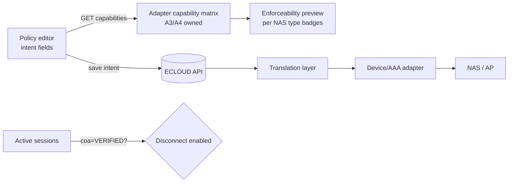

# A7 — Admin UI / Policy UI / Captive Portal UI (ECLOUD Phase 2)

Status legend: **VERIFIED FROM EXISTING CODE** (local path cited) · **PROPOSED** (our design choice) · **UNKNOWN** · **REQUIRES DEVICE TEST**. Nothing here changes any remote host. Backend/API specifics are owned by A5 (API_ARCHITECTURE.md) and auth/security by A8; dependencies are flagged inline.

## 0. Precedent: the existing in-house UI stack (ezecontroller)

| Aspect | Finding | Evidence |
|---|---|---|
| Shell | One static `public/index.html` (33 KB) that pulls ~40 HTML partials via `data-include="sections/*.html"` placeholders, some `data-lazy`. Vanilla JS shell, Bearer token from `localStorage.authToken` | **VERIFIED FROM EXISTING CODE** `/Users/danny/Project/ezecontroller/public/index.html` L343-372; `public/js/app.js` L2-3 |
| Islands | React 18 + TS islands, one Vite build per island → self-contained IIFE `public/islands/<name>.js` (~110-360 KB each, React bundled, "zero CDN references, no eval"). Mount seam `window.EzeIslands.<name>.{mount,unmount}` gated by `window.EZE_UI_FLAGS.UI_REACT_*` | **VERIFIED** `vite.config.islands.mjs`; `frontend-src/islands/auditlogs/main.tsx`; `public/sections/audit-logs.html` |
| Shared kit | `frontend-src/kit/{table/EzeTable,EzePager,toolbar; modal/EzeModal,EzeWizard; chart/SpellChart}.tsx`; `frontend-src/bridge/EzeBridge.js` is the only React↔shell doorway (tenant context from localStorage `activeClientId/activeSiteId`) | **VERIFIED** listing of `frontend-src/` |
| Styling | Tailwind 3 CLI build (`tailwind-input.css` → `public/css/tw-build.css`, 112 KB) + `tailwindcss-animate`; palette `primary.500 #1ca0ed`, slate grays, Inter/Roboto; four theme modes (light/navdark/chromedark/dark) in `localStorage.ezTheme` | **VERIFIED** `tailwind.config.js`; `public/index.html` theme script |
| Vendor | Self-hosted in `public/vendor/` (FontAwesome, Inter, Lucide, Phosphor, Chart.js, MapLibre, xterm…) — 11 MB; `public/js/bundle.js` is 1.27 MB | **VERIFIED** `du -sh public/*` |
| RBAC | `src/lib/permissions.ts`: flat `PERMISSIONS` catalogue (`'site.read'`, `'device.adopt'`, `'dashboard.site.view'`…), `ROLE_GRANTS` map, `ALIASES`, `can()`, `requirePermission()` | **VERIFIED** `src/lib/permissions.ts` L24-60, L120-140 |
| Auth | JWT (`jsonwebtoken`, `JWT_SECRET` env) in localStorage; `express-session` also a dependency; TOTP service exists (`src/services/auth/totpService.ts`) | **VERIFIED** `src/server.ts` L299; `package.json` |
| i18n / RTL | None found (no `i18n`, `dir="rtl"`, `lang="ar"` in public/) | **VERIFIED (absence)** grep over `public/` |
| Captive portal | No portal UI precedent in ezecontroller | **VERIFIED (absence)** |

Lessons for ECLOUD (**PROPOSED**): keep Tailwind + React/TS + self-hosted vendor + permission-catalogue pattern; **do not** repeat the 1.27 MB vanilla `bundle.js` + per-island React duplication (React is re-bundled into each of 15 islands) + localStorage JWT.

> **Implementation note (Phase 4, 2026-10-07).** The admin app is implemented in `apps/admin`
> (`@ecloud/admin`): Vite + React 19 + TypeScript strict + Tailwind 3 + TanStack Query + React
> Router (TanStack Table/Router not used; plain tables and React Router suffice). It calls
> same-origin `/api/v1` with the session cookie (D-029) through a client typed from the
> generated OpenAPI document (`npm run generate:api -w @ecloud/admin`). Permission names follow
> D-021 `resource:action`, superseding the dotted names in §2. Enforceability badges use the
> four D-028 states and show "Verified" only for `VERIFIED_SUPPORTED`; the preview panel uses
> `GET /policies/simulate` (needs a subject user) or, for platform operators, the
> `GET /platform/adapters` catalogue. Session Disconnect is disabled unless the adapter's
> disconnect status is `VERIFIED_SUPPORTED` (none today). Not yet built: portal designer,
> reports, i18n/RTL, idle-timeout warning modal, "my sessions" screen. See docs/DEVELOPMENT.md
> "Admin app".

## 1. UI surfaces and hosting (**PROPOSED**; domains pending A5/A8 and owner Q13)

| Surface | Host | Audience | Rendering |
|---|---|---|---|
| (a) Admin app | `ecloud.ezelink.ai` | Platform + Org + Site + Operator + Read-only admins | SPA-ish React app, single Vite build, served as static files by Caddy; talks to `api.ecloud.ezelink.ai` (or same-origin `/api`, A5 decides) |
| (b) Captive portal | `portal.ecloud.ezelink.ai` (one host, per-site routing by token/`?site=`/NAS id) | Subscribers inside mini-browsers (iOS CNA, Android captive sign-in, Windows) | Server-rendered templates (Node, same backend image) + progressive, optional ~5 KB vanilla JS; no framework |
| (c) Self-care | `my.ecloud.ezelink.ai` or `portal…/account` (future) | Subscribers | Server-rendered first; reuse portal theme |

**Admin app: SPA vs server-rendered + islands.** Recommendation: **single-build React SPA (Vite, React 18/19, TypeScript, Tailwind, TanStack Query/Table/Router)** rather than cloning the ezecontroller include-partials + islands pattern. Reasons: (1) ECLOUD is greenfield — the islands pattern in ezecontroller exists only to migrate a legacy vanilla shell incrementally (`vite.config.islands.mjs` header comment cites `docs/react-migration`), a constraint we do not have; (2) one shared React runtime instead of 15 copies; (3) the 2 vCPU / 3.7 GiB pilot VPS favours static files behind Caddy (zero server CPU per page) over SSR; (4) team already owns React/TS/Tailwind kit code (`EzeTable`, `EzeModal`, `EzeWizard`) that can be lifted. Keep what is good from precedent: Tailwind tokens, self-hosted fonts/icons, permission catalogue, dark mode. Avoid Next.js/SSR for admin (needs a Node render process per request; no SEO benefit). Code-split by route; budget ≤ 250 KB gz initial.

## 2. Information architecture (permission-driven, never role-name-driven)

Scope switcher in the top bar: **Platform ▸ Organization ▸ Site** (mirrors ezecontroller context manager). The UI fetches `GET /me` → `{ user, permissions: string[], scopes[] }` and renders menu items/actions only when the required permission string is present; role names appear only as labels in the Admins screen. Permission catalogue is the API contract with A5/A8 (**PROPOSED** names, same dotted style as `permissions.ts`):

| Nav item | Scope | Required permission (PROPOSED) | Roles that typically hold it (informational only) |
|---|---|---|---|
| Platform dashboard | Platform | `dashboard.platform.view` | Platform Super Admin, Platform Support |
| Organizations (CRUD, suspend, quotas) | Platform | `org.read` / `org.write` | Super Admin; Support read |
| Global devices / NAS inventory | Platform | `device.global.read` | Super Admin, Support |
| Platform settings (adapters, identity brokers, mail, defaults) | Platform | `platform.settings.write` | Super Admin |
| Support tools: assume-tenant (impersonate org), diagnostics, RADIUS test | Platform | `support.assume_tenant`, `support.diagnostics` | Super Admin, Support (time-boxed, audited) |
| Org dashboard | Org | `dashboard.org.view` | Org Admin, Operator, Read-only |
| Sites | Org/Site | `site.read` / `site.write` | Org Admin (write), Site Admin (own site write) |
| Devices / NAS (register, secret rotation, adapter type, health) | Org/Site | `nas.read` / `nas.write` / `nas.secret_rotate` | Org Admin, Site Admin |
| Subscribers: users, groups, import | Org/Site | `subscriber.read` / `subscriber.write` / `subscriber.import` | Org Admin, Site Admin, Operator (write limited) |
| Client devices (MAC-auth allow list, blocked MACs) | Org/Site | `clientdevice.read` / `clientdevice.write` | Org Admin, Site Admin, Operator |
| Vouchers (batches, print, revoke) | Org/Site | `voucher.read` / `voucher.create` / `voucher.revoke` | Org Admin, Site Admin, Operator (create) |
| Policies (intent editor) + assignments | Org/Site | `policy.read` / `policy.write` / `policy.assign` | Org Admin; Site Admin assign-only (PROPOSED) |
| Portals & branding (designer, preview, publish) | Org/Site | `portal.read` / `portal.write` / `portal.publish` | Org Admin, Site Admin |
| Sessions (active, history, disconnect) | Org/Site | `session.read` / `session.disconnect` | Org Admin, Site Admin, Operator |
| Reports (usage by user/site/time, export) | Org/Site | `report.read` / `report.export` | Org Admin, Site Admin, Read-only (read) |
| Audit log | Org/Site/Platform | `audit.read` | Org Admin, Platform roles, Read-only |
| Admins & roles (invite, assign role template, MFA reset) | Org / Platform | `admin.read` / `admin.write` / `role.write` | Org Admin (org scope), Super Admin |

Site Admin sees the same tree filtered to assigned sites (server enforces; UI just hides). Operator/Read-only: same menus, write actions rendered disabled with tooltip "requires `<permission>`" (helps support conversations). Rule of thumb for the front-end: **a component may import `usePermission('x.y')`; it may never import a role enum.**

## 3. Key screens and API data needs (for A5's API_ARCHITECTURE.md)

| Screen | Data needed from API (list only; shapes are A5's) | UX notes |
|---|---|---|
| Org/Site dashboard KPIs | online NAS / total; active sessions; auth success/fail last 24 h; top sites by traffic; expiring vouchers; recent audit events | Poll 30 s or SSE/WebSocket (A5 to choose; precedent uses socket.io) |
| Device / NAS health | per NAS: adapter type (uCentral-uspot, CoovaChilli, …), last RADIUS seen, WireGuard tunnel state (from A1/A2 data), **capability matrix** incl. `coa: VERIFIED / UNKNOWN / UNSUPPORTED`, firmware | Capability matrix is the single source for enabling/disabling actions |
| Active sessions | paginated sessions: user/MAC/IP/NAS/site/start/in-out octets/policy applied; actions: **Disconnect** (CoA/DM) and **Re-authorize** | Disconnect button enabled **only** if that session's NAS reports `coa=VERIFIED`; otherwise disabled with reason tooltip. Verification of CoA itself: **REQUIRES DEVICE TEST** (A3/A4) |
| Policy editor (intent) | policy intent fields exactly as owner list (rate down/up, burst, daily/monthly/total quota, session/idle timeout, concurrent devices/sessions, account validity, voucher validity, schedules, VLAN); plus `GET /adapters/{type}/capabilities` | **Enforceability preview** (core UX): a right-hand panel listing each intent field with per-NAS-type badge — Enforced / Partially (e.g. quota tracked by ECLOUD, cut by disconnect) / Not enforceable — drawn from the adapter capability matrix supplied by A3/A4. Field-level badges show the translation layer rather than hiding it; saving a policy that has "Not enforceable" fields for an assigned site requires explicit acknowledgment |
| Policy assignment | targets (user, group, site, client device, temporary), priority integer, effective window (from/to, schedule ref), resulting **effective policy** resolver endpoint for a given user+site | Show "effective policy for X at site Y" simulation before saving |
| Voucher batches | create batch (count, prefix, length, policy, validity, max devices), list, revoke, `GET …/print` (HTML A4 grid, QR via server-rendered SVG), CSV export | Print view is a server-rendered page reusing portal branding; QR precedent exists (`qrcode` dep) |
| User import | CSV upload → dry-run report (rows, errors) → commit; job status endpoint (BullMQ precedent) | Async job with progress |
| Captive portal designer | per-site portal config: theme tokens (colors, radius, font choice from self-hosted set), logo/background asset ids, legal text (multi-language), enabled auth methods, page texts for login/error/success/expired/logout, redirect URL, walled-garden hints; `POST …/preview` renders the real server template with draft config | Live preview = iframe of real portal renderer in draft mode, so WYSIWYG is exact; publish creates an immutable version (rollback) |
| Reports | usage aggregates by user / site / time bucket; auth outcomes; voucher consumption; export CSV/XLSX job | Time zone = site TZ (see §6) |
| Audit log | paginated events (actor, scope, action, target, before/after JSON, IP, impersonator if any) with filters | Precedent island `auditlogs` can be ported |
| Admins & roles | admins list, role templates → permission sets, invitations, MFA status, sessions revoke | Role templates are editable permission sets (fits "granular permissions") |

## 4. Captive portal page architecture (**PROPOSED**)

- **Server-rendered templates** (e.g. Eta/Nunjucks/Handlebars in the Node backend or a dedicated small `portal` service in the same Compose project), one template set, per-site **theme tokens** injected as CSS custom properties (`--p-brand`, `--p-bg`, `--p-radius`, `--p-font`). Per-site assets referenced by hashed URL on the portal host itself.
- Pages: `login` (method tabs rendered only for enabled methods), `error`, `success`, `expired`, `logout`, `terms`, `status` (session remaining time/quota). All reachable without JS (plain `<form method=post>`); JS only enhances (auto-submit, countdown).
- Auth forms: username/password; voucher code (single field, auto-uppercase, grouped input); click-to-continue with terms checkbox; MAC-auth is transparent (no page unless denied → `error`); social login = buttons linking to the identity broker redirect (A5/A8) — the broker callback host must be in the walled garden (see below).
- Portal → NAS hand-off (UAM/uspot/chilli form fields, redirect targets, challenge values): **UNKNOWN / REQUIRES DEVICE TEST** — owned by A4; the template layer only exposes a "NAS hand-off partial" slot per adapter so markup differs by adapter without touching branding.
- **Budget: < 50 KB per page transferred** (HTML+CSS+inline SVG logo; images lazy, ≤ 20 KB). No third-party CDN, no web fonts from Google, no analytics — **walled-garden constraint**: before authentication the AP only permits the portal host (and whatever is explicitly whitelisted). uCentral exposes `walled-garden-fqdn` / `walled-garden-ipaddr` under `service.captive` — **VERIFIED FROM EXISTING CODE** `/Users/danny/Project/ezecontroller/src/schemas/ucentral.full.json` `$defs/service.captive` (`allOf[1]`: `walled-garden-fqdn`, `walled-garden-ipaddr`, `idle-timeout`, `session-timeout`; modes `click`, `radius`, `credentials`, `uam`). CoovaChilli equivalent: A4 to confirm. Anything social-login needs (IdP domains) must therefore be pushed into the walled garden by the device adapter — flag to A4.
- Mini-browser (CNA) constraints: no `localStorage` assumptions, no popups, no `target=_blank`, HTTP→HTTPS redirect chain short, HSTS on portal host, `<meta name="viewport">`, forms work with autofill off, success page must not depend on JS to close the CNA. Avoid cookies as the only state carrier; carry a signed `state` param.
- Accessibility: WCAG 2.2 AA, labels + `autocomplete` attributes, ≥ 4.5:1 contrast enforced by the designer (contrast check on theme tokens), focus visible, errors announced via `aria-live`, logical tab order; language switcher is a plain link list (`?lang=`), `lang`/`dir` set on `<html>`.
- Security (defer detail to A8): CSRF token in forms, strict CSP (`default-src 'self'`), no inline event handlers, rate limit per MAC/IP, no enumeration in error text.

## 5. Admin auth/session UX (**PROPOSED**; mechanism owned by A8/A5)

- Login: email + password → optional TOTP step (owner wants MFA option; ezecontroller already has `totpService.ts` — **VERIFIED** precedent). Recovery codes shown once. "Trust this browser 30 days" optional.
- Session carrier: UI prefers **HttpOnly, Secure, SameSite=Lax session cookie** (same-site API or cookie-domain `.ecloud.ezelink.ai`) over localStorage JWT (precedent) because XSS can't read it and logout/idle can be enforced server-side; if A8 picks JWT, use short-lived access token in memory + refresh cookie. UI needs: `GET /me`, `POST /auth/logout`, 401 → redirect to login preserving deep link, 403 → inline "insufficient permission" state.
- Idle timeout: 30 min default (per-org configurable), warning modal at 28 min with "stay signed in"; absolute lifetime 12 h.
- Impersonation / assume-tenant: persistent top banner "You are acting in Org X as Support — ends in 59:30 · Exit", distinct colour, every action audited with `impersonator_id`; impersonation cannot change admins/roles or secrets (PROPOSED guardrail).
- Password policy, lockout, email verification: A8.

## 6. Internationalisation, time zones, branding assets (**PROPOSED**)

- i18n: admin app uses ICU message catalogs (e.g. `i18next` or FormatJS) with English source, keys in code, JSON per locale; the portal uses the same catalog format rendered server-side, with per-site **overrides** (legal text, welcome text) stored as `{locale: text}` maps. RTL support planned from day one (`dir` attribute, logical CSS properties `margin-inline-start`), because the owner's market (ezelink.ai) may need Arabic — **UNKNOWN**, see open questions.
- Time zones: every Site has an IANA `timezone`; schedules in policies are evaluated in site TZ; admin UI displays site-scoped data in site TZ with a per-user override toggle "show in my time zone"; API transfers UTC ISO-8601 always.
- Branding assets (logos, backgrounds, favicon, PDF terms): **object storage** (S3-compatible — MinIO container in Compose on the pilot, swappable to a cloud bucket in production) with DB rows holding metadata/hash/size; portal serves them through the portal host (`/assets/<sha>.<ext>`) so the walled garden sees one host; server-side resize via `sharp` (precedent dep) to ≤ 20 KB web variants; per-org quota (e.g. 20 MB). Rationale vs DB blobs: keeps Postgres small and backups fast; still portable. Cache headers immutable (hash in filename).
- Theme tokens persisted as JSON on the portal version row (not files) so they version with the portal.

## 7. Evidence index

| Source | Label |
|---|---|
| `/Users/danny/Project/ezecontroller/public/index.html` (data-include shell, theme modes, asset loading) | VERIFIED FROM EXISTING CODE |
| `/Users/danny/Project/ezecontroller/public/sections/*.html` (≈40 partials incl. `login.html`, `audit-logs.html`, `policy-center.html`) | VERIFIED FROM EXISTING CODE |
| `/Users/danny/Project/ezecontroller/vite.config.islands.mjs`, `scripts/build-islands.mjs` (via package.json scripts) | VERIFIED FROM EXISTING CODE |
| `/Users/danny/Project/ezecontroller/tailwind.config.js`, `package.json` (deps/devDeps) | VERIFIED FROM EXISTING CODE |
| `/Users/danny/Project/ezecontroller/frontend-src/{islands,kit,bridge}/` and `public/islands/*.js` sizes | VERIFIED FROM EXISTING CODE |
| `/Users/danny/Project/ezecontroller/src/lib/permissions.ts` (PERMISSIONS, ROLE_GRANTS, ALIASES, can) | VERIFIED FROM EXISTING CODE |
| `/Users/danny/Project/ezecontroller/src/server.ts` (jwt.verify L299), `src/services/auth/totpService.ts`, `public/js/app.js` L2-3 | VERIFIED FROM EXISTING CODE |
| `/Users/danny/Project/ezecontroller/src/schemas/ucentral.full.json` `$defs/service.captive*` (walled-garden-fqdn/ipaddr, idle/session-timeout, click/radius/credentials/uam) | VERIFIED FROM EXISTING CODE (schema presence only; device behaviour REQUIRES DEVICE TEST) |
| `/Users/danny/Project/EZECLOUD/{GOAL,ARCHITECTURE,DECISIONS,QUESTIONS,SECURITY}.md`, `BRIEF.md` | Project requirements (owner) |
| All framework/hosting/i18n/storage choices in §1-§6 | PROPOSED |

## 8. Open questions for owner

1. Frontend framework preference: React + TypeScript (team precedent) is recommended; any objection or wish for Vue/Svelte/htmx?
2. Is Arabic / RTL required for the admin app, the portal, or both, and which locales must ship in release 1?
3. White-label needs: per-organization branding of the **admin app** (logo/colours/custom admin domain), or only per-site portal branding?
4. Should Site Admins be allowed to create policies, or only assign org-defined policies (affects `policy.write` scoping)?
5. Platform Support "assume-tenant": acceptable, and must the tenant be notified/see it in their audit log?
6. Portal domain: single `portal.ecloud.ezelink.ai` for all sites vs custom per-org portal hostnames (adds certificate + walled-garden work per site)?
7. Is the subscriber self-care surface in scope for the first release?
8. Voucher print format requirements (card size, QR, logo) and any fiscal/legal text?

## 9. Items requiring a real device test

- Which portal hand-off parameters uspot (click/radius/credentials/uam modes) and CoovaChilli actually send/accept, and the exact redirect/success behaviour inside iOS CNA / Android captive sign-in — drives the per-adapter "NAS hand-off partial" (A4).
- Whether the walled garden on EZEAP permits the portal host by default or must list `portal.ecloud.ezelink.ai` explicitly, and whether identity-broker domains for social login can be whitelisted (uCentral `walled-garden-fqdn` exists in schema; runtime behaviour untested).
- CoA/Disconnect support per NAS type — gates the Sessions "Disconnect" button (`coa=VERIFIED`).
- Mini-browser page-weight behaviour: confirm < 50 KB pages render and the success page releases the CNA on real iOS/Android/Windows clients.
