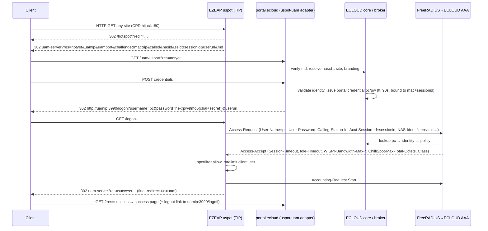
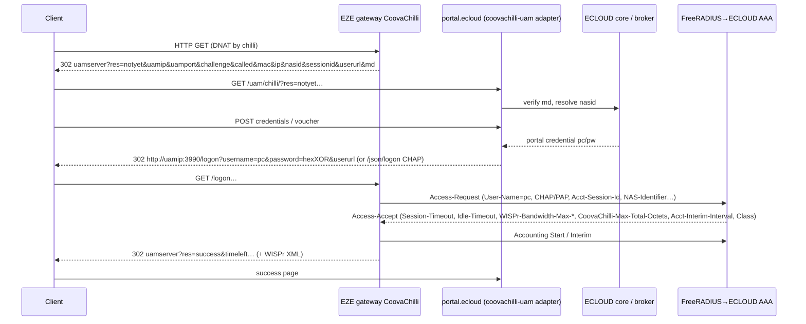
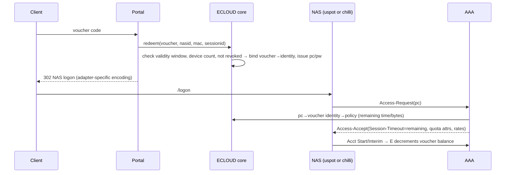
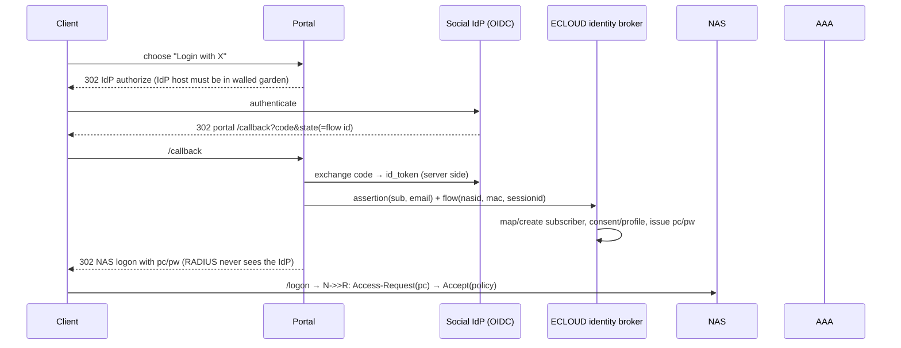

# ECLOUD Captive Portal Architecture (Phase 2 — design + protocol validation)

Author: A4 Captive Portal Agent. Status: PROPOSED design built only on VERIFIED mechanisms. No remote host or device was modified.

Evidence labels used throughout: **VERIFIED FROM EXISTING CODE** (local path/key), **VERIFIED FROM OFFICIAL DOCUMENTATION** (upstream URL), **PROPOSED**, **UNKNOWN**, **REQUIRES DEVICE TEST**. Upstream sources were downloaded read-only to `/Users/danny/.claude/jobs/6ede8b14/tmp/p2/a4_src/` for grepping; line numbers below refer to those copies (commit hashes in the Evidence index).

## 0. Headline findings

1. There are **two different uspot code bases**. TIP OpenWiFi firmware ships its own fork at `wlan-ap/feeds/ucentral/uspot` (depends on `spotfilter` + `ratelimit`, no DAS daemon). The f00b4r0 upstream (`github.com/f00b4r0/uspot`, packaged in openwrt/packages) is a later rewrite with `uspotfilter`, an RFC 5176 DAS and RFC 8908 CapPort API. Which one is on EZEAP is **REQUIRES DEVICE TEST** (`ls /usr/share/uspot; ubus list | grep -i spotfilter`). Everything below is stated per code base.
2. uspot (both) and CoovaChilli implement the **same ChilliSpot UAM redirect protocol** (`res=, uamip=, uamport=, challenge=, mac=, ip=, called=, nasid=, sessionid=, userurl=, md=`; login via `http://uamip:uamport/logon?username=&password=|response=`; `/logoff`). This lets ECLOUD share a portal *page layer* while keeping **separate adapters**, because the RADIUS reply attributes honoured, CoA path, quota attributes, MAC-auth username/password rules and password-encoding block size differ.
3. CoA/Disconnect: CoovaChilli listens on `coaport` and matches on `User-Name` (+ optional `Acct-Session-Id`). TIP-fork uspot has **no RADIUS listener of its own**: a Disconnect-Request must be sent to **hostapd's DAS** (uCentral `ssid.radius.dynamic-authorization`), which raises a ubus `coa` event that uspot consumes to kick the client. Upstream uspot runs its own DAS on UDP 3799. All three paths are **REQUIRES DEVICE TEST** on EZEAP.
4. Rate limiting: both uspot variants and CoovaChilli honour `WISPr-Bandwidth-Max-Up/Down` (bits/s) and `ChilliSpot-/CoovaChilli-Bandwidth-Max-Up/Down` (kbit/s ×1000). Quota: CoovaChilli honours Max-Input/Output/Total-Octets(+Gigawords); TIP-fork uspot honours only `ChilliSpot-Max-Total-Octets` (32-bit, ≈4 GiB cap); upstream honours all three plus Gigawords.
5. The `sessionid` UAM parameter **is** the RADIUS `Acct-Session-Id` in both uspot variants and CoovaChilli — it is the natural correlation key between portal flow, Access-Request and accounting.

## 1. uCentral `captive` schema (VERIFIED FROM EXISTING CODE)

Source: `/Users/danny/Project/ezecontroller/src/schemas/ucentral.full.json`, `$defs/service.captive*`; referenced from `$defs/interface.ssid/properties/captive` and `$defs/service/properties/captive`. `service.captive` = `oneOf[click, radius, credentials, uam]` + common block.

| Key | Type / default | Notes (schema only; semantics in §3) |
|---|---|---|
| `auth-mode` | const `click-to-continue` \| `radius` \| `credentials` \| `uam` | discriminator |
| `credentials[]` `{username,password}` | array | credentials mode only |
| `auth-server`/`auth-port`/`auth-secret` | uc-host / int 1024–65535 default 1812 / string | radius + uam modes |
| `acct-server`/`acct-port`/`acct-secret` | uc-host / int default **1812** (sic) / string | schema default for acct-port is 1812, not 1813 |
| `acct-interval` | int default 600 | see §3.4 on precedence over RADIUS `Acct-Interim-Interval` |
| `uam-port` | int default 3990 | local UAM listener on AP |
| `uam-secret` | string | ChilliSpot `uamsecret` |
| `uam-server` | string | remote portal URL; uspot appends `?res=` directly (must not already contain `?`, §3.2) |
| `nasid` | string | → RADIUS NAS-Identifier and UAM `nasid=` |
| `nasmac` | string | → Called-Station-Id and UAM `called=`; renderer defaults to device serial |
| `ssid` | string | sent as UAM `ssid=` (TIP fork) |
| `mac-format` | enum `aabbccddeeff`,`aa-bb-cc-dd-ee-ff`,`aa:bb:cc:dd:ee:ff` + uppercase | MAC formatting in UAM URL and RADIUS |
| `final-redirect-url` | enum `default`,`uam` | after login: honour `userurl`/local page, or force redirect to UAM server `res=success` |
| `mac-auth` | bool default false | try RADIUS MAC auth before redirect |
| `radius-gw-proxy` | bool default false | tunnel RADIUS via OpenWiFi gateway proxy (§3.6) |
| `walled-garden-fqdn[]`, `walled-garden-ipaddr[]` | string[] / uc-ip[] | pre-auth allow list |
| `web-root` (uc-base64 tar), `web-root-url`, `web-root-checksum` | | custom AP-local pages |
| `idle-timeout` | int default 600 | NAS default when RADIUS has no Idle-Timeout |
| `session-timeout` | int | NAS default when RADIUS has no Session-Timeout |

No key exposes a uspot `das_secret`/`das_port`, `challenge`, `uam_sslurl`, `ratelimit_def`, `counters`, or quota settings. The only other `idle-timeout` in the schema is `service.ssh`.

## 2. TIP wlan-testing payloads (VERIFIED FROM EXISTING CODE, upstream TIP)

Base: `/Users/danny/Project/wlan-testing/tests/e2e/basic/advanced_captive_portal_tests/`. Bridge and NAT variants exist for every mode with identical `captive` dicts (`diff` of bridge vs nat click tests shows only formatting), i.e. TIP tests uspot in **both** bridge and NAT.

| Test file (`…/open/`) | `captive` payload | Client action asserted |
|---|---|---|
| internal `test_click_to_continue_{bridge,nat}.py` L15–24 | `{"auth-mode":"click-to-continue","walled-garden-fqdn":["*.google.com","telecominfraproject.com"]}` | POST to AP `action=click&accept_terms=clicked` (L164) |
| internal `test_local_user_and_pass_*.py` L15–27 | `{"auth-mode":"credentials","credentials":[{"username":"abc","password":"def"}],"walled-garden-fqdn":[…]}` | POST `username=abc&password=def&action=credentials` (L174) |
| internal `test_radius_user_and_pass_*.py` L16–25 | `{"auth-mode":"radius","auth-server":"10.28.3.21","auth-port":1812,"auth-secret":"<secret>","walled-garden-fqdn":[…]}` | POST `username=…&password=…&action=radius` (L169) |
| external `test_click_to_continue_bridge.py` L20–30, `test_local_user_and_pass_bridge.py` L20–36 | `{"auth-mode":"uam","uam-port":3990,"uam-secret":"<secret>","uam-server":"https://customer.hotspotsystem.com/customer/hotspotlogin.php","nasid":"AlmondLabs","auth-server":"radius.hotspotsystem.com","auth-port":1812,"auth-secret":"<secret>","walled-garden-fqdn":["*.google.com","telecominfraproject.com","customer.hotspotsystem.com","youtube.com"]}` | see flow below |

External UAM flow as executed by the test (`test_click_to_continue_bridge.py` L240–297; `test_local_user_and_pass_bridge.py` L245–300):
1. Station `curl -I http://<AP inet addr of up0v0>/hotspot/` → expects `Location:` 302 to the UAM server; test parses `challenge`, `nasid`, `mac`, `uamport` from the query string (so the AP emits at least these; full list in §3.2).
2. Station calls the UAM server with `…hotspotlogin.php?…&chal=<challenge>&uamip=<AP ip>&uamport=3990&nasid=<nasid>&mac=<mac>&userurl=…&login=login&uid=<user>&pwd=<password>…` (portal-specific form of hotspotsystem.com).
3. UAM server answers with a 302 `Location:` (click test) or a `<meta http-equiv="refresh">` (user/pass test) pointing at the AP logon URL; the station follows it and the test asserts `<h1> Connected </h1>` in the final HTML, then verifies ping to the Internet succeeds (and failed before login).
Note: the test never inspects RADIUS; the RADIUS behaviour is asserted indirectly through hotspotsystem.com accepting `uid/pwd`. In bridge mode the AP has an IP on `up0v0` obtained from the upstream network (L241–248). `lab_info.json` L206–212 shows plain RADIUS test servers (secret redacted here).

## 3. uspot — verified capabilities (two code bases)

**(T)** = TIP fork `Telecominfraproject/wlan-ap/feeds/ucentral/uspot` (VERIFIED FROM OFFICIAL DOCUMENTATION, source). **(U)** = f00b4r0 upstream commit e0c19eb (2026-07-06) as packaged by openwrt/packages (`PKG_SOURCE_VERSION 87080bf`, 2026-06-30). Renderer = `Telecominfraproject/wlan-ucentral-schema/renderer/templates/{services,interface}/captive.uc` (what turns uCentral JSON into UCI on the AP).

### 3.1 What the renderer actually configures (VERIFIED, renderer)
- `interface/captive.uc` `generate_uspot_base_config/radius/uam`: maps 1:1 `auth_mode, idle_timeout, session_timeout, auth_server/port/secret, acct_server/port/secret, acct_interval, uam_port, uam_secret, uam_server, nasid, nasmac||serial, ssid, mac_format, final_redirect_url, mac_auth`; generates a random 16-byte hex `challenge` per render (`normalize_challenge()`), so the challenge changes on every config apply.
- UAM listener: a dedicated uhttpd instance on `0.0.0.0:<uam_port>` with `ucode_prefix /logon|/logoff|/logout → handler-uam.uc` (`UAM_PREFIXES`); portal listener on `:80` with `/hotspot → handler.uc`, `/cpd → handler-cpd.uc` as `error_page` (CPD hijack), cert `/etc/uhttpd.crt` (device self-signed; `listen_https` not configured by the renderer).
- Firewall (`services/captive.uc`): DNAT of TCP/80 for unauthenticated clients (fwmark `1/127`), `Drop-pre-captive` for everything else, walled-garden ACCEPT rules per `walled-garden-ipaddr` and per `walled-garden-fqdn` **except entries containing `*`, which are skipped** (`if (index(fqdn, "*") >= 0) continue;`). Only one captive interface is allowed (`validate_single_interface`). Mode check: `services.is_present("spotfilter")` — i.e. the renderer targets the **TIP fork** (spotfilter), not upstream uspotfilter.
- `radius_gw_proxy`: when set, uspot talks to `127.0.0.1:1812/1813` and `auth_proxy/acct_proxy` carries `serial:server:port:captive` for the on-AP radius-gw-proxy; hostapd DAS is then pinned to `127.0.0.1:3799` (`interface/ssid.uc normalize_radius_dynamic_auth`).

### 3.2 UAM redirect parameters emitted
(T) `portal.uc` L221–238; (U) `portal.uc uam_url()` and README "UAM interface".

| Param | (T) | (U) | Meaning |
|---|---|---|---|
| `res` | notyet, success, reject, logoff | + `already`, `failed` (with `reason=`) | result/state |
| `uamip`, `uamport` | AP `SERVER_ADDR`, `uam_port` | same | where to post login |
| `challenge` | `md5(challenge_cfg + formatted MAC)` hex | same | per-client challenge, stable until re-render |
| `mac`, `ip` | formatted client MAC, client IP | same | |
| `called`, `nasid` | `nasmac`, `nasid` | same | NAS identity |
| `ssid` | yes | no | |
| `sessionid` | 16-hex, = RADIUS `Acct-Session-Id` (`radius_init acct_session`) | same (`ctx.sessionid`) | correlation key |
| `userurl` | from `?redir=` (raw, not url-encoded) | url-encoded | original URL |
| `timeleft`, `ssl`, `reply`, `lang` | no | yes (optional) | |
| `md` | `md5(url + uam_secret)` appended last when `uam_secret` set | same | URL integrity (MD5 of the full URL string + secret, hex uppercase in U; T uses same `uam.md5`) |

Both build `uam_server + '?res='` by plain concatenation: the configured `uam-server` must have **no query string** (CoovaChilli, by contrast, checks for an existing `?`, `redir.c` L422).

### 3.3 Login/logoff endpoints on the AP
- `GET http://uamip:uamport/logon|/login?username=<u>&password=<hex>` **or** `&response=<CHAP hex>` [`&userurl=…`, (U) `&lang=`]. (T) `handler-uam.uc` L10–45; (U) `handler-uam.uc auth_client`.
- PAP encoding when `uam_secret` is set: `password = hex( cleartext XOR md5(challenge_bytes + uam_secret) )`, computed 16 bytes at a time. (T) loops over 32-hex chunks → arbitrary length; (U) `uam.c uc_password` XORs `MIN(plen,16)` bytes → **passwords longer than 16 bytes are truncated upstream**. Without `uam_secret`, `password=` is cleartext. CHAP: `response = md5(ident 0x00 + password + challenge')` where `challenge' = md5(challenge_bytes + uam_secret)` if secret set (same as CoovaChilli `hotspotlogin.cgi` L74–115).
- `GET http://uamip:uamport/logoff|/logout` → client removed, redirect to `uam_server?res=logoff`. (T) `portal.uc logoff()`; (U) `deauth_client`.
- Success handling (T): if `final_redirect_url=='uam'` → 302 to `uam_url('success')`; else 302 to `userurl` if present, else serve `/allow.html`. Reject (T): `res=reject` redirect only when `final_redirect_url=='uam'`, otherwise a local error page. (U): always redirects `success`/`reject`/`failed`.
- Internal modes (T `handler.uc`): POST to `/hotspot` with `action=click|credentials|radius` + fields exactly as the wlan-testing payloads in §2.

### 3.4 RADIUS behaviour
Attributes **sent** in Access-Request (T `portal.uc radius_init` + `src/radius.c` avpair table; U `uspot.uc radius_init` + `src/radius-client.c`): `User-Name`, `User-Password` or `CHAP-Password`+`CHAP-Challenge`, `Acct-Session-Id`, `Framed-IP-Address` (client IP), `Called-Station-Id` (T: `nasmac:ssid`; U: `nasmac`), `Calling-Station-Id` (formatted MAC), `NAS-IP-Address` (T: AP `SERVER_ADDR`; U: libradcli or `nas_ip`), `NAS-Identifier`, `NAS-Port-Type`=19, `WISPr-Logoff-URL` (`http://uamip:uamport/logoff`), `WISPr-Location-Name` (if configured), `Proxy-State` (gw proxy), `Service-Type` only for MAC-auth (T: 10 Call-Check), (U) also `Chargeable-User-Identity`, `ChilliSpot-Lang`. Accounting adds `Acct-Status-Type` (Start/Interim/Stop/On/Off), `Acct-Session-Time`, `Acct-{Input,Output}-{Octets,Gigawords,Packets}`, `Acct-Terminate-Cause` (1 logout, 2 lost carrier, 4 idle, 5 session timeout/quota, 6 admin reset), and copies `Class` from the Access-Accept.

Reply attributes **honoured** (T `uspot.uc client_add/client_ratelimit`; U `uspot.uc client_enable/client_ratelimit/client_quotalimit`):

| Reply attribute | (T) | (U) | Effect |
|---|---|---|---|
| `Session-Timeout` | yes | yes | NAS-side timer; Stop cause 5 |
| `Idle-Timeout` | yes | yes | spotfilter/uspotfilter idle; Stop cause 4 |
| `Acct-Interim-Interval` | yes, **but a configured `acct_interval` overrides it** ("RFC: NAS local interval value *must* override") | same precedence | interim cadence |
| `WISPr-Bandwidth-Max-Up/Down` (bits/s) | yes → `ubus ratelimit client_set rate_ingress/egress` | yes | `tc` HTB `ceil` per MAC; bare number = bit/s per tc(8) |
| `ChilliSpot-Bandwidth-Max-Up/Down` (kbit/s) | yes (×1000) | yes (×1000) | same |
| `ChilliSpot-Max-Total-Octets` | yes (32-bit) | yes + Gigawords | Stop cause 5 |
| `ChilliSpot-Max-Input/Output-Octets(+Gigawords)` | **no** | yes | |
| `Class` | copied to accounting | copied | correlation |
| `Reply-Message` | not surfaced | surfaced as `reply=` | |
| `WISPr-Redirection-URL`, `Filter-Id`, VLAN attrs | **no** | **no** | |

(T) enables accounting only when both `acct_server` and `acct_secret` are set; sends Accounting-On at start and Accounting-Off at stop; polls every 10 s. Lost-carrier detection comes from spotfilter state.

### 3.5 CoA / Disconnect
- (T): **no RADIUS DAS in uspot**. `uspot.uc hapd_subscriber_notify_cb` subscribes to every `hostapd.*` ubus object and on `notify.type == 'coa'` calls `client_kick(iface, mac, true)` (removes client + conntrack flush). The `coa` ubus event is produced by TIP's hostapd patches: `feeds/qca-wifi-6/hostapd/patches/901-coa-ubus.patch` (in `hostapd_das_disconnect`, raise `HOSTAPD_UBUS_COA` with `attr->sta_addr` **before** the NAS-mismatch/STA lookup and return `RADIUS_DAS_SUCCESS` if a subscriber handled it), `900-coa.patch` (allows `Vendor-Specific` and `Called-Station-Id` in DAS/CoA), `900-coa_multi.patch`/`761-shared_das_port.patch` (one DAS port shared across BSSes, selected by NAS-Identifier), and for the 25.12 tree `patches-25.12/0082-…CoA-event-type-with-synchronous-notify.patch`, `0069-…DAS-and-CoA-allowed-attributes.patch`. hostapd's DAS is configured by uCentral `interface.ssid.radius.dynamic-authorization {host, port, secret}` (schema `$defs/interface.ssid.radius`; example `captive-uam.json` sets it on the hotspot SSID). **Consequence:** the Disconnect must carry `Calling-Station-Id` (station MAC) and hit hostapd's DAS port/secret of the captive SSID; `client_kick(…, true)` does **not** call `radius_terminate` → **no Acct-Stop is sent on this path** (VERIFIED in source; confirm on device). Whether the hostapd.c side of the ubus hook is present in the 25.12/qca-wifi-7 build is UNKNOWN (only the ubus.c part was found) → REQUIRES DEVICE TEST.
- (U): `src/radius-das.c` — UDP DAS on `das_port` (3799) with `das_secret`; supports Disconnect-Request and CoA-Request; identifies sessions by `User-Name`, `NAS-IP-Address`, `NAS-Identifier`, `Framed-IP-Address`, `Called-Station-Id`, `Calling-Station-Id`, `Acct-Session-Id`, `Chargeable-User-Identity`; CoA may change `Session-Timeout`, `Idle-Timeout`, `Acct-Interim-Interval`; NAKs on any unsupported attribute (incl. `Message-Authenticator`, `Event-Timestamp`, `Service-Type`, VSAs); no `Error-Cause`. Not reachable through the uCentral schema (no `das_secret` key).

### 3.6 Other
- MAC-auth (T `handler.uc` L22–37): `User-Name = formatted MAC + mac_suffix`, `User-Password = mac_passwd || formatted MAC`, `Service-Type = Call-Check`; on Accept the client is allowed without portal. (U): same via `client_auth` without username.
- Walled garden: uCentral lists → firewall rules (wildcards skipped, §3.1); (T) `captive generate` can also feed spotfilter `wl_hosts/wl_addrs` but the renderer does not set them → UNKNOWN whether wildcard FQDNs work on EZEAP.
- HTTPS: CPD hijack is TCP/80 only; pre-auth HTTPS is dropped. (U) adds `uam_sslurl` and RFC 8908 CapPort API (`/api`, needs HTTPS + DHCP option 114) — absent in (T).
- State: no persistence; uspot restart resets clients (U README). (T) exports per-client state to the OpenWiFi state report (`wlan-ucentral-schema/system/state/captive.uc`: status, idle, time, bytes/packets ul/dl, username) — a telemetry source the controller already receives.

## 4. CoovaChilli — verified capabilities (VERIFIED FROM OFFICIAL DOCUMENTATION: `github.com/coova/coova-chilli` master + `coova.github.io/CoovaChilli`)

- **UAM redirect** (`src/redir.c bstring_buildurl` L413–600): `res=` (`notyet|already|success|failed|logoff|wispr|…`), `uamip`, `uamport`, `challenge` (unless `nochallenge`), `called` (`nasmac` or NAS MAC `XX-XX-…`), `uid`, `timeleft`, `mac` (`XX-XX-XX-XX-XX-XX`), `ip`, `reply`, `ssid`, `nasid` (`radiusnasid`), `vlan`, `loc`, `lang`, `sessionid` (= Acct-Session-Id), `ssl`, `redirurl`, `userurl`, then `md=` = uppercase hex `MD5(url + uamsecret)` (`redir_md_param` L639). Status pages add `starttime, sessiontime, sessiontimeout, stoptime`.
- **Login** (`redir.c` L2238–2255, L2382–2480): paths `logon|login`, `logoff|logout`, `status`, `prelogin`, `macreauth`, `abort`, `www/`, `json/<cmd>` (JSON/JSONP via `callback=`). Params: `username`, `password` (hex, XOR-encoded with `md5(challenge+uamsecret)` unless `nochallenge`), `response` (CHAP) + `ident`, `ntresponse` (MSCHAPv2), `userurl`, `lang`, `continue`, `WISPrVersion/WISPrEAPMsg`. Server-side reference algorithm: `doc/hotspotlogin.cgi` L74–120 (`$newchal = md5($hexchal, $uamsecret)`; PAP: `password ^ newchal` hex; CHAP: `md5("\0", password, newchal)`). WISPr 1.0/2.0 XML blocks (`LoginURL`, `LogoffURL`, `AbortLoginURL`, `ResponseCode` 50/100/102/105/150/151) are emitted around redirects (`redir.c` L788–960).
- **JSON interface** (`coova.github.io/CoovaChilli/JSON`, `www/ChilliLibrary.js` L102, L309): `http://uamip:uamport/json/logon?username=&response=`, `/json/logoff`, `/json/status`; CHAP only in the JS library; reply contains `clientState`, `sessionId`, `session{sessionTimeout,idleTimeout,…}`, `accounting{…}`, `redir{originalURL,redirectionURL,macAddress}`.
- **RADIUS** (`doc/attributes`, `doc/dictionary.coovachilli` VENDOR 14559 = same vendor id as ChilliSpot, `doc/freeradius.users`, `src/chilli.c config_radius_session` L3947–4075): sends `User-Name`, `User-Password`/`CHAP-*`, `NAS-IP-Address`, `Service-Type` Login (or Framed), `Framed-IP-Address`, `Called-Station-Id` (`nasmac`), `Calling-Station-Id`, `NAS-Identifier`, `NAS-Port-Type` 19, `Acct-Session-Id`, `Message-Authenticator`, `WISPr-Location-ID/Name`, `WISPr-Logoff-URL`, `CoovaChilli-Version/Lang/OriginalURL`, `Class` echo. Honours in Access-Accept (and CoA): `Session-Timeout`, `Idle-Timeout`, `Filter-Id`, `Acct-Interim-Interval` (<60 → ignored), `WISPr-Bandwidth-Max-Up/Down` (bit/s), `CoovaChilli-Bandwidth-Max-Up/Down` (kbit/s ×1000), `CoovaChilli-Max-Input/Output/Total-Octets` + `-Gigawords`, `CoovaChilli-Config`, `WISPr-Redirection-URL`, `WISPr-Session-Terminate-Time`, `CoovaChilli-VLAN-Id`, `Framed-IP-Address/Netmask` (MAC-auth), `State`, `Class`. Defaults: `defsessiontimeout`, `defidletimeout`, `definteriminterval` (300), `defbandwidthmax{up,down}`. Accounting Start/Interim/Stop with `Acct-Terminate-Cause` 1/2/4/5/11 and optional `acctupdate` from Accounting-Response.
- **CoA/Disconnect** (`src/cmdline.ggo` L99–100 `coaport`, `coanoipcheck`; `src/chilli.c cb_radius_coa_ind` L4855–4958): listens on `coaport` (default 0 = disabled); source must be a configured RADIUS server unless `coanoipcheck`; **`User-Name` is mandatory**, `Acct-Session-Id` optional narrows to one session; Disconnect → terminate (cause Admin-Reset); CoA → re-applies `config_radius_session` (timeouts/bandwidth/quota) and honours `CoovaChilli-Session-State` Authorized/NotAuthorized; replies ACK/NAK.
- **MAC auth** (`cmdline.ggo` L175–182): `macauth`, `macreauth`, `macauthdeny`, `macallowed`, `macsuffix`, `macpasswd` (no default in `cmdline.ggo` L180; when unset, `src/chilli.c` `auth_radius` L1586-1591 sends the MAC-based User-Name as the password — corrected 2026-10-08 from a source re-read, PHASE2_VALIDATION V-148), `macallowlocal`, `strictmacauth`.
- **Walled garden**: `uamallowed` (host/IP/CIDR[:proto:port]), `uamdomain` (DNS-snooped wildcard domains), `uamregex`, `uamanydns`, `uamallowed` override by RADIUS `CoovaChilli-UAM-Allowed`.
- **Local control**: `chilli_query` (`doc/chilli_query.1.in`): `list|listip|listmac`, `authorize ip|sessionid … sessiontimeout idletimeout maxoctets maxbwup maxbwdown`, `logout`, `dhcp-release`, `listgarden|addgarden|remgarden`, `listradqueue` over `cmdsocket`/`cmdsocketport` 42424.
- **Deployment position**: TUN/TAP routed gateway with its own DHCP (`net`, `dhcpif`, `dynip`, `statip`), optionally `layer3`/`usetap`; i.e. CoovaChilli is a **routed gateway/NAT** device, not a bridge-mode AP feature.

## 5. Local CoovaChilli precedent — EZE gateway (VERIFIED FROM EXISTING CODE)

`/Users/danny/Project/EZEGATE/Ezeinstall/post-install-script.sh`: installs FreeRADIUS config from a private repo and moves `dictionary.chillispot` to `/share/freeradius/` (L224–227, SQL module enabled L228–230); installs `coova-chilli-1.2.9-1.x86_64.rpm` from private repo `chilli-rpm` (L237–240); patches `/etc/chilli/eth1.11/config` and `/etc/chilli/defconfig` with `HS_UAMFORMAT=http://$HS_UAMLISTEN/login/` (portal served **by the gateway itself**), `HS_RADIUS=127.0.0.1`, `HS_RADAUTH=1812`, `HS_RADACCT=1813`, removes `HS_RADIUS2` (L242–252); multi-instance per VLAN interface (`/etc/chilli/newmulti.sh`, `/bin/newmulti` in sudoers); cron uses `chilli_query dhcp-list|dhcp-release|list` (L573–575); PRTG user count via `chilli_query listgarden|list` (L257–269); `chkconfig chilli on` (L783). `Ezeinstall/sudoers` L11 whitelists `/sbin/chilli`, `/etc/init.d/chilli`, `/sbin/chilli_query` and **`/bin/radclient`** (a CoA-by-radclient precedent). `Ezeinstall/portal.ezelink.net.conf` is an Apache PHP vhost for `portal.ezelink.net` (HTTP+HTTPS). Chilli version 1.2.9 is old relative to the master sources analysed in §4; capability differences are UNKNOWN. No `uamsecret`, `coaport` or `uamallowed` settings are visible in this repo.

## 6. uspot vs CoovaChilli comparison

| Aspect | uspot (T = TIP fork / U = upstream) | CoovaChilli | Label |
|---|---|---|---|
| Runs where | AP (OpenWrt/OpenWiFi), bridge **or** NAT SSID (TIP tests both) | Routed gateway with own DHCP/TUN (EZE gateway precedent) | VERIFIED (code) |
| Redirect params | `res,uamip,uamport,challenge,mac,ip,called,nasid,sessionid[,ssid(T)][,userurl,md][,timeleft,reply,lang,ssl(U)]` | same core + `uid,vlan,loc,lang,reply,ssl,redirurl,timeleft` | VERIFIED |
| Login method | GET `/logon` PAP (hex XOR md5(chal+secret)) or CHAP; (U) 16-byte PAP limit | GET `/logon` PAP/CHAP/MSCHAPv2, WISPr XML, `/json/logon` (CHAP) | VERIFIED |
| Logoff | `/logoff` → `res=logoff` | `/logoff`, `uamlogoutip` 1.0.0.0, `/json/logoff` | VERIFIED |
| Acct | Start/Interim/Stop/On/Off; interval = NAS cfg else RADIUS | Start/Interim/Stop; RADIUS interval unless <60; `acctupdate` | VERIFIED |
| Rate attrs | WISPr-Bandwidth-Max-* (bit/s), ChilliSpot-Bandwidth-Max-* (kbit/s) → tc HTB per MAC | WISPr-Bandwidth-Max-*, CoovaChilli-Bandwidth-Max-*, `defbandwidthmax*`, token bucket in chilli | VERIFIED |
| Quota attrs | (T) ChilliSpot-Max-Total-Octets only; (U) Input/Output/Total + Gigawords | Max-Input/Output/Total-Octets + Gigawords | VERIFIED |
| Timeouts | Session-Timeout, Idle-Timeout | Session-Timeout, Idle-Timeout, WISPr-Session-Terminate-Time | VERIFIED |
| CoA/Disconnect | (T) via hostapd DAS (`ssid.radius.dynamic-authorization`) → ubus `coa` → kick, no Acct-Stop; (U) own DAS 3799, Disconnect + CoA(timeouts/interim) | `coaport`; Disconnect needs User-Name(+Acct-Session-Id); CoA re-applies all session attrs | VERIFIED source; **REQUIRES DEVICE TEST** |
| MAC-auth | `mac_auth`: User-Name=MAC(+suffix), Password=mac_passwd\|MAC, Service-Type Call-Check | `macauth`, `macpasswd` (unset → password = MAC-based User-Name, V-148), `macsuffix`, `macallowlocal` | VERIFIED |
| Walled garden | uCentral fqdn/ipaddr → nft rules; wildcard FQDN skipped by renderer | `uamallowed`, `uamdomain` (wildcards via DNS snoop), RADIUS `CoovaChilli-UAM-Allowed` | VERIFIED |
| Portal HTTPS | CPD hijack port 80 only; AP cert self-signed; (U) `uam_sslurl`, RFC 8908 | `redirssl`, `uamuissl` with own cert | VERIFIED |
| Local state/API | `ubus uspot/spotfilter`, OpenWiFi state report `captive{}` | `chilli_query`, `/json/status` | VERIFIED |
| Dictionary vendor id | ChilliSpot 14559 (`files/etc/radcli/dictionary.chillispot`), WISPr 14122 | CoovaChilli 14559 (same numbers as ChilliSpot) | VERIFIED |

## 7. ECLOUD design (PROPOSED)

### 7.1 Components
- **Portal service** `portal.ecloud.ezelink.ai` (candidate; A1/A0 own DNS) — stateless HTTPS web app (Node/TS per baseline), behind the existing Caddy. Renders tenant/site-branded pages: `login`, `voucher`, `social`, `consent`, `connecting`, `success`, `error`, `expired`, `logout`. Branding resolved from the NAS identity (7.3). No RADIUS code inside the portal.
- **Portal adapters** (`uspot-uam`, `coovachilli-uam`) — pure functions that (a) parse/verify the inbound UAM query, (b) produce the device-native login/logoff URL, (c) interpret `res=` callbacks. Selected per NAS record (`nas.portal_adapter`), never by sniffing.
- **Identity broker** — ECLOUD core module that turns any identity proof (password check, voucher, MAC allow-list, social/OIDC assertion) into a **short-lived portal credential** `{username: "pc-<16 hex>", password: <≤16 chars>, ttl 90 s, bound to nasid+mac+sessionid, single-use}` stored in the AAA credential store. The AAA layer (FreeRADIUS → rlm_sql/rlm_rest into ECLOUD) authenticates that credential exactly like a normal user and attaches the policy of the *resolved identity*. Social providers therefore never touch RADIUS.
- **AAA adapter layer** (A3) — emits NAS-type-specific reply attributes from the ECLOUD policy intent (7.5). ECLOUD session records key on `Acct-Session-Id` (= UAM `sessionid`).

### 7.2 Portal state machine (per `sessionid`+`mac`)
`ARRIVED(res=notyet)` → `IDENTIFYING` (password | voucher | social | mac) → `CREDENTIAL_ISSUED` (broker) → `LOGON_SENT` (302 to NAS logon) → `AUTHORIZED(res=success)` | `REJECTED(res=reject|failed)` → `ACTIVE` (Acct Start/Interim seen) → `ENDED` (Acct Stop | res=logoff | CoA). Transitions are recorded in `portal_flows` with the `md`-verified source NAS, so a callback for a flow that never issued a credential is rejected (replay protection).

### 7.3 Identifying the site/NAS from the UAM request
1. Verify `md` when the NAS has a `uam_secret`: recompute `MD5(url_without_&md= + secret)` (both devices append `md` last; compare case-insensitively).
2. Lookup order: `nasid` (unique per NAS in ECLOUD; set `captive.nasid` = ECLOUD NAS id) → fall back to `called` (uspot: `nasmac` or device serial; CoovaChilli: `nasmac`). Validate that `uamip` is a private/LAN address and that the request's source IP is a known site egress/WireGuard peer where available (A1 dependency).
3. Resolve `nas → site → organization → branding, allowed auth methods, policies`. Unknown NAS → generic error page, no credential issuance.

### 7.4 Adapters

**`uspot-uam`** (EZEAP, TIP fork assumed; upstream differences flagged)
- Receives: `res, uamip, uamport, challenge, mac, ip, called, nasid, ssid, sessionid[, userurl, md]` (`timeleft/reply` only on U).
- Posts back (top-level 302 from the HTTPS page, as hotspotsystem.com does in the TIP test): `http://{uamip}:{uamport}/logon?username={pc}&password={hex(pw XOR md5(chal_bytes+uam_secret))}&userurl={enc(userurl)}`. Keep the broker password **≤16 bytes** so the same encoding works on T and U. If the NAS has no `uam_secret`, PAP is cleartext over LAN HTTP — ECLOUD should require `uam_secret` for uspot NAS records.
- Logout: link to `http://{uamip}:{uamport}/logoff`.
- Callbacks: `res=success` → success page (requires `final-redirect-url: "uam"` on the NAS, otherwise T serves its local `/allow.html` and the portal never learns of success except via accounting); `res=reject|failed` → error page; `res=logoff` → logout page; `res=already` → status page (U) / treat as success.
- Required uCentral config emitted by the device adapter (A2): `auth-mode: uam`, `uam-server: https://portal.ecloud.ezelink.ai/uam/uspot/` (no `?`), `uam-port: 3990`, `uam-secret`, `nasid: <ecloud nas id>`, `nasmac` (optional), `auth-server/acct-server` = ECLOUD RADIUS (public IP or WireGuard address, A1), `acct-port: 1813` (schema default is 1812), `final-redirect-url: uam`, `walled-garden-fqdn: [portal.ecloud.ezelink.ai, <IdP hosts>]` plus `walled-garden-ipaddr` for the portal's IPs (wildcards are not rendered), `mac-auth: true` only when MAC login is a site policy. Do **not** set `acct-interval` if RADIUS should control interim cadence (NAS value overrides RADIUS).
- CoA: send Disconnect-Request with `Calling-Station-Id` (and `NAS-Identifier`) to the hostapd DAS address/port/secret from `ssid.radius.dynamic-authorization`; expect ACK; ECLOUD must close the session itself (no Acct-Stop on this path). CoA attribute changes are **not** applied by T → re-authentication is the only way to change a live session's rate on T. (U) DAS: Disconnect/CoA with `Session-Timeout`, `Idle-Timeout`, `Acct-Interim-Interval` only.

**`coovachilli-uam`** (EZE gateway or any CoovaChilli)
- Receives: `res, uamip, uamport, challenge, called, mac (XX-XX-…), ip, nasid, sessionid, userurl[, uid, timeleft, reply, ssid, vlan, loc, lang, ssl, redirurl, md]`.
- Posts back: `http://{uamip}:{uamport}/logon?username={pc}&password={hex XOR}&userurl=` (PAP, same scheme; any length) or CHAP `&response=md5(0x00+pw+chal')`; for JS-driven pages optionally `/json/logon` (CHAP) and `/json/status` for live counters.
- Logout: `/logoff` or `http://1.0.0.0/` (`uamlogoutip`). Callbacks: `res=success|failed|logoff|already|notyet|wispr`; `reply=` carries RADIUS Reply-Message.
- Required chilli config: `uamserver https://portal…/uam/chilli/`, `uamsecret`, `radiusnasid <ecloud nas id>`, `nasmac`, `radiusserver1/2`, `radiussecret`, `coaport 3799`, `uamallowed portal.ecloud.ezelink.ai,<IdP hosts>`, `uamdomain` for wildcard IdP domains, `definteriminterval`, optional `macauth`+`macpasswd`.
- CoA: Disconnect/CoA to `coaport` with **`User-Name`** (+ `Acct-Session-Id`); CoA may carry new Session-Timeout/Idle-Timeout/WISPr-Bandwidth-*/CoovaChilli-Max-*-Octets and is applied live. Source IP must be a configured RADIUS server (or `coanoipcheck`).

### 7.5 Reply attributes the AAA layer should emit per NAS type (policy intent → verified mechanism)

| Policy intent | uspot (T) | uspot (U) | CoovaChilli |
|---|---|---|---|
| Download / upload rate | `WISPr-Bandwidth-Max-Down/Up` (bit/s) | same | same (or `CoovaChilli-Bandwidth-Max-*` kbit/s) |
| Burst | not expressible → **REQUIRES DEVICE TEST / not supported** | same | not expressible via RADIUS |
| Session quota (bytes) | `ChilliSpot-Max-Total-Octets` (<4 GiB) | `ChilliSpot-Max-{Input,Output,Total}-Octets` + `-Gigawords` | `CoovaChilli-Max-*-Octets` + `-Gigawords` |
| Daily/monthly quota | AAA-side: compute remaining → emit as session quota + Session-Timeout; re-auth at reset | same | same (+ CoA to shorten) |
| Session timeout / account validity | `Session-Timeout` (min(remaining validity, policy)) | same | same, or `WISPr-Session-Terminate-Time` |
| Idle timeout | `Idle-Timeout` | same | same |
| Interim cadence | `Acct-Interim-Interval` (only if NAS `acct-interval` unset) | same | `Acct-Interim-Interval` ≥60 |
| Concurrent devices | AAA-side counting on Access-Request (Calling-Station-Id) | same | same |
| VLAN | not honoured by uspot → **UNKNOWN** (A2) | not honoured | `CoovaChilli-VLAN-Id` → REQUIRES DEVICE TEST |
| Correlation | `Class = <ecloud session id>` echoed in accounting | same | same |
| Redirect after login | none (portal handles via `res=success`) | none | `WISPr-Redirection-URL` |

### 7.6 Sequence diagrams









```mermaid
sequenceDiagram
  participant C as Client
  participant N as NAS
  participant P as Portal
  participant E as ECLOUD
  participant R as AAA
  Note over C,N: Explicit logout
  C->>N: GET uamip:uamport/logoff
  N->>R: Accounting Stop (Terminate-Cause User-Request)
  N-->>C: 302 uam-server?res=logoff → P shows logout page
  Note over N,R: Expiry
  N->>N: Session-Timeout / Idle-Timeout / quota reached
  N->>R: Accounting Stop (cause 5 / 4) → E closes session
  C->>N: next HTTP → res=notyet → P shows "expired" (from E session record)
  Note over E,N: Admin disconnect
  E->>N: Disconnect-Request (uspot T: to hostapd DAS, Calling-Station-Id; chilli: coaport, User-Name)
  N-->>E: Disconnect-ACK (uspot T sends no Acct-Stop → E closes session on ACK)
```

### 7.7 Security considerations
- **HTTPS portal behind captive detection**: CPD only hijacks port 80; the portal FQDN (and its IPs) must be in the walled garden so the 302 to `https://portal…` succeeds; the AP's own `/hotspot` pages are HTTP on a LAN IP. Set HSTS on the portal, never serve it on HTTP except a 302.
- **`uam_secret`/`uamsecret` handling**: secret per NAS, stored encrypted in ECLOUD, only used by the adapter for `md` verification and PAP XOR / CHAP; without it PAP is cleartext over the LAN hop (`uspot` T/U) → mandatory. Rotate via config push (uspot) / chilli config.
- **Replay & binding**: portal credentials are single-use, 90 s TTL, bound to `mac+nasid+sessionid`; AAA rejects Access-Requests whose `Calling-Station-Id`/`NAS-Identifier` do not match the binding. Flow ids in OIDC `state`.
- **Open redirects**: `userurl`/`redir` values are reflected into 302s — only allow `http(s)://` with a host that is not the NAS `uamip`, strip credentials, cap length, or replace with the tenant landing page.
- **Rate limiting**: per `nasid+mac` (login attempts, voucher guesses), per source IP; voucher codes ≥ 8 chars from a non-ambiguous alphabet; constant-time compare.
- **NAS impersonation**: `md` check + known NAS id + (where WireGuard/public IP allow-lists exist) source checks; unknown NAS gets no credential.
- **uspot CPD `userurl` is not URL-encoded (T)** → treat the query string as hostile, parse the last `&md=` first.
- **DAS exposure**: hostapd DAS / uspot DAS / chilli coaport must only accept the ECLOUD RADIUS address (WireGuard preferred, A1); U's DAS has no replay protection (no Event-Timestamp support).

## 8. Evidence index
- VERIFIED FROM EXISTING CODE: `/Users/danny/Project/ezecontroller/src/schemas/ucentral.full.json` (`$defs/service.captive`, `.click`, `.radius`, `.credentials`, `.uam`, `$defs/interface.ssid.radius.dynamic-authorization`, `$defs/interface.ssid/properties/captive`); `/Users/danny/Project/wlan-testing/tests/e2e/basic/advanced_captive_portal_tests/{internal,external}_captive_portal_tests/open/*.py` (lines cited in §2); `/Users/danny/Project/wlan-testing/tests/lab_info.json` L206–244; `/Users/danny/Project/EZEGATE/Ezeinstall/post-install-script.sh` L224–269, L462–463, L573–575, L783; `/Users/danny/Project/EZEGATE/Ezeinstall/sudoers` L11; `/Users/danny/Project/EZEGATE/Ezeinstall/portal.ezelink.net.conf`.
- VERIFIED FROM OFFICIAL DOCUMENTATION (TIP): `https://github.com/Telecominfraproject/wlan-ap/tree/main/feeds/ucentral/uspot` (`Makefile`, `files/etc/config/uspot`, `files/usr/share/uspot/{uspot.uc,portal.uc,handler.uc,handler-uam.uc,handler-cpd.uc}`, `files/usr/bin/captive`, `src/radius.c`, `src/uam.c`); `…/feeds/ucentral/ratelimit/files/usr/bin/ratelimit`; `…/feeds/qca-wifi-6/hostapd/patches/{900-coa.patch,900-coa_multi.patch,901-coa-ubus.patch}`; `…/feeds/qca-wifi-7/hostapd/patches/761-shared_das_port.patch`; `…/patches-25.12/0069-hostapd-extend-RADIUS-DAS-and-CoA-allowed-attributes.patch`, `0082-hostapd-ubus-add-CoA-event-type-with-synchronous-not.patch`; `…/feeds/ucentral/ucentral-schema/files/etc/ucentral/examples/captive-uam.json`; `https://github.com/Telecominfraproject/wlan-ucentral-schema/blob/main/renderer/templates/{services,interface}/captive.uc`, `renderer/libs/captive.uc`, `system/state/captive.uc`, `schema/service.captive*.yml`.
- VERIFIED FROM OFFICIAL DOCUMENTATION (uspot upstream): `https://github.com/f00b4r0/uspot` commit `e0c19ebd` (`README.md`, `files/etc/config/uspot`, `files/usr/share/uspot/{portal.uc,handler.uc,handler-uam.uc,handler-api.uc,handler-cpd.uc,uspot.uc,uspotlib.uc}`, `src/{uam.c,radius-client.c,radius-das.c}`, `files/etc/radcli/dictionary.{chillispot,WISPr}`); `https://github.com/openwrt/packages/blob/master/net/uspot/Makefile`.
- VERIFIED FROM OFFICIAL DOCUMENTATION (CoovaChilli): `https://github.com/coova/coova-chilli` master (`README.md`, `doc/attributes`, `doc/dictionary.coovachilli`, `doc/chilli.conf.5.in`, `doc/chilli_query.1.in`, `doc/hotspotlogin.cgi`, `doc/freeradius.users`, `src/redir.c`, `src/chilli.c`, `src/radius.c`, `src/radius.h`, `src/cmdline.ggo`, `www/ChilliLibrary.js`); `https://coova.github.io/CoovaChilli/` and `https://coova.github.io/CoovaChilli/JSON`.
- Other: `https://man7.org/linux/man-pages/man8/tc.8.html` (RATES: bare number = bits per second).
- Context: `/Users/danny/Project/EZECLOUD/{GOAL.md,ARCHITECTURE.md,SECURITY.md,DECISIONS.md,QUESTIONS.md,DISCOVERY_REPORT.md}`; `/Users/danny/.claude/jobs/6ede8b14/tmp/p2/BRIEF.md`.
- Tooling note: `ctx_fetch_and_index` was unavailable (missing `turndown`); sources were fetched with curl/git into the scratch dir and grepped there.

## 9. Open questions for owner
1. Which captive-portal deployment is first: uspot on EZEAP (bridge and/or NAT SSID) or CoovaChilli on an EZE gateway? Both adapters are designed, but device tests differ.
2. Is the EZE gateway CoovaChilli (1.2.9) still in service and may it be upgraded to current master (needed for `coaport`/JSON behaviour verified here)?
3. Confirm `portal.ecloud.ezelink.ai` as the portal host and whether the AAA RADIUS endpoint for sites will be the VPS public IP or a WireGuard address (affects `auth-server`, walled garden and DAS source allow-lists; A1).
4. Which social IdPs are required (each adds hosts to the walled garden; wildcard FQDNs are not rendered by the TIP renderer)?
5. Should MAC-auth be offered (requires `mac-auth: true` and an ECLOUD MAC allow-list in AAA; username = formatted MAC)?
6. Is `radius-gw-proxy` (RADIUS tunnelled through the OpenWiFi gateway) in scope, or will EZEAP reach ECLOUD RADIUS directly?

## 10. Items requiring a real device test (EZEAP / gateway)
1. Identify the uspot code base on EZEAP firmware (`opkg list-installed | grep -i spot; ls /usr/share/uspot; ubus list`), and whether `ratelimit` is installed.
2. Bridge-mode UAM: confirm the AP obtains an IP on the captive bridge, that `uamip` is reachable from clients, and the full `res=notyet` → `/logon` → `res=success` round trip with `final-redirect-url: uam` and `uam-secret` set (verify `md` and PAP XOR encoding, ≤16- and >16-byte passwords).
3. NAT-mode UAM: same as 2 on a routed SSID.
4. RADIUS: capture Access-Request/Accounting attributes actually sent (Called-Station-Id format `nasmac:ssid`, NAS-IP-Address value, Acct-Session-Id == `sessionid`), and that `Session-Timeout`, `Idle-Timeout`, `WISPr-Bandwidth-Max-*`, `ChilliSpot-Max-Total-Octets`, `Class` are honoured (iperf/ping, counters).
5. `acct-interval` precedence: with `acct-interval` unset in uCentral, does the renderer still inject the schema default 600 (which would override RADIUS `Acct-Interim-Interval`)?
6. Disconnect via hostapd DAS: configure `ssid.radius.dynamic-authorization` on the captive SSID, send Disconnect-Request (`Calling-Station-Id`, `NAS-Identifier`) with `radclient`, confirm ACK, client kicked, and whether an Accounting Stop is produced; test CoA-Request (expected: not applied on TIP fork).
7. Walled garden: verify FQDN vs wildcard behaviour and that HTTPS to the portal and IdP hosts works pre-auth.
8. Accounting-On/Off at uspot start/stop and lost-carrier detection timing (10 s poll).
9. CoovaChilli gateway: `coaport` Disconnect/CoA with `User-Name`+`Acct-Session-Id`, live rate change via CoA, `uamdomain` wildcard garden, `/json/status` availability, version-specific param differences vs master.
10. OpenWiFi state report `captive{}` arrival in the controller (ezecontroller) as a telemetry/consistency source.
