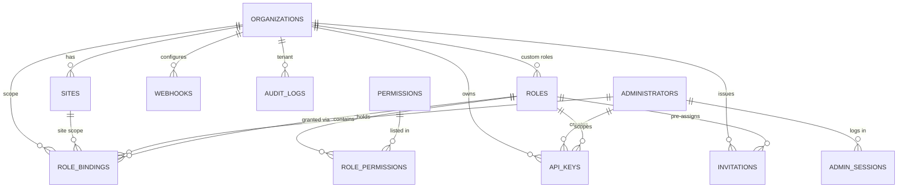
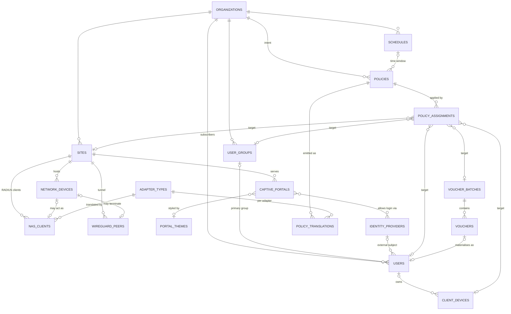
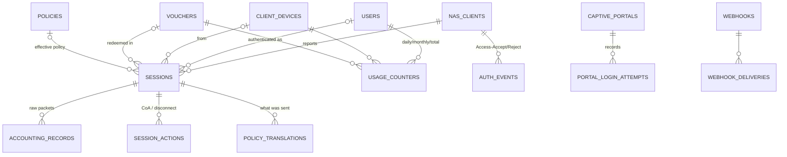

# ECLOUD — Database Design (Phase 2, A6)

Status: **PROPOSED** unless a row is labelled otherwise. Nothing in this document has been created on any host. Companion document: `MULTITENANCY.md` (tenant model, RBAC data model, isolation rules).

Target engine: **PostgreSQL 16** (PROPOSED by A0 baseline; this document designs against it and flags nothing that requires a newer major).

---

## 1. Conventions

| Topic | Decision (PROPOSED) | Why |
|---|---|---|
| Primary keys, business entities | `uuid` generated as **UUID v7** in the application (PG16 ships only `gen_random_uuid()` = v4; no built-in v7 generator). Column default stays `gen_random_uuid()` as a safety net. | v7 is time-ordered, so B-tree inserts are append-mostly (v4 fragments indexes). Opaque in URLs/webhooks (no enumeration of `/users/1234`). Safe to merge across environments and tenant exports. ULID would need a `text` column or a custom domain; `bigint` leaks cardinality and needs a central sequence. Precedent: ezecontroller already uses `uuid DEFAULT gen_random_uuid()` for `api_keys`, `mfa_credentials` (`migrations/001_auth_session_engine.sql`) — **VERIFIED FROM EXISTING CODE**. |
| Primary keys, append-only high-volume tables | `bigint GENERATED ALWAYS AS IDENTITY` + partition key in PK | 8 bytes vs 16; these rows are never exposed by id; BRIN-friendly. Precedent: `security_events.id bigserial` (same file). |
| Timestamps | `timestamptz` everywhere, UTC in the DB, `created_at timestamptz NOT NULL DEFAULT now()`, `updated_at` maintained by one shared trigger `set_updated_at()` | Precedent uses `timestamptz DEFAULT now()`; FreeRADIUS schema uses `timestamp with time zone`. |
| Naming | `snake_case`, **plural** table names (`users`, `api_keys` as in precedent), indexes `idx_<table>_<cols>`, unique `uq_<table>_<cols>`, FKs `fk_<table>_<col>`, checks `ck_<table>_<rule>` | Matches ezecontroller (`uq_devices_serial_number`, `idx_secev_type`). |
| Tenant key | `organization_id uuid NOT NULL REFERENCES organizations(id)` on **every tenant-scoped table**, always the **leading column** of composite indexes; even when derivable through `site_id` it is denormalised so RLS and indexes never need a join | §8 RLS, §7 indexes. |
| Soft delete | Hard delete is the default. `deleted_at timestamptz` only on entities referenced by historical rows: `organizations`, `sites`, `users`, `administrators`, `policies`, `vouchers`, `client_devices`, `nas_clients`, `network_devices`. Uniqueness on those uses partial indexes `WHERE deleted_at IS NULL`. Sessions/accounting/audit are never deleted by the application; only partition retention drops them. | Keeps accounting/audit referentially valid; avoids "unique violated by a deleted row". |
| Enums | `text` + `CHECK (col IN (...))` for small closed sets; **lookup tables** for catalogues that grow at runtime (`permissions`, `adapter_types`). No native `ENUM` types. | The precedent runner executes each migration in one transaction (`src/lib/migrate.ts`); adding values to a PG enum has transaction caveats, a `CHECK` is rewritten with `ALTER TABLE … DROP/ADD CONSTRAINT` in the same transaction. |
| JSONB | Allowed for: device-reported capabilities, IdP non-secret config, portal theme/strings, adapter emitted-attribute snapshots, audit `before/after`, schedule rules. **Not** allowed for: anything joined or filtered in a hot path, anything with FK semantics, the tenant key, quota/rate numbers, secrets. Soft cap 64 KB/value; GIN index only when a documented query needs it. | Keeps the intent model relational (brief rule 4) and queries indexable. |
| Secrets | Never stored. Columns are `*_ref text` holding a reference into the secret store (env/file/Vault — A5 decision). Exceptions are **hashes**: `password_hash`, `key_hash`, `token_hash`, `code_hash`. | Brief rule 2; SECURITY.md "Protect RADIUS shared secrets". |
| MAC addresses | Column type `macaddr` (PostgreSQL normalises case and separators on input) | Precedent uses `lower(mac)` partial unique indexes on text (`021_identity_uniqueness_and_fk_indexes.sql`); the native type removes that class of bug. |
| IPs | `inet` / `cidr` | Matches FreeRADIUS `NASIPAddress inet`, `FramedIPAddress inet`. |
| Money/quotas | `bigint` bytes, `integer` kbps/seconds. No floats. | Octet counters exceed 2^31 routinely (RADIUS gigawords). |

---

## 2. Entity-relationship diagrams

### 2.1 Tenancy, administration, RBAC



### 2.2 Network, subscribers and policy



### 2.3 Sessions, accounting, portal runtime



---

## 3. Table definitions

Legend: `T` = tenant-scoped (`organization_id NOT NULL`, RLS on). `P` = platform table (no tenant key). `A` = append-only, partitioned. Every table has `created_at`; mutable tables also have `updated_at`.

### 3.1 Tenancy & administration

| Table | Scope | Columns (type, constraint) | Uniqueness | FK / ON DELETE |
|---|---|---|---|---|
| `organizations` | P | `id uuid PK`, `slug text NOT NULL`, `name text NOT NULL`, `status text CHECK IN ('active','suspended','archived')`, `settings jsonb DEFAULT '{}'`, `max_sites int`, `max_devices int`, `max_users int`, `max_concurrent_sessions int`, `deleted_at` | `uq_organizations_slug (lower(slug)) WHERE deleted_at IS NULL` | — |
| `sites` | T | `id`, `organization_id`, `slug text`, `name text`, `timezone text NOT NULL DEFAULT 'UTC'`, `address text`, `geo point NULL`, `status text`, `settings jsonb`, `deleted_at` | `uq_sites_org_slug (organization_id, lower(slug)) WHERE deleted_at IS NULL` | org → **RESTRICT** (archive first) |
| `administrators` | P | `id`, `email citext NOT NULL`, `display_name text`, `password_hash text NULL` (NULL when SSO-only), `status text CHECK IN ('invited','active','disabled')`, `mfa_enforced bool`, `last_login_at`, `deleted_at` | `uq_administrators_email (email) WHERE deleted_at IS NULL` | — |
| `admin_sessions` | P | `id`, `administrator_id`, `token_hash text NOT NULL`, `ip inet`, `user_agent text`, `impersonating_organization_id uuid NULL`, `impersonation_reason text`, `expires_at NOT NULL`, `revoked_at` | `uq_admin_sessions_token_hash` | admin → **CASCADE**; org → SET NULL |
| `permissions` | P | `key text PK` (e.g. `policy:create`), `resource text`, `action text`, `description text`, `min_scope text CHECK IN ('platform','organization','site')`, `is_platform_only bool` | key | — (seeded) |
| `roles` | P/T | `id`, `organization_id uuid NULL` (NULL = platform template), `key text`, `name text`, `description text`, `is_system bool DEFAULT false`, `template_version int` | `uq_roles_platform_key (key) WHERE organization_id IS NULL`; `uq_roles_org_key (organization_id, key) WHERE organization_id IS NOT NULL` | org → CASCADE |
| `role_permissions` | P/T | `role_id`, `permission_key` | PK `(role_id, permission_key)` | role → CASCADE; permission → RESTRICT |
| `role_bindings` | P/T | `id`, `administrator_id`, `role_id`, `scope_type text CHECK IN ('platform','organization','site')`, `organization_id uuid NULL`, `site_id uuid NULL`, `granted_by uuid`, `expires_at`, `ck_role_bindings_scope` (platform ⇒ both NULL; organization ⇒ org NOT NULL, site NULL; site ⇒ both NOT NULL) | `uq_role_bindings (administrator_id, role_id, scope_type, coalesce(organization_id,'00…0'), coalesce(site_id,'00…0'))` | admin → CASCADE; role → CASCADE; org/site → CASCADE |
| `api_keys` | P/T | `id`, `organization_id NULL`, `created_by uuid`, `name text`, `key_prefix text NOT NULL`, `key_hash text NOT NULL`, `role_id uuid NOT NULL`, `scope_type`, `site_id NULL`, `allowed_cidrs cidr[]`, `last_used_at`, `expires_at`, `revoked_at` | `uq_api_keys_prefix (key_prefix)` | org → CASCADE; role → RESTRICT |
| `invitations` | T | `id`, `organization_id`, `email citext`, `role_id`, `scope_type`, `site_id NULL`, `token_hash`, `invited_by`, `expires_at`, `accepted_at`, `accepted_administrator_id NULL` | `uq_invitations_token_hash` | org → CASCADE |
| `webhooks` | T | `id`, `organization_id`, `name`, `url text`, `events text[] NOT NULL`, `signing_secret_ref text`, `enabled bool`, `failure_count int` | `uq_webhooks_org_url (organization_id, url)` | org → CASCADE |
| `webhook_deliveries` | T,A | `id bigint`, `organization_id`, `webhook_id`, `event text`, `payload jsonb`, `status text`, `http_status int`, `attempt int`, `created_at` | PK `(id, created_at)` | webhook → CASCADE |
| `audit_logs` | A | see §3.5 | | |

`api_keys` follows the precedent exactly (`key_prefix` for lookup, `key_hash` for verification, `scopes`, `revoked_at` — `migrations/001_auth_session_engine.sql`, **VERIFIED FROM EXISTING CODE**); the difference is that scope is expressed through `role_id + scope_type` so keys and humans are authorised by the same algorithm (`MULTITENANCY.md §5`).

### 3.2 Network

| Table | Scope | Columns | Uniqueness | FK / ON DELETE |
|---|---|---|---|---|
| `adapter_types` | P | `key text PK` (e.g. `openwifi_ucentral`, `coovachilli`, `uspot`, `generic_radius`), `name`, `supports_coa bool NULL`, `supports_rate_limit bool NULL`, `supports_vlan bool NULL`, `capabilities jsonb`, `verification_status text CHECK IN ('verified_code','verified_docs','proposed','unknown','requires_device_test')`, `evidence_url text` | key | seeded; **capability flags start NULL until A2/A4 verify** |
| `network_devices` | T | `id`, `organization_id`, `site_id NOT NULL`, `serial text NOT NULL`, `mac macaddr NULL`, `model text`, `firmware text`, `mode text CHECK IN ('bridge','routed','unknown') DEFAULT 'unknown'`, `adapter_type_key text`, `mgmt_status text`, `last_seen_at`, `reported_capabilities jsonb`, `wireguard_peer_id uuid NULL`, `deleted_at` | `uq_network_devices_serial (lower(serial)) WHERE deleted_at IS NULL` (global — a physical unit belongs to one tenant at a time); `uq_network_devices_mac (mac) WHERE mac IS NOT NULL AND deleted_at IS NULL` | site → RESTRICT; adapter → RESTRICT |
| `nas_clients` | T | `id`, `organization_id`, `site_id NOT NULL`, `network_device_id uuid NULL`, `name text`, `nas_identifier text NULL`, `nas_ip inet NOT NULL`, `adapter_type_key text NOT NULL`, `secret_ref text NOT NULL`, `coa_port int NULL`, `coa_supported bool NULL`, `require_message_authenticator bool DEFAULT true`, `status text`, `deleted_at` | `uq_nas_clients_ip (nas_ip) WHERE deleted_at IS NULL` — RADIUS identifies a client by source IP, so this must be **globally** unique (see open question Q3) | site → RESTRICT; device → SET NULL |
| `wireguard_peers` | T | `id`, `organization_id`, `site_id`, `network_device_id NULL`, `name`, `public_key text NOT NULL`, `tunnel_ip inet NOT NULL`, `allowed_ips cidr[] NOT NULL`, `endpoint text NULL`, `preshared_key_ref text NULL`, `persistent_keepalive_s int`, `last_handshake_at`, `status text` | `uq_wireguard_peers_public_key`, `uq_wireguard_peers_tunnel_ip` (global — hub address plan is platform-wide) | site → RESTRICT |

`coa_port`/`coa_supported` are deliberately nullable: CoA/Disconnect support per NAS type is **REQUIRES DEVICE TEST** (DECISIONS.md D-006). The schema does not assume UDP/3799.

### 3.3 Subscribers, devices, identity

| Table | Scope | Columns | Uniqueness | FK / ON DELETE |
|---|---|---|---|---|
| `user_groups` | T | `id`, `organization_id`, `site_id NULL`, `name`, `description`, `is_default bool` | `uq_user_groups_org_name (organization_id, lower(name))` | org → CASCADE |
| `users` (subscribers) | T | `id`, `organization_id`, `site_id uuid NULL` (NULL = org-wide), `username text NOT NULL`, `password_hash text NULL`, `auth_methods text[] NOT NULL DEFAULT '{password}'` (`password`,`mac`,`voucher`,`idp`), `user_group_id NULL`, `identity_provider_id NULL`, `external_subject text NULL`, `display_name`, `email citext NULL`, `phone text NULL`, `status text CHECK IN ('active','suspended','expired','disabled')`, `valid_from timestamptz`, `valid_until timestamptz`, `max_devices int NULL`, `origin text CHECK IN ('admin','portal_signup','voucher','idp')`, `deleted_at` | `uq_users_org_username (organization_id, lower(username)) WHERE deleted_at IS NULL` — **PROPOSED per-organization**, see Q1; `uq_users_idp_subject (identity_provider_id, external_subject)` | org → CASCADE; group → SET NULL; idp → RESTRICT |
| `client_devices` | T | `id`, `organization_id`, `user_id uuid NULL`, `mac macaddr NOT NULL`, `name`, `device_type text`, `first_seen_at`, `last_seen_at`, `mac_auth_enabled bool DEFAULT false`, `blocked bool DEFAULT false`, `deleted_at` | `uq_client_devices_org_mac (organization_id, mac) WHERE deleted_at IS NULL` (per tenant: the same phone can visit two tenants' sites) | org → CASCADE; user → SET NULL |
| `identity_providers` | T | `id`, `organization_id`, `type text CHECK IN ('local','oidc','google','facebook','saml','sms_otp','radius_proxy')`, `name`, `config jsonb NOT NULL` (issuer, client_id, scopes, attribute map — **no secrets**), `client_secret_ref text NULL`, `enabled bool` | `uq_identity_providers_org_name (organization_id, lower(name))` | org → CASCADE |
| `vouchers`, `voucher_batches` | T | see §3.6 | | |

### 3.4 Policy model (intent only — never device attributes)

| Table | Scope | Columns | Uniqueness | FK / ON DELETE |
|---|---|---|---|---|
| `schedules` | T | `id`, `organization_id`, `name`, `timezone text NOT NULL`, `rules jsonb NOT NULL` (array of `{days:[1..7], start:"HH:MM", end:"HH:MM"}`), `ck_schedules_rules_is_array` | `uq_schedules_org_name` | org → CASCADE |
| `policies` | T | `id`, `organization_id`, `site_id NULL`, `name text`, `description`, `scope_type text CHECK IN ('user','group','site','temporary')`, `download_rate_kbps int NULL`, `upload_rate_kbps int NULL`, `burst_download_kbps int NULL`, `burst_upload_kbps int NULL`, `burst_duration_s int NULL`, `quota_daily_bytes bigint NULL`, `quota_monthly_bytes bigint NULL`, `quota_total_bytes bigint NULL`, `session_timeout_s int NULL`, `idle_timeout_s int NULL`, `max_concurrent_sessions int NULL`, `max_devices int NULL`, `valid_from timestamptz NULL`, `valid_until timestamptz NULL`, `vlan_id int NULL CHECK (vlan_id BETWEEN 1 AND 4094)`, `schedule_id NULL`, `priority int NOT NULL DEFAULT 100`, `is_default bool`, `status text CHECK IN ('draft','active','retired')`, `version int NOT NULL DEFAULT 1`, `deleted_at`; `ck_policies_rates_positive` | `uq_policies_org_name (organization_id, lower(name)) WHERE deleted_at IS NULL`; `uq_policies_org_default (organization_id) WHERE is_default` | org → CASCADE; schedule → RESTRICT; site → RESTRICT |
| `policy_assignments` | T | `id`, `organization_id`, `policy_id NOT NULL`, `target_type text CHECK IN ('user','user_group','site','client_device','voucher_batch')`, `user_id NULL`, `user_group_id NULL`, `site_id NULL`, `client_device_id NULL`, `voucher_batch_id NULL`, `ck_policy_assignments_one_target` (exactly one target FK NOT NULL and it matches `target_type`), `effective_from timestamptz NOT NULL DEFAULT now()`, `effective_until timestamptz NULL`, `priority int NOT NULL DEFAULT 100`, `created_by uuid`, `note text` | `uq_policy_assignments_active (policy_id, target_type, coalesce(user_id,…), …) WHERE effective_until IS NULL` | policy → CASCADE; each target → CASCADE |
| `policy_translations` | T,A | `id bigint`, `organization_id`, `policy_id`, `policy_version int`, `adapter_type_key text`, `adapter_version text`, `nas_client_id NULL`, `session_id NULL`, `trigger text CHECK IN ('authorize','coa','preview','config_push')`, `input_snapshot jsonb` (resolved intent), `emitted jsonb` (what the adapter produced — attribute list / config fragment), `unsupported jsonb` (intent fields the adapter could not express), `created_at` | PK `(id, created_at)` | policy → SET NULL (keep the log) |

Why real FK columns instead of `target_id uuid`: a polymorphic `target_id` cannot be constrained by the database; five nullable FKs plus a `CHECK` give referential integrity and let `ON DELETE CASCADE` remove stale assignments.

**Priority resolution (PROPOSED, implemented in the policy engine, not SQL):** collect active assignments whose window contains `now()` for the session's user, the user's group, the client device, the site and (voucher sessions) the voucher batch; order by `policy_assignments.priority ASC, policies.priority ASC, specificity (client_device > user > voucher_batch > group > site)`; take the first. A `temporary` policy is simply an assignment with `effective_until` set. `policy_translations` records which policy/version won and what the adapter emitted, so an operator can answer "why did this phone get 2 Mbit/s on Tuesday".

### 3.5 Sessions, accounting, audit

| Table | Scope | Columns | Uniqueness / PK | FK / ON DELETE |
|---|---|---|---|---|
| `sessions` | T | `id uuid`, `organization_id`, `site_id`, `nas_client_id NOT NULL`, `network_device_id NULL`, `user_id NULL`, `client_device_id NULL`, `voucher_id NULL`, `policy_id NULL`, `policy_version int`, `acct_session_id text NOT NULL`, `acct_unique_id text NOT NULL`, `username_raw text`, `mac macaddr NULL`, `framed_ip inet NULL`, `nas_port_id text`, `called_station_id text`, `calling_station_id text`, `started_at timestamptz NOT NULL`, `last_interim_at`, `stopped_at`, `input_octets bigint DEFAULT 0`, `output_octets bigint DEFAULT 0`, `session_time_s bigint DEFAULT 0`, `status text CHECK IN ('active','stopped','stale')`, `terminate_cause text` | `uq_sessions_acct_unique_id (acct_unique_id)` | nas → RESTRICT; user/device/voucher/policy → SET NULL |
| `accounting_records` | T,A | `id bigint`, `organization_id NULL` (NULL when tenant could not be resolved — must be visible to platform ops), `session_id uuid NULL`, `acct_unique_id text`, `acct_session_id text`, `status_type text CHECK IN ('start','interim','stop','accounting_on','accounting_off')`, `nas_ip inet NOT NULL`, `nas_identifier text`, `username text`, `calling_station_id text`, `called_station_id text`, `framed_ip inet`, `event_time timestamptz` (from `Event-Timestamp` if present), `received_at timestamptz NOT NULL DEFAULT now()`, `input_octets bigint`, `output_octets bigint` (gigawords already folded in), `session_time_s bigint`, `terminate_cause text`, `raw jsonb` (full attribute list as received) | PK `(id, received_at)`; partition `RANGE (received_at)` monthly | **no FKs** (append path must never block on a lookup) |
| `auth_events` | T,A | `id bigint`, `organization_id NULL`, `nas_client_id NULL`, `username text`, `calling_station_id text`, `called_station_id text`, `nas_ip inet`, `result text CHECK IN ('accept','reject','challenge','error')`, `reason text`, `auth_method text`, `identity_provider_id NULL`, `policy_id NULL`, `reply_summary jsonb`, `created_at` | PK `(id, created_at)`; monthly partitions | none |
| `session_actions` | T | `id uuid`, `organization_id`, `session_id`, `action text CHECK IN ('disconnect','coa_update')`, `payload jsonb`, `status text CHECK IN ('pending','sent','ack','nak','timeout','unsupported')`, `requested_by uuid NULL`, `request_id text`, `created_at`, `completed_at`, `error text` | — | session → CASCADE |
| `usage_counters` | T | `organization_id`, `subject_type text CHECK IN ('user','client_device','voucher')`, `subject_id uuid`, `period_type text CHECK IN ('daily','monthly','total')`, `period_start date NOT NULL` (`1970-01-01` for `total`), `bytes_in bigint`, `bytes_out bigint`, `session_count int`, `session_time_s bigint`, `last_record_id bigint` (watermark into `accounting_records`), `reconciled_at`, `updated_at` | PK `(subject_type, subject_id, period_type, period_start)` | none (subject rows may be soft-deleted) |
| `audit_logs` | A | `id bigint`, `organization_id uuid NULL`, `actor_type text CHECK IN ('administrator','api_key','subscriber','system')`, `actor_id uuid NULL`, `impersonator_id uuid NULL` (platform admin acting as tenant), `action text NOT NULL` (same vocabulary as permissions, e.g. `policy:update`), `target_type text`, `target_id uuid`, `before jsonb`, `after jsonb`, `ip inet`, `request_id text`, `user_agent text`, `created_at` | PK `(id, created_at)`; monthly partitions | none |
| `portal_login_attempts` | T,A | `id bigint`, `organization_id`, `captive_portal_id`, `method text`, `username_or_code_prefix text`, `mac macaddr`, `client_ip inet`, `result text`, `reason text`, `created_at` | PK `(id, created_at)` | none |

Append-only is enforced three ways: (1) the application role has `INSERT, SELECT` only on these tables (no `UPDATE/DELETE`); (2) a `BEFORE UPDATE OR DELETE` trigger raises; (3) retention is `ALTER TABLE … DETACH PARTITION` + `DROP` executed by the owner role.

### 3.6 Vouchers and captive portal

| Table | Scope | Columns | Uniqueness | FK / ON DELETE |
|---|---|---|---|---|
| `voucher_batches` | T | `id`, `organization_id`, `site_id NULL`, `name`, `policy_id NULL` (default policy for the batch; may also be targeted by `policy_assignments`), `count int`, `code_format text` (e.g. `alnum-8`), `valid_from`, `valid_until`, `duration_s int NULL` (validity counted from first use), `max_uses int DEFAULT 1`, `max_devices int DEFAULT 1`, `created_by`, `exported_at` | `uq_voucher_batches_org_name` | org → CASCADE; policy → RESTRICT |
| `vouchers` | T | `id`, `organization_id`, `batch_id`, `code_hash text NOT NULL` (HMAC-SHA-256 with a server pepper from the secret store), `code_hint text` (last 3 chars, display only), `code_enc text NULL` (symmetric-encrypted code for authorised re-print; see Q4), `status text CHECK IN ('unused','active','exhausted','expired','revoked')`, `activated_at`, `expires_at` (computed on activation when `duration_s` is set), `use_count int DEFAULT 0`, `bound_user_id uuid NULL` (subscriber row auto-created on first use so sessions/quotas attach to a normal user), `revoked_by`, `deleted_at` | `uq_vouchers_code_hash (code_hash)` — global so a code is never ambiguous across tenants when the portal has to resolve it | batch → CASCADE; user → SET NULL |
| `portal_themes` | T | `id`, `organization_id`, `name`, `logo_asset_ref text`, `colors jsonb`, `strings jsonb` (per-page texts: login/error/success/expired/logout), `custom_css text`, `version int` | `uq_portal_themes_org_name` | org → CASCADE |
| `captive_portals` | T | `id`, `organization_id`, `site_id NOT NULL`, `name`, `portal_type text CHECK IN ('uspot','coovachilli','external')`, `network_ref text` (SSID / interface label as the adapter understands it), `theme_id NULL`, `auth_methods text[]`, `identity_provider_ids uuid[]`, `uam_secret_ref text NULL`, `redirect_url text`, `terms_version text`, `walled_garden text[]`, `adapter_config jsonb` (portal-type-specific **non-secret** parameters; allowed keys constrained by A4's verified list), `status text` | `uq_captive_portals_site_network (site_id, network_ref)`; `uq_captive_portals_public_slug (public_slug)` global (the portal URL identifies site → tenant; see MULTITENANCY.md §6) | site → CASCADE; theme → SET NULL |

Voucher codes are **hashed, not stored in plain** (PROPOSED). Reasoning: a voucher is a bearer credential; a database leak must not turn every unsold voucher into free airtime. Lookup is by `code_hash`, a single indexed equality.

### 3.7 Intentionally not included

- `firmware`: device lifecycle/upgrade is owned by the EZE controller today (ezecontroller `025_ap_upgrade_on_connect.sql`); ECLOUD stores `network_devices.firmware` as reported, nothing more. Add only if the owner moves firmware management into ECLOUD.
- Per-tenant `radcheck/radreply` tables: see §4.
- Billing/invoices: future; `organizations.max_*` and `usage_counters` are the hooks.

---

## 4. FreeRADIUS data integration

### 4.1 What the official schema looks like — **VERIFIED FROM OFFICIAL DOCUMENTATION**

Source: `https://github.com/FreeRADIUS/freeradius-server/blob/v3.2.x/raddb/mods-config/sql/main/postgresql/schema.sql` (fetched 2026-10-07).

| Table | Columns (official) | Official indexes |
|---|---|---|
| `radacct` | `RadAcctId bigserial PK, AcctSessionId text NOT NULL, AcctUniqueId text NOT NULL UNIQUE, UserName, Realm, NASIPAddress inet NOT NULL, NASPortId, NASPortType, AcctStartTime/AcctUpdateTime/AcctStopTime timestamptz, AcctInterval bigint, AcctSessionTime bigint, AcctAuthentic, ConnectInfo_start, ConnectInfo_stop, AcctInputOctets bigint, AcctOutputOctets bigint, CalledStationId, CallingStationId, AcctTerminateCause, ServiceType, FramedProtocol, FramedIPAddress inet, FramedIPv6Address, FramedIPv6Prefix, FramedInterfaceId, DelegatedIPv6Prefix, Class` | `radacct_active_session_idx (AcctUniqueId) WHERE AcctStopTime IS NULL`; `radacct_bulk_close (NASIPAddress, AcctStartTime) WHERE AcctStopTime IS NULL`; `radacct_start_user_idx (AcctStartTime, UserName)`; `radacct_calss_idx (Class)` |
| `radcheck` | `id serial, UserName text, Attribute text, op varchar(2) DEFAULT '==', Value text` | `(UserName, Attribute)` |
| `radreply` | same shape, `op DEFAULT '='` | `(UserName, Attribute)` |
| `radgroupcheck` / `radgroupreply` | `GroupName` instead of `UserName` | `(GroupName, Attribute)` |
| `radusergroup` | `id serial, UserName, GroupName, priority int DEFAULT 0` | `(UserName)` |
| `radpostauth` | `id bigserial, username, pass, reply, CalledStationId, CallingStationId, authdate timestamptz DEFAULT now(), Class` | `(username)`, `(Class)` |
| `nas` | `id serial, nasname text NOT NULL, shortname text NOT NULL, type text DEFAULT 'other', ports int, secret text NOT NULL, server, community, description` | `(nasname)` |
| `nasreload` | `NASIPAddress inet PK, ReloadTime timestamptz` | — |

Two facts in that schema drive the design: `radacct` is a **mutable** table (stop/interim rows update the start row — the official partial indexes exist for exactly those updates), and `nas.secret` is **plaintext** (FreeRADIUS needs the clear secret). Neither matches ECLOUD's append-only / secret-ref rules, so the official tables cannot simply be the ECLOUD tables.

### 4.2 Options — **PROPOSED**, final choice belongs to A3 (AAA); A6 owns the data side

| | (a) `rlm_sql` only — FreeRADIUS reads/writes ECLOUD-owned tables shaped like the official schema | (b) `rlm_rest` only — FreeRADIUS calls the ECLOUD API for authorize/accounting | (c) Hybrid — `rlm_rest` for authorize/post-auth, `rlm_sql` for accounting |
|---|---|---|---|
| Policy resolution (priority, quotas, schedule, concurrency) | Must be pre-materialised into `radcheck/radreply`-shaped rows per user; every intent change re-renders rows; schedule/quota checks need SQL hacks or `rlm_sqlcounter` | Done in TypeScript against the intent model at request time; full `policy_translations` logging | As (b) |
| Tenant resolution | FreeRADIUS queries are templated with request attributes; which attributes are available for the query is an A3 fact | ECLOUD receives NAS-IP / NAS-Identifier / Called-Station-Id and resolves tenant itself | As (b) |
| Accounting durability | FreeRADIUS writes straight to PG; proven, buffered by `rlm_sql` pools; works when the API is down | Every packet is an HTTP call; API outage = lost or retried accounting | SQL path for the high-volume stream; API outage only affects new logins |
| Latency per auth | One SQL round trip | One HTTP + SQL round trip | One HTTP + SQL round trip |
| Secrets | `nas.secret` plaintext in a table | `clients.conf` rendered from secret store, or dynamic clients via REST | As (b) |
| Fit with "intent vs enforcement" (brief rule 4) | Weak — adapters would emit rows into FreeRADIUS tables | Strong — adapter runs inside ECLOUD | Strong |
| **Recommendation** | pilot fallback only | acceptable | **recommended** |

Data-side consequences of (c), which also keep (a) possible as a fallback:

1. A dedicated PostgreSQL schema `radius` owned by ECLOUD, with a DB role `freeradius` that has **only** `INSERT` on `radius.radacct_raw`/`radius.radpostauth_raw` and `SELECT` on `radius.nas_v` — nothing in `public`.
2. `radius.radacct_raw` is **not** the official mutable `radacct`; it is a thin append table (official column names, plus `received_at`, `acctstatustype`) that an ECLOUD worker drains by `RadAcctId` watermark into `accounting_records` and `sessions`. This keeps `radius` disposable and `public` canonical. **Dependency on A3:** confirm that FreeRADIUS 3.2 `rlm_sql` accounting queries can be configured as insert-only (the shipped `queries.conf` is per-status-type and editable — A3 to cite the file).
3. `radius.nas_v`: if A3 chooses `rlm_sql` NAS lookup, the view must expose a clear secret; the only acceptable source is a worker-populated table in the `radius` schema with the secret decrypted from the secret store at render time and the schema readable solely by `freeradius`. If A3 chooses a rendered `clients.conf` instead, `nas_v` is not needed. **UNKNOWN until A3 decides.**
4. If A3 falls back to (a) for authorize, ECLOUD renders `radius.radcheck/radreply/radusergroup/radgroupreply` from `users`, `policies` and `policy_assignments` via a worker (not views — views would run the whole priority algorithm per packet). Username scoping for those rows is then the open question Q1/Q2 in `MULTITENANCY.md`.

---

## 5. Sessions, counters and retention

| Concern | Design (PROPOSED) |
|---|---|
| Session identity | `acct_unique_id` as emitted by FreeRADIUS (`AcctUniqueId … UNIQUE` in the official schema) is the join key between `accounting_records` and `sessions`; `acct_session_id` is kept because NASes reuse it. |
| Start / Interim / Stop | Worker upserts `sessions` on `acct_unique_id`: start → insert `active`; interim → update octets/`last_interim_at`; stop → set `stopped_at`, `terminate_cause`, `status='stopped'`. Counters are **monotonic**: never decrease octets if an interim arrives out of order. |
| Stale sessions | Job marks `active` sessions with `last_interim_at < now() - 3 × interim_interval` as `stale`; `accounting_on/off` closes all active sessions of that `nas_ip` (mirrors the purpose of the official `radacct_bulk_close` index). |
| Quota counters | `usage_counters` rows are advanced from the **delta** between consecutive accounting records of the same session (store last seen octets on `sessions`), per `daily` (site timezone), `monthly`, `total`. Enforcement reads a single PK row. |
| Reconciliation | Nightly job recomputes the last 2 days of `daily` and the current `monthly`/`total` from `accounting_records` and overwrites counters, setting `reconciled_at`; discrepancies above a threshold are logged to `audit_logs` with `actor_type='system'`. |
| Retention (default, per-org override later) | `accounting_records` raw: 13 months; `auth_events`: 90 days; `portal_login_attempts`: 90 days; `policy_translations`: 90 days; `webhook_deliveries`: 30 days; `audit_logs`: 24 months minimum (compliance; owner to confirm); `sessions`: 13 months then archived to cold storage as CSV/parquet; `usage_counters` monthly rows: indefinitely. |
| Partition management | Monthly `RANGE` partitions created 2 months ahead by a cron job (or `pg_partman` — PROPOSED, optional); dropping a partition is the retention operation (instant, no vacuum debt). Default partition exists to catch late/clock-skewed rows. |

---

## 6. Size estimates (arithmetic shown)

Assumptions (PROPOSED, to be replaced with pilot measurements): interim interval 300 s, mean session 60 min ⇒ 12 interims + start + stop = **14 accounting records per session**. Heap row: 23 B header + ~330 B of text/inet/bigint columns + ~350 B `raw jsonb` ≈ **700 B**; indexes (BRIN on time is negligible; B-tree on `acct_unique_id`, `(organization_id, received_at)`, `username`) ≈ +45% ⇒ **≈ 1.0 KB per record all-in**.

| Sessions/day | Records/day | Raw/day | Per month (30 d) | Per year | 13-month retention | Pilot VPS fit (31 GB free) |
|---|---|---|---|---|---|---|
| 1 000 | 14 000 | 14 000 × 1.0 KB ≈ 14 MB | ≈ 0.42 GB | ≈ 5.1 GB | ≈ 5.5 GB | yes |
| 10 000 | 140 000 | ≈ 140 MB | ≈ 4.2 GB | ≈ 51 GB | ≈ 55 GB | **no** — needs ≤ 6-month raw retention or a dedicated volume |
| 100 000 | 1 400 000 | ≈ 1.4 GB | ≈ 42 GB | ≈ 511 GB | ≈ 553 GB | no — production host, partition-per-week, consider compressing `raw` or dropping it after 30 days |

`sessions` is ~1/14 of that (one row per session, ~600 B): 1k/day ⇒ 0.2 GB/yr; 100k/day ⇒ 22 GB/yr. `audit_logs` depends on admin activity, typically < 1 GB/yr. `auth_events` ≈ 1 row per login attempt (+ rejects), at most a few × `sessions`.

---

## 7. Indexing strategy

Rules: `organization_id` leads every tenant index (RLS predicate + tenant queries hit the same index); partial indexes for "active" rows; BRIN on the time column of partitioned tables; B-tree only where equality/range lookups are proven.

| Table | Index | Query it serves |
|---|---|---|
| `users` | `uq_users_org_username (organization_id, lower(username)) WHERE deleted_at IS NULL` | Access-Request lookup by tenant + username |
| `users` | `idx_users_org_group (organization_id, user_group_id)`; `idx_users_org_status_valid (organization_id, status, valid_until)` | group policy resolution; expiry sweeps |
| `client_devices` | `uq_client_devices_org_mac`; `idx_client_devices_org_user (organization_id, user_id)` | MAC auth; "devices of this user" |
| `client_devices` | `idx_client_devices_mac (mac)` | pre-tenant resolution when only the MAC is known (platform ops) |
| `sessions` | `uq_sessions_acct_unique_id`; `idx_sessions_active_nas (organization_id, nas_client_id) WHERE status='active'`; `idx_sessions_active_user (organization_id, user_id) WHERE status='active'`; `idx_sessions_active_mac (mac) WHERE status='active'`; `idx_sessions_org_started (organization_id, started_at DESC)` | interim/stop upsert; concurrency check (`max_concurrent_sessions`); CoA target lookup; session list |
| `accounting_records` | per partition: `brin_accounting_received (received_at)`; `idx_accounting_acct_unique (acct_unique_id)`; `idx_accounting_org_time (organization_id, received_at)`; `idx_accounting_username (organization_id, username)` | time-range scans; session join; tenant reports; per-user drill-down |
| `auth_events` | `brin (created_at)`; `(organization_id, created_at)`; `(organization_id, username)`; `(nas_ip, created_at)` | reject troubleshooting per tenant / per NAS |
| `usage_counters` | PK only; `idx_usage_counters_org_period (organization_id, period_type, period_start)` | quota check (PK); tenant usage report |
| `policies` / `policy_assignments` | `idx_policy_assignments_org_user (organization_id, user_id) WHERE effective_until IS NULL OR effective_until > now()` — one such partial index per target column; `idx_policies_org_status (organization_id, status)` | policy resolution at authorize time |
| `policy_translations` | `brin (created_at)`; `(session_id)`; `(organization_id, policy_id, created_at)` | debugging a session; policy history |
| `nas_clients` | `uq_nas_clients_ip`; `idx_nas_clients_org_site (organization_id, site_id)`; `idx_nas_clients_identifier (nas_identifier) WHERE nas_identifier IS NOT NULL` | tenant resolution from NAS-IP / NAS-Identifier |
| `network_devices` | `uq_network_devices_serial`; `idx_network_devices_org_site (organization_id, site_id)`; `idx_network_devices_last_seen (organization_id, last_seen_at)` | device lists; offline detection |
| `vouchers` | `uq_vouchers_code_hash`; `idx_vouchers_org_batch_status (organization_id, batch_id, status)` | redemption; batch inventory |
| `audit_logs` | `brin (created_at)`; `(organization_id, created_at DESC)`; `(actor_id, created_at DESC)`; `(target_type, target_id)` | tenant audit view; per-admin trail; object history |
| `role_bindings` | `idx_role_bindings_admin (administrator_id)`; `idx_role_bindings_org (organization_id)` | permission evaluation; tenant member list |
| `api_keys` | `uq_api_keys_prefix` | key lookup before hash compare (precedent `idx_apikeys_prefix`) |
| `admin_sessions` | `uq_admin_sessions_token_hash`; `idx_admin_sessions_admin_active (administrator_id) WHERE revoked_at IS NULL` | request auth; revoke-all |

Not indexed on purpose: `accounting_records.raw` (no GIN until a query needs it), text search on names, FKs on tiny tables (precedent `021` deliberately skipped indexes on empty tables).

---

## 8. Row-Level Security — **PROPOSED: application filter + PostgreSQL RLS as the second lock**

| Option | Pros | Cons |
|---|---|---|
| Application-level filtering only | Simple; no transaction wrapper requirement | One forgotten `WHERE organization_id = $1` is a cross-tenant leak (SECURITY.md threat "Cross-tenant/site data exposure") |
| PostgreSQL RLS only | Enforced for every query path, including ad-hoc tools | Platform-wide queries need a bypass; errors become "0 rows", harder to debug |
| **Both** (recommended) | Defence in depth; the repository layer still filters (fast failure, good errors) and RLS catches omissions | Every DB access must run inside a transaction that sets the tenant GUC |

Mechanics:

```sql
-- once per tenant-scoped table (migration)
ALTER TABLE users ENABLE ROW LEVEL SECURITY;
ALTER TABLE users FORCE ROW LEVEL SECURITY;          -- applies to the owner too
CREATE POLICY tenant_isolation ON users
  USING (
    organization_id = current_setting('app.current_org', true)::uuid
    OR current_setting('app.platform_access', true) = 'on'
  );
-- per request (application)
BEGIN;
SET LOCAL app.current_org = '<org uuid>';             -- or SET LOCAL app.platform_access = 'on'
... queries ...
COMMIT;
```

Rules: (1) the application connects as `ecloud_app`, which is **not** the table owner and has no `BYPASSRLS`; migrations run as `ecloud_owner`. (2) `SET LOCAL` only — a session-level `SET` leaks across pooled connections. (3) With **PgBouncer in transaction mode** (recommended once the API runs more than one process) `SET LOCAL` is the only safe form; the `pg` Pool wrapper exposes `withTenant(orgId, fn)` and `withPlatform(reason, fn)`; the latter writes an `audit_logs` row. (4) Platform roles (Super Admin, Support) run with `app.platform_access = 'on'` **and** are still filtered in the application by the organization they are inspecting; impersonation sets `app.current_org` to the target tenant instead (so even Support cannot accidentally join two tenants' data). (5) The `freeradius` role never touches RLS tables (it only sees the `radius` schema). (6) Partitioned append tables (`accounting_records`, `audit_logs`) get the same policy; rows with `organization_id IS NULL` are visible only with `platform_access`. (7) Benchmark RLS cost in the pilot — the predicate is an indexed equality so the expected overhead is low, but the measurement goes into the evidence index.

---

## 9. Migration strategy

**Recommendation: plain SQL, forward-only, versioned files, with a runner ported from ezecontroller `src/lib/migrate.ts` (VERIFIED FROM EXISTING CODE).** Precedent facts used: file pattern `^(\d{3,})_([A-Za-z0-9._-]+)\.sql$` (`migrate.ts:54`), `schema_migrations(version, name, checksum, applied_by, duration_ms, baselined)` (`migrate.ts:76-137`), one transaction per file, refusal of the non-transactional index build form (`migrate.ts:184`, documented in `migrations/021_…sql` header), `npm run migrate | migrate:status | migrate:baseline` (`package.json:26-28`), driver `pg ^8.20.0`.

| Alternative | Verdict |
|---|---|
| Prisma Migrate | Schema DSL cannot express RLS policies, partitions, partial indexes, `macaddr`, triggers — all would be hand-written SQL anyway; adds a second source of truth |
| Drizzle Kit | Closer to SQL, but partitioned tables and RLS still need custom SQL; fine as a *query* layer later, not as the migration authority |
| node-pg-migrate / Knex | JS-DSL migrations hide SQL the team already writes fluently in `.sql` files |
| **Plain SQL + ported runner** | Matches team habit, reviewable diffs, zero new dependency, works for the `radius` schema and roles too |

Changes versus the precedent (PROPOSED): add a header directive `-- ecloud:no-transaction` so `CREATE INDEX CONCURRENTLY` on large partitions and `ALTER TYPE` can run outside a transaction (the runner records them as applied only after success); add `-- ecloud:requires-role owner` so grants/RLS run as `ecloud_owner`; checksum mismatch is an error, never auto-updated (the precedent repairs checksums for baselined files only).

Zero-downtime rules: expand → backfill (batched, ≤ 5 000 rows per statement) → contract in separate releases; `NOT NULL` via `ADD CONSTRAINT … CHECK (col IS NOT NULL) NOT VALID` then `VALIDATE CONSTRAINT`; `SET lock_timeout = '5s'` at the top of every file; never rewrite a partitioned table; new partitions and indexes before the month rolls; dropping a column is a two-release operation (stop reading, then drop).

Seed data (idempotent `INSERT … ON CONFLICT DO NOTHING`, in migrations): `permissions` catalogue, platform role templates in `roles`/`role_permissions` (`organization_id IS NULL`, `is_system = true`), `adapter_types` with `verification_status` set honestly to `unknown`/`requires_device_test`. **Not** in migrations: the first Platform Super Admin — created by a one-shot CLI (`npm run bootstrap:admin`) reading the email from env and printing a one-time invitation link, so no password or hash is ever committed.

Reproducibility: migrations run from the API image at container start (`migrate` then `serve`), against `DATABASE_URL`/`DATABASE_OWNER_URL` from env; CI runs the full chain against an empty PG16 container and a `pg_dump --schema-only` diff guards against drift.

---

## 10. Backup and restore (data aspects)

| Phase | Method (PROPOSED) | Notes |
|---|---|---|
| Pilot (this VPS) | Nightly `pg_dump -Fc` of the ECLOUD database to an encrypted off-host location; `--exclude-table-data='accounting_records_*'` older than 2 months to keep dumps small; weekly restore drill into a scratch container | 31 GB free, no second disk — off-host copy is mandatory |
| Production | Continuous WAL archiving + base backups (pgBackRest or WAL-G — A5/A7 to choose) for PITR; `pg_dump` kept weekly as a logical safety copy and for per-tenant exports | PITR needed because accounting is money-relevant; logical dump needed because PITR cannot restore one tenant |
| Per-tenant export | `COPY (SELECT … WHERE organization_id = $1) TO STDOUT` per table, driven by the same table catalogue the RLS migration uses | Also the mechanism for a future move of a tenant to a dedicated database (`MULTITENANCY.md §3`) |
| Archival | Detached monthly partitions are dumped to compressed CSV/parquet before `DROP` | cheap long-term storage, re-loadable |
| Encryption | Backups encrypted at rest; dump files never contain secrets by construction (only hashes and `*_ref`) | SECURITY.md baseline |

---

## 11. Evidence index

| # | Source | Label | Used for |
|---|---|---|---|
| E1 | `/Users/danny/.claude/jobs/6ede8b14/tmp/p2/BRIEF.md` | Owner requirements | entity list, policy fields, RBAC roles, pilot facts |
| E2 | `/Users/danny/Project/ezecontroller/migrations/001_auth_session_engine.sql` | VERIFIED FROM EXISTING CODE | uuid/bigserial/timestamptz/inet/jsonb conventions; `api_keys` prefix+hash pattern |
| E3 | `/Users/danny/Project/ezecontroller/migrations/021_identity_uniqueness_and_fk_indexes.sql` | VERIFIED FROM EXISTING CODE | partial unique indexes, `lower(mac)`, index-naming, one-transaction-per-file constraint |
| E4 | `/Users/danny/Project/ezecontroller/src/lib/migrate.ts` (L51-54, 76, 100-137, 184-196) | VERIFIED FROM EXISTING CODE | runner semantics, `schema_migrations` columns |
| E5 | `/Users/danny/Project/ezecontroller/package.json` (L26-28, `pg ^8.20.0`) | VERIFIED FROM EXISTING CODE | migrate scripts, driver |
| E6 | `/Users/danny/Project/ezecontroller/src/lib/permissions.ts` (L1-20, 24, 120, 136, 188-225) | VERIFIED FROM EXISTING CODE | permission registry shape (see MULTITENANCY.md) |
| E7 | `https://github.com/FreeRADIUS/freeradius-server/blob/v3.2.x/raddb/mods-config/sql/main/postgresql/schema.sql` | VERIFIED FROM OFFICIAL DOCUMENTATION | §4.1 tables, columns, indexes |
| E8 | `/Users/danny/Project/EZECLOUD/SECURITY.md`, `DECISIONS.md` (D-006, D-007, D-008), `GOAL.md`, `ARCHITECTURE.md` | project docs | threat model items, open decisions |
| E9 | PostgreSQL 16: `gen_random_uuid()` is v4, `macaddr`/`inet` types, declarative partitioning, RLS `FORCE ROW LEVEL SECURITY`, `SET LOCAL` | general PG16 documentation knowledge (postgresql.org/docs/16) — no page fetched in this session | §1, §5, §8 |

## 12. Open questions for owner

| ID | Question | Default if unanswered |
|---|---|---|
| Q1 | Subscriber `username` unique **per organization** (proposed) or **per site**? Per-site allows two cafés of one tenant to both have `guest1`, but RADIUS cannot tell them apart without a site hint in the request. | per organization |
| Q2 | Should subscriber usernames carry a realm (`user@org-slug`) on the wire? Changes `uq_users_org_username` to a generated `radius_username` column. | no realm; tenant from NAS identity |
| Q3 | Will any two sites ever present the same RADIUS source IP (NAT without WireGuard)? If yes, `uq_nas_clients_ip` must become `(nas_ip, nas_identifier)` and tenant resolution needs `NAS-Identifier`. | WireGuard gives unique tunnel IPs — global unique IP |
| Q4 | Voucher re-print: store `code_enc` (recoverable with `voucher:reveal` permission + audit) or hash-only (print once at creation)? | hash-only; batches exportable only at creation |
| Q5 | Audit log retention (24 months proposed) and accounting raw retention (13 months proposed) — any regulatory requirement in the operating country? | as proposed |
| Q6 | Is a single `user_group` per subscriber enough, or are overlapping groups needed (many-to-many)? | single primary group |
| Q7 | Platform admin identity: one global email account with bindings into many organizations (proposed) vs separate account per organization? | global |

## 13. Items requiring a real device test

None for the database itself. Two columns are placeholders for other agents' device tests: `nas_clients.coa_port/coa_supported` (CoA/Disconnect support — A2/A4, DECISIONS.md D-006) and `adapter_types.capabilities/verification_status` (which intent fields each adapter can enforce — A2/A4). The schema stays valid whichever way those tests go.

## 14. Implementation notes (Phase 3, A6 — `packages/db`)

Implemented in `packages/db/migrations/001…011` and `packages/db/src`. Deviations from the text above, all deliberate:

| Topic | Design said | Implemented | Why |
|---|---|---|---|
| Permission catalogue size | §4.2 of MULTITENANCY.md "~60 keys" | **99 keys** (98 in Phase 3 + `administrator:mfa_reset`, D-038), generated from `@ecloud/shared` `PERMISSION_CATALOGUE` (one source of truth, D-021) | the Phase 3 shared package enumerates every `resource:action`; the "~60" estimate is superseded. Seeded at runtime by `ecloud-db seed`, not by a generated SQL file, so the catalogue cannot drift from code |
| Role template flag | `roles.is_system bool` | `roles.is_template bool` + `template_key` (copy-on-write origin) + `template_version` | matches the Phase 3 brief wording; `CHECK (NOT is_template OR organization_id IS NULL)` |
| `citext` for emails | `administrators.email citext`, `users.email citext`, `invitations.email citext` | `text` + `lower()` unique indexes, no extensions at all | the migration role has no `CREATE` on the dev database; `gen_random_uuid()` is core PG13+ so no extension is needed anywhere |
| Platform access GUC | §8 policy `… OR current_setting('app.platform_access') = 'on'` | policy is `organization_id = NULLIF(current_setting('app.current_org', true), '')::uuid` only; platform access = separate BYPASSRLS connection (`DATABASE_URL_PLATFORM`, `withPlatform()`) | a GUC the app role can set is not a security boundary; `NULLIF` makes an unset GUC fail closed instead of erroring |
| RLS on P/T tables | `roles`, `role_permissions`, `role_bindings`, `api_keys` marked "P/T" | `roles`: tenants read templates + own rows, write own only; `role_permissions`: follows its role; `role_bindings`, `api_keys`, `invitations`: tenant-scoped (platform rows, `organization_id NULL`, visible only via the platform role) | authentication/binding resolution across organizations runs on the platform connection (`withPlatform(…, { audit: false })`) |
| Owner role name | `ecloud_owner`, `DATABASE_OWNER_URL`, FreeRADIUS role `freeradius` | `ecloud_platform` / `DATABASE_URL_PLATFORM` (scaffold config), FreeRADIUS role `ecloud_radius` | names fixed by the Phase 3 scaffold and brief |
| Identity columns on partitioned tables | `bigint GENERATED ALWAYS AS IDENTITY` | explicit `CREATE SEQUENCE <table>_id_seq` + `DEFAULT nextval()` on the six partitioned tables | PostgreSQL 16 rejects identity columns on partitioned tables (PG17 feature) |
| `policy_assignments` partial indexes | `WHERE effective_until IS NULL OR effective_until > now()` | `WHERE effective_until IS NULL` | `now()` is not IMMUTABLE and cannot appear in an index predicate; the engine filters the time window |
| `radius.radacct_raw` partitioning | implied monthly like other append tables | plain table with unique idempotency index `(acctuniqueid, acctstatustype, acctsessiontime, acctinputoctets, acctoutputoctets)` (AAA_ARCHITECTURE.md §5), 7-day drain/delete (D-025) | a unique key across partitions would have to include the partition column, defeating retransmit de-duplication |
| Append-only enforcement | 3 mechanisms | implemented: `REVOKE UPDATE, DELETE, TRUNCATE` from `ecloud_app`, `forbid_mutation()` trigger (owner included), partition drop for retention | — |
| Partitions and RLS | — | `enable_tenant_rls(regclass)` protects parent + partitions; `ensure_month_partitions(regclass, int)` re-applies it to new partitions | PG does not apply the parent's policies to partitions addressed directly |
| `mfa_credentials` | not in §3 | added (TOTP): `secret_enc` (encrypted with the server key — a TOTP secret must be recoverable), `recovery_codes_hash text[]` | brief requires TOTP via otplib; exception to the "hashes only" rule, documented |
| Impersonation | §4.5 of MULTITENANCY.md on `admin_sessions` | as designed (`impersonating_organization_id`, `impersonation_reason`, `CHECK` reason required); no separate table | — |
| `outbox` | requested by API_ARCHITECTURE.md | `outbox(id identity, organization_id NULL, event, payload jsonb, request_id, created_at, published_at NULL)`, partial index on unpublished, RLS | — |
| `captive_portals.public_slug` | referenced in uniqueness only | column added, `NOT NULL`, global unique | — |
| `user_groups` default | — | `uq_user_groups_org_default (organization_id) WHERE is_default` | one default group per tenant |
| Roles / passwords in migrations | "`-- ecloud:requires-role owner`" directive | not implemented; the runner always connects as the owner role, `CREATE ROLE` is never in a migration, grants are conditional on the role existing | migration role has no `CREATEROLE`; secrets never in git (D-033) |
| First platform admin | `npm run bootstrap:admin` with invitation link | `ecloud-db create-platform-admin --email … --password-stdin` (argon2id m=19456,t=2,p=1, min 12 chars) | brief wording; no default credentials anywhere |
| Dev database privilege | — | `ecloud_platform` needs `CREATE` on the database for `CREATE SCHEMA radius` (init script grants it only on `ecloud_test`) | open item for infra: add `GRANT CREATE ON DATABASE :"DBNAME" TO ecloud_platform;` to `01_roles.sql` |

Counts after `migrate` + `seed` on a fresh PG16: 37 tables in `public` (+ `schema_migrations`), 3 tables + 1 view in `radius`, 31 tables with FORCE RLS, 6 partitioned tables × (default + 3 monthly partitions), 98 permissions, 6 templates (platform_super_admin 98, org_admin 89, site_admin 39, platform_support 28, read_only 22, operator 16).
After Phase 4 (migrations 012–018 + `seed`): 99 permissions; platform_super_admin 99, other templates unchanged (`administrator:mfa_reset` is platform-only).

### 14.1 Phase 4 additions (P4 backend, 2026-10-07)

Forward-only; 001–014 are untouched (checksums immutable).

| Migration | Decision | Change | Notes |
|---|---|---|---|
| `015_nas_adapter_key` | D-035 | `adapter_types.key` CHECK widened to `^[a-z][a-z0-9_-]{1,63}$`; the five `@ecloud/adapters` keys inserted (`openwifi-hostapd-radius`, `openwifi-uspot-uam`, `uspot-upstream-uam`, `coovachilli-uam`, `openwifi-config`); `nas_clients.adapter_key text NULL` with FK → `adapter_types` and CHECK ∈ the four NAS-facing keys; CHECK `adapter_key IS NULL OR adapter_type_key = adapter_key` | backfill only where the Phase 3 AAA path already mapped: `coovachilli` → `coovachilli-uam`, `uspot` → `uspot-upstream-uam` (also on `network_devices`). `openwifi_ucentral` / `generic_radius` rows keep `adapter_key NULL` (no adapter, no Disconnect) until an operator chooses; unreferenced legacy keys are deleted, so a fresh database holds exactly the five engine keys. The API requires `adapter_key` on create. NULL is allowed at the DB level only for those legacy rows |
| `016_session_authorized_state` | D-036 | `ck_sessions_status` ∈ `authorized, active, stopped, stale, expired`; partial indexes `idx_sessions_open_user`, `idx_sessions_open_device` (`WHERE status IN ('authorized','active')`) and `idx_sessions_authorized_started` | authorize inserts `authorized`; drain promotes to `active`; `sessions.reap` sets `expired` / `terminate_cause = 'authorization_expired'` after `WORKER_AUTHORIZATION_TTL_S` (default 300); Accounting-On marks open sessions (incl. authorized) `stale`; a late Start/Interim revives `expired`/`stale` |
| `017_voucher_limits` | D-037 | `voucher_batches.max_uses` nullable (DEFAULT 1 kept); CHECK requires `duration_s` or `max_uses`; both enforced when both set | backfill `max_uses = NULL` where `duration_s` is set (it was ignored for those before), so existing vouchers keep their behaviour |
| `018_admin_mfa_reset` | D-038 | `administrators.mfa_reenrol_required boolean NOT NULL DEFAULT false` | set by the MFA reset endpoint (credentials deleted, sessions revoked), cleared by the next confirmed TOTP enrolment; while true the API grants no permissions |


### 14.x Phase 9 additions (P9-A dashboard & reports, 2026-10-08)

Forward-only; 001–025 untouched. `026_dashboard_reports` (next free number):

| Change | Notes |
|---|---|
| `usage_hourly (organization_id, site_id, hour_start, bytes_in, bytes_out, session_count, session_time_s, last_record_id, created_at, updated_at)`, PK `(organization_id, site_id, hour_start)`, `idx_usage_hourly_org_hour`, tenant RLS (FORCE), FK site `RESTRICT` | Hourly site rollup written by the accounting drainer in the same transaction as `usage_counters` (one upsert per accounting delta). `hour_start` = instant the **site-local** hour began (exact for :30 / :45 offsets; a repeated DST hour gets its own row). Plain table (small: sites × 24 × days); `retention.prune` deletes rows older than the accounting cutoff (13 months, D-025) when `RETENTION_APPLY=true`. No backfill |
| `portal_login_attempts.triggered_lockout boolean NOT NULL DEFAULT false` | Catalog-only change on the partitioned parent. Set on the failed identify attempt that activated a portal lock (lock state lives in Redis and has no history) |
| Indexes `idx_sessions_open_org_site_nas` (partial, open sessions), `idx_auth_events_org_nas_time`, `idx_accounting_org_nas_received`, `idx_accounting_anomalies_org_created` | Dashboard reads: open sessions per site / NAS, newest auth request / accounting record per NAS (`ORDER BY … DESC LIMIT 1` per partition), anomalies per window. Partitioned-table indexes are not built CONCURRENTLY (as 024) |

Counts after 026: 47 tables in `public` (+ `schema_migrations`).
