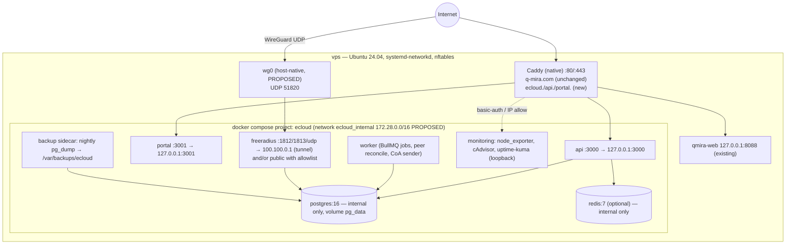
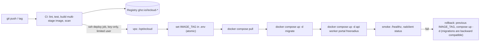
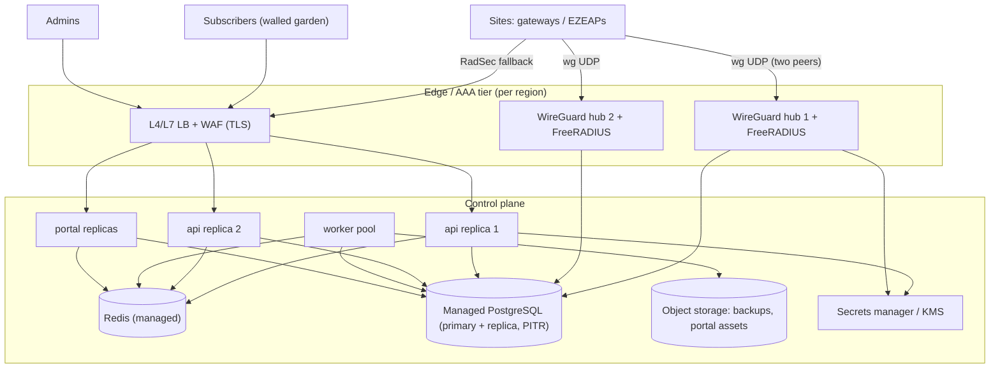

# Deployment Architecture — ECLOUD pilot on the current VPS and the path to production

Status: PROPOSED (Phase 2 design only). Nothing has been deployed, installed or changed on `vps`. Labels: **VERIFIED ON VPS (read-only)**, **VERIFIED FROM EXISTING CODE**, **VERIFIED FROM OFFICIAL DOCUMENTATION**, **PROPOSED**, **REQUIRES CLARIFICATION**.

Baseline from the A0 brief (PROPOSED): native Caddy edge (preserve q-mira.com), Docker Compose application tier, TypeScript/Node backend (precedent: ezecontroller), PostgreSQL 16, optional Redis, FreeRADIUS 3.2.x, WireGuard hub host-native (see WIREGUARD_ARCHITECTURE.md §7).

---

## 1. Host facts the design is sized against

| Fact | Value | Label |
|---|---|---|
| CPU / RAM / swap | 2 vCPU, 3.7 GiB (3819 MiB total, 592 MiB used, 3227 MiB available at check time), **no swap** | VERIFIED ON VPS (`free -m`), REMOTE_ENVIRONMENT.md §2 |
| Disk | 40 GB, 31 GB free | REMOTE_ENVIRONMENT.md §2 |
| Docker | CE 29.8.0, Compose plugin 5.5.1; `/etc/docker/daemon.json` **absent**; default bridge 172.17.0.0/16; one container `qmira-web` → `127.0.0.1:8088->80/tcp` | VERIFIED ON VPS |
| Caddy | 2.11.4 native; `/etc/caddy/Caddyfile` = single block `q-mira.com, www.q-mira.com { … reverse_proxy 127.0.0.1:8088 }`; admin API 127.0.0.1:2019 | VERIFIED ON VPS; REMOTE_ENVIRONMENT.md §9 |
| Free ports | UDP 1812/1813/3799, TCP 5432 free | BRIEF / REMOTE_ENVIRONMENT.md §3 |
| Firewall | none effective (ufw inactive, INPUT ACCEPT) | REMOTE_ENVIRONMENT.md §4 |
| Pending | reboot (kernel 6.8.0-142), 50 upgradable pkgs incl. docker-ce 29.8.2, containerd 2.3.6, compose 5.6.0, caddy 2.11.7 | REMOTE_ENVIRONMENT.md §14 |
| Runtime | no Node/Python-pip/DB on host → everything app-side must be containerised | REMOTE_ENVIRONMENT.md §7 |
| Mail | no MTA; cron mail discarded | REMOTE_ENVIRONMENT.md §7 |
| Precedent | ezecontroller `Dockerfile`: `node:22-bookworm-slim`, `npm ci --omit=dev`, non-root `USER node`, `tini`, `EXPOSE 3001`; migrations via `npm run migrate` (`scripts/migrate.js migrate|status|baseline`) | VERIFIED FROM EXISTING CODE (/Users/danny/Project/ezecontroller/Dockerfile, package.json) |

---

## 2. Pilot deployment (single VPS)



### 2.1 Services

| Service | Image (pinned by digest in prod, tag in dev) | Published ports | Networks | Volumes | Healthcheck | Notes |
|---|---|---|---|---|---|---|
| `api` | `ghcr.io/<org>/ecloud-api:<tag>` (node:22-bookworm-slim multi-stage, non-root) | `127.0.0.1:3000:3000` | internal | none (stateless) | `GET /healthz` (DB + Redis ping) | REST API + admin UI static |
| `portal` | `ghcr.io/<org>/ecloud-portal:<tag>` | `127.0.0.1:3001:3001` | internal | none | `GET /healthz` | captive-portal pages; separate process so a portal flood cannot starve admin API |
| `worker` | same image as api, different command | none | internal | none | process liveness (`pgrep`-style or `/healthz` on 127.0.0.1 inside container) | queues, accounting roll-ups, peer reconcile, CoA via `radclient` (image includes freeradius-utils) |
| `freeradius` | `freeradius/freeradius-server:3.2.x` (Docker Hub, official) + custom raddb layer | `100.100.0.1:1812-1813/udp` (tunnel) and, if option C, `57.129.69.122:1812-1813/udp` guarded by nftables allowlist; CoA listener 3799 **not** published in pilot (hub originates CoA) | internal + published | `fr_config` (ro bind of rendered raddb), `fr_logs` | `radtest`/`radclient status` to localhost with `Status-Server` | rlm_sql → postgres; clients from `nas` table (`read_clients`) |
| `postgres` | `postgres:16.<x>` | **none** | internal | `pg_data` | `pg_isready -U $POSTGRES_USER` | `shared_buffers=256MB`, `max_connections=60` (PROPOSED) |
| `redis` (optional) | `redis:7-alpine` | none | internal | `redis_data` (AOF) | `redis-cli ping` | sessions/rate limit/BullMQ; can be deferred |
| `migrate` | api image, `command: npm run migrate` | none | internal | none | one-shot (`restart: "no"`), api/worker `depends_on: migrate: condition: service_completed_successfully` | migrations as code |
| `node_exporter` | `prom/node-exporter` | `127.0.0.1:9100` | host pid/rootfs ro | ro mounts | — | host metrics |
| `cadvisor` | `gcr.io/cadvisor/cadvisor` | `127.0.0.1:8080` | — | ro docker socket | — | container metrics (heavier; may defer) |
| `uptime-kuma` | `louislam/uptime-kuma:1` | `127.0.0.1:3002` | internal | `kuma_data` | built-in | probes + webhook alerts |
| `backup` | `postgres:16.<x>` with cron script | none | internal | `/var/backups/ecloud` bind | — | nightly `pg_dump -Fc` |

Exposure policy (PROPOSED): **everything TCP binds to 127.0.0.1 and is reached only through Caddy**; the only non-loopback publications are RADIUS UDP (tunnel IP first, public IP only with nftables allowlist) and WireGuard UDP (host-native, not Docker). PostgreSQL and Redis are never published. This matches DISCOVERY_REPORT §7.2 and SECURITY.md "Minimal public ports / Restrict database exposure".

Internal network: `ecloud_internal` with explicit subnet `172.28.0.0/16` (PROPOSED; avoids the default 172.17.0.0/16 and leaves 100.100.0.0/16 for the overlay; subject to Q16). Compose `internal: false` is required for `api` to reach external IdPs, but no inbound path exists except via published loopback ports.

### 2.2 Memory budget (3.7 GiB, 2 vCPU) — PROPOSED `deploy.resources.limits` (Compose `deploy.resources.limits/reservations` memory/cpus/pids — VERIFIED FROM OFFICIAL DOCUMENTATION https://docs.docker.com/reference/compose-file/deploy/)

| Component | Limit | Reservation | cpus | Rationale |
|---|---|---|---|---|
| Host OS + sshd + journald + Caddy + qmira-web | ~600 MiB (measured used 592 MiB) | — | — | VERIFIED ON VPS baseline |
| postgres | 640 MiB | 384 MiB | 1.0 | shared_buffers 256 MiB + work_mem × connections |
| api | 384 MiB | 192 MiB | 0.75 | Node heap `--max-old-space-size=256` |
| portal | 256 MiB | 128 MiB | 0.5 | Node heap 160 MiB |
| worker | 320 MiB | 160 MiB | 0.5 | Node heap 224 MiB; radclient spawns |
| freeradius | 192 MiB | 96 MiB | 0.5 | small footprint |
| redis | 128 MiB | 64 MiB | 0.25 | `maxmemory 96mb` |
| uptime-kuma | 256 MiB | 128 MiB | 0.25 | Node app |
| node_exporter | 64 MiB | 32 MiB | 0.1 | |
| cadvisor (optional) | 192 MiB | — | 0.25 | defer if tight |
| backup (nightly, transient) | 128 MiB | — | 0.25 | |
| **Total limits (containers)** | **≈ 2.56 GiB** | ≈ 1.18 GiB | | leaves ≥ 0.5 GiB headroom + swap for spikes |

Swap (PROPOSED, needs approval Q21): 2 GiB swapfile (`/swapfile`, 0600, `vm.swappiness=10`) or zram; required because the host has none (REMOTE_ENVIRONMENT.md §2) and OOM-kills would otherwise hit postgres first.

### 2.3 Log rotation and host prerequisites

`/etc/docker/daemon.json` (absent today — VERIFIED ON VPS). Docker's json-file driver defaults `max-size` to unlimited; rotation is configured via `log-driver`/`log-opts` in `daemon.json` (VERIFIED FROM OFFICIAL DOCUMENTATION https://docs.docker.com/engine/logging/drivers/json-file/). PROPOSED content:
```json
{ "log-driver": "json-file", "log-opts": { "max-size": "10m", "max-file": "3" } }
```
Applying it restarts Docker (brief qmira-web interruption). Also set `journald SystemMaxUse=300M` (journal is 302 MB, uncapped — REMOTE_ENVIRONMENT.md §14).

Prerequisites before any deployment — from DISCOVERY_REPORT.md §7.5 (all require approval, Q21), in order:
1. Resolve `cf-dns-failover` cron intent (Q19) — it runs as root every minute on the same host.
2. Schedule the pending reboot (kernel 6.8.0-142) — brief q-mira.com interruption; re-verify `modinfo wireguard` afterwards.
3. Upgrade docker-ce / containerd / compose / caddy from vendor repos.
4. Add swap (2 GiB).
5. Create `daemon.json` (above) and journald cap.
6. Host firewall (nftables) + fail2ban, sequenced: SSH allow rule first, console fallback confirmed (Q17).
7. Remove hello-world containers and build cache (optional).
8. Install `wireguard-tools` (only if the tunnel option is approved — WIREGUARD_ARCHITECTURE.md §7).

---

## 3. Caddy integration (no change now; Phase 3 procedure)

### 3.1 Subdomains vs paths

| Criterion | Subdomains `ecloud.` / `api.ecloud.` / `portal.ecloud.ezelink.ai` | Single host with paths `/`, `/api`, `/portal` |
|---|---|---|
| Captive-portal clients | Walled garden needs only `portal.ecloud.ezelink.ai`; admin UI/API are **not** reachable by unauthenticated subscribers at all | Whole host must be in the walled garden → admin UI/API exposed to pre-auth subscribers (login page attack surface) |
| Cookies / sessions | Separate origins: admin session cookie never sent to the portal; CSRF surface smaller | Shared cookie scope unless carefully path-scoped |
| TLS / ACME | One cert per name (Caddy automatic; HTTP-01 needs port 80 reachable for each name and DNS A/AAAA → VPS). Wildcard would need DNS-01 (Cloudflare API) — avoid for pilot | One cert |
| Rate limiting / WAF | Per-vhost policies (portal: high volume, anonymous; api: authenticated) | Path matchers; workable but coarser |
| Future split | api/portal can move to other hosts/regions by DNS alone | Requires path routing at an LB |
| Recommendation | **Subdomains** (PROPOSED). `ecloud.ezelink.ai` = admin UI (serves the SPA and proxies `/api/*` to api for same-origin convenience, optional); `api.ecloud.ezelink.ai` = REST (devices, integrations); `portal.ecloud.ezelink.ai` = captive portal | — |

Conditions (REQUIRES CLARIFICATION, Q13): the three names must resolve to 57.129.69.122 / the IPv6 /128 **DNS-only** (not Cloudflare-proxied) — proxied records would (a) hide client IPs from the portal (needed for NAS/client correlation unless trusted-proxy headers are configured), and (b) be inconsistent with RADIUS/WireGuard which cannot be proxied anyway. Captive-portal detection probes use plain HTTP first; Caddy's automatic HTTP→HTTPS redirect handles that, provided the portal host is in the walled garden (A2 domain: uspot/CoovaChilli allowlist).

### 3.2 Proposed Caddyfile fragments (NOT applied)

Keep the existing block **verbatim**; convert to imports only inside the validated change:
```caddyfile
# /etc/caddy/Caddyfile  (PROPOSED final shape)
q-mira.com, www.q-mira.com {
	@www host www.q-mira.com
	redir @www https://q-mira.com{uri} permanent
	encode zstd gzip
	reverse_proxy 127.0.0.1:8088
}

import /etc/caddy/sites/*.caddy
```
```caddyfile
# /etc/caddy/sites/ecloud.caddy  (PROPOSED)
ecloud.ezelink.ai {
	encode zstd gzip
	log { output file /var/log/caddy/ecloud.access.log { roll_size 50mb roll_keep 5 } }
	header { Strict-Transport-Security "max-age=31536000" X-Content-Type-Options nosniff X-Frame-Options DENY }
	reverse_proxy 127.0.0.1:3000
}
api.ecloud.ezelink.ai {
	encode zstd gzip
	log { output file /var/log/caddy/api.access.log { roll_size 50mb roll_keep 5 } }
	reverse_proxy 127.0.0.1:3000 { header_up X-Forwarded-For {remote_host} }
}
portal.ecloud.ezelink.ai {
	encode zstd gzip
	log { output file /var/log/caddy/portal.access.log { roll_size 50mb roll_keep 10 } }
	header { X-Frame-Options DENY X-Content-Type-Options nosniff }
	reverse_proxy 127.0.0.1:3001
}
```
(Optional) monitoring UI behind auth: `kuma.ecloud.ezelink.ai { basic_auth { <user> <hash from caddy hash-password> } reverse_proxy 127.0.0.1:3002 }`.

### 3.3 Validation / reload procedure (Phase 3, after approval; preserves q-mira.com)

Caddy CLI: `caddy validate` "Tests whether a config file is valid"; `caddy adapt --config <path> --validate` performs adaptation **and** provisioning-level validation; `caddy reload` "Changes the config of the running Caddy process"; `caddy fmt` formats — VERIFIED FROM OFFICIAL DOCUMENTATION https://caddyserver.com/docs/command-line.

1. `sudo cp -a /etc/caddy/Caddyfile /etc/caddy/Caddyfile.bak.$(date +%F)` and `sudo mkdir -p /etc/caddy/sites /var/log/caddy && sudo chown caddy:caddy /var/log/caddy`.
2. Write new files to a staging path first: `/tmp/caddy-new/Caddyfile`, `/tmp/caddy-new/sites/ecloud.caddy` (with `import /tmp/caddy-new/sites/*.caddy` temporarily, or validate the final paths after copying).
3. `caddy fmt --overwrite /tmp/caddy-new/Caddyfile` then `caddy validate --config /etc/caddy/Caddyfile.new --adapter caddyfile` (and `caddy adapt --config … --validate --pretty | less` to eyeball that the `q-mira.com` site block is unchanged).
4. Confirm DNS for the new names already points at the VPS (otherwise ACME for those names fails and retries; the q-mira.com site keeps serving, but avoid noise): `dig +short ecloud.ezelink.ai A AAAA`.
5. Install: `sudo install -m 0644 /tmp/caddy-new/Caddyfile /etc/caddy/Caddyfile; sudo install -m 0644 /tmp/caddy-new/sites/ecloud.caddy /etc/caddy/sites/`.
6. `sudo systemctl reload caddy` (graceful; equivalent to `caddy reload --config /etc/caddy/Caddyfile`), then `systemctl status caddy`, `journalctl -u caddy -n 50`, `curl -sI https://q-mira.com | head -1`, `curl -sI https://ecloud.ezelink.ai | head -1`.
7. Rollback: `sudo cp -a /etc/caddy/Caddyfile.bak.<date> /etc/caddy/Caddyfile && sudo systemctl reload caddy`.

---

## 4. Environment-driven configuration, secrets, reproducibility

### 4.1 `.env.example` (variable names only; real `.env` is 0600, never committed)

```
# --- identity / URLs
ECLOUD_ENV=pilot|production
ECLOUD_BASE_URL=https://ecloud.ezelink.ai
ECLOUD_API_URL=https://api.ecloud.ezelink.ai
ECLOUD_PORTAL_URL=https://portal.ecloud.ezelink.ai
IMAGE_TAG=                      # git sha or semver; used by compose for rollback
# --- database
POSTGRES_DB= POSTGRES_USER= POSTGRES_PASSWORD_FILE=/run/secrets/postgres_password
DATABASE_URL=                   # or composed in entrypoint from the above
PG_SHARED_BUFFERS=256MB PG_MAX_CONNECTIONS=60
# --- redis (optional)
REDIS_URL=
# --- app secrets (files preferred)
JWT_SIGNING_KEY_FILE=/run/secrets/jwt_key
SESSION_SECRET_FILE=/run/secrets/session_secret
ENCRYPTION_KEY_FILE=/run/secrets/data_encryption_key    # encrypts stored RADIUS secrets / WG keys at rest
# --- RADIUS
RADIUS_BIND_IP=100.100.0.1 RADIUS_PUBLIC_BIND_IP=       # empty = not published publicly
RADIUS_SQL_USER= RADIUS_SQL_PASSWORD_FILE=/run/secrets/radius_sql_password
RADIUS_COA_PORT=3799
# --- WireGuard hub (host-native; app only needs these)
WG_INTERFACE=wg0 WG_HUB_ENDPOINT=57.129.69.122:51820 WG_OVERLAY_CIDR=100.100.0.0/16 WG_HUB_PUBLIC_KEY=
# --- integrations
IDP_OAUTH_CLIENT_ID= IDP_OAUTH_CLIENT_SECRET_FILE=
ALERT_WEBHOOK_URL=              # no MTA on host
# --- backups
BACKUP_DIR=/var/backups/ecloud BACKUP_RETENTION_DAILY=7 BACKUP_RETENTION_WEEKLY=4 BACKUP_OFFSITE_TARGET=   # REQUIRES CLARIFICATION
BACKUP_ENCRYPTION_PUBKEY_FILE=  # age/gpg public key
# --- logging
LOG_LEVEL=info LOG_FORMAT=json
```

### 4.2 Secrets handling

| Rule | Mechanism (PROPOSED) |
|---|---|
| Never in git | `.env`, `secrets/` in `.gitignore`; CI secret scan (gitleaks) blocks pushes |
| At rest on host | `/opt/ecloud/secrets/*` 0600 root (or deploy user), mounted as Compose `secrets:` (file-based) → `/run/secrets/<name>` in containers; apps read `*_FILE` variables |
| Rendered configs with secrets (FreeRADIUS raddb, `.netdev`) | generated by the worker/deploy script into 0600 files; templates in git with placeholders only |
| Rotation | documented per secret; DB password rotation via `ALTER ROLE` + redeploy; RADIUS secrets per NAS stored encrypted (`ENCRYPTION_KEY_FILE`) and rotated via UI |
| Production | secrets manager (provider KMS/Vault); same `*_FILE` contract so images do not change |

### 4.3 Reproducible images and migrations

- Multi-stage `Dockerfile`: `node:22-bookworm-slim` build stage (`npm ci`, `tsc`), runtime stage with only `dist/` + production deps, `USER node`, `tini` (precedent: ezecontroller Dockerfile — VERIFIED FROM EXISTING CODE). Pin base images by digest in production; tag app images `:<git-sha>` and `:<semver>`; SBOM + Trivy scan in CI.
- Migrations as code in the api repo (`migrations/` SQL or a migration tool), executed by the `migrate` one-shot service before `api`/`worker` start (`depends_on … service_completed_successfully`). Precedent: ezecontroller `npm run migrate|migrate:status|migrate:baseline` (VERIFIED FROM EXISTING CODE). Rule: expand/contract (backwards-compatible) migrations so the previous image can still run during rollback.
- FreeRADIUS raddb rendered from templates + DB-driven clients (`read_clients`), so the container image is stock and reproducible.

### 4.4 CI/CD sketch and rollback


- Deploy root (Q14): `/opt/ecloud` recommended (consistent with `/opt/qmira-site`); contains `compose.yaml`, `compose.pilot.yaml` override, `.env` (0600), `secrets/`, `config/` (rendered), no source code.
- Deploy user: dedicated non-root user in `docker` group **or** sudo-limited; today only `ubuntu` exists (Q22).
- Rollback: `IMAGE_TAG=<previous>` + `docker compose up -d`; DB rollback only via restore (see §5) — hence expand/contract migrations.

---

## 5. Backup and restore

| Item | Proposal | Label |
|---|---|---|
| Database | nightly `pg_dump -Fc` from the `backup` sidecar to `/var/backups/ecloud/pg/ecloud-<date>.dump`; retention 7 daily + 4 weekly; optional WAL archiving later for lower RPO | PROPOSED |
| Config | nightly tar of `/opt/ecloud/{compose*.yaml,config/}`, `/etc/caddy/`, `/etc/systemd/network/50-wg0.*` (private key **encrypted** with `age`/gpg before leaving the host), `/etc/nftables.conf`, `/etc/docker/daemon.json` | PROPOSED |
| Encryption | all offsite artefacts encrypted client-side (`age -r <pubkey>`); keys held outside the VPS | PROPOSED (SECURITY.md "Backup encryption") |
| Offsite target | **REQUIRES CLARIFICATION** (Q18): OVH snapshots enabled? Object storage bucket (S3-compatible via `rclone`), or push to the EZE controller host? Local-only backups do not survive VPS loss | REQUIRES CLARIFICATION |
| Restore drill | monthly: `docker compose -p ecloud-restore -f compose.restore.yaml up -d postgres` on a throwaway volume → `pg_restore -d ecloud …` → run smoke SQL (tenant count, latest accounting row) → tear down; record duration | PROPOSED |
| RPO / RTO (pilot) | RPO 24 h (nightly dump), RTO 2 h (rebuild compose on same or new VPS from backups + DNS unchanged) | PROPOSED |
| RPO / RTO (production target) | RPO ≤ 15 min (managed PostgreSQL PITR), RTO ≤ 30 min (stateless replicas + second hub) | PROPOSED |
| Monitoring of backups | uptime-kuma "push" monitor: backup job pings after success; alert if no ping in 26 h | PROPOSED |

---

## 6. Monitoring, observability, alerting (sized for the pilot)

| Layer | Pilot (PROPOSED) | Later |
|---|---|---|
| Availability | **uptime-kuma** (container, loopback, via Caddy with basic_auth): HTTP probes for the three vhosts and q-mira.com, TCP/ping probes over wg0 to site gateways, push monitors for backup/cron, RADIUS probe via a small `radclient status` cron reporting to a push monitor | keep |
| Host metrics | `node_exporter` on 127.0.0.1:9100 (+ `textfile` collector for `wg show wg0 dump` latest-handshake per peer) | Prometheus + Grafana (≈ 400–600 MiB extra; defer until a second host or after memory review) |
| Containers | Docker healthchecks + `docker stats`; cAdvisor optional | cAdvisor + Prometheus |
| FreeRADIUS | `freeradius_exporter` (Status-Server based) if Prometheus is added; until then log-based counters (Access-Accept/Reject per NAS) emitted by the api from accounting data | exporter |
| PostgreSQL | `postgres_exporter` with Prometheus; pilot: `pg_stat_activity` snapshots in the api `/healthz` detail | exporter |
| Logs | Docker json-file (rotated), Caddy access logs per vhost (rotated), FreeRADIUS `linelog`; `journalctl` for host; aggregate later with Loki/Promtail (memory permitting) | Loki |
| Alert routing | **No MTA exists** → webhook only: uptime-kuma native notifications (Slack/Telegram/Discord/generic webhook) to `ALERT_WEBHOOK_URL` — REQUIRES CLARIFICATION which channel | Alertmanager → same webhook |
| Security signals | fail2ban (sshd, portal/admin login jails), nftables counters, audit log of privileged actions in the app | SIEM export |

Repository existence verified (HTTP 200): prometheus/node_exporter, google/cadvisor, prometheus-community/postgres_exporter, bvantagelimited/freeradius_exporter, louislam/uptime-kuma, grafana/loki, prometheus/alertmanager; Docker Hub `freeradius/freeradius-server` — tool suitability is PROPOSED.

---

## 7. Future production scaling (independent of this VPS)



| Dimension | Production design (PROPOSED) |
|---|---|
| Separation | Control plane (api/portal/worker/DB) separate from AAA edge (FreeRADIUS + WireGuard hubs per region); edges hold no durable state |
| Database | Managed PostgreSQL 16 with PITR, read replica for accounting reports; connection pooler (PgBouncer) in front |
| API/portal | Stateless replicas behind LB; sessions in Redis; horizontal scale per tenant load |
| RADIUS HA | Every NAS configured with **two** RADIUS servers (`interface.ssid.radius.server` + `.secondary` — schema key exists, VERIFIED FROM EXISTING CODE; device behaviour REQUIRES DEVICE TEST), each on a different hub/region; accounting idempotent on `Acct-Session-Id` |
| WireGuard hubs | Two hubs per region (WIREGUARD_ARCHITECTURE.md §11); DNS-steered endpoints; per-tenant interfaces |
| Backups | Object storage (versioned, encrypted, cross-region) |
| Secrets | KMS/Vault; same `*_FILE` contract |
| Delivery | same images, same compose/Helm values with env overrides; no host-specific code |
| Observability | Prometheus/Grafana/Loki/Alertmanager centrally; per-tenant dashboards |

---

## Evidence index

| Source | Label |
|---|---|
| `ssh vps` read-only checks 2026-10-07: `free -m`, `swapon`, `ip -brief addr`, `docker ps`, `cat /etc/caddy/Caddyfile`, `cat /etc/docker/daemon.json` (absent), `modinfo/lsmod/which wg` | VERIFIED ON VPS |
| /Users/danny/Project/EZECLOUD/REMOTE_ENVIRONMENT.md §2, §3, §4, §7, §9, §14 | Phase 1 verified |
| /Users/danny/Project/EZECLOUD/DISCOVERY_REPORT.md §7.1, §7.2, §7.4, §7.5 | Phase 1 verified / proposals |
| /Users/danny/Project/EZECLOUD/QUESTIONS.md Q13–Q22 ; SECURITY.md ; BRIEF.md | Requirements |
| /Users/danny/Project/ezecontroller/Dockerfile ; package.json (`migrate` scripts, node:22-bookworm-slim, tini, USER node) | VERIFIED FROM EXISTING CODE |
| /Users/danny/Project/ezecontroller/src/schemas/ucentral.full.json (`interface.ssid.radius.server.secondary`, `service.radius-proxy`) | VERIFIED FROM EXISTING CODE |
| https://caddyserver.com/docs/command-line (`caddy validate`, `caddy adapt --validate`, `caddy reload`, `caddy fmt`) | VERIFIED FROM OFFICIAL DOCUMENTATION |
| https://docs.docker.com/engine/logging/drivers/json-file/ (`daemon.json` `log-driver`/`log-opts`, `max-size` default unlimited, example 10m/3) | VERIFIED FROM OFFICIAL DOCUMENTATION |
| https://docs.docker.com/reference/compose-file/deploy/ (`resources.limits/reservations`: cpus, memory, pids) | VERIFIED FROM OFFICIAL DOCUMENTATION |
| https://raw.githubusercontent.com/FreeRADIUS/freeradius-server/v3.2.x/raddb/mods-available/sql (`read_clients`, `client_table = "nas"`) ; …/sites-available/originate-coa ; …/man/man1/radclient.1 | VERIFIED FROM OFFICIAL DOCUMENTATION |
| GitHub repos (HTTP 200): prometheus/node_exporter, google/cadvisor, prometheus-community/postgres_exporter, bvantagelimited/freeradius_exporter, louislam/uptime-kuma, grafana/loki, prometheus/alertmanager; hub.docker.com/r/freeradius/freeradius-server | Existence VERIFIED; suitability PROPOSED |
| WIREGUARD_ARCHITECTURE.md (this project) | PROPOSED companion design |

## Open questions for owner

1. **Q13** DNS: will `ecloud.`, `api.ecloud.`, `portal.ecloud.ezelink.ai` point (DNS-only, unproxied) at 57.129.69.122 / the IPv6 address? Is the subdomain structure accepted?
2. **Q14** Deploy root `/opt/ecloud` (recommended) vs `/home/ubuntu/ecloud`.
3. **Q15** Confirm keeping native Caddy as the shared edge (recommended) rather than a containerised proxy.
4. **Q16** Confirm `172.28.0.0/16` (Compose) and `100.100.0.0/16` (overlay) do not collide with any site/VPN addressing.
5. **Q18 / backup offsite target**: OVH snapshots? Object storage bucket? Which account/credentials?
6. **Alert channel**: Slack/Telegram/Discord/generic webhook URL for uptime-kuma (no MTA on host).
7. **Q21** Approval and maintenance window for host prerequisites (reboot, upgrades, swap, daemon.json, firewall, fail2ban).
8. **Q22** Dedicated deploy user and per-person accounts; CI runner identity allowed to SSH.
9. Redis in the pilot (sessions/queues) or defer to keep memory low?
10. Is RADIUS to be published on the public IP at all in the pilot (option C fallback), or tunnel-only?
11. Container registry choice (GHCR vs other) and who owns the org.

## Items requiring a real device test

| # | Test | Decides |
|---|---|---|
| D1 | NAS configured with primary + `secondary` RADIUS server; stop primary; observe failover and accounting continuity | RADIUS HA design (§7) |
| D2 | Captive-portal client detection flow against `portal.ecloud.ezelink.ai` with only that FQDN in the walled garden (HTTP probe → Caddy redirect → HTTPS portal) | Subdomain decision (§3.1), walled-garden list (A2) |
| D3 | RADIUS Access-Request/Accounting from AP reaches FreeRADIUS published on the tunnel IP (`100.100.0.1:1812`) vs public IP with nftables allowlist | Exposure policy (§2.1) |
| D4 | `radclient status` (Status-Server) against the FreeRADIUS container from the worker container — healthcheck viability | Healthchecks (§2.1) |
| D5 | End-to-end latency budget: portal login → RADIUS → policy applied on AP, measured with limits from §2.2 under load (e.g. 50 concurrent logins) | Resource sizing (§2.2) |
| D6 | Site gateway/AP reaching `api.ecloud.ezelink.ai` (if device-side integrations are needed) over public vs tunnel | API path (§2.1, WIREGUARD §6) |
