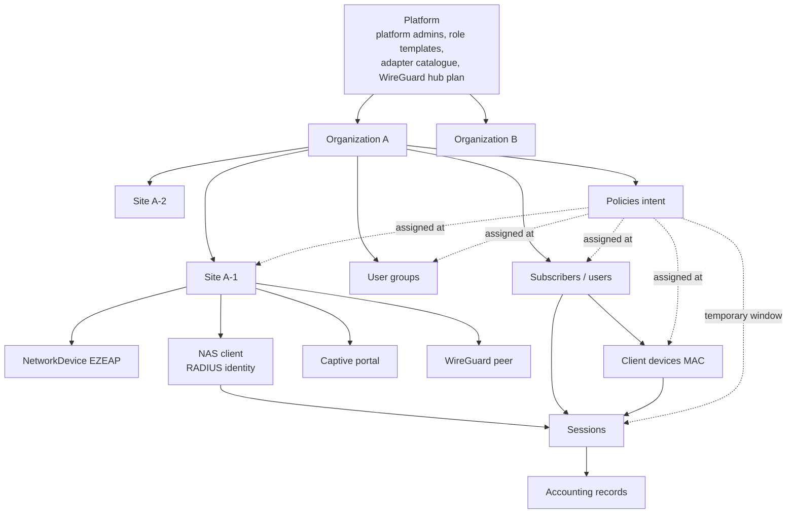
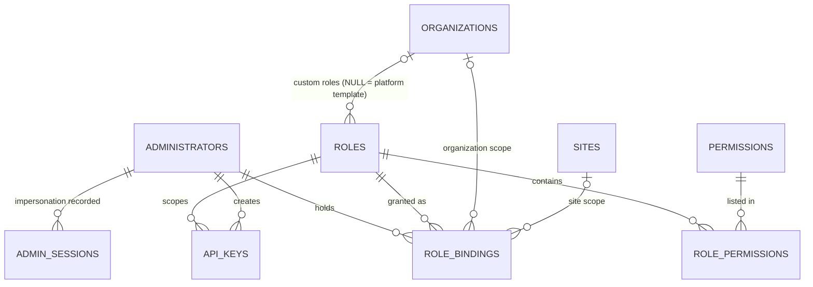

# ECLOUD — Multi-tenancy, Isolation and RBAC Data Model (Phase 2, A6)

Status: **PROPOSED** unless labelled otherwise. Table definitions referenced here live in `DATABASE_DESIGN.md`. Nothing has been created on any host.

Owner requirement (BRIEF.md, verbatim summary): *"MULTI-TENANT: Platform → Organization/Tenant → Sites → Network Devices → Users/Devices → Sessions → Policies. Logical isolation per organization."* and *"RBAC roles: Platform Super Admin, Platform Support, Organization Admin, Site Admin, Operator/Support, Read Only. Do not hard-code around role names; use granular permissions."* This resolves DECISIONS.md D-007 as **multi-tenant** (status PROPOSED until the owner approves this document).

---

## 1. Hierarchy



| Level | Owns | Tenant key | Notes |
|---|---|---|---|
| Platform | `administrators` (identity), platform `roles`, `permissions`, `adapter_types`, WireGuard address plan | none | No "platform organization" row — platform is the absence of a tenant, never a special tenant id |
| Organization | sites, users, groups, client devices, policies, vouchers, IdPs, themes, webhooks, API keys, custom roles | `organizations.id` | The isolation boundary. Everything below carries `organization_id` |
| Site | network devices, NAS clients, captive portals, WireGuard peers, site-scoped users/groups/policies | `organization_id` + `site_id` | Scope boundary for Site Admin; not an isolation boundary (same tenant) |
| NetworkDevice / NAS | sessions originate here | inherited | Device = managed EZEAP/gateway; NAS = RADIUS client identity. One device may be zero or one NAS; a gateway NAS may front many APs |
| Users / ClientDevices | sessions, usage counters | inherited | Subscriber identity scoped to the organization (§4) |
| Sessions / Accounting | append-only runtime data | inherited, nullable for unresolved packets | Unresolved rows visible to platform only |
| Policies | intent at `user` / `group` / `site` / `temporary` scope | inherited | Resolution order in `DATABASE_DESIGN.md §3.4` |

---

## 2. Isolation model

| Criterion | Shared DB + shared schema + `organization_id` + RLS | Schema per tenant | Database per tenant |
|---|---|---|---|
| Cross-tenant leak protection | Application filter + PostgreSQL RLS (two independent locks) | Search-path mistakes leak; no RLS needed | Strongest; connection string is the boundary |
| Migrations | One run | N runs, N failure modes, drift risk | N runs + N databases to back up |
| FreeRADIUS integration | One `radius` schema, tenant resolved per packet | FreeRADIUS would need tenant-aware search_path per packet — not a standard `rlm_sql` feature (UNKNOWN; A3) | One FreeRADIUS SQL module instance per tenant — does not scale |
| Platform-wide views (support, billing, capacity) | Plain queries with `platform_access` | `UNION ALL` across schemas | Federated queries / ETL |
| Connection pooling | One pool, `SET LOCAL app.current_org` | One pool, `SET LOCAL search_path` | Pool per tenant |
| Per-tenant restore | Logical export by `organization_id` (slower) | `pg_dump -n schema` | `pg_restore` of one DB (best) |
| Noisy neighbour | Shared buffers/IO; mitigated by quotas (§7) and partitioning | Same | Isolated |
| Cost on a 2 vCPU / 3.7 GiB pilot VPS | Lowest | Medium | Highest |
| **Pilot** | **recommended** | no | no |
| **Production** | **recommended** as the default tier; keep the per-tenant export path so an enterprise tenant can be moved to a dedicated database later without schema changes | no | optional "dedicated" tier, same schema, same code — only the connection is chosen per tenant |

Design invariants that keep the dedicated-DB escape hatch open: every tenant table has `organization_id` even in a dedicated database (the value is constant there); no cross-tenant foreign keys; platform tables (`administrators`, `permissions`, platform `roles`, `adapter_types`) have no FK *from* tenant tables except `role_bindings.role_id` and `nas_clients.adapter_type_key`, both of which can be replicated as reference data.

---

## 3. Identity scoping rules

### 3.1 Administrators

| Rule | Decision (PROPOSED) |
|---|---|
| Account identity | One global `administrators` row per email (Q7 in `DATABASE_DESIGN.md`). An administrator becomes "a member of" an organization only through `role_bindings`. |
| Platform vs organisation admins | Not a column on the account. A platform admin is simply an administrator holding a binding with `scope_type = 'platform'`. Removing the binding removes the power. |
| Login | Email + password (hash) or SSO; MFA enforcement is a platform setting and may be required per organization (`organizations.settings.require_mfa`). Admin sessions carry the **selected** organization context, never "all tenants" by default. |
| Lifecycle | Invitations (`invitations`) are organization-scoped and pre-assign a role + scope; accepting creates or links the global account. Disabling the global account revokes every binding's effect immediately (`administrators.status`). |

### 3.2 Subscribers (RADIUS users)

| Rule | Decision (PROPOSED) |
|---|---|
| Username uniqueness | Per **organization** (`uq_users_org_username`). Open question Q1 (per site) is left to the owner. |
| On the wire | The username presented to RADIUS is the bare username; the **tenant comes from the NAS identity** (§3.3), not from the name. Optional realm (`user@org-slug`) is a `users.radius_username` generated column if the owner answers Q2 "yes". |
| MAC-auth | `client_devices.mac` is unique per organization, so MAC lookups are also tenant-first: resolve tenant from NAS, then `(organization_id, mac)`. |
| Vouchers | `vouchers.code_hash` is globally unique so a code presented on any portal resolves to exactly one tenant; the portal's own tenant (from the portal URL/site) **must equal** the voucher's tenant or the attempt is rejected and logged (§6 test T-07). |
| Social / external IdP | `(identity_provider_id, external_subject)` unique; the IdP row is tenant-scoped, so the same Google account becomes two different subscribers in two tenants. |

### 3.3 RADIUS request → tenant resolution (AAA must know the tenant before it can look up a user)

| Option | How | Verification status | Notes |
|---|---|---|---|
| **A. NAS identity** (primary) | Source IP of the Access-Request (`NAS-IP-Address` attribute and/or the actual UDP source) → `nas_clients.nas_ip` → `organization_id`, `site_id`. `NAS-Identifier` as secondary key when IPs collide. | `NAS-IP-Address` (type 4) and `NAS-Identifier` (type 32) are standard RADIUS attributes defined in RFC 2865 §5.4 and §5.32 — **VERIFIED FROM OFFICIAL DOCUMENTATION** (`https://www.rfc-editor.org/rfc/rfc2865`). Whether EZEAP/uspot/CoovaChilli populate `NAS-Identifier` — **REQUIRES DEVICE TEST** (A2/A4). | The RADIUS shared secret is per NAS, so the trust anchor and the tenant key are the same object. This is why `nas_clients.nas_ip` is globally unique and why WireGuard tunnel IPs are planned platform-wide. |
| B. Realm suffix | Portal or supplicant sends `user@org-slug`; FreeRADIUS strips the realm; ECLOUD maps realm → organization. | Realm handling in FreeRADIUS (`rlm_realm`/`suffix`) exists as a module — its exact behaviour for this flow is for A3 to cite. Whether uspot/CoovaChilli append a realm — **UNKNOWN / REQUIRES DEVICE TEST**. | Only useful if one NAS must serve several tenants (shared venue). Kept as an optional refinement. |
| C. SSID / VLAN hint | `Called-Station-Id` carrying the AP MAC and SSID; or `NAS-Port-Id`/VLAN. | RFC 3580 §3.20 describes `Called-Station-Id` as the AP MAC, optionally with SSID appended, for IEEE 802.1X — **VERIFIED FROM OFFICIAL DOCUMENTATION** (`https://www.rfc-editor.org/rfc/rfc3580`). Format sent by uspot / CoovaChilli / OpenWiFi — **REQUIRES DEVICE TEST** (A4). | Refines **site/SSID** within a tenant already identified by A; must never be the sole tenant key (client-influenced values). |

Decision (PROPOSED): **A is mandatory, C refines within the tenant, B is optional.** A request from an unknown NAS IP is rejected by FreeRADIUS before reaching ECLOUD (no shared secret), and if it does reach ECLOUD it is logged to `auth_events` with `organization_id NULL`, `result='error'`.

---

## 4. RBAC data model



### 4.1 Precedent and what changes

ezecontroller `src/lib/permissions.ts` — **VERIFIED FROM EXISTING CODE**: a flat registry `PERMISSIONS = { 'device.read': 'description', … }` (L24), role grant lists `ROLE_GRANTS = { superuser: ALL, client_admin, site_admin, readonly, none }` (L120-126), an alias map for renamed verbs (L136), `canonical()` (L188), `can(req, perm)` (L201) and the Express guard `requirePermission(perm)` (L214). Its header states the four-part rule *"Role + Scope + Permission + Ownership"* (L4) and that permissions are additive to ownership checks, never a replacement (L11-15).

Reused: the flat `resource:action` catalogue, deny-by-default (`none: []`), additive-only grants (no deny rules), the `requirePermission` guard shape, and the "permission answers *kind of thing*, ownership answers *this object*" split.

Changed: grants move from a hard-coded `ROLE_GRANTS` constant into `roles` / `role_permissions` rows so organizations can define custom roles; scope becomes explicit data (`role_bindings.scope_type`) instead of `req.user.role_type` + `assigned_country_id`; separator becomes `:` (brief examples `policy:create`) with the precedent's `.` form accepted by the parser for one release.

### 4.2 Permission catalogue (seed, PROPOSED — ~60 keys)

| Resource | Actions | Min scope | Platform-only |
|---|---|---|---|
| `organization` | `read`, `update`, `create`, `suspend`, `delete`, `settings:update` | organization (`create/delete/suspend`: platform) | create, delete, suspend |
| `site` | `read`, `create`, `update`, `delete` | site (`create/delete`: organization) | — |
| `network_device` | `read`, `create`, `update`, `delete`, `config:push` | site | — |
| `nas` | `read`, `create`, `update`, `delete`, `secret:rotate` | site | — |
| `wireguard_peer` | `read`, `create`, `update`, `delete`, `key:rotate` | site | — |
| `administrator` | `read`, `invite`, `update`, `disable`, `binding:create`, `binding:delete` | organization | — |
| `role` | `read`, `create`, `update`, `delete` | organization | — |
| `user` | `read`, `create`, `update`, `delete`, `suspend`, `password:reset`, `export` | site | — |
| `user_group` | `read`, `create`, `update`, `delete` | organization | — |
| `client_device` | `read`, `create`, `update`, `delete`, `block` | site | — |
| `policy` | `read`, `create`, `update`, `delete`, `preview` | organization | — |
| `policy_assignment` | `read`, `create`, `delete` | site | — |
| `voucher` | `read`, `create`, `revoke`, `export`, `reveal` | site | — |
| `session` | `read`, `disconnect`, `coa` | site | — |
| `accounting` | `read`, `export` | site | — |
| `report` | `read`, `export` | site | — |
| `captive_portal` | `read`, `create`, `update`, `delete` | site | — |
| `portal_theme` | `read`, `create`, `update`, `delete` | organization | — |
| `identity_provider` | `read`, `create`, `update`, `delete` | organization | — |
| `api_key` | `read`, `create`, `revoke` | organization | — |
| `webhook` | `read`, `create`, `update`, `delete` | organization | — |
| `audit_log` | `read`, `export` | site | — |
| `tenant` | `impersonate`, `list` | platform | yes |
| `platform` | `settings:update`, `adapter:manage`, `role_template:manage`, `health:read` | platform | yes |

Permission keys are data (`permissions` table). Authorization code only ever asks `can(principal, 'session:disconnect', scope)`; it never compares role names.

### 4.3 Role templates (seed rows in `roles` with `organization_id IS NULL`, `is_system = true`)

| Owner role | Template key | Default `scope_type` of bindings | Permission set (summary) |
|---|---|---|---|
| Platform Super Admin | `platform_super_admin` | platform | every key in the catalogue |
| Platform Support | `platform_support` | platform | all `*:read`, `tenant:list`, `tenant:impersonate`, `session:disconnect`, `session:coa`, `audit_log:*`, `platform:health:read`; **no** create/update/delete on tenant configuration while not impersonating |
| Organization Admin | `org_admin` | organization | every non-platform key |
| Site Admin | `site_admin` | site | `site:read/update`, `network_device:*`, `nas:read`, `user:*`, `client_device:*`, `policy:read/preview`, `policy_assignment:*`, `voucher:read/create/revoke/export`, `session:*`, `accounting:*`, `report:*`, `captive_portal:read/update`, `audit_log:read` |
| Operator / Support | `operator` | site or organization | `user:read/update/password:reset`, `client_device:read/update/block`, `voucher:read/create`, `session:read/disconnect`, `accounting:read`, `report:read`, `*:read` on site/device objects |
| Read Only | `read_only` | site or organization | every `*:read` except `voucher:reveal`, `audit_log:export` |

Templates are copied into an organization's custom role when edited (copy-on-write, `template_version` recorded), so a platform update to a template never silently widens a tenant's edited role.

### 4.4 Evaluation algorithm (PROPOSED)

```text
authorize(principal, permission, target):
  # principal = administrator session | api key ; target = {organization_id?, site_id?}
  1. if principal disabled/expired/revoked -> DENY
  2. bindings = role_bindings for principal (api key: its single role+scope) with expires_at null/future
  3. applicable = bindings where scope contains target:
        platform binding      -> any target
        organization binding  -> target.organization_id = binding.organization_id
        site binding          -> target.organization_id = binding.organization_id AND target.site_id = binding.site_id
  4. granted = UNION of role_permissions.permission_key over applicable
  5. if permission not in granted -> DENY (default)
  6. if permission.is_platform_only and no applicable platform binding -> DENY
  7. if session.impersonating_organization_id is set:
        - target.organization_id must equal it, else DENY
        - effective permissions = permissions of the impersonated role template (org_admin by default), never the platform set
  8. ALLOW; the route still performs the ownership check (object belongs to target) and the DB runs under
     SET LOCAL app.current_org = target.organization_id (RLS second lock, DATABASE_DESIGN.md §8)
```

Properties: deny-by-default; additive only (no deny rules, hence no ordering problems — same choice as the precedent); scopes nest strictly (platform ⊃ organization ⊃ site); the result is cacheable per `(principal, organization_id, site_id)` for the lifetime of a request. Listing endpoints apply the same bindings as a **filter** (sites the principal may read) rather than a yes/no.

### 4.5 Impersonation / assume-tenant (Platform Support)

| Step | Data effect |
|---|---|
| Start | Requires `tenant:impersonate`; `admin_sessions.impersonating_organization_id` set, `impersonation_reason` required; `audit_logs` row `action='tenant:impersonate'`, `actor_id=support admin`, `organization_id=target` |
| During | Every audit row written has `actor_id = support admin` **and** `impersonator_id = support admin`, `organization_id = target`; UI banner; RLS `app.current_org = target`, `platform_access` **off** |
| End / timeout | Hard cap (e.g. 60 min) via `admin_sessions.expires_at`; `audit_logs` `action='tenant:impersonate:end'` |
| Visibility | Tenant Organization Admins can see impersonation entries in their own audit log (transparency); platform keeps the full trail |

### 4.6 API keys

Same algorithm, one binding: `api_keys.role_id + scope_type + organization_id/site_id`. Keys are created by an administrator who already holds every permission of the chosen role within that scope (no escalation by key). `allowed_cidrs` optional. Platform API keys (`organization_id IS NULL`) are restricted to `platform_*` templates and are never allowed `tenant:impersonate`.

---

## 5. Cross-tenant data paths that must be guarded

| # | Path | How tenant is determined | Guard |
|---|---|---|---|
| G1 | Captive portal URL | `captive_portals.public_slug` (global unique) → site → organization | Portal controller loads tenant from the slug **only**; any body/query parameter naming another org/site is ignored; theme/IdP/voucher lookups are `(organization_id, …)` |
| G2 | RADIUS Access-Request | NAS identity (§3.3 A) | User/MAC/voucher lookups prefixed by the resolved `organization_id`; mismatch (voucher of tenant B on NAS of tenant A) → reject + `auth_events` |
| G3 | RADIUS Accounting | NAS identity; `acct_unique_id` must belong to a session of the same tenant | Records with unknown NAS or mismatched session stored with `organization_id NULL` and surfaced to platform ops, never attributed to a tenant |
| G4 | CoA / Disconnect | `sessions.organization_id` | `session:disconnect` evaluated against the session's org/site; worker reads `nas_clients` of the same org only |
| G5 | Webhooks | `webhooks.organization_id` | Event fan-out selects webhooks by the event's `organization_id`; payload contains only that tenant's ids; signing secret per webhook |
| G6 | Reports / dashboards | request scope | All aggregate SQL runs under `app.current_org`; platform aggregates run under `platform_access` and are grouped by `organization_id` |
| G7 | Exports (CSV, backups) | request scope | Export jobs store `organization_id` and are served only to principals authorised for it; per-tenant dump uses the RLS table catalogue |
| G8 | Admin invitation / binding | `invitations.organization_id` | Accepting a token may only create bindings for that organization/site |
| G9 | Object references in writes | FK columns | Every FK supplied in a request (`policy_id`, `site_id`, `theme_id`, …) is re-checked to belong to the current tenant before insert (RLS makes the row invisible, the application returns 404, never 403, to avoid existence leaks) |
| G10 | Logs/metrics | request id | Application logs carry `organization_id` and `request_id`; no subscriber PII in platform logs |

### Isolation test cases (hand to A9)

| ID | Test | Expected |
|---|---|---|
| T-01 | Org-A admin lists `/sites` | only Org-A sites; count equals DB rows for A |
| T-02 | Org-A admin `GET /users/{id-of-B-user}` | 404 |
| T-03 | Org-A admin `POST /policy_assignments` with `policy_id` of B and `user_id` of A | 404/422, no row written |
| T-04 | Site-admin of A-1 reads sessions of A-2 | 404/empty |
| T-05 | Access-Request from NAS of A with username that exists only in B | Reject; `auth_events.result='reject'`, `organization_id = A` |
| T-06 | Same username in A and B, request from NAS of B | B's user authenticates; A's row untouched (check `last_login`) |
| T-07 | Voucher issued by A redeemed on portal of B | Rejected; `portal_login_attempts` row for B with reason `tenant_mismatch` |
| T-08 | Accounting packet with `acct_unique_id` of A's session arriving from B's NAS | stored with `organization_id NULL`, flagged; A's session unchanged |
| T-09 | Direct SQL as `ecloud_app` with `app.current_org = A`: `SELECT count(*) FROM users` | equals A's users only (RLS) |
| T-10 | Same, without any `SET LOCAL` | 0 rows (RLS fails closed) |
| T-11 | Platform Support impersonating A tries `PATCH /organizations/B` | 403/404; audit row recorded with `impersonator_id` |
| T-12 | Webhook event for A | delivered only to A's webhooks; payload has no B ids |
| T-13 | Export job created by A downloaded with B's token | 404 |
| T-14 | API key of A with `read_only` role attempts `session:disconnect` | 403; audit row |
| T-15 | Custom role in A edited; template updated at platform | A's role unchanged (copy-on-write) |

---

## 6. Quotas, limits and billing hooks

| Limit | Column | Enforced where |
|---|---|---|
| Sites per organization | `organizations.max_sites` | `site:create` handler (count + check in the same transaction) |
| Network devices / NAS | `organizations.max_devices` | device/NAS create |
| Subscribers | `organizations.max_users` | user create, voucher activation (voucher users count) |
| Concurrent sessions per organization | `organizations.max_concurrent_sessions` | authorize path: `count(*) FROM sessions WHERE organization_id=$1 AND status='active'` via `idx_sessions_active_*` |
| Per-user concurrency / devices | `policies.max_concurrent_sessions`, `policies.max_devices`, `users.max_devices` | authorize path |
| Accounting retention per org | `organizations.settings.retention` (future) | partition job cannot vary per org — per-org retention would be a `DELETE` job; default is global |
| Rate limits on portal/API | Redis (A0 baseline) keyed by `organization_id` | middleware |

Billing hooks (future, PROPOSED): `usage_counters` monthly rows per subject roll up to a per-organization monthly row (`subject_type='organization'` — reserved value); `organizations.plan text` and `organizations.billing_ref text` columns are reserved; audit action vocabulary already covers plan changes (`organization:settings:update`).

---

## 7. Evidence index

| # | Source | Label | Used for |
|---|---|---|---|
| E1 | `/Users/danny/.claude/jobs/6ede8b14/tmp/p2/BRIEF.md` | Owner requirements | hierarchy, six roles, "no hard-coded role names" |
| E2 | `/Users/danny/Project/ezecontroller/src/lib/permissions.ts` L1-20 (header), L24 (`PERMISSIONS`), L120-126 (`ROLE_GRANTS`), L136 (`ALIASES`), L188-225 (`canonical`, `can`, `requirePermission`) | VERIFIED FROM EXISTING CODE | §4.1 precedent |
| E3 | `/Users/danny/Project/ezecontroller/migrations/001_auth_session_engine.sql` (`api_keys`, `security_events`) | VERIFIED FROM EXISTING CODE | API key and audit shape |
| E4 | RFC 2865 §5.4 `NAS-IP-Address`, §5.32 `NAS-Identifier` — `https://www.rfc-editor.org/rfc/rfc2865` | VERIFIED FROM OFFICIAL DOCUMENTATION (standards text; not fetched in this session, cited from the RFC) | §3.3 option A |
| E5 | RFC 3580 §3.20 `Called-Station-Id` — `https://www.rfc-editor.org/rfc/rfc3580` | VERIFIED FROM OFFICIAL DOCUMENTATION (standards text; not fetched in this session, cited from the RFC) | §3.3 option C |
| E6 | `https://github.com/FreeRADIUS/freeradius-server/blob/v3.2.x/raddb/mods-config/sql/main/postgresql/schema.sql` | VERIFIED FROM OFFICIAL DOCUMENTATION (fetched 2026-10-07) | `nas` table identifies clients by `nasname`; shapes used in `DATABASE_DESIGN.md §4` |
| E7 | `/Users/danny/Project/EZECLOUD/SECURITY.md` (threats: cross-tenant exposure, privilege escalation, RADIUS client impersonation), `DECISIONS.md` D-007, `GOAL.md` "Multi-Site / Multi-Tenant" | project docs | §2, §5 |
| E8 | `/Users/danny/Project/EZECLOUD/DATABASE_DESIGN.md` | this phase, A6 | table definitions, RLS mechanics |

## 8. Open questions for owner

| ID | Question | Default |
|---|---|---|
| M1 | Confirm multi-tenant SaaS (D-007) — this document assumes **yes**. | yes |
| M2 | Will one physical site/NAS ever serve **two organizations** (shared venue)? If yes, realm or SSID-based tenant resolution (§3.3 B/C) becomes mandatory and `nas_clients` needs a many-to-many to organizations. | no |
| M3 | May Platform Support impersonate without tenant consent? Alternative: tenant must enable "allow support access" (flag on `organizations.settings`) with an expiry. | allowed, always audited, visible to tenant |
| M4 | Should organizations be able to create **custom roles** at launch, or only pick templates? Custom roles add a UI and a review surface. | templates only at pilot; schema supports custom |
| M5 | Should Read Only be allowed to export (`report:export`, `accounting:export`)? Exports move data out of the tenant boundary. | no |
| M6 | Subscriber username uniqueness per organization vs per site (same as `DATABASE_DESIGN.md` Q1). | per organization |

## 9. Items requiring a real device test

Owned by A2/A4 but needed by this design: (1) which of `NAS-IP-Address`, `NAS-Identifier`, `Called-Station-Id` (and its format) EZEAP/OpenWiFi, uspot and CoovaChilli actually send in Access-Request and Accounting-Request — determines whether §3.3 option C can refine site/SSID; (2) whether the NAS source IP seen by FreeRADIUS through the WireGuard hub is the tunnel IP (expected) — determines `uq_nas_clients_ip` (Q3). No database-only device test exists.
