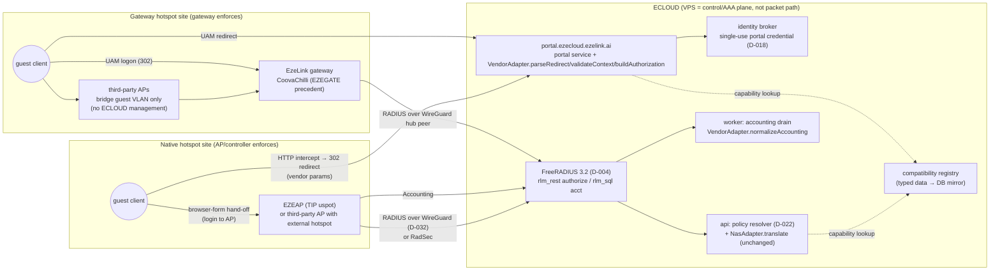
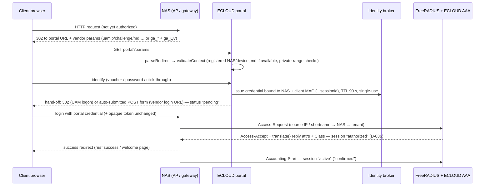

# MULTI_VENDOR_INTEGRATION_PLAN.md — Multi-vendor hotspot foundation (M11, loop step L1)

Status: **PROPOSED (L1 deliverable, docs only)** · Date: 2026-10-08 · Author: Architecture/Integration agent (Continuous Engineering Loop cycle 3) · Environment: MacBook, LOCAL ONLY.

Scope: reconcile [ECLOUD_MULTI_VENDOR_HOTSPOT.md](ECLOUD_MULTI_VENDOR_HOTSPOT.md) (the "spec") with the approved decision register, describe what exists in code today, and define the exact shapes and acceptance criteria for loop steps **L2 (contract + registry code)**, **L3 (data structures)** and **L4 (simulators)**. No code, migration, STATUS.md, VPS, device, DNS, Caddy, EZEAP or EZECONTROL change is made by this document.

Precedence (spec preamble, CLAUDE.md): **DECISIONS.md wins** over the spec. Approved design is not verified device capability (D-034). Every vendor fact below cites a URL that was actually read on 2026-10-08 (§12); anything not found is `UNKNOWN`. Labels used: **OBSERVED** (read in code/docs/device record), **PROPOSED** (this plan's default), `REQUIRES_CLARIFICATION` (owner input), `REQUIRES_DEVICE_TEST` (lab hardware needed).

---

## 1. Summary

1. ECLOUD already has the first-party path implemented as five engine adapters behind one `NasAdapter` interface ([packages/adapters/src/types.ts](packages/adapters/src/types.ts)). The multi-vendor contract of spec §3 is added **around** it (composition), not by changing it: `VendorAdapter` wraps a `NasAdapter`, and `translate()` / `buildReplyAttributes()` / `buildDisconnect()` / `buildCoa()` stay byte-identical (golden tests unchanged).
2. Capability **status** stays the four-state enum of D-028. A second, orthogonal axis — **evidence level** (`DOCUMENTED | VERIFIED_FROM_SOURCE | SIMULATOR_TESTED | LAB_VALIDATED | PRODUCTION_VALIDATED`) — is added to every declaration, and a **lifecycle** (`planned | researched | implemented | lab-validated | production-validated`) to every vendor/model/firmware row.
3. Today 29 cells are `VERIFIED_SUPPORTED` (25 policy-field cells + 4 `macAuth` flags; plus 40 reply-attribute declarations). None has device evidence: DT-01 was **identification only**. All of them map to `VERIFIED_FROM_SOURCE`. The admin badge currently says "Verified — verified by a recorded device test", which is **not true for any cell**; L2 relabels it **"Verified (source)"**, presents such cells as "Expected (source-verified, not device-tested)" with `deviceEnforced = false`, and reserves **"Lab validated"** (the only state read as device-enforced) for DT-backed cells. This resolves the owner's labelling question (§4.4, R-39); owner confirmation of the semantics is OQ-16.
4. Cambium is **researched only**: one Cambium-authored integration document (2016, cnPilot E400/E500/ePMP1000) gives redirect parameters, the AP-side `hotspot_login.cgi` handshake and RADIUS attribute lists; the cnMaestro EasyPass "Third-Party Integration" API exists (cnMaestro 5.2.2 Cloud) but its paths/schemas are **not public in anything read** → `UNKNOWN`. Cambium's 24-Sep-2026 guidance says cnMaestro Cloud may not support Enterprise devices after end of October 2026 → the cnMaestro strategy is **not** the primary path. All other roadmap vendors are `planned` with every capability `UNKNOWN`.
5. Hotspot services live in **ECLOUD** (api/portal/worker/FreeRADIUS) as the authenticated companion service to EZECONTROL (D-013 Option C). The spec's "EZECONTROL dashboard" views are built in the ECLOUD admin app; EZECONTROL is not modified (D-031).

---

## 2. Reconciliation table — spec clause → approved decision → resolution

`OK` = consistent; `CONFLICT` = the spec and a register entry/approved doc disagree (register wins); `GAP` = the spec needs something no decision covers (default proposed, owner may override); `DRIFT` = code or docs contradict an approved decision.

| # | Spec clause | Approved decision / artifact | Finding | Resolution (register wins) |
|---|---|---|---|---|
| R-01 | §0 Platform → Organization → Site → Device/NAS hierarchy, isolation at every layer | D-007, D-008, MULTITENANCY §1–§2 | OK | New tenant tables (`controllers`) carry `organization_id` + FORCE RLS (L3). Registry tables are platform data (no tenant rows). |
| R-02 | §0, §7 `resource:action` permissions, no role names | D-017, D-021 | OK | New keys `controller:*`, `compatibility:read` added to the catalogue in `packages/shared/src/permissions.ts` (L3). |
| R-03 | §0, §6 precedence `temporary > client_device > user > voucher_batch > user_group > site > organization default` | D-022, POLICY_ENGINE §2.3 | OK | Resolver untouched. Vendor adapters receive the already-resolved `EffectivePolicy`; no adapter resolves policy. |
| R-04 | §0 VPS = control/AAA plane, enforcement only on a verified AP/controller/gateway | D-003, D-012 | OK | Every registry row names its `enforcementPoint` (`ap`, `controller`, `gateway`). |
| R-05 | §0 four-state capability status | D-028 | OK, extended | Status stays four-state. Evidence level and lifecycle are **separate** fields (§4). `UNKNOWN` is a **registry-only research state** for `planned`/`researched` rows with no adapter; it is never an adapter field status and renders as "not enforced". |
| R-06 | §3 lifecycle `planned … production-validated` | none | GAP | Adopted as `lifecycle` on registry rows (§4.3). Promotion rules in §4.5. |
| R-07 | §11.8 evidence levels (`SIMULATOR_TESTED` ≠ `LAB_VALIDATED`, source finding ≠ device success) | D-034 device-testing rule | OK | `LAB_VALIDATED` requires a recorded PASS row in PHASE2_VALIDATION §5.4 for that model/firmware (validator rule V3, §4.5). |
| R-08 | POLICY_ENGINE §3 `Level = VERIFIED_CODE \| VERIFIED_DOCS \| REQUIRES_DEVICE_TEST \| UNKNOWN \| UNSUPPORTED`; `adapter_types.verification_status` CHECK (`verified_code`, `verified_docs`, `proposed`, `unknown`, `requires_device_test`) — migration 003 | D-028 (owner amendment, later) | DRIFT (superseded vocabulary) | D-028 wins for status. The old `VERIFIED_CODE`/`VERIFIED_DOCS` distinction is now carried by evidence level (`VERIFIED_FROM_SOURCE` / `DOCUMENTED`). `adapter_types.verification_status` stays `unknown` (011/015 never edited); L3 adds the evidence model in new tables instead of reusing that column. |
| R-09 | PHASE2_VALIDATION DT-04 "capability flip to `VERIFIED_DEVICE`" | D-028 | DRIFT | No `VERIFIED_DEVICE` state exists. A passed DT-04 sets status `VERIFIED_SUPPORTED` + evidence `LAB_VALIDATED` (dtRef `DT-04`, model/firmware). |
| R-10 | Admin UI: `StatusBadge` "Verified — Enforced by the device; verified by a recorded device test"; AdaptersPage "Only Verified entries have passed a recorded real-device test" ([apps/admin/src/lib/adapterStatus.ts](apps/admin/src/lib/adapterStatus.ts), [AdaptersPage.tsx](apps/admin/src/features/platform/AdaptersPage.tsx)) | D-028 "never present a policy as device-enforced when unverified"; D-034 | DRIFT (claim exceeds evidence) | L2 changes the label to **"Verified (source)"** with the true description, and shows **"Lab validated"** only with a DT reference (§4.4). |
| R-11 | §0, §6 D-006 CoA/Disconnect stays `REQUIRES_DEVICE_TEST` | D-006 | OK | Existing guard tests (capabilities.test.ts l.261, registry.test.ts l.177) kept; strengthened: Disconnect/CoA may only become `VERIFIED_SUPPORTED` with `LAB_VALIDATED` evidence (rule V5). |
| R-12 | §0, §6 tunnel-only RADIUS; RadSec only where verified | D-010, D-032 | OK | Third-party APs reach ECLOUD RADIUS through a site gateway WireGuard peer (topology A) or RadSec. Cambium RadSec support: `UNKNOWN` → REQUIRES_DEVICE_TEST. |
| R-13 | §0 domains, `/opt/ecloud`, Caddy, q-mira.com | D-014, D-029, D-030, D-031 | OK | Nothing here deploys. Portal URL configured on vendors = `https://portal.ezecloud.ezelink.ai/...` (not live until D-031 gate). |
| R-14 | §0, §7 secrets never committed; encrypted at rest; rotation | D-033, SECURITY §9; code: NAS secret sealed via `Envelope` → `secret_ref` ([apps/api/src/routes/resources.ts](apps/api/src/routes/resources.ts)) | OK | Controller credentials follow the NAS pattern: write-only input, sealed into `credential_secret_ref` with a distinct envelope context, never returned, rotation endpoint blocked under impersonation (D-027). |
| R-15 | §1 "identify whether hotspot services belong inside EZECONTROL or a companion service" | D-013 (Option C: ECLOUD is the RADIUS/UAM/DAE target; SSIDs stay in the EZE controller); D-031 (no EZE controller change) | Resolved | Hotspot services belong in **ECLOUD** (companion service with authenticated APIs). EZECONTROL unchanged; Option A (policy-fragment API) remains a later owner decision (Q49). |
| R-16 | §8 "EZECONTROL dashboard: Hardware Integrations, Sites/APs/NAS, Portals …" | D-013, D-031, D-029 (admin = `ezecloud.ezelink.ai`) | CONFLICT (naming/target) | Views are built in the **ECLOUD admin app** (`apps/admin`). "EZECONTROL" in the spec is read as "the EzeLink control surface", not the ezecontroller codebase. `REQUIRES_CLARIFICATION` OQ-1 if the owner literally means the ezecontroller UI. |
| R-17 | §2 preserve first-party path; do not refactor it to fit Cambium | D-005, D-012, D-035 | OK | Composition wrapper; `NasAdapter` and the five capability records unchanged except the additive `evidenceLevel` field. Golden tests ([golden.test.ts](packages/adapters/src/golden.test.ts)) must pass unmodified. |
| R-18 | §2 gateway hotspot via "EzeLink gateway, CoovaChilli or supported MikroTik hotspot" | D-002 (CoovaChilli gateways, EZEGATE 1.2.9), D-005 | GAP for MikroTik | Gateway mode in M11 = **CoovaChilli only** (`coovachilli-uam`). MikroTik gateway = `planned`, capabilities `UNKNOWN`. |
| R-19 | §2/§3 "Do not send uCentral configuration to Cambium or another vendor" | D-013; adapter `openwifi-config` | OK | Registry rows carry `configuration.kind`; only rows with `ucentral` may be targeted by `openwifi-config`. Validator rule V7. |
| R-20 | §3 browser-form vs backend-API authorization | D-005 (UAM), D-018 (identity broker, single-use ≤16-byte portal credential) | OK, extended | `AuthorizationStrategy = 'browser-form' \| 'backend-api'` (§6.3). First-party = browser-form (UAM 302). Backend-API exists only as a typed slot; no implementation in M11. |
| R-21 | §3 normalize context; keep opaque vendor tokens byte-for-byte; no secrets in the browser | CAPTIVE_PORTAL §7.3, SECURITY §5.2/§5.3/§5.6 | OK | `HotspotContext.vendorOpaque` keeps the raw query substring (no decode/re-encode). UAM secret and RADIUS secret never leave the server. |
| R-22 | §4 "short-lived credentials for RADIUS-based portal authorization" | D-018; SECURITY §5.6 (TTL 90 s, single-use, bound to nasid+mac+sessionid) | OK | Same broker for Cambium. Cambium credential length limits on `ga_pass`: `UNKNOWN` → REQUIRES_DEVICE_TEST. |
| R-23 | §4 "authorized only after a real adapter result: pending / accepted / confirmed" | D-036 (`sessions.status` `authorized` → `active` on Accounting-Start) | OK | Portal-side states map: `pending` = credential issued + hand-off sent; `accepted` = RADIUS Access-Accept (`sessions.status='authorized'`); `confirmed` = Accounting-Start (`active`). No new session states. |
| R-24 | §5 English + Arabic with RTL | Q77 default (approved via D-023): English only, RTL-ready CSS | CONFLICT | Register wins: release-1 portal English, RTL-ready. Arabic → `REQUIRES_CLARIFICATION` OQ-2 (owner may amend Q77). Portal UI is Phase 6, outside M11. |
| R-25 | §5 OAuth/social, SMS, email providers | Q64 default (none in pilot; Google first), D-018 | OK | Provider interfaces only, not in M11. |
| R-26 | §6 many sites behind NAT; validated NAS identity, source IP alone insufficient | SECURITY §3.2; M8 hardening: tenant resolved **only** from authenticated packet source IP / `clients.conf` shortname, NAS-Identifier never selects a tenant ([apps/api/src/internal/aaa.ts](apps/api/src/internal/aaa.ts) `resolveNas`); Q48 default (no shared source IPs) | OK, stricter | Keep the M8 rule. Vendor redirect fields (`nasid`, `ga_nas_id`, `ga_ap_mac`) select **branding/flow only after** matching a registered NAS; they never select a tenant on their own. Shared-IP sites: `REQUIRES_CLARIFICATION` OQ-5 (Q48). |
| R-27 | §6 unsupported policy → gateway path or clear rejection, never silent | D-028; POLICY_ENGINE §4.2 degradation (`reject`, `allow_and_flag`, `fallback_ecloud_side`), Q67 default `fallback_ecloud_side` + amber | OK | L4 asserts the existing `EnforcementPlan.unenforceable` / `decision` output; adds a `gatewaySuggestion` hint (registry lookup) in the vendor layer only. |
| R-28 | §6 accounting dedupe, retransmit, out-of-order, missing Stop, gigawords | D-019; AAA §5; worker `normalize.ts` (`counterDelta`, `maxCounters`), FreeRADIUS fixtures with Gigawords | OK | `normalizeAccounting` op delegates to the existing pure functions; L4 adds simulator cases (32-bit wrap without Gigawords is new). |
| R-29 | §7 fail-open/fail-closed decided per site, conservative default | Q32 default (approved): fail-closed + cached-allow ≤ 15 min, no fail-open | CONFLICT (per-site switch not approved) | Keep Q32 globally. A per-site fail-open option is `REQUIRES_CLARIFICATION` OQ-6; not built. |
| R-30 | §7 never use `ga_srvr` / controller URL as an arbitrary backend fetch target; SSRF | SECURITY §5.3; webhook SSRF guard (M8) | OK | `ga_srvr` is used **only** by the client browser (form action), validated against the registered device; never fetched by ECLOUD. Controller `base_url` https-only and not fetched in M11. |
| R-31 | §9 Phase 3 foundation = registry + simulators + data structures, no hardware claims | STATUS audit 2026-10-08 → M11 (L1–L4) | OK | This plan. |
| R-32 | §9 device validation of first-party path | PHASE2_VALIDATION DT-02…DT-24, D-034 | OK | Not in M11; DT-01 only executed. |
| R-33 | Spec references "STATUS.md … compatibility matrix" and "update the compatibility registry" | none exists | GAP | Created in L2 as typed data (single source), mirrored to DB in L3. |
| R-34 | CAPTIVE_PORTAL §7.1/§7.4 portal adapter names `uspot-uam`, `coovachilli-uam`; `nas.portal_adapter` | D-035 (engine keys on `nas_clients.adapter_key`) | Resolved by D-035 | Vendor adapter key = engine key for first-party rows. |
| R-35 | `captive_portals.portal_type` CHECK `('uspot','coovachilli','external')` (migration 006) | D-035 | DRIFT (legacy vocabulary) | Not changed in M11 (non-destructive rule). L3 derives the portal flavour from the NAS `adapter_key`; reconciliation of `portal_type` deferred to Phase 6 portal work. |
| R-36 | DT-01 "uspot variant VERIFIED ON DEVICE" | D-035 note, D-034 | OK, scoped | DT-01 is used for exactly three things: (1) identity facts of EZE-AP1832 / r32912 / schema 4.2.0 / TIP-fork uspot = `LAB_VALIDATED`; (2) absence of WireGuard/unetd = `UNSUPPORTED` + `LAB_VALIDATED` for the connectivity capability "AP as WireGuard peer" (negative, not enforcement); (3) `sourceVersionMatchesDevice = true` for the TIP-uspot source evidence (the on-device uspot code is the analysed code base and names the attributes). Attribute **honouring** stays `VERIFIED_FROM_SOURCE` (DT-04/05/06 pending). |
| R-37 | §10 deliverables "Cambium installation guide, gateway guide, operator runbook" | — | Deferred | Out of M11 (Third-party Phase A / device validation). `buildSetupGuide` returns structured steps; prose guides later. |
| R-38 | Spec research note: Social WiFi as functional reference only; do not copy its IPs, secrets, domain lists | — | OK | Nothing from Social WiFi pages is copied into configuration; only cited as third-party evidence of UI field names (§7.3). |
| R-39 | Adapter code declares 29 cells `VERIFIED_SUPPORTED`; PHASE2_VALIDATION labels the same claims `VD→RDT` / `VC→RDT` (verified in docs/code, honouring still REQUIRES DEVICE TEST, e.g. V-073); D-028 "never present a policy as device-enforced when unverified" | D-028, D-034 | DRIFT (semantic tension) | Resolved conservatively without waiting for the owner: `VERIFIED_SUPPORTED` + `VERIFIED_FROM_SOURCE` means **source-verified mechanism, not device enforcement**. `deviceEnforced` is `true` only for `LAB_VALIDATED`/`PRODUCTION_VALIDATED` (§4.4). Engine translation output is unchanged (it still emits the attributes). Owner confirmation of the semantics: OQ-16. |
| R-40 | `openwifi-uspot-uam.coaChange = UNSUPPORTED` and `openwifi-config.disconnect = UNSUPPORTED`, while D-006 reads "CoA/Disconnect remains REQUIRES_DEVICE_TEST" | D-006 | DRIFT (conservative) | Kept: both are source-backed negatives (TIP uspot applies no CoA attribute changes, CP §7.4; config-only adapter has no RADIUS path) and are stricter than D-006, never weaker. Owner FYI; no action. A device test (DT-08) may still flip the TIP-uspot CoA cell. |
| R-41 | §8 "distinguish registered APs from APs whose actual online status is known" | none (`network_devices.mgmt_status` `unknown/online/offline`, `last_seen_at` exist, migration 003) | GAP | Not in M11. Later: online status only from a verified telemetry/monitoring connector; registry `monitoring` group stays `UNKNOWN` for third-party rows; UI shows "registered" vs "online (source: …)". |
| R-42 | §5 marketing consent separate from terms (timestamp, version, purpose, withdrawal), retention/export/deletion, randomized MACs are observations | D-025 (pilot retention), SECURITY §5.10, `captive_portals.terms_version` | GAP | Phase 6 (portal) work, not M11. `HotspotContext.clientMac` is documented as a device observation, never a person identity. |
| R-43 | §10 configuration examples with placeholders, lab test checklist, rollout/rollback plan | PHASE2_VALIDATION §5 (first-party lab plan), D-031 (deployment change list) | GAP | Not in M11. `buildSetupGuide` emits placeholder-only steps (L2); third-party lab checklist written in Cambium Phase A; rollout/rollback belongs to the D-031 change list. |

Conflicts and drifts requiring action are R-08, R-09, R-10, R-16, R-24, R-29, R-35, R-39 (R-40 is FYI only). R-10 and R-39 need code changes inside M11 (L2).

---

## 3. Discovery summary (OBSERVED in code, 2026-10-08)

| Area | What exists | Path |
|---|---|---|
| Adapter interface | `NasAdapter { key, version, capabilities(), translate(), buildReplyAttributes(), describeDisconnect(), buildDisconnect(), buildCoa(), renderConfig?() }`. Pure; never sends packets. | [packages/adapters/src/types.ts](packages/adapters/src/types.ts), [base.ts](packages/adapters/src/base.ts) (`createAdapter`, `decl`, `attr`, `fieldTable`, `attributeTable`) |
| Adapters | 5 frozen entries: `openwifi-hostapd-radius`, `openwifi-uspot-uam` (TIP fork), `uspot-upstream-uam`, `coovachilli-uam`, `openwifi-config` (per-SSID, config-only). All `version 0.1.0`. | [registry.ts](packages/adapters/src/registry.ts), `adapters/*.ts` |
| Capability model | `AdapterCapabilities` (portalType, granularity, rate families, quota attrs, octet width, timeouts, interim, VLAN, Class, `disconnect`, `coaChange`, `macAuth`, 17 `fields`, `attributes`). Status = `AdapterFieldStatus` (four states) + `evidence` string; no evidence level. | [packages/policy-engine/src/capabilities.ts](packages/policy-engine/src/capabilities.ts), `packages/shared/src/adapter-status.ts` |
| Status counts (computed by importing `listCapabilities()`) | Fields `VERIFIED_SUPPORTED`: uspot-TIP 7, uspot-upstream 7, coovachilli 7, openwifi-config 4, hostapd 0 = **25**; `macAuth` VERIFIED on 4 adapters (all but hostapd) → **29 cells**. Attributes VERIFIED: 9 + 14 + 17 + 0 + 0 = **40**. Disconnect: RDT on 4, UNSUPPORTED on openwifi-config. CoA: UNSUPPORTED on TIP uspot, RDT elsewhere. | — |
| Guards | D-006 guards: capabilities.test.ts l.261, registry.test.ts l.177; golden translation tests. | [packages/adapters/src/*.test.ts](packages/adapters/src) |
| DB | `adapter_types` (platform; `verification_status` all `unknown`; legacy vocabulary), `network_devices` (`model`, `firmware` free text, `mode` bridge/routed, `adapter_type_key`), `nas_clients` (`nas_ip` globally unique, `secret_ref`, `adapter_key` FK+CHECK to the 4 NAS-facing engine keys, D-035), `captive_portals` (`portal_type` legacy CHECK, `uam_secret_ref`, `walled_garden`, `adapter_config jsonb`). 18 migrations; no vendor/controller/model/firmware tables. | [packages/db/migrations/003_network.sql](packages/db/migrations/003_network.sql), [011](packages/db/migrations/011_seed_adapter_types.sql), [015](packages/db/migrations/015_nas_adapter_key.sql), 006 |
| AAA | `POST /internal/aaa/authorize`: NAS resolved from `ECLOUD-Packet-Src-IP-Address`, then `ECLOUD-Client-Shortname` (= NAS id); NAS-Identifier never selects tenant; identity (password/voucher/MAC) → `resolveEffectivePolicy` → `nasAdapter(adapter_key).translate()` → reply attrs + `Class ai:<32hex>`; NULL `adapter_key` → Auth-Type + Class only; any backend error → 503 (never fail-open); 10 s retransmit cache. | [apps/api/src/internal/aaa.ts](apps/api/src/internal/aaa.ts), [apps/api/src/nas-adapter.ts](apps/api/src/nas-adapter.ts) |
| Accounting | Pure `normalizeAccounting(RawAccountingRow)`, `counterDelta` (never negative), `maxCounters`, event-time tolerance ±5 min, attribution only by `packet_src_ip` (migration 014). FreeRADIUS folds Gigawords (`(G<<32)+Octets`). | [apps/worker/src/accounting/normalize.ts](apps/worker/src/accounting/normalize.ts), `drain.ts`, `infra/freeradius/test/acct-*.txt` |
| NAS routes | CRUD `/api/v1/orgs/:orgId/nas` (`nas:read/create/update/delete`), `rotate-secret` (`nas:secret:rotate`, returned once, blocked under impersonation); secret sealed with `Envelope('ecloud:nas:secret:v1')`. | [apps/api/src/routes/resources.ts](apps/api/src/routes/resources.ts) |
| Platform adapter matrix | `GET /api/v1/platform/adapters` (`platform:health:read`) returns per-field status + evidence from `listAdapters()`. | [apps/api/src/routes/platform.ts](apps/api/src/routes/platform.ts) l.342 |
| Portal | Skeleton only: Express app with `/healthz`, graceful shutdown. No UAM parsing, no portal flows. | [apps/portal/src/index.ts](apps/portal/src/index.ts) |
| Admin | `AdaptersPage` matrix, `StatusBadge` (four-state presentation, unknown input → RDT), `EnforceabilityMatrix`/`PreviewPanel` in the policy editor; drift test keeps admin enums equal to `@ecloud/shared`. **Mislabel R-10.** | [apps/admin/src/lib/adapterStatus.ts](apps/admin/src/lib/adapterStatus.ts), [AdaptersPage.tsx](apps/admin/src/features/platform/AdaptersPage.tsx) |
| Permissions | 99 keys; `nas:*`, `network_device:*` incl. `config:push`, `platform:adapter:manage`, `platform:health:read`. No `controller:*`, no `compatibility:*`. | [packages/shared/src/permissions.ts](packages/shared/src/permissions.ts) |
| Device evidence | DT-01 only (2026-10-07, PASS, identification): EZE-AP1832 (`ezelink,ap1832`, ipq50xx), EZEAP 6 r32912-6639b15f62, uCentral client + schema 4.2.0, uspot = TIP fork (spotfilter + ratelimit, no DAS in uspot), hostapd wpad-openssl 2021.02.20 with `radius_das_*`/`dynamic_vlan` support, **no wireguard/unetd**, `radius-gw-proxy` installed. Fixture `test/fixtures/device/EZE-AP1832/r32912-6639b15f62/DT-01_identification_2026-10-07.txt`. | PHASE2_VALIDATION §5.4 |

Not present anywhere: vendor/controller/model/firmware data, evidence levels, lifecycle, a compatibility registry, a redirect parser, simulators, deployment-mode field.

---

## 4. Evidence model

### 4.1 Three independent axes

| Axis | Values | Applies to | Owner rule |
|---|---|---|---|
| **status** (unchanged) | `VERIFIED_SUPPORTED`, `REQUIRES_DEVICE_TEST`, `UNSUPPORTED`, `ECLOUD_SIDE_ONLY` | every adapter capability declaration (fields, attributes, `disconnect`, `coaChange`, `macAuth`) | D-028 |
| **research state** (registry only) | status ∪ `UNKNOWN` | capability cells of registry rows with lifecycle `planned`/`researched` (no adapter) | spec §3 "missing = unknown"; never shown as enforced |
| **evidence level** (new) | `DOCUMENTED` < `VERIFIED_FROM_SOURCE` < `SIMULATOR_TESTED` < `LAB_VALIDATED` < `PRODUCTION_VALIDATED` | every declaration and every registry cell | spec §11.8 |
| **lifecycle** (new) | `planned` → `researched` → `implemented` → `lab-validated` → `production-validated` | vendor, hardware model, firmware/controller combination (registry row) | spec §3 |

Evidence level definitions:

| Level | Meaning | Allowed on |
|---|---|---|
| `DOCUMENTED` | Vendor or third-party documentation only; no code read, no test. | any |
| `VERIFIED_FROM_SOURCE` | Mechanism read in vendor/firmware source or schema (or on-device code listing), with file/line reference. Not a behaviour proof. | any |
| `SIMULATOR_TESTED` | ECLOUD's own adapter code path passes the L4 simulator (redirect parse, handshake build, accounting normalisation). Proves ECLOUD behaviour, **not** device behaviour. | **operation capabilities only** (`redirectParse`, `authorizationHandoff`, `accountingNormalize`) — never on an enforcement field (rate, quota, timeouts, VLAN, Disconnect, CoA) |
| `LAB_VALIDATED` | A PHASE2_VALIDATION §5.4 row (or successor lab record) with result PASS for this exact model + firmware (+ controller version) and the capability under test. | any; requires `dtRefs` |
| `PRODUCTION_VALIDATED` | Observed in production with a signed record. | none today (validator asserts zero) |

Each declaration keeps its existing free-text `evidence` and gains `evidenceLevel` plus optional structured `evidenceRefs` (doc section, source file/line, URL, DT id, firmware the source/doc applies to).

### 4.2 Mapping of today's declarations (L2 applies this mechanically)

| Current status | Count today | Evidence level assigned | Reason |
|---|---|---|---|
| `VERIFIED_SUPPORTED` (fields) | 25 | `VERIFIED_FROM_SOURCE` | The evidence strings cite **ECLOUD doc sections** (CAPTIVE_PORTAL §3.4/§4, NETWORK_INTEGRATION §2, POLICY_ENGINE §3.1); only some also quote a source line (e.g. `uspot.uc l.179-204`). The underlying source analysis is recorded in the PHASE2_VALIDATION V-rows (§2.1–§2.3: e.g. V-052/V-053 uspot, V-070…V-075 coova-chilli `redir.c`/`chilli.c`, renderer/schema rows for openwifi-config). L2 must back-fill each cell's `evidenceRefs` with a `source` entry taken from those V-rows (rule V10). No DT executed for any of them. |
| `VERIFIED_SUPPORTED` (`macAuth`) | 4 | `VERIFIED_FROM_SOURCE` | handler.uc (CP §3.6) / schema `mac-filter` (NI §2); `source` refs back-filled from the V-rows. |
| `VERIFIED_SUPPORTED` (attributes) | 40 | `VERIFIED_FROM_SOURCE` | Same doc sections and V-rows as the fields; same back-fill. |
| `UNSUPPORTED` | per adapter | `VERIFIED_FROM_SOURCE` where the evidence string cites source/schema absence; otherwise `DOCUMENTED` | Absence verified in source is still source evidence. |
| `REQUIRES_DEVICE_TEST` | per adapter | `DOCUMENTED` by default; `VERIFIED_FROM_SOURCE` only where the evidence cites code for the **behaviour** (not merely a config path) | The claim under test is behaviour. |
| `ECLOUD_SIDE_ONLY` | per adapter | `DOCUMENTED` | Statement that the device has no such mechanism; ECLOUD's own enforcement is covered by ECLOUD tests, not by this cell. |

Notes that must be carried as `evidenceRefs.appliesTo`:
- `coovachilli-uam`: source analysed is **upstream master**; EZEGATE runs **1.2.9** (PHASE2_VALIDATION V-073 "VD→RDT (1.2.9)"). The registry row for EZEGATE 1.2.9 flags `sourceVersionMatchesDevice: false` until DT-15. **Registry-only override:** while that flag is false, every cell of the row whose engine status is `VERIFIED_SUPPORTED` is **presented** as `REQUIRES_DEVICE_TEST` (evidence `VERIFIED_FROM_SOURCE`, `appliesTo: "coova-chilli master"`) until the relevant DT (DT-15) passes for 1.2.9. The engine declaration and translation output are unchanged; the override lives only in the registry/presentation layer (rule V11).
- `openwifi-uspot-uam`: TIP-fork source; DT-01 confirmed the same code base and the attribute names in the on-device uspot code on r32912 → `sourceVersionMatchesDevice: true` (still not behaviour).
- `uspot-upstream-uam`: f00b4r0 upstream source; no device ships it in our inventory.

**Nothing becomes `LAB_VALIDATED` in M11 except the DT-01 identity/connectivity facts of the EZE-AP1832 r32912 row** (§7.1). DT-01 validates no enforcement capability.

### 4.3 Lifecycle definitions

| Lifecycle | Entry condition |
|---|---|
| `planned` | Named in the spec roadmap; no research recorded. All capability cells `UNKNOWN`. No adapter code. |
| `researched` | At least one cited URL per stated fact; open questions listed; capability cells `UNKNOWN` or status with `DOCUMENTED` evidence; **no** cell `VERIFIED_SUPPORTED` (closed-source docs alone never reach `VERIFIED_FROM_SOURCE`). No adapter code. |
| `implemented` | A `VendorAdapter` exists and passes the contract suite, plus the simulator suite where an L4 scenario exists for it; cells may be `VERIFIED_SUPPORTED` only with ≥ `VERIFIED_FROM_SOURCE`. |
| `lab-validated` | Every enforcement capability that is `VERIFIED_SUPPORTED` for this model/firmware has `LAB_VALIDATED` evidence, and the mandatory DT set for the row passed (first-party: PHASE2_VALIDATION execution order; third-party: lab checklist to be written in Phase A). |
| `production-validated` | Owner sign-off after a production observation window. |

### 4.4 UI labels (resolves the owner's labelling question)

The badge text is derived from **status + evidence level**, never from status alone:

| status | evidenceLevel | Badge label | Tone | Tooltip (description) | `deviceEnforced` in preview |
|---|---|---|---|---|---|
| `VERIFIED_SUPPORTED` | `VERIFIED_FROM_SOURCE` | **Verified (source)**; policy preview cell text **"Expected (source-verified, not device-tested)"** | success (outlined) | "Mechanism confirmed in vendor/firmware source for this adapter. Not yet proven on a lab device." + evidence | **`false`** (R-39: only lab/production evidence reads as device-enforced) |
| `VERIFIED_SUPPORTED` with registry override (§4.2, `sourceVersionMatchesDevice=false`) | `VERIFIED_FROM_SOURCE` | Needs device test | warning | "Verified in <source version> source; this device runs <firmware>." | `false` |
| `VERIFIED_SUPPORTED` | `LAB_VALIDATED` | **Lab validated** | success (solid) | "Proven on <model> <firmware> in <DT-xx> on <date>." | `true` |
| `VERIFIED_SUPPORTED` | `PRODUCTION_VALIDATED` | **Production validated** | success (solid) | record reference | `true` |
| `VERIFIED_SUPPORTED` | `DOCUMENTED` or `SIMULATOR_TESTED` | — (forbidden; validator V1/V2) | — | — | — |
| `REQUIRES_DEVICE_TEST` | any | Needs device test | warning | unchanged + evidence level shown ("Documented" / "Verified (source)") | `false` |
| `UNSUPPORTED` | any | Unsupported | danger | unchanged | `false` |
| `ECLOUD_SIDE_ONLY` | any | ECLOUD side | info | unchanged | `false` |
| `UNKNOWN` (registry only) | `DOCUMENTED` or none | Unknown | neutral | "Not researched / not documented for this model." | `false` |
| operation capability | `SIMULATOR_TESTED` | Simulator tested | info | "ECLOUD code path passes the simulator; says nothing about the device." | n/a |

Unknown or missing evidence level on input falls back to the weakest presentation (as `presentStatus()` already does for unknown statuses). AdaptersPage description changes to: "Verified (source) = mechanism confirmed in source code, expected but not device-tested; Lab validated = proven on a recorded device test. No adapter is lab validated yet." Consequence for the policy editor today: no cell shows as device-enforced (green solid) until a DT passes; source-verified cells show the outlined "Expected" state. The translation layer still emits the attributes (engine behaviour unchanged); only presentation and `deviceEnforced` change.

### 4.5 Validator rules (L2 tests; mirrored by L3 seed check)

- **V1** `VERIFIED_SUPPORTED` ⇒ `evidenceLevel ∈ {VERIFIED_FROM_SOURCE, LAB_VALIDATED, PRODUCTION_VALIDATED}`.
- **V2** `SIMULATOR_TESTED` only on operation capabilities.
- **V3** `LAB_VALIDATED` ⇒ non-empty `dtRefs`, each present in the typed DT-results list (`DT_RESULTS`, initially only DT-01) with result `PASS` and the same model/firmware as the row.
- **V4** `PRODUCTION_VALIDATED` count = 0 (until an owner-approved record type exists).
- **V5** `disconnect` / `coaChange` `VERIFIED_SUPPORTED` ⇒ `LAB_VALIDATED` (D-006, stricter than V1). Existing guards stay.
- **V6** lifecycle `planned`/`researched` ⇒ no `adapterKey`, no cell `VERIFIED_SUPPORTED`; every non-`UNKNOWN` cell of a `researched` row has ≥ 1 `url`.
- **V7** `configuration.kind = 'ucentral'` only on rows whose firmware identity is uCentral (EZEAP); `openwifi-config` may only target such rows.
- **V8** lifecycle `lab-validated` ⇒ V3 holds for every `VERIFIED_SUPPORTED` enforcement cell of the row.
- **V9** registry keys unique; every `adapterKey` exists in `ADAPTER_KEYS`; every engine adapter appears in ≥ 1 `implemented` row.
- **V10** `evidenceLevel = VERIFIED_FROM_SOURCE` ⇒ ≥ 1 `evidenceRefs` entry of kind `source` (file + line, or URL + section of the source/schema). The ECLOUD doc-section string alone does not satisfy it.
- **V11** a registry row with `sourceVersionMatchesDevice = false` presents no cell as `VERIFIED_SUPPORTED`: such cells are presented `REQUIRES_DEVICE_TEST` (evidence `VERIFIED_FROM_SOURCE`, `appliesTo` = source version) until a `DT_RESULTS` PASS for the row's firmware covers them; engine declarations are not modified.
- **V12** `deviceEnforced` (API payload and admin presentation) is `true` only when status is `VERIFIED_SUPPORTED` **and** evidence is `LAB_VALIDATED` or `PRODUCTION_VALIDATED` (R-39).

---

## 5. Architecture: native vs gateway hotspot (PROPOSED)

### 5.1 Components and enforcement points



| Mode | NAS (RADIUS client) | Enforcement point | ECLOUD manages device config? | Adapter (M11) |
|---|---|---|---|---|
| native / EZEAP | EZEAP uspot (TIP fork) | AP (`ratelimit`, spotfilter) | No — SSIDs in EZE controller (D-013 Option C) | `openwifi-uspot-uam` (+ `openwifi-config` for per-SSID intent through the controller, later Option A) |
| native / third-party | vendor AP or controller | AP or controller (per row) | No | none yet (Cambium `researched`) |
| gateway | CoovaChilli on EzeLink gateway | gateway (TUN/TAP, own DHCP — V-076) | No (bundle applied by site staff, Q54) | `coovachilli-uam` |

Gateway mode gives guest Wi-Fi through the gateway only; the bridged third-party APs are inventory rows (`network_devices`, `managed=false`), not NAS, and imply no AP management (spec §2).

### 5.2 Browser-form authorization sequence (first-party UAM and Cambium external hotspot share this shape)



Backend-API strategy (e.g. a controller "login" API) replaces the two client→NAS steps by a server-side call from ECLOUD to a **registered** controller base URL. No first-party adapter needs it; the Cambium EasyPass variant is `UNKNOWN` (§7.3). It is a typed slot in L2 with no implementation.

### 5.3 Where tenant identity comes from

Unchanged from M8: RADIUS → authenticated packet source / shortname only. Portal → the redirect identifies a **candidate** NAS; the credential issued is bound to that NAS id and client MAC; FreeRADIUS resolves the NAS independently from the packet source; AAA rejects when the resolved NAS ≠ credential binding or `Calling-Station-Id` ≠ bound MAC (SECURITY §5.6). A forged redirect therefore yields at most a credential usable only through the real, registered NAS of the claimed site.

---

## 6. Vendor-neutral adapter contract (shape for L2)

### 6.1 Mapping of spec §3 operations onto the existing `NasAdapter`

| Spec operation | Implementation over existing code | First-party behaviour | Changes existing output? |
|---|---|---|---|
| `discoverCapabilities(context)` | `engine.capabilities()` + registry lookup by (vendor, model, firmware, controller) → `CapabilityReport` with status + evidence level per cell | static record; registry row picks evidence (e.g. DT-01 identity on EZE-AP1832) | No |
| `parseRedirect(request)` | **new**, pure; UAM parser per CAPTIVE_PORTAL §3.2/§4/§7.3 and SECURITY §5.3 (`md` parsed as last parameter, `userurl` treated hostile) | uspot TIP/upstream, CoovaChilli: UAM; hostapd-radius, openwifi-config: `Unsupported` (no portal) | n/a (new) |
| `validateContext(context)` | **new**; checks registered NAS/device, `md` with UAM secret (when NAS has one), `uamip` private, freshness, tenant consistency | as left | n/a |
| `buildAuthorization(context, identity, policy)` | `engine.translate(effective, ctx)` + `engine.buildReplyAttributes(plan)` (**called, not modified**) + broker credential + hand-off plan | UAM `logon` URL (PAP XOR or CHAP) per CP §7.4 | No — golden plans byte-identical |
| `authorizeSession(context, credentialsOrToken)` | browser-form: returns the hand-off (302 URL or POST form) and state `pending`; backend-api: slot only | browser-form 302 | n/a |
| `revokeSession(session)` | `engine.buildDisconnect(sessionRef)` (status stays RDT, D-006) or browser logout URL (`/logoff`) | unchanged statuses | No |
| `normalizeAccounting(packet)` | delegates to the existing pure `normalizeAccounting`/`counterDelta`/`maxCounters` (relocated to a package, re-exported to the worker with identical behaviour) + per-vendor quirks hook | none needed | No (worker tests unchanged) |
| `buildSetupGuide(site)` | **new**, data-only steps derived from CP §7.4 "Required uCentral/chilli config" and registry row | uCentral keys / chilli options, placeholders for secrets | n/a |
| `healthCheck(site)` | **new**, ECLOUD-side signals only (last Access-Request, last accounting, interim freshness vs interval, WireGuard handshake age); never probes devices | as left | n/a |

### 6.2 TypeScript sketch (L2 target; names binding, bodies to implement)

```ts
// packages/shared — new
export const EVIDENCE_LEVELS = ['DOCUMENTED','VERIFIED_FROM_SOURCE','SIMULATOR_TESTED','LAB_VALIDATED','PRODUCTION_VALIDATED'] as const;
export type EvidenceLevel = (typeof EVIDENCE_LEVELS)[number];
export const LIFECYCLES = ['planned','researched','implemented','lab-validated','production-validated'] as const;
export type Lifecycle = (typeof LIFECYCLES)[number];
export type ResearchStatus = AdapterFieldStatus | 'UNKNOWN';           // registry cells only
export interface EvidenceRef {
  readonly kind: 'doc-section' | 'source' | 'url' | 'device-test' | 'simulator';
  readonly ref: string;                 // e.g. "CAPTIVE_PORTAL_ARCHITECTURE.md §3.4", "uspot.uc l.179-204", "DT-01"
  readonly url?: string;                // vendor fact ⇒ required
  readonly appliesTo?: string;          // firmware/source version the evidence covers
}

// packages/policy-engine capabilities.ts — additive fields only
export interface AdapterFlag { readonly status: AdapterFieldStatus; readonly evidence: string;
  readonly evidenceLevel: EvidenceLevel; readonly evidenceRefs?: readonly EvidenceRef[]; readonly note?: string; }
// AdapterFieldDeclaration (packages/shared) gains the same two fields.

// packages/adapters/src/vendor/types.ts — new
export type AuthorizationStrategy = 'browser-form' | 'backend-api';
export type DeploymentMode = 'native' | 'gateway';

export interface HotspotContext {
  readonly organizationId: string;          // resolved server-side, never from the query
  readonly siteId: string;
  readonly vendorKey: string;               // registry vendor key
  readonly controllerId: string | null;     // controllers.id when a controller mediates
  readonly nas: { readonly id: string; readonly identifier: string | null; readonly adapterKey: string | null };
  readonly apMac: string | null;            // normalised aa:bb:cc:dd:ee:ff
  readonly clientMac: string;               // normalised; device observation, not a person (spec §5)
  readonly ssid: string | null;
  readonly clientIp: string | null;
  readonly nasSessionId: string | null;     // UAM sessionid = Acct-Session-Id (CP §0 item 5)
  readonly policyRef: { readonly policyId: string | null; readonly snapshotHash: string | null } | null;
  readonly deploymentMode: DeploymentMode;
  readonly vendorOpaque: { readonly raw: string; readonly fields: Readonly<Record<string, string>> }; // byte-for-byte raw query substring; secrets never included
  readonly receivedAt: Date;
}

export interface ParsedRedirect {
  readonly vendorKey: string;
  readonly params: Readonly<Record<string, string>>;   // decoded copies for display/lookup
  readonly rawQuery: string;                            // exactly as received
  readonly signature: { readonly kind: 'uam-md5' | 'none'; readonly value: string | null };
  readonly result: 'notyet' | 'already' | 'success' | 'failed' | 'logoff' | 'other' | null;
}

export type ContextValidation =
  | { readonly ok: true; readonly context: HotspotContext }
  | { readonly ok: false; readonly reason: 'unknown_nas' | 'bad_signature' | 'stale' | 'tenant_mismatch'
        | 'private_address_required' | 'replayed' | 'malformed'; readonly detail: string };

export interface AuthorizationHandoff {
  readonly strategy: AuthorizationStrategy;
  readonly browser?: { readonly method: 'GET-302' | 'POST-form'; readonly url: string;
                       readonly fields: Readonly<Record<string, string>> };   // no secrets: credential is single-use
  readonly backend?: { readonly controllerId: string; readonly operation: 'login' };
  readonly state: 'pending';
}

export interface AuthorizationPlan {
  readonly enforcement: EnforcementPlan;           // from engine.translate — unchanged
  readonly replyAttributes: readonly RadiusAttribute[]; // from engine.buildReplyAttributes — unchanged
  readonly handoff: AuthorizationHandoff;
  readonly gatewaySuggestion: string | null;       // registry hint when plan.unenforceable is non-empty
}

export interface SetupStep { readonly id: string; readonly title: string; readonly setting: string;
  readonly value: string /* placeholders like <RADIUS_SECRET> only */; readonly evidenceRefs: readonly EvidenceRef[]; }
export interface HealthReport { readonly signals: readonly { readonly name: string;
  readonly state: 'ok' | 'stale' | 'missing' | 'unknown'; readonly lastSeenAt: Date | null }[] }

export interface VendorAdapter {
  readonly key: string;                            // = engine key for first-party
  readonly vendorKey: string;
  readonly engine: NasAdapter | null;              // the unchanged first-party adapter (same object as getAdapter(key))
  readonly strategies: readonly AuthorizationStrategy[];
  discoverCapabilities(ctx: { readonly modelKey?: string; readonly firmware?: string }): CapabilityReport;
  parseRedirect(req: { readonly url: string; readonly method: string }): ParsedRedirect | Unsupported;
  validateContext(parsed: ParsedRedirect, lookup: NasLookup): Promise<ContextValidation>;
  buildAuthorization(ctx: HotspotContext, identity: BrokerCredential, effective: EffectivePolicy,
                     tctx: TranslationContext): AuthorizationPlan | Unsupported;
  authorizeSession(ctx: HotspotContext, credential: BrokerCredential): AuthorizationHandoff | Unsupported;
  revokeSession(session: SessionRef): DisconnectRequest | { readonly browserLogoutUrl: string } | Unsupported;
  normalizeAccounting(row: RawAccountingRow): NormalizedAccounting;
  buildSetupGuide(site: { readonly siteId: string; readonly nasId: string }): readonly SetupStep[];
  healthCheck(signals: SiteSignals): HealthReport;
}
```

`NasLookup`, `SiteSignals`, `BrokerCredential` and `CapabilityReport` are small interfaces injected by the caller (portal/api/worker) so the package stays pure (no DB, no network). `BrokerCredential = { username: string; password: string; expiresAt: Date; boundNasId: string; boundClientMac: string }` (password ≤ 16 bytes, CP §7.4).

### 6.3 Strategy matrix (M11)

| Vendor adapter | browser-form | backend-api | Notes |
|---|---|---|---|
| `openwifi-uspot-uam` | yes (GET-302 to `http://{uamip}:{uamport}/logon`) | no | UAM secret required for uspot NAS (SECURITY §5.2) |
| `uspot-upstream-uam` | yes (same) | no | CapPort API (RFC 8908) not used |
| `coovachilli-uam` | yes (GET-302 `/logon`, PAP or CHAP; `/json/logon` optional) | no | |
| `openwifi-hostapd-radius` | `Unsupported` (no portal) | no | 802.1X / MAC-auth only |
| `openwifi-config` | `Unsupported` | no | config-only, per-SSID |
| Cambium (researched, no code) | candidate: POST-form to AP `hotspot_login.cgi` | candidate: cnMaestro EasyPass Third-Party Integration (`UNKNOWN` API) | §7.3 |

---

## 7. Compatibility registry

### 7.1 Schema (typed data in `packages/adapters/src/registry/compatibility.ts`; DB mirror in L3)

```ts
export interface VendorEntry {
  readonly key: string;                      // 'ezelink', 'coova', 'cambium', 'mikrotik', ...
  readonly name: string;
  readonly lifecycle: Lifecycle;             // vendor-level = max of its rows
  readonly roadmapPhase: 'pilot' | 'phase-a' | 'phase-b' | 'phase-c' | 'legacy-candidate';
  readonly docLinks: readonly EvidenceRef[];
  readonly notes?: string;
}

export interface CompatibilityRow {
  readonly key: string;                      // stable, e.g. 'ezelink-eze-ap1832-r32912-tip-uspot'
  readonly vendorKey: string;
  readonly hardwareModel: string | 'UNKNOWN';
  readonly firmware: string | 'UNKNOWN';
  readonly controller: { readonly product: string; readonly version: string } | null;
  readonly lifecycle: Lifecycle;
  readonly deploymentModes: readonly DeploymentMode[];
  readonly enforcementPoint: 'ap' | 'controller' | 'gateway' | 'UNKNOWN';
  readonly adapterKey: string | null;        // engine/vendor adapter; null unless implemented
  readonly sourceVersionMatchesDevice: boolean | null; // false ⇒ V11 presentation override; null when no source evidence
  readonly identity: readonly RegistryFact[];        // model/firmware/schema/variant facts (DT-01 lives here)
  readonly profile: {                         // spec §3 record list
    readonly licensing: RegistryFact; readonly redirectProtocol: RegistryFact;
    readonly authorizationMethod: RegistryFact; readonly radiusAuth: RegistryFact;
    readonly radiusAccounting: RegistryFact; readonly accountingInterval: RegistryFact;
    readonly disconnectCoa: RegistryFact; readonly bandwidthAttributes: RegistryFact;
    readonly quotaEnforcement: RegistryFact; readonly sessionTimeout: RegistryFact;
    readonly ipv6Behaviour: RegistryFact; readonly roamingContinuity: RegistryFact;
    readonly cloudDependencies: RegistryFact; readonly transport: RegistryFact; // WireGuard/RadSec/plain
  };
  readonly capabilities: Readonly<Record<CapabilityGroup, readonly RegistryCell[]>>;
  readonly openItems: readonly { readonly id: string; readonly label: 'REQUIRES_CLARIFICATION' | 'REQUIRES_DEVICE_TEST'; readonly text: string }[];
}
export type CapabilityGroup = 'captivePortal' | 'accounting' | 'bandwidth' | 'disconnect' | 'monitoring' | 'configuration';
export interface RegistryFact { readonly value: string | 'UNKNOWN'; readonly evidenceLevel: EvidenceLevel | null; readonly evidenceRefs: readonly EvidenceRef[] }
export interface RegistryCell { readonly capability: string; readonly status: ResearchStatus;
  readonly evidenceLevel: EvidenceLevel | null; readonly evidenceRefs: readonly EvidenceRef[];
  readonly dtRefs?: readonly string[]; readonly note?: string }
export interface DeviceTestResult { readonly id: string; readonly date: string; readonly result: 'PASS'|'FAIL'|'PARTIAL'|'N-A';
  readonly rowKey: string; readonly scope: string; readonly evidenceFile: string }
export const DT_RESULTS: readonly DeviceTestResult[];   // initially DT-01 only
```

For `implemented` rows the per-field cells are **derived** from `engine.capabilities()` (single source; the registry stores only row-specific overrides such as evidence upgrades from a DT), so the registry and the adapter declarations cannot drift.

### 7.2 Initial rows — first party

**Row 1 — `ezelink-eze-ap1832-r32912-tip-uspot`** · vendor `ezelink` · lifecycle **`implemented`** (not lab-validated) · deployment `native` · enforcement `ap` · adapter `openwifi-uspot-uam`

| Item | Value | Evidence level | Source |
|---|---|---|---|
| Model | EZE-AP1832 (`ezelink,ap1832`, ipq50xx) | `LAB_VALIDATED` (identity) | DT-01, PHASE2_VALIDATION §5.4 |
| Firmware | EZEAP 6 r32912-6639b15f62 (TIP `EZEAP v6 de7aaa37`, devel), kernel 5.4.164 | `LAB_VALIDATED` (identity) | DT-01 |
| uCentral schema | uCentral client 4.2.0, schema 4.2.0 (`ucentral-schema` 2026.07.25~818569f4) | `LAB_VALIDATED` (identity) | DT-01 |
| Controller product | EZE controller (ezecontroller) uCentral gateway; version not recorded | `DOCUMENTED` | D-013 (not observed by DT-01) |
| uspot variant | TIP fork (`wlan-ap/feeds/ucentral/uspot`, spotfilter + ratelimit, no DAS in uspot) | `LAB_VALIDATED` (identity) | DT-01, D-035 |
| Redirect protocol | ChilliSpot UAM (`res, uamip, uamport, challenge, mac, ip, called, nasid, ssid, sessionid, userurl, md`) | `VERIFIED_FROM_SOURCE` | CP §3.2, §7.4 |
| Authorization | browser-form, UAM `logon` (PAP XOR / CHAP), RADIUS | `VERIFIED_FROM_SOURCE` | CP §3.3 |
| Bandwidth | per-client WISPr bit/s or ChilliSpot kbit/s → `ratelimit` | `VERIFIED_FROM_SOURCE` (source on device confirmed by DT-01; honouring → DT-04) | adapter `openwifi-uspot-uam` |
| Quota | `ChilliSpot-Max-Total-Octets`, 32-bit | `VERIFIED_FROM_SOURCE` (→ DT-06) | adapter |
| Session/idle timeout, interim | Session-Timeout, Idle-Timeout, Acct-Interim-Interval (NAS acct-interval overrides) | `VERIFIED_FROM_SOURCE` (→ DT-05) | adapter |
| Disconnect / CoA | hostapd DAS → uspot kick, no Acct-Stop: **RDT**; CoA attribute change: UNSUPPORTED | `DOCUMENTED` / `VERIFIED_FROM_SOURCE` (→ DT-07/08) | D-006 |
| AP as WireGuard peer (topology B) | **UNSUPPORTED** on this firmware (no wireguard/unetd) | `LAB_VALIDATED` (DT-01, negative result) | DT-01, D-010 |
| Transport | topology A (gateway WireGuard peer) or C (RadSec via `radius-gw-proxy`, installed per DT-01; behaviour → DT-21) | `DOCUMENTED` | D-010, D-032 |
| IPv6 behaviour | `UNKNOWN` | — | REQUIRES_DEVICE_TEST (OQ-9) |
| Roaming / session continuity | `UNKNOWN` | — | REQUIRES_DEVICE_TEST |
| Licensing / cloud dependency | none known beyond the EZE controller | `DOCUMENTED` | D-013 |
| Configuration | `ucentral` via EZE controller; per-SSID `rate-limit` (adapter `openwifi-config`) | `VERIFIED_FROM_SOURCE` (→ DT-02) | NI §7.3 |

Companion rows (same model/firmware, other engine adapters): `ezelink-eze-ap1832-r32912-hostapd-radius` (adapter `openwifi-hostapd-radius`, all per-client cells RDT) and `ezelink-eze-ap1832-r32912-ucentral-config` (adapter `openwifi-config`). `uspot-upstream-uam` gets a generic row `openwrt-uspot-upstream` (model/firmware `UNKNOWN`, lifecycle `implemented`, no device in inventory).

**Row 2 — `coova-chilli-1.2.9-ezegate`** · vendor `coova` (on EzeLink gateway) · lifecycle **`implemented`** · deployment `gateway` · enforcement `gateway` · adapter `coovachilli-uam` · `sourceVersionMatchesDevice: false` → per V11 every engine `VERIFIED_SUPPORTED` cell is **presented as `REQUIRES_DEVICE_TEST`** on this row until DT-15 passes on 1.2.9 (a generic `coova-chilli-master` row, no device, keeps the engine statuses).

| Item | Value | Evidence level | Source |
|---|---|---|---|
| Software | coova-chilli 1.2.9 (`coova-chilli-1.2.9-1.x86_64.rpm`), local FreeRADIUS precedent, multi-instance per VLAN | `VERIFIED_FROM_SOURCE` (EZEGATE repo, V-077) | PHASE2_VALIDATION V-077, D-002 |
| Gateway hardware | `UNKNOWN` (V-111) | — | REQUIRES_CLARIFICATION OQ-7 |
| Redirect / login | UAM params incl. `md` (uppercase hex MD5(url+uamsecret)); `/logon` PAP/CHAP/MSCHAPv2, `/json/*` | `VERIFIED_FROM_SOURCE` (**upstream master**, `sourceVersionMatchesDevice: false`) | V-070, V-071 |
| Bandwidth / quota / timeouts | WISPr + CoovaChilli rate (kbit/s), Max-Input/Output/Total-Octets + Gigawords, Session/Idle-Timeout, WISPr-Session-Terminate-Time | `VERIFIED_FROM_SOURCE` (master) → DT-15 for 1.2.9 | V-073, adapter |
| Disconnect / CoA | `coaport` default 0 (disabled); `User-Name` mandatory — **RDT** (D-006) | `VERIFIED_FROM_SOURCE` (master) | V-074 |
| Access-Request content on 1.2.9 | `UNKNOWN` (master verified) | — | V-072, REQUIRES_DEVICE_TEST (DT-15) |
| Walled garden | `uamallowed`, `uamdomain`, `uamregex` | `VERIFIED_FROM_SOURCE` (master) | V-075 |
| Transport | gateway as WireGuard peer (topology A) | `DOCUMENTED` | D-010 |
| IPv6 | `UNKNOWN` | — | REQUIRES_DEVICE_TEST |

### 7.3 Initial row — Cambium (researched only, no adapter)

**Row 3 — `cambium-cnpilot-e-external-hotspot`** · vendor `cambium` · lifecycle **`researched`** · deployment `native` · enforcement `ap` (per doc) · adapter **none** · model/firmware of the installed Cambium device: `UNKNOWN` → REQUIRES_CLARIFICATION OQ-3.

Sources actually read: **[C1]** Cambium-authored "Guest Access Portal Integration — cnPilot E400, E500, ePMP1000 Hotspot" (© 2016), https://community.cambiumnetworks.com/bstrc49894/attachments/bstrc49894/cnPilot_Indoor/328/1/Guest%20Access%20Portal%20Integration%20(002).pdf · **[C2]** "Guest Access WLAN-External Hotspot with RADIUS Authentication" (Cambium community, 2021-12-08), https://community.cambiumnetworks.com/t/guest-access-wlan-external-hotspot-with-radius-authentication/82858 and its PDF https://community.cambiumnetworks.com/uploads/short-url/vjDQ142pgECAJcUvoXyLklkJrla.pdf · **[C3]** cnMaestro 5.2.2 (Cloud) Release Notes, https://community.cambiumnetworks.com/t/cnmaestro-5-2-2-cloud-release-notes/106564 · **[C4]** Guidance for cnMaestro Enterprise Customers (updated 24 Sep 2026), https://community.cambiumnetworks.com/t/guidance-for-cnmaestro-enterprise-customers-updated-24-sep-2026/108849 · **[C5]** "Third party captive portals" (Cambium community, 2018), https://community.cambiumnetworks.com/t/third-party-captive-portals/57831 · **[S1]** third-party (Social WiFi) cnMaestro guide, https://academy.socialwifi.com/en/hardware-and-installation/installation-guides/cambium-networks/cnmaestro/ — functional reference only, not vendor documentation.

| Item | Value as documented | Evidence level | Source | Status for ECLOUD |
|---|---|---|---|---|
| Portal hosting options | internal AP, External Hotspot, cnMaestro | `DOCUMENTED` | C2 | — |
| Redirect parameters | `ga_ap_mac` (AP MAC, `XX-XX-XX-XX-XX-XX`), `ga_nas_id` (WLAN NAS-ID or AP hostname), `ga_srvr` (AP interface IP for the client VLAN, or public IP when an external web server is used; "can be used by the portal to connect to the AP"), `ga_cmac` (client MAC, same format), `ga_orig_url` (only when success action = original URL), `ga_Qv` ("token … needs to be sent back unchanged"), `c_timeout` (welcome URL, session time), `ga_error_code` (`timeout`, `reject`, `not-found`) | `DOCUMENTED` | C1 p.4–5 | `UNKNOWN` on current firmware |
| Additional parameters in a newer example | `ga_ssid`, `ga_rssi` | `DOCUMENTED` | C2 | `UNKNOWN` |
| Redirect integrity | no signature parameter documented (unlike UAM `md`) | `DOCUMENTED` (absence in doc) | C1 | Treat all fields as untrusted; binding enforced at RADIUS (§5.3) |
| Login handshake | client browser POSTs `application/x-www-form-urlencoded` to the AP `/cgi-bin/hotspot_login.cgi` on port 880 (HTTPS variant port **444**) with form fields `ga_user`, `ga_pass` (C1 p.6–8). The rule "everything received as part of the query string … needs to be appended back in the POST URL" is from **C2**; C1's sample POST has the bare path `/cgi-bin/hotspot_login.cgi` and carries the `ga_*` query only in the `Referer` header. C1 also describes a variant where the external web portal server "should process the request and frame a new request in the given format to be posted to the access point" | `DOCUMENTED` | C1 p.6–8, C2 | browser-form candidate; which form (query appended vs Referer) and whether the server-framed variant is required: **REQUIRES_DEVICE_TEST** (OQ-10, OQ-12) |
| Logout | form POST to `/cgi-bin/hotspot_logout.cgi` on the AP (welcome page sample) | `DOCUMENTED` | C1 p.9 | `UNKNOWN` on current firmware |
| Access-Request attributes | Framed-IP-Address, NAS-IP-Address (AP IP), Called-Station-Id (`MAC:SSID`), NAS-Identifier (WLAN NAS-ID, else hostname), NAS-Port-Id (SSID), NAS-Port-Type 802.11, Calling-Station-Id (client MAC) | `DOCUMENTED` | C1 p.12 | REQUIRES_DEVICE_TEST |
| Access-Accept attributes understood | Session-Timeout, Idle-Timeout, Acct-Interim-Interval ("ACCT_INTERIM_INTVL"), Class (echoed in accounting), Reply-Message, `WIFI_ALLIANCE_MAX_UP` / `WIFI_ALLIANCE_MAX_DOWN` (up/downstream client rate limit) | `DOCUMENTED` | C1 p.12–13 | bandwidth: dictionary name, vendor id and **units UNKNOWN** (whether these are WISPr-Bandwidth-Max-Up/Down is not stated) → REQUIRES_DEVICE_TEST |
| Quota attributes | none documented | — | C1 | `UNKNOWN` (not "unsupported") |
| Disconnect / CoA | none documented | — | — | `UNKNOWN`; D-006 applies |
| Accounting | Start-Interim-Stop mode and interim interval exist as cnMaestro AAA settings | `DOCUMENTED` (third-party) | S1 | `UNKNOWN` (attributes, Gigawords) |
| cnMaestro Guest Access settings (UI names) | Portal Mode "External Hotspot", Access Policy "Radius", AP Server Protocol "HTTP", "WISPr Clients External Server Login", "External Portal Post Through cnMaestro", External Portal Type "Standard", Success Action, "Prefix Query Strings in Redirect URL", whitelist (walled garden) | `DOCUMENTED` (third-party) | S1 | for setup-guide drafting only; S1's IPs/ports/domains are **not** reused |
| Firmware range reported working by a third party | AP firmware 3.11.3-r7 and newer, tested up to 4.2.3.1-r7 | `DOCUMENTED` (third-party) | S1 | not evidence for ECLOUD |
| cnMaestro EasyPass "Third-Party Integration" | portal type introduced in cnMaestro 5.2.2 (Cloud), available in Essentials and X; external portal "posts login and logout requests directly to cnMaestro"; per-portal **base URL** (may differ by account and region) and **secret key** (shown once, revocable); two endpoints: Login, Logout | `DOCUMENTED` | C3 | endpoint paths, request/response schemas, auth header scheme, rate limits, on-prem availability: **UNKNOWN** — never invented |
| Older API statement | Cambium staff reply (2018): no OAuth2 support for portal integration at that time | `DOCUMENTED` | C5 | superseded by C3 for EasyPass; not relied on |
| Cloud continuity | "cnMaestro Cloud may not support Enterprise devices post the end of October, 2026"; recommended migration to cnMaestro on-premises 6.0 via a Cloud Anchor account; if the Anchor is discontinued on-prem continues but devices cannot be added/deleted; on-prem lacks "Some EasyPass features like Google/Azure/Social logins/UPSK (X)"; Cambium plans an unrestricted on-prem image | `DOCUMENTED` | C4 | ECLOUD must not depend on cnMaestro Cloud. AP-side External Hotspot + RADIUS (browser-form) is the primary candidate; EasyPass is optional and `REQUIRES_CLARIFICATION` OQ-4 |
| Licensing | EasyPass Third-Party Integration APIs in Essentials and X; "all other APIs continue to require a cnMaestro X subscription" | `DOCUMENTED` | C3 | — |
| IPv6, roaming continuity, RadSec, WireGuard | not documented | — | — | `UNKNOWN` |

Cambium design constraints (from spec §4 + sources):
- `ga_srvr` is a **browser** form target only. ECLOUD never fetches it (spec §7). The portal accepts it only if it equals the registered management/interface address of the AP identified by `ga_ap_mac` (once Cambium devices are registrable), else it must be an RFC 1918/RFC 6598 address; public values are rejected until OQ-8 is answered.
- `ga_Qv` and the full original query string are preserved **byte-for-byte** (`vendorOpaque.raw`): C1 shows percent-encoded binary bytes in `ga_Qv`, so decoding and re-encoding could corrupt it.
- Mixed content / Private Network Access: an HTTPS portal page POSTing to `http://<private AP>:880` triggers browser insecure-form warnings and may be subject to private-network-access restrictions; the HTTPS port 444 variant depends on the AP's certificate (unknown). All → REQUIRES_DEVICE_TEST (OQ-10) on iOS/Android captive browsers.
- `ga_pass` length/charset limits: `UNKNOWN` → broker keeps ≤ 16 bytes.

### 7.4 Initial rows — roadmap vendors (planned, all capabilities `UNKNOWN`)

Each row: lifecycle `planned`, `adapterKey: null`, `hardwareModel/firmware/controller: UNKNOWN`, every capability group `UNKNOWN`, `docLinks: []`. Presence on the Social WiFi live list (https://socialwifi.com/hardware-integrations/, read 2026-10-08: Alcatel, Aruba, Cambium, Cisco, DCN, DrayTek, EnGenius, Extreme Networks, Fortinet, Grandstream, Huawei, Juniper Mist, MikroTik, OpenMesh, Ruckus, Ruijie, Tanaza, Teltonika, TP-Link Omada, Ubiquiti UniFi, Zyxel = Cambium + 20) is recorded as a roadmap reference only — **not** compatibility evidence.

| Vendor key | Name | Phase | On Social WiFi live list | Note |
|---|---|---|---|---|
| `mikrotik` | MikroTik | phase-b | yes | also a gateway-mode candidate (spec §2); `UNKNOWN` |
| `ubiquiti-unifi` | Ubiquiti UniFi | phase-b | yes | |
| `tplink-omada` | TP-Link Omada | phase-b | yes | third-party note (https://academy.socialwifi.com/en/hardware-and-installation/hardware-faqs/recommended-devices/): Omada cloud "Essentials" plan reportedly lacks captive-portal functionality — research lead only |
| `aruba` | Aruba | phase-c | yes | |
| `cisco` | Cisco | phase-c | yes (as "Cisco") | |
| `cisco-meraki` | Cisco Meraki | phase-c | no separate entry | separate variant required by spec §2 |
| `ruckus` | Ruckus | phase-c | yes | |
| `grandstream` | Grandstream | phase-c | yes | |
| `engenius` | EnGenius | phase-c | yes | |
| `fortinet` | Fortinet | phase-c | yes | |
| `huawei` | Huawei | phase-c | yes | |
| `ruijie` | Ruijie | phase-c | yes | |
| `zyxel` | Zyxel | phase-c | yes | |
| `juniper-mist` | Juniper Mist | phase-c | yes | |
| `extreme` | Extreme Networks | phase-c | yes | |
| `alcatel` | Alcatel | phase-c | yes | |
| `dcn` | DCN | phase-c | yes | |
| `draytek` | DrayTek | phase-c | yes | |
| `openmesh` | OpenMesh | phase-c | yes | |
| `tanaza` | Tanaza | phase-c | yes | |
| `teltonika` | Teltonika | phase-c | yes | |
| `aerohive` | Aerohive | legacy-candidate | no | spec: investigate only, no assumed support |
| `ignitenet` | IgniteNet | legacy-candidate | no | same |

---

## 8. Phased plan and loop tasks

| Step | Deliverable | Environment | Evidence produced |
|---|---|---|---|
| L1 | this document | docs | — |
| L2 | contract + evidence + registry code; admin label fix | packages/shared, policy-engine (types only), adapters, apps/admin, apps/api (adapter matrix payload) | `VERIFIED_FROM_SOURCE` mapping; validator |
| L3 | additive migrations ≥ 019, seed from registry, read/CRUD endpoints, permissions | packages/db, apps/api, packages/shared | DB mirror == registry |
| L4 | simulator harness (uspot UAM, CoovaChilli UAM) | tests/simulators (+ packages/testing helpers) | `SIMULATOR_TESTED` on operation capabilities only |
| later | device validation (DT-02…DT-24), Cambium Phase A (lab device, adapter, wizard), Phase B/C vendors | lab (D-034), gated | `LAB_VALIDATED` |

### 8.1 L2 — Contract + registry code

Files (proposed): `packages/shared/src/evidence.ts` (enums, `EvidenceRef`); additive fields in `packages/shared/src/adapter-status.ts` (`AdapterFieldDeclaration.evidenceLevel`, `evidenceRefs?`) and `packages/policy-engine/src/capabilities.ts` (`AdapterFlag`, `AttributeDeclaration` via `AdapterFlag`); `packages/adapters/src/base.ts` helpers `decl()`/`attr()` gain an `evidenceLevel` parameter (required, no default); `packages/adapters/src/vendor/{types,first-party,uam}.ts`; `packages/adapters/src/registry/{compatibility,vendors,dt-results,validate}.ts`; `apps/api/src/routes/platform.ts` adds `evidence_level` to the matrix payload; `apps/admin/src/lib/adapterStatus.ts` + `StatusBadge` + `AdaptersPage` copy.

Acceptance criteria:
1. `VendorAdapter` exposes the nine operations of §6.2 with `AuthorizationStrategy = 'browser-form' | 'backend-api'`; `HotspotContext` has every field of §6.2 (tenant, site, vendor, controller, NAS identity, AP MAC, client MAC, SSID, client IP, opaque vendor context preserved byte-for-byte, NAS session id, policy ref, deployment mode).
2. Five first-party wrappers exist; for each, `vendor.engine === getAdapter(key)`; `buildAuthorization` output contains `engine.translate()`/`buildReplyAttributes()` results by reference. **`golden.test.ts`, `capabilities.test.ts`, `registry.test.ts` and `translate.test.ts` pass without edits to their expected values** (only additive assertions allowed). Decision: `evidenceLevel` is a **required** field in the types; test fixture **inputs** that build capability records (e.g. `packages/policy-engine/src/adapters.fixture.ts`) may be edited **only** to add `evidenceLevel`/`evidenceRefs`; any other fixture or expected-output change fails the review.
3. `parseRedirect` for UAM: parses `md` as the last parameter, verifies it with a supplied UAM secret (MD5 per CP §7.3, case-insensitive), returns `rawQuery` identical to the input substring, and treats `userurl` as hostile (SECURITY §5.3). Unit tests with fixtures derived from CP §3.2/§4 parameter lists (no fabricated vendor parameters).
4. Every capability declaration (17 fields × 5, `disconnect`, `coaChange`, `macAuth`, every attribute) has `evidenceLevel`; the 29 `VERIFIED_SUPPORTED` cells and 40 verified attributes are `VERIFIED_FROM_SOURCE`, each with a `source` evidence ref back-filled from the PHASE2_VALIDATION V-rows (V10); zero `LAB_VALIDATED` declarations in adapters.
4a. `GET /api/v1/platform/adapters` and the admin presentation expose `deviceEnforced` per V12 (false for all cells today); the policy preview shows "Expected (source-verified, not device-tested)" for `VERIFIED_FROM_SOURCE` cells; the EZEGATE 1.2.9 registry row presents its cells as `REQUIRES_DEVICE_TEST` (V11).
5. Registry typed data contains rows of §7.2–§7.4 exactly (first-party implemented rows, Cambium researched row with the URLs of §7.3, 23 planned vendors); `DT_RESULTS` contains DT-01 only.
6. Validator tests V1–V12 (§4.5) pass and each has a negative test (a deliberately bad fixture fails). D-006 guards kept.
7. No third-party adapter code; Cambium/others appear only as registry entries.
8. Admin badge shows "Verified (source)" / "Lab validated" per §4.4; AdaptersPage text corrected; component tests updated; drift test extended to `EVIDENCE_LEVELS`.
9. `npm run build`, `npm run lint`, `npm run format:check`, `npm test` green; secrets scan clean.

#### Implementation notes (L2)

Done 2026-10-08 (cycle 4, A5b, LOCAL ONLY; no commit, no STATUS.md edit). Verification (after the review fixes below): root `npm run build` / `npm run lint` / `npm run format:check` / `npm test` green (unit: 59 files passed, 9 skipped; 573 tests passed, 246 skipped); `npm run typecheck` green; `bash scripts/check-no-secrets.sh` OK (410 files); integration run with the dev stack: 68 files, 818 passed, 1 skipped. `golden.test.ts` and `capabilities.test.ts` untouched.

What landed:
- `packages/shared/src/evidence.ts`: `EVIDENCE_LEVELS`, `LIFECYCLES`, `ResearchStatus`, `EvidenceRef` (+ `EVIDENCE_REF_KINDS`), `OPERATION_CAPABILITIES`, `isDeviceEnforced()` (V12). `AdapterFieldDeclaration` and `AdapterFlag` gained required `evidenceLevel` + optional `evidenceRefs` (additive only).
- `packages/adapters`: `decl()/attr()` take a required `evidenceLevel` (3rd arg) and accept `sourced(text, refs)`; `src/source-refs.ts` holds the V-row back-fill; every one of the 29 VERIFIED cells and 40 VERIFIED attributes is `VERIFIED_FROM_SOURCE` with ≥ 1 `source` ref (table pinned in `evidence.test.ts`). UNSUPPORTED cells backed by source absence (burst on uspot-TIP and openwifi-config `V-003`, uspot VLAN `V-055`, TIP Input/Output/Gigawords `V-054`, TIP `coaChange` `V-059`) are `VERIFIED_FROM_SOURCE`; hostapd burst is `DOCUMENTED` (V-003 is the ratelimit daemon, not hostapd); every other UNSUPPORTED, every REQUIRES_DEVICE_TEST and ECLOUD_SIDE_ONLY is `DOCUMENTED`. Zero LAB/PRODUCTION/SIMULATOR in adapters. Engine translation output unchanged (golden/capabilities tests unedited; `registry.test.ts`, `translate.test.ts`, `adapters.fixture.ts` changed only to add `evidenceLevel`).
- `packages/adapters/src/registry/` (`types`, `derive`, `vendors`, `dt-results`, `compatibility`, `validate`, `index`): 30 rows = 6 implemented first-party rows (TIP uspot, hostapd and ucentral-config companions, `openwrt-uspot-upstream`, `coova-chilli-1.2.9-ezegate`, `coova-chilli-master`) + Cambium (researched) + 23 planned; 27 vendors; `DT_RESULTS` = DT-01 only. Implemented cells are derived from `engine.capabilities()`. LAB_VALIDATED appears only on DT-01 identity facts (model, firmware, schema, uspot variant on the three EZE-AP1832 rows; `sourceVersionMatchesDevice` on the TIP row) and the negative `apWireguardPeer` cell. The EZEGATE row presents its 8 engine-verified cells as REQUIRES_DEVICE_TEST (V11, `engineStatus` kept). No cell is device-enforced.
- `packages/adapters/src/vendor/` (`types`, `uam`, `accounting`, `first-party`, `index`): the §6.2 contract and five wrappers (`getVendorAdapter`, `listVendorAdapters`); `vendor.engine === getAdapter(key)`; UAM parser (md last, raw query byte-identical, raw uspot-T `userurl`), MD5 `md` verification, PAP hand-off, hostile-`userurl` filter.
- Admin (R-10): `presentStatus(status, evidenceLevel, { dtRefs })` → "Verified (source)" (catalogue) / "Expected (source-verified, not device-tested)" (policy preview), "Lab validated" only with LAB/PRODUCTION evidence **and** a DT reference; missing level ⇒ weakest presentation. AdaptersPage, PreviewPanel, PoliciesPage, SessionsPage copy corrected; Disconnect gate now requires device-enforced (V5/V12). Drift tests extended to `EVIDENCE_LEVELS` and to `isDeviceEnforced`; a source-scan test forbids the old device-test claims.

Deviations (with reason):
1. **`apps/api` not touched** (A5b scope excludes it): `GET /api/v1/platform/adapters` does not yet emit `evidence_level` / `deviceEnforced` (AC4a API half, §8.1 file list). The admin computes `deviceEnforced` locally and already reads `evidence_level` / `dt_refs` when present, so today every VERIFIED cell renders "Verified (source)" (never device-enforced). Follow-up: add the two fields in `platform.ts` (L3).
2. **Accounting normaliser copied, not relocated**: `apps/worker` is out of scope and the worker imports `@ecloud/db` types; `vendor/accounting.ts` is a verbatim copy of the pure functions (status types inlined). L3/L4 should make the worker re-export it (plan §6.1) and delete the duplicate. The per-vendor quirks hook (SIM-14) is left to L4.
3. **Additive schema fields** needed to evaluate rules: `RegistryFact.label` (V3/V7), `RegistryCell.engineStatus` (V11), `CompatibilityRow.configurationKind` (V7), `DeviceTestResult.covers` (which capability cells a DT covers). `VendorAdapter.buildAuthorization`/`authorizeSession` take an optional trailing `secrets?: { uamSecret }` because PAP encoding needs the per-NAS UAM secret, which the binding signature cannot carry without putting it in the context. `RegisteredNas`/`HandoffSecrets`/`CapabilityReportCell` are the concrete shapes of the "small injected interfaces".
4. **`openwrt` vendor key** added for the generic `openwrt-uspot-upstream` row (plan §7.2 names the row, not its vendor).
5. **Back-fill gaps closed by a fresh source read (2026-10-08).** Three verified declarations had no V-row; the cached Phase 2 sources were re-read and three ledger rows added to PHASE2_VALIDATION.md (status `VD (source)→RDT`), statuses unchanged:
   - **V-146** upstream uspot `Acct-Interim-Interval` → interim timer: f00b4r0 uspot `e0c19ebd002f17b5847650286a679d1ebb374e8b`, `files/usr/share/uspot/uspot.uc` L481-510 (`client_enable`: NAS `acct_interval` overrides, else the reply attribute; `next_interim`), L339-349 (`client_interim`), L694-695 (loop).
   - **V-147** upstream uspot MAC-auth: same commit, `handler.uc` L22-33 (MAC-auth first on UAM), `uspot.uc` L879-901 (`client_auth`: User-Name = MAC + `mac_suffix`, Password = `mac_passwd` or MAC, Service-Type Call-Check), L911-917 (client created on Accept).
   - **V-148** CoovaChilli MAC-auth: coova-chilli master (GitHub tree `e0c7d7af95066eff2b58ad4dca77a2dc85c64188`, same cache as V-070…V-075), `src/chilli.c` L1545-1595 (`auth_radius`: User-Name = MAC + `macsuffix`, User-Password = `macpasswd` else the User-Name, Service-Type Framed), L4977/L5072-5084/L5156-5158 (macauth trigger, `strictmacauth`). Correction from this read: the default MAC-auth password is the User-Name, not the literal "password" claimed in CP §4 / the old adapter note; the `coovachilli-uam` `macAuth.usernameRule` note was corrected (note text only).

   openwifi-config `session_timeout_s` cites the renderer mapping in CP §3.1 (`interface/captive.uc generate_uspot_base_config`), not V-030. It is the only remaining source ref without a V-row, and it says so.
6. `sourceVersionMatchesDevice` is `null` on the hostapd and ucentral-config companion rows (not compared; DT-02 open item) — only the TIP row gets `true` (DT-01, R-36).
7. `authorizeSession` refuses (explicit `Unsupported`) when the NAS has no UAM secret, for CoovaChilli too (cleartext PAP never produced); `validateContext` refuses unsigned redirects for every UAM adapter. Stricter than §6.3 for coova; reversible.
8. V1 additionally fails any non-`UNKNOWN` cell/declaration without an evidence level. V3 requires the DT's `covers` to include the claim (`identity:*` covers identity facts; DT-01 covers `identity:*` and `apWireguardPeer`). V4 also rejects lifecycle `production-validated` on rows and vendors. V6 also rejects non-`UNKNOWN` cells on `planned` rows. V8 also requires ≥ 1 PASS DT recorded for a `lab-validated` row. V9 additionally checks that a vendor's lifecycle is the maximum of its rows and that each row's vendor exists; "implemented" in V9 means lifecycle ≥ `implemented`.

9. `NasLookup.isReplay` and `NasLookup.expectedOrganizationId` are required; validation fails closed (`replayed` / `tenant_mismatch`) when a caller omits them at runtime. `expectedOrganizationId: null` is an explicit "request not tenant-bound" statement (single portal hostname, SECURITY §5.7); the tenant then comes only from the NAS. `verifyUamSignature` derives `md` from the raw query only. `safeUserUrl` also rejects `::`-prefixed IPv6 literals (incl. IPv4-mapped) and `localhost.` / `*.localhost`.
10. Admin: a VERIFIED cell with no reported evidence level (today's API payload) reads "Verified (evidence level not reported)" / "Expected (evidence level not reported, not device-tested)", not "Verified (source)".
11. **Note for the portal caller (L4/Phase 6):** `validateContext` checks NAS existence/adapter (`unknown_nas`) and tenant binding before verifying `md`; an unsigned probe can therefore distinguish "unknown NAS" from "bad signature". The portal must map every failure to one generic error page (CP §7.3 item 3) and rate-limit per SECURITY §5.4. Ordering left as is per review.
12. Accounting: `vendor/accounting.test.ts` pins the copied normaliser on fixed vectors copied from the worker's `normalize.test.ts` (period bucketing omitted); relocation stays an L3 item.

Validator rule → negative test (`packages/adapters/src/registry/validate.test.ts`): V1 adapter field VERIFIED+DOCUMENTED, cell with status but no level · V2 SIMULATOR_TESTED on `download_rate_kbps` (and passes on `redirectParse`) · V3 lab cell without dtRefs / unknown DT / other firmware / LAB in an adapter / TIP `disconnect` VERIFIED+LAB citing DT-01 (not covered) · V4 PRODUCTION_VALIDATED fact, `production-validated` row or vendor · V5 coova `disconnect` VERIFIED+source · V6 researched row with adapter / verified cell / URL-less fact, planned row with a non-UNKNOWN cell · V7 `ucentral` on coova row, openwifi-config on vendor-ui row · V8 TIP row set `lab-validated` (source-only cells), hostapd row `lab-validated` with no DT recorded · V9 duplicate row, unknown adapter key, uncovered engine adapter · V10 VERIFIED_FROM_SOURCE with only a doc-section ref · V11 EZEGATE cell presented VERIFIED / missing `appliesTo` · V12 presenter marking source-verified cells device-enforced.

### 8.2 L3 — Data structures

Migration `019_multivendor_registry.sql` (and `020_…` if split), additive only:

| Table / column | Scope | Columns (PROPOSED) | RLS |
|---|---|---|---|
| `vendors` | platform | `key text PK CHECK (^[a-z][a-z0-9-]{1,63}$)`, `name`, `lifecycle text CHECK (5 values)`, `roadmap_phase text CHECK`, `doc_links jsonb NOT NULL DEFAULT '[]'`, `registry_hash text NOT NULL`, timestamps | read-only to app role (like `adapter_types`) |
| `hardware_models` | platform | `id uuid PK`, `vendor_key FK → vendors`, `model text`, `UNIQUE(vendor_key, lower(model))`, `notes`, timestamps | read-only |
| `firmware_versions` | platform | `id uuid PK`, `hardware_model_id FK NULL`, `vendor_key FK`, `version text`, `controller_product text NULL`, `controller_version text NULL`, `UNIQUE(...)` | read-only |
| `compatibility_entries` | platform (seeded mirror) | `key text PK`, `vendor_key FK`, `hardware_model_id FK NULL`, `firmware_version_id FK NULL`, `lifecycle`, `deployment_modes text[] CHECK ⊆ {native,gateway}`, `enforcement_point text CHECK`, `adapter_key text NULL FK → adapter_types`, `profile jsonb`, `capabilities jsonb` (cells incl. status, evidence_level, refs), `open_items jsonb`, `registry_hash` | read-only |
| `controllers` | **tenant** | `id uuid PK`, `organization_id NOT NULL FK`, `site_id NULL`, `vendor_key FK → vendors`, `name`, `kind text CHECK ('cloud','on_premises','embedded')`, `base_url text NOT NULL CHECK (base_url ~ '^https://')`, `credential_secret_ref text NULL`, `status text CHECK ('active','disabled')`, timestamps, `deleted_at`; index `(organization_id, site_id)`; same-org check for `site_id` (composite FK `(organization_id, site_id) → sites (organization_id, id)` if that unique key exists, else a trigger) | **ENABLE + FORCE RLS**, policy named `tenant_isolation` on `app.current_org` (as in migration 010) |
| `nas_clients.deployment_mode` | tenant | `text NOT NULL DEFAULT 'native' CHECK IN ('native','gateway')`; backfill `gateway` where `adapter_key = 'coovachilli-uam'` | existing |
| `nas_clients.controller_id` | tenant | `uuid NULL FK → controllers ON DELETE RESTRICT`; composite org check via trigger or `(organization_id, controller_id)` FK | existing |
| `network_devices.hardware_model_id`, `.firmware_version_id`, `.controller_id`, `.managed boolean NOT NULL DEFAULT true` | tenant | nullable FKs; `managed=false` for gateway-mode third-party APs; free-text `model`/`firmware` kept | existing |

Seed: `ecloud-db seed` upserts `vendors`, `hardware_models`, `firmware_versions`, `compatibility_entries` from `@ecloud/adapters` registry (one source of truth, same pattern as permissions); `registry_hash` = SHA-256 of the canonical JSON; a test fails if DB rows ≠ registry.

Permissions (added to `packages/shared/src/permissions.ts`, role templates updated by the generator): `controller:read`, `controller:create`, `controller:update`, `controller:delete`, `controller:secret:rotate` (min scope organization; site-scoped bindings see their site's controllers), `compatibility:read` (organization). Templates (MULTITENANCY §4.3 rules; the template lists in `packages/shared/src/permissions.ts` are **edited explicitly**, not inferred): `org_admin` gets every new key (every non-platform key); `site_admin` gets `controller:read` + `compatibility:read` (follows its `nas:read` precedent); `operator` gets `controller:read` + `compatibility:read`; `read_only` and `platform_support` get both read keys (their "all `*:read`" rule, written out explicitly); `platform_super_admin` gets every key.

Endpoints (OpenAPI-generated, RFC 9457 errors):
- `GET /api/v1/compatibility` and `GET /api/v1/compatibility/{key}` — `compatibility:read`; returns registry rows with status + evidence level + lifecycle + doc links.
- `GET /api/v1/vendors` — `compatibility:read` (explicit choice: vendor list with lifecycle is the same public-to-tenant registry data as compatibility rows, so no platform permission is needed).
- `GET|POST /api/v1/orgs/:orgId/controllers`, `GET|PATCH|DELETE /api/v1/orgs/:orgId/controllers/:id` — `controller:*`; `credential` is **write-only** on create, sealed with `Envelope('ecloud:controller:credential:v1')` into `credential_secret_ref`, never returned (response carries `has_credential: boolean`). `base_url`: always `https://`, no userinfo, no fragment; for `kind = cloud` the host must be public (webhook rule); for `kind = on_premises`/`embedded` private or tunnel (WireGuard) addresses are allowed, since self-hosted controllers (e.g. cnMaestro on-premises, C4) live there. `base_url` is **never fetched** in M11; the fetch policy for a future connector is OQ-17.
- L3 task: move the webhook URL guard (`webhookTarget`, `isPublicWebhookAddress` in `apps/worker/src/jobs/webhook-transport.ts`) into a shared package (e.g. `@ecloud/shared`) without behaviour change (worker webhook tests unchanged) so the API validates `base_url` with the same code.
- `POST /api/v1/orgs/:orgId/controllers/:id/rotate-credential` — `controller:secret:rotate`, refused under impersonation (D-027), audited.
- NAS create/update accept `deployment_mode` and `controller_id` (same-org check).

Acceptance criteria:
1. Migrations ≥ 019, forward-only, no `DROP`/`ALTER … TYPE`/data deletion; applied on a fresh DB and on a DB at 018.
2. `controllers` has FORCE RLS with a policy named `tenant_isolation`; `tests/isolation/rls-matrix.test.ts` (which enumerates `pg_class` and compares with `TENANT_SCOPED_TABLES`, so an unlisted tenant table fails the suite) gets `controllers` added to `TENANT_SCOPED_TABLES`, and the tenant-case suite gains controller CRUD cross-tenant denial cases. The two-tenant fixture (`withTwoTenants()` in `packages/testing/src/two-tenants.ts`) gets a `controllers` row builder for both tenants so the generic cross-tenant read/write checks cover the table; a controller whose `site_id` belongs to another organization is rejected (same-org check).
3. Seed reproduces the L2 registry exactly (hash check); re-running seed is idempotent.
4. Permission keys appear in the catalogue, the generated role templates and the OpenAPI per-operation permission notes; no role-name checks.
5. No endpoint returns `credential_secret_ref` contents or a credential; audit events for create/update/delete/rotate; secrets scan clean.
6. Integration tests skip cleanly without `ECLOUD_TEST_DATABASE_URL`; full integration suite green with the dev stack.

#### Implementation notes (L3)

Done 2026-10-08 (cycle 5, A6/A5, LOCAL ONLY; no commit, no STATUS.md edit). Verification: `npm run db:migrate` on the dev DB (at 018) applied `019_multivendor_registry.sql` and `020_controllers_base_url_userinfo.sql`; `ecloud-db seed` → 105 permissions, templates +6/+2, registry 27 vendors / 1 hardware model / 3 firmware versions / 30 compatibility entries, registry hash `719782527ca6327287eef2fdeaa8a604bd2f544b6a13ae43b5a0db7d93f5f646` (mirror verified); re-run: +0 everywhere (idempotent); `ecloud-db registry-check` ok. Root build / lint / format:check / typecheck green; `npm test` 69 files passed, 12 skipped (651 tests passed, 286 skipped, 1 todo); `bash scripts/check-no-secrets.sh` OK (438 files); `npm run test:integration` with the dev stack (`ECLOUD_TEST_RADIUS=1`): 81 files, 936 passed, 1 skipped, 1 todo.

What landed:
- **Migrations** (additive): 019 — platform mirror tables `vendors`, `hardware_models`, `firmware_versions`, `compatibility_entries` (every column needed to rebuild the typed row, `registry_hash` per entry; vendor-consistent composite FKs; read-only for `ecloud_app`, no access for `ecloud_radius`); `uq_sites_org_id` (composite-FK target); tenant table `controllers` (ENABLE + FORCE RLS via `enable_tenant_rls` → policy `tenant_isolation`; same-org `site_id` by composite FK `(organization_id, site_id) → sites (organization_id, id)`; `base_url` CHECK https / ≤ 2048 / no fragment; `credential_secret_ref` CHECK `enc:v1.` envelope; partial unique name per org); `nas_clients.deployment_mode` (`native` default, backfill `gateway` for CoovaChilli) and `nas_clients.controller_id` (composite FK to `controllers (organization_id, id)`, RESTRICT); `network_devices.hardware_model_id`, `.firmware_version_id`, `.controller_id` (composite, same-org), `.managed`. 020 — additional CHECK forbidding userinfo in `controllers.base_url` (019's CHECK only inspected the first authority character; 019 is not edited because it was already applied to the dev DB).
- **Seed**: `packages/db/src/registry-seed.ts` (`seedRegistry`, `verifyRegistryMirror`); `ecloud-db seed` runs the permission seed then the registry seed; new `ecloud-db registry-check` (exit 2 on drift). The seed rebuilds every typed entry from the DB columns, hashes it (canonical JSON, `packages/adapters/src/registry/mirror.ts`) and rolls back on any mismatch; stale `compatibility_entries` are deleted, orphan vendors / models / firmware are reported, never deleted. `@ecloud/db` now depends on `@ecloud/adapters` (no cycle). The test DB helper seeds the registry too; `migrateTestDatabase({ atVersion })` proves the 018 → 019 backfill on a database that already had NAS rows.
- **Permissions**: `controller:read|create|update|delete|secret:rotate` (min scope organization; `controller:read` overridden to `site` so site bindings see their site's controllers) and `compatibility:read` (organization). Templates edited explicitly: org_admin / platform_super_admin all six; site_admin, operator, read_only, platform_support `controller:read` + `compatibility:read`. `secret:rotate` description now reads "Rotate the shared secret / credential of …" (also updates `nas:secret:rotate`'s text).
- **API**: `GET /api/v1/compatibility[/{key}]`, `GET /api/v1/vendors` (from the DB mirror; cells presented with `presentCells` → `evidence_level`, `dt_refs`, `device_enforced`; new route scope `any-binding`: allowed for any binding that holds `compatibility:read`, impersonation-safe); `/api/v1/orgs/{orgId}/controllers` CRUD (crud factory, site-mode `column`, soft delete, 409 when referenced by a NAS / device, `has_credential` only) and `POST …/controllers/{id}/rotate-credential` (`controller:secret:rotate`, Idempotency-Key required, refused while impersonating, audited). Credential sealed with `Envelope('ecloud:controller:credential:v1')`; `credential_secret_ref` / `credential` added to the audit redaction list. `base_url`: https, no userinfo / fragment; `cloud` = the webhook rule (`webhookTarget`, public host); `on_premises` / `embedded` additionally allow RFC 1918 / CGNAT-WireGuard / ULA literals; loopback, link-local/metadata, multicast and reserved literals always refused; never fetched, no DNS lookup. NAS create/update accept `deployment_mode` (default and allowed values from the registry rows of the engine adapter: CoovaChilli → `gateway`, others → `native`) and `controller_id` (same org, and same site when the controller is site-bound). Network devices accept `hardware_model_id` / `firmware_version_id` (must agree) / `controller_id` / `managed`. OpenAPI documents all of it with per-operation permission notes; admin client regenerated (`apps/admin/src/api/openapi.json`, `schema.d.ts`, 67 paths).
- **§8.1 deviations closed**: (1) `GET /api/v1/platform/adapters` emits `evidence_level`, `device_enforced`, `dt_refs` for every field, `disconnect`, `coa_change`, `mac_auth` via `adapterCellEvidence()` (registry rows of the adapter only; `device_enforced` true only when every registry row of the adapter presents the cell device-enforced); attributes carry the engine `evidence_level`, `device_enforced: false`, `dt_refs: []` (attributes are not registry cells). (2) `apps/worker/src/accounting/normalize.ts` re-exports `packages/adapters/src/vendor/accounting.ts` (duplicate deleted; the worker keeps only `periodStarts`); `relocation.test.ts` pins identity by reference and type equality with the `@ecloud/db` unions; `normalize.test.ts` unchanged and green. (3) `WebhookTargetError`, `isPublicWebhookAddress`, `webhookTarget` moved verbatim to `packages/shared/src/net-guard.ts` (+ new `isPrivateNetworkAddress`); the worker re-exports them, webhook tests unchanged and green.
- **Isolation**: `controllers` in `TENANT_SCOPED_TABLES`; `withTwoTenants()` seeds a controller per tenant (and links the NAS to it), so the generated RLS matrix covers the table; `tenant-cases.test.ts` adds controller visibility, composite-FK cross-org refusal (site, NAS, device), CHECK constraints and read-only mirror cases; the API suite (`apps/api/src/multivendor.integration.test.ts`) covers cross-tenant CRUD / rotate denial, site-scoped reads, impersonation refusal, credential never returned (bodies, list, audit rows), registry reads and the adapter catalogue fields.
- **Drainer defect found by L4 SIM-18 (fixed)**: `apps/worker/src/accounting/drain.ts` `createSession` re-read the session by the globally unique, NAS-chosen `acct_unique_id` after `ON CONFLICT DO NOTHING`, so an authenticated org-B NAS echoing org A's Class + Acct-Session-Id was attributed to A's session. Now every Class / Acct-Unique-Session-Id match must belong to the same organization AND NAS (`ownedBy`), the post-insert re-read is scoped to organization + NAS, and a collision is recorded as an accounting record of the reporting organization without a session (no session / usage change) plus a platform-level audit row `accounting:acct_unique_id_collision` (organization_id NULL, so neither tenant learns about the other); `firstRecord` counting is scoped to the organization. The pinned `it.fails` SIM-18 test is now a normal `it` and passes; regression suite `apps/worker/src/attribution.integration.test.ts`. The uniqueness key stays global (changing it would need a DROP of the existing unique index); a colliding packet therefore never opens its own session — acceptable because a collision across NAS only arises from echoed identifiers.
- **Reaper**: `reapSessions` now also closes `stale` sessions (Accounting-On/Off) after the same 2 × interim + grace cutoff (`stopped` / `lost_interim`, so a late Interim still revives them); test in the attribution suite.

Deviations / open points:
1. `controller:read` min scope is `site` (plan says organization for the resource) so that "site-scoped bindings see their site's controllers" holds; writes stay organization.
2. Plan's `deviceEnforced` is emitted as snake_case `device_enforced` (API convention, like `evidence_level` / `dt_refs`); the admin computes it locally and is unaffected.
3. Composite FKs use RESTRICT like the existing site FKs: a hard delete of an organization that still has controllers referenced by NAS rows would fail (organizations are soft-deleted today).
4. `nas_clients.controller_id` / `network_devices.controller_id` referencing a soft-deleted controller is prevented by the API (delete returns 409 while referenced), not by the database.
5. Registry hash depends on the L2 evidence refs still being edited concurrently; re-run `ecloud-db seed` after L2 lands (the seed reconciles; `registry-check` exits 2 until then).
6. Review fixes (loop step 6): F1 trailing-dot `localhost.` refused in `webhookTarget` and controller `base_url` (`bareHost` / `isLocalhostName` in `@ecloud/shared`); F2 the IPv4-compatible block `::/96` (e.g. `[::127.0.0.1]` → `[::7f00:1]`) is neither public nor private (webhook delivery included; the `::a.b.c.d` form is no longer mapped to its IPv4 address); F3 fetch rule recorded at OQ-17; F4 controller create with a `credential` is refused while impersonating (D-027, like rotate); F5 a dormant (stale / expired / lost-interim) session that reports again via Start/Stop gets `last_interim_at` = receipt time so the reaper cannot close it on the old timestamp; F6 collision audit rows are deduplicated per (NAS, acct_unique_id) within `COLLISION_AUDIT_WINDOW_S` = 3600 s (every accounting record is still stored).

### 8.3 L4 — Simulators

Location: `tests/simulators/` (workspace test project) with reusable builders in `packages/testing/src/simulators/`. Inputs are fixtures derived only from documented parameter lists (CP §3.2, §4; PHASE2_VALIDATION V-070/V-071) and the existing FreeRADIUS accounting fixtures; no network, no device.

| ID | Scenario | Adapter(s) | Expected |
|---|---|---|---|
| SIM-01 | valid UAM redirect `res=notyet` with correct `md` | uspot TIP, CoovaChilli | `ParsedRedirect` + `ContextValidation.ok` |
| SIM-02 | forged redirect: `md` wrong / missing when NAS has UAM secret | both | `bad_signature`, no credential issued |
| SIM-03 | tampered parameter after signing (`mac`, `nasid`, `uamip`) | both | `bad_signature` |
| SIM-04 | unknown `nasid` / unregistered NAS | both | `unknown_nas`, generic error, no tenant data leaked |
| SIM-05 | cross-tenant: `nasid` of org A, credential bound to org B NAS | both | `tenant_mismatch`; AAA stub rejects |
| SIM-06 | replay: same `challenge`/`sessionid` after credential consumed; credential reused after TTL | both | `replayed`; second Access-Request rejected |
| SIM-07 | `uamip` public address; `userurl` open-redirect payloads (`javascript:`, credentials, >2 KB, private host) | both | `private_address_required`; `userurl` replaced by landing page |
| SIM-08 | opaque value preservation: query with percent-encoded binary and non-encoded `userurl` (uspot T) | both | `rawQuery` byte-identical; hand-off URL carries it unchanged |
| SIM-09 | authorization hand-off: PAP XOR password encoding (≤16 bytes) and CHAP response | both | matches reference vectors computed from CP §7.4 formulas |
| SIM-10 | accounting retransmit (identical Interim twice) | both | single counter increment (`counterDelta` 0) |
| SIM-11 | out-of-order Interim (older after newer) | both | no negative delta; counters = max |
| SIM-12 | missing Stop → reaper closes after timeout (**DB-backed integration group**, with SIM-05/06) | both | session closed with derived cause; usage not double-counted |
| SIM-13 | Gigawords rollover (Octets wrap with Gigawords+1) | CoovaChilli (64-bit) | correct 64-bit total |
| SIM-14 | 32-bit wrap without Gigawords (uspot TIP, `octetWidth 32`) | uspot TIP | anomaly flagged by the **vendor quirks hook** of `normalizeAccounting` (worker `normalize.ts` and its tests unchanged); no negative/huge delta (device behaviour REQUIRES_DEVICE_TEST) |
| SIM-15 | unsupported policy: VLAN on uspot, burst everywhere, quota > 4 GiB on TIP uspot | uspot TIP, CoovaChilli | explicit `unenforceable` entries per degradation mode; `reject` mode → reject; `gatewaySuggestion` set where a gateway row supports the field |
| SIM-16 | Disconnect build for a session lacking `User-Name` (CoovaChilli) / `Calling-Station-Id` (uspot) | both | `Unsupported` with reason; status stays RDT |
| SIM-17 | NAS reboot: Accounting-On / Accounting-Off from a NAS with open sessions (**DB-backed**) | both | open sessions of that NAS closed per the existing drainer rule (`drain.ts` `accounting_on/off` branch); no usage double count; other NAS untouched |
| SIM-18 | multi-NAS / roaming: same client MAC and user appear on two NAS of one site in overlapping windows (**DB-backed**) | both | two sessions, each counted once; period usage = sum of per-session deltas, never the max of two cumulative counters applied twice; cross-tenant NAS records never merged |

Acceptance criteria:
1. All SIM-01…SIM-18 implemented and green: pure scenarios in `npm test` (no Docker); the DB-backed group (SIM-05, SIM-06, SIM-12, SIM-17, SIM-18) in the integration project, skipping cleanly without `ECLOUD_TEST_DATABASE_URL`.
2. Passing simulators set `SIMULATOR_TESTED` **only** on the operation capabilities `redirectParse`, `authorizationHandoff`, `accountingNormalize` of the two first-party UAM adapters; validator V2 proves no enforcement cell carries `SIMULATOR_TESTED`; nothing becomes `LAB_VALIDATED`.
3. Fixtures contain placeholder secrets only (`<UAM_SECRET>`-style or obvious test values), scanned by the secrets job.
4. Report lists each scenario with result; simulators are described as proving ECLOUD code behaviour, not hardware compatibility (spec §9).

#### Implementation notes (L4)

Done 2026-10-08 (cycle 6, A9; loop step 6 fixes applied the same day; LOCAL ONLY; no commit, no STATUS.md edit, no registry edit). **Simulator evidence proves ECLOUD code behaviour against a simulated NAS — not hardware compatibility.**

What landed:
- `packages/testing/src/simulators/` (exported from `@ecloud/testing`): `uam-device.ts` (simulated uspot T / CoovaChilli redirect builder with independent `md`, reference PAP encode, device-side PAP decode T-chunked and U/Coova MIN(16), reference CHAP, `/logon` parser), `accounting.ts` (`SimAccountingSession` writing `radacct_raw`-shaped rows with the FreeRADIUS Gigawords fold and per-adapter counter width), `catalogue.ts` (SIM-01…SIM-18 catalogue, claim requirements, `SIMULATOR_RESULTS` format `ecloud-simulator-results/v1`, `deriveClaims`, `scenarioOutcomesHash`, `checkSimulatorResults`). No import from `@ecloud/adapters`: a second implementation of the documented formulas. PAP/CHAP vectors were additionally computed with Python `hashlib`.
- `tests/simulators/`: `uam-redirect.test.ts` (SIM-01…04, 07, 08), `handoff.test.ts` (SIM-09, 15, 16), `accounting.test.ts` (SIM-10, 11, 13, 14), `db.integration.test.ts` (SIM-05, 06, 12, 17, 18 via `describeIntegration`; NAS resolved from real `nas_clients` of two tenants; accounting through the real `drainOnce`/`reapSessions`), `broker.ts` (SimBroker: single-use/TTL/binding/tenant AAA stand-in, NAS by packet source from the DB), `results.test.ts` (registry check), `record-results.ts` (writes `SIMULATOR_RESULTS.json` from a real Vitest JSON run), `SIMULATOR_RESULTS.json`. `docs/TESTING.md` §10.
- The results file is bound to its recording run (`run.runId` + `run.outcomesHash` = SHA-256 of run id and canonical scenario outcomes); the checker rejects edited or copied results.

Results (recorded run with the dev stack after `npm run build`, `npx tsx tests/simulators/record-results.ts`, run id `dafbef1e73f3be7aa4304183317ef009`: 55 passed, 0 failed, 0 todo; `results.test.ts` is excluded from the recording run; superseded run `9e949bd66d5408fb5791b6aec0df72ae` had 54 passed, 1 todo with SIM-14 BLOCKED):

| ID | uspot TIP | CoovaChilli | Note |
|---|---|---|---|
| SIM-01…SIM-13, SIM-15…SIM-18 | PASS | PASS | SIM-13 Coova only |
| SIM-14 | PASS | n/a | no negative/huge delta: PASS; anomaly `counter_wrap_32bit` flagged by the vendor quirks hook with the estimated lost bytes: PASS (hook added 2026-10-08, CE loop A5b; was BLOCKED / `it.todo`) |

Claims in the file (orchestrator applies later), all `SIMULATOR_TESTED` with `proposedStatus: ECLOUD_SIDE_ONLY` (V1 rejects `VERIFIED_SUPPORTED` + `SIMULATOR_TESTED`; the L2 V2 positive test pushes exactly that combination and only asserts "no V2"): `openwifi-uspot-uam` `redirectParse`, `authorizationHandoff`, `accountingNormalize`; `coovachilli-uam` `redirectParse`, `authorizationHandoff`, `accountingNormalize`. Withheld: none (`openwifi-uspot-uam` `accountingNormalize` was withheld while SIM-14 was BLOCKED). **`authorizationHandoff` evidence is PAP only**: ECLOUD emits the PAP XOR form; the CHAP vectors check the simulator's reference implementation only. `results.test.ts` proves the proposed promotion keeps V1–V12 green and that an enforcement-cell promotion fails V2. Nothing LAB_VALIDATED; Disconnect/CoA untouched (D-006).

Defects found by the simulators (fixed):
1. **SIM-18 — cross-tenant session merge (worker), fixed in L3.** `drain.ts createSession` inserted with `ON CONFLICT (acct_unique_id) DO NOTHING` and re-read by `acct_unique_id` alone. Failing input: org-B NAS (authenticated `packet_src_ip`) sends Interim + Stop with org A's `Class` and `Acct-Session-Id` (same `acctuniqueid`), counters 9 000 000/9 000 001, cause Admin-Reset → org A's session input_octets 1000 → 9000001, status active → stopped, B's records attributed to A. L3 scoped the lookups (`ownedBy()`) and records the collision (`recordCollision()`); the SIM-18 test is a plain `it` and passes.
2. **SIM-07 — backslash `userurl` payloads, fixed.** `safeUserUrl` accepted `http:\\evil.example` (→ `http://evil.example/`), `https:/\evil.example/` (→ `https://evil.example/`), `http://evil\@x` (→ `http://evil/@x`). Orchestrator policy: any raw `userurl` containing `\` is refused (`packages/adapters/src/vendor/uam.ts`); the payloads are in SIM-07's `hostile` list.

Other findings (open):
3. Accounting-On/Off marks the NAS's open sessions `stale` (existing drainer rule) but nothing ever closes a stale session (`reapSessions` only matches `active`; no `stopped_at`). SIM-17 asserts the existing rule; plan text "closed" is not what the code does.
4. `authorizeSession` checks credential expiry against `ctx.receivedAt` (redirect time), not hand-off time; TTL is effectively enforced only at the AAA/broker (SIM-06 asserts both layers with a post-TTL redirect).
5. uspot TIP 32-bit wrap: the monotonic counter rule yields delta 0 after a wrap, so usage is under-counted (up to 4 GiB per wrap); quota on TIP > 4 GiB relies on the watcher/drain-time bound. Device behaviour REQUIRES_DEVICE_TEST. Since 2026-10-08 the wrap is **detected** (report only) by the optional `VendorAdapter.accountingQuirks.detectAnomalies(prev, next)` hook (`packages/adapters/src/vendor/accounting.ts` `counterWrap32Quirks`, attached to adapters whose engine declares `octetWidth: 32` — today only `openwifi-uspot-uam`): a counter that decreases while session time advances yields `counter_wrap_32bit` with `estimatedLostBytes = 2^32 − previous + observed` (single-wrap assumption; out-of-order and retransmitted Interims are not flagged). Normalisation output, `counterDelta`/`maxCounters` and the worker are unchanged; the worker does not call the hook yet, so the under-count itself remains open (wiring the anomaly into the drainer/alerts is a later, separately authorised change).
6. `nas_identifier` is not unique across tenants; the Phase 6 portal `NasLookup` must fail closed on ambiguity (the simulator's DB lookup does; SIM-05 duplicate-nasid case).
7. Test isolation: the DB group calls `drainOnce` without the production lock; a concurrent process draining `ecloud_test` can double-process rows (observed once as a flaky SIM-12/18 run while other agents were active; four consecutive solo runs green).

Deviations: CHAP half of SIM-09 is a reference-vector check only (CP §7.4 makes CHAP optional). SIM-05/06 AAA decision is the `SimBroker` stand-in (Phase 6 broker / `portal_flows` absent), not `startAaaStub` (static modes). `tests/package.json` not changed: `@ecloud/adapters`, `@ecloud/policy-engine`, `@ecloud/worker` resolve through the workspace links / Vitest aliases. `packages/testing/src/index.ts` gained one re-export line.

Verification after the step-6 fixes (2026-10-08, L3 still finishing in the tree): `npm run build` exit 0; `npm test` exit 0 (69 files passed, 12 skipped; 651 passed, 286 skipped, 1 todo); simulators without DB: 4 files passed, 1 skipped; 46 passed, 16 skipped, 1 todo; simulators with DB (`ECLOUD_TEST_REQUIRE_INTEGRATION=1`): 5 files passed; 62 passed, 1 todo (four consecutive runs); `bash scripts/check-no-secrets.sh` OK (438 files); all L4 files lint/format/typecheck clean.

### 8.4 After M11 (not authorised now)

1. Device validation (D-034): DT execution order of PHASE2_VALIDATION §5.2; each PASS upgrades the matching registry cells to `LAB_VALIDATED` with the DT id; row lifecycle → `lab-validated` when V8 holds.
2. Third-party Phase A (Cambium): owner supplies installed model/firmware/controller (OQ-3); lab checklist (redirect capture, `hotspot_login.cgi` on target firmware incl. HTTPS 444, RADIUS attribute capture, bandwidth attribute mapping/units, accounting, Disconnect, captive-browser behaviour iOS/Android, IPv6 bypass check); then adapter + wizard; lifecycle → `implemented` only after source-or-device evidence (closed source → device evidence).
3. Phase B/C: research row per vendor (cited URLs) before any code.

---

## 9. Open items

| ID | Label | Item | Default until answered |
|---|---|---|---|
| OQ-1 | REQUIRES_CLARIFICATION | Spec §8 "EZECONTROL dashboard": ECLOUD admin app (default) or the ezecontroller UI (would need a D-031/D-013 exception)? | ECLOUD admin app |
| OQ-2 | REQUIRES_CLARIFICATION | Arabic/RTL in the release-1 portal (spec §5) vs approved Q77 default (English, RTL-ready) | Q77 default |
| OQ-3 | REQUIRES_CLARIFICATION | Installed Cambium model(s), AP firmware, cnMaestro deployment (Cloud / on-prem 6.x / none) and licence tier | row stays `researched`, model/firmware `UNKNOWN` |
| OQ-4 | REQUIRES_CLARIFICATION | Is the cnMaestro EasyPass Third-Party Integration wanted at all given C4 (Cloud may stop supporting Enterprise devices after Oct 2026)? If yes: API documentation (paths, schemas, auth) from Cambium and on-prem availability | AP-side External Hotspot + RADIUS only |
| OQ-5 | REQUIRES_CLARIFICATION | Third-party sites where several APs share one public RADIUS source IP (NAT without WireGuard) — Q48 default "no" | tunnel (topology A) required for third-party sites |
| OQ-6 | REQUIRES_CLARIFICATION | Per-site fail-open option (spec §7) vs approved Q32 fail-closed + cached-allow | Q32, no per-site switch |
| OQ-7 | REQUIRES_CLARIFICATION | EZE gateway hardware model (V-111) and whether 1.2.9 may be upgraded (Q41) | keep 1.2.9 |
| OQ-8 | REQUIRES_CLARIFICATION | Accept Cambium `ga_srvr` public-IP mode (C1 allows it)? It requires exposing the AP login endpoint publicly | reject non-private `ga_srvr` |
| OQ-9 | REQUIRES_DEVICE_TEST | IPv6 on captive SSIDs (EZEAP, CoovaChilli, Cambium): enforcement or explicit guest-VLAN IPv6 restriction (spec §9) | document restriction; no IPv6 claim |
| OQ-10 | REQUIRES_DEVICE_TEST | Cambium: HTTPS portal → `http://AP:880` POST (mixed content, private-network access) and HTTPS 444 certificate on iOS/Android captive browsers; and whether C1's server-framed variant ("frame a new request … posted to the access point") means the browser must still be the poster (ECLOUD never posts to the AP itself, R-30) | browser posts only |
| OQ-11 | REQUIRES_DEVICE_TEST | Cambium `WIFI_ALLIANCE_MAX_UP/DOWN`: exact attribute (vendor id/number), units, direction | `UNKNOWN` |
| OQ-12 | REQUIRES_DEVICE_TEST | Cambium current firmware: redirect parameter set (`ga_ssid`, `ga_rssi` present?), login POST form (query appended per C2 vs bare path + Referer per C1 sample vs server-framed request per C1), `ga_Qv` lifetime/replay behaviour, `ga_user`/`ga_pass` limits, logout endpoint, accounting attributes, Disconnect/CoA support | `UNKNOWN` |
| OQ-13 | REQUIRES_DEVICE_TEST | Cambium RadSec support / reachability of ECLOUD RADIUS through a site WireGuard gateway | topology A |
| OQ-14 | REQUIRES_DEVICE_TEST | First-party enforcement cells (DT-02…DT-24), roaming/session continuity on EZEAP | per PHASE2_VALIDATION |
| OQ-15 | REQUIRES_CLARIFICATION | `captive_portals.portal_type` legacy CHECK reconciliation (R-35) — schedule with Phase 6 portal work? | defer |
| OQ-16 | REQUIRES_CLARIFICATION | Confirm the semantics (R-39): `VERIFIED_SUPPORTED` = **source-verified mechanism, not device enforcement**; only `LAB_VALIDATED`/`PRODUCTION_VALIDATED` is presented as device-enforced | applied now (conservative); reversible if the owner prefers otherwise |
| OQ-17 | REQUIRES_CLARIFICATION | Fetch policy for a future backend-API connector that actually calls a controller `base_url` (allowed address classes per `kind`, DNS pinning, egress via tunnel only, timeouts) | no controller is fetched in M11. **Binding for any future fetcher (L3 review F3):** `base_url` hosts that are DNS names are only name-checked today (no resolution); a fetcher must resolve the name itself, re-check EVERY resolved address against the per-`kind` address policy (`isPublicWebhookAddress` / `isPrivateNetworkAddress`, `::/96` and loopback/link-local always refused) and pin the connection to the checked address at connect time (as `apps/worker/src/jobs/webhook-transport.ts` does), never following redirects |

---

## 10. Risks

- **Over-claiming**: the admin label drift (R-10) is live today; until L2 lands, the UI implies device tests that never happened. L2 should be the next task.
- **Closed-source vendors** never reach `VERIFIED_FROM_SOURCE`; every Cambium enforcement cell needs lab hardware before `VERIFIED_SUPPORTED` (by design, V1/V6).
- **Cambium platform continuity** (C4) may change the controller landscape during Phase A; the AP-side path avoids the dependency.
- **Opaque token corruption** (`ga_Qv`, uspot unencoded `userurl`) if any layer normalises query strings — guarded by SIM-08.
- **Registry drift** between typed data, adapter declarations and DB — guarded by derivation (§7.1) and the seed hash check.

## 11. Non-goals of M11

No portal UI, no Cambium adapter code, no backend-API authorization implementation, no controller connectivity, no device contact, no changes to EZECONTROL, VPS, DNS, Caddy, WireGuard or RADIUS exposure, no change to policy precedence or to first-party translation output.

## 12. Evidence index

Internal: DECISIONS.md D-002…D-006, D-010, D-012, D-013, D-018, D-022, D-027…D-036; STATUS.md audit 2026-10-08; QUESTIONS.md Q32, Q41, Q48, Q49, Q54, Q64, Q67, Q77; PHASE2_VALIDATION.md §2.3 (V-070…V-079), §5.2 (DT-01, DT-04, DT-15), §5.4 (DT-01 row); POLICY_ENGINE.md §3, §4.2; CAPTIVE_PORTAL_ARCHITECTURE.md §0, §3.2–§3.5, §4, §7.1–§7.4; NETWORK_INTEGRATION.md §2, §7.3, §8; AAA_ARCHITECTURE.md §2.2, §5; SECURITY_ARCHITECTURE.md §3.2, §5; MULTITENANCY.md §4.2–§4.3; DATABASE_DESIGN.md §3.2; code paths in §3.

External URLs actually read on 2026-10-08:
1. https://community.cambiumnetworks.com/t/guest-access-wlan-external-hotspot-with-radius-authentication/82858 (C2)
2. https://community.cambiumnetworks.com/uploads/short-url/vjDQ142pgECAJcUvoXyLklkJrla.pdf (C2, PDF form)
3. https://community.cambiumnetworks.com/bstrc49894/attachments/bstrc49894/cnPilot_Indoor/328/1/Guest%20Access%20Portal%20Integration%20(002).pdf (C1)
4. https://community.cambiumnetworks.com/t/cnmaestro-5-2-2-cloud-release-notes/106564 (C3)
5. https://community.cambiumnetworks.com/t/guidance-for-cnmaestro-enterprise-customers-updated-24-sep-2026/108849 (C4)
6. https://community.cambiumnetworks.com/t/third-party-captive-portals/57831 (C5)
7. https://socialwifi.com/hardware-integrations/ (roadmap list)
8. https://academy.socialwifi.com/en/hardware-and-installation/installation-guides/cambium-networks/cnmaestro/ (S1, third-party)
9. https://academy.socialwifi.com/en/hardware-and-installation/hardware-faqs/recommended-devices/ (third-party)

Referenced inside C4 but **not read** (so not relied on): Cambium company statement PDF (Sep 23 2026), cnMaestro Anchor user-guide page, support.cambiumnetworks.com/files/cnmaestro/.
