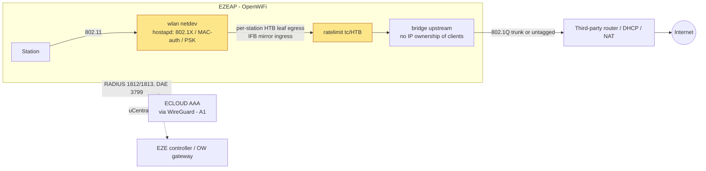
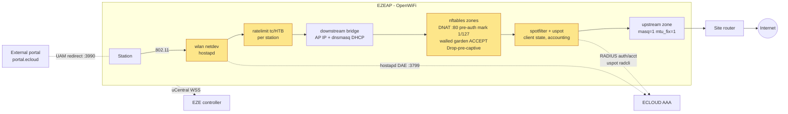
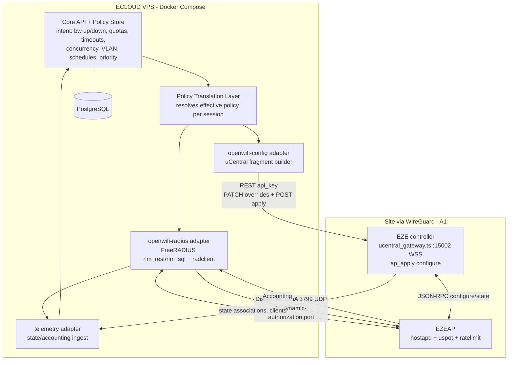

# NETWORK_INTEGRATION.md — ECLOUD ↔ EZEAP (TIP OpenWiFi / uCentral) enforcement & integration

Author: A2 (Network & Enforcement Agent). Phase 2 — design + protocol validation only. Nothing was installed or changed.
Evidence labels: **VERIFIED FROM EXISTING CODE** (local path) · **VERIFIED FROM OFFICIAL DOCUMENTATION** (upstream URL) · **PROPOSED** · **UNKNOWN** · **REQUIRES DEVICE TEST**.
Local schema analysed: `/Users/danny/Project/ezecontroller/src/schemas/ucentral.full.json` (`$id https://openwrt.org/ucentral.schema.json`). Its `$defs` were diffed against upstream `wlan-ucentral-schema/main/ucentral.schema.json`: every key set used below is identical in both (local additionally carries `service.facebook-wifi/http/mdns/rtty/wifi-steering/wireguard-overlay`). Upstream fetched copies are cached in `/Users/danny/.claude/jobs/6ede8b14/tmp/p2/a2/up/`.

## 1. Summary

1. Per-SSID bandwidth caps are a first-class uCentral feature: `interfaces[].ssids[].rate-limit.{ingress-rate,egress-rate}` (integers, Mbit/s, default 0 = off). The AP implements them with the wlan-ap `ratelimit` daemon (tc HTB + IFB, one HTB leaf + MAC filter **per station**), so the cap is a per-client ceiling applied to every station of that SSID, not an aggregate. Works identically in bridge and NAT mode because shaping happens on the AP's wireless netdev. VERIFIED FROM EXISTING CODE + OFFICIAL DOCUMENTATION.
2. Per-client bandwidth from RADIUS reply attributes (`WISPr-Bandwidth-Max-Up/Down` bps, `ChilliSpot-Bandwidth-Max-Up/Down` kbps) is implemented **only in the uspot captive-portal path** (`uspot.uc client_ratelimit → ubus ratelimit client_set`). No evidence that hostapd (802.1X / MAC-auth SSIDs) honours any bandwidth attribute. VERIFIED (source) / UNKNOWN for hostapd.
3. uspot also honours `Session-Timeout`, `Idle-Timeout`, `Acct-Interim-Interval` (local interval wins) and `ChilliSpot-Max-Total-Octets` (terminates session at quota), and sends RADIUS accounting (Start/Interim/Stop with octets). VERIFIED FROM OFFICIAL DOCUMENTATION (wlan-ap uspot source).
4. RADIUS CoA/Disconnect (RFC 5176): the schema exposes `ssids[].radius.dynamic-authorization.{host(uc-ip),port,secret}`; the renderer maps it to hostapd `dae_client/dae_port/dae_secret` and opens a UDP firewall rule from the upstream zone. uspot subscribes to hostapd's `coa` notification and kicks the client. CoA attribute *changes* to uspot sessions are not configurable through uCentral (no `das_*` rendering found). Disconnect works in theory for both paths; REQUIRES DEVICE TEST.
5. Captive portal (uspot) is only accepted on a **downstream** (routed, AP-owned IP + DHCP) interface and on a single interface per AP (renderer `warn` + reject). Therefore an "open + captive" SSID always has its own routed subnet on the AP, even at a bridge-mode site. Bridged SSIDs can carry 802.1X / MAC-auth / PSK, not the on-AP portal. VERIFIED FROM OFFICIAL DOCUMENTATION.
6. Auth paths available: WPA-Enterprise 802.1X (`radius.authentication`), RADIUS MAC-auth on any proto (`radius.authentication.mac-filter: true`), uspot `radius` (local splash + RADIUS PAP/CHAP), uspot `uam` (external portal, optional `mac-auth`), `click-to-continue`, local `credentials`. Dynamic VLAN: renderer always sets hostapd `dynamic_vlan=1`; wlan-testing has `dynamic_vlan` tests. VERIFIED.
7. Management channel: uCentral JSON-RPC 2.0 over WSS (device-initiated, mTLS). The in-house EZE controller already runs this gateway (port 15002), pushes `configure`, parses `state.interfaces[].ssids[].associations[]` (per-client rx/tx bytes) into `ap_clients`, and already emits `rate-limit`, `radius.*`, `dynamic-authorization`, `captive.*` keys. VERIFIED FROM EXISTING CODE.
8. Telemetry sources: periodic `state` (per-station counters, DHCP leases, counters), `metrics.statistics.types ["clients","ssids",…]`, `metrics.wifi-frames` (assoc/deauth/sta-authorized), `telemetry` stream (`dhcp`,`rrm` only), `request` (state/healthcheck on demand), plus RADIUS accounting from uspot/hostapd. VERIFIED.
9. Gaps: no evidence of per-client RADIUS bandwidth for hostapd clients, of burst parameters, of daily/monthly quota (only total-octets per session via uspot), of aggregate per-site shaping (schema has `service.quality-of-service.bandwidth-up/down` on WAN but semantics unverified), or of concurrent-device limits at the AP (must be enforced in ECLOUD AAA). All listed in §10.
10. PROPOSED: ECLOUD core stores policy intent; two adapters translate it — `openwifi-radius` (FreeRADIUS reply attributes + accounting + CoA/Disconnect) and `openwifi-config` (uCentral config fragments pushed through the existing EZE controller). Device-side mechanisms used are only those verified above; everything else is a REQUIRES DEVICE TEST candidate.

## 2. EZEAP / OpenWiFi capability matrix

Mode columns: **B** = bridge (SSID member of the `upstream` interface, L2 to a third-party router), **N** = routing/NAT/DHCP (SSID member of a `downstream` interface with `ipv4.addressing: static`, `dhcp{}`; upstream zone `masq=1`).

| Capability | B | N | Mechanism (device side) | Label | Source |
|---|---|---|---|---|---|
| Per-SSID up/down cap (per-station ceiling) | Yes | Yes | `ssids[].rate-limit.ingress-rate/egress-rate` (Mbit/s) → UCI `ratelimit rate {ssid,ingress,egress}` → `ubus ratelimit defaults_set` → tc HTB leaf + u32 MAC filter per station on wlan netdev + IFB mirror | VERIFIED CODE + DOCS | schema `$defs.interface.ssid.rate-limit`; renderer `interface/ssid.uc` `generate_rate_limit_config()`; wlan-ap `feeds/ucentral/ratelimit/files/{etc/init.d/ratelimit,usr/bin/ratelimit}`; wlan-testing `config/Ratelimit*.json`, `tests/e2e/basic/validation_of_operating_modes/{bridge,nat,vlan}_mode/rate_limiting` |
| Per-client cap from RADIUS (captive clients) | n/a (portal needs N) | Yes | uspot reads `WISPr-Bandwidth-Max-Up/Down` (bps) or `ChilliSpot-Bandwidth-Max-Up/Down` (kbps×1000) from Access-Accept → `ubus ratelimit client_set {device,address,rate_ingress,rate_egress}` | VERIFIED DOCS (source) | wlan-ap `feeds/ucentral/uspot/files/usr/share/uspot/uspot.uc` l.179-204 |
| Per-client cap from RADIUS (802.1X / MAC-auth clients) | ? | ? | No handler found in renderer/hostapd options; `ratelimit client_set` has no caller outside uspot in fetched sources | UNKNOWN → REQUIRES DEVICE TEST | ssid.uc, OpenWrt wifi doc (no bandwidth option) |
| Session timeout / idle timeout (captive) | n/a | Yes | uspot: `Session-Timeout`, `Idle-Timeout` from reply, else `captive.session-timeout` / `captive.idle-timeout` (default 600) | VERIFIED CODE + DOCS | schema `$defs.service.captive`; uspot.uc l.215-227 |
| Session/idle timeout (802.1X) | ? | ? | hostapd `max_inactivity` ← `ssids[].max-inactivity` (default 300) is per-SSID only; RADIUS `Session-Timeout` honouring by hostapd not verified here | UNKNOWN / REQUIRES DEVICE TEST | schema `interface.ssid.max-inactivity` |
| Per-session total quota (captive) | n/a | Yes | uspot `ChilliSpot-Max-Total-Octets` → terminates when `bytes_ul+bytes_dl ≥ max` ; upstream README also lists `ChilliSpot-Max-{Input,Output,Total}-{Octets,Gigawords}` | VERIFIED DOCS | uspot.uc l.225, l.349-353; f00b4r0/uspot README |
| Daily / monthly quota | No | No | Not a device feature; must be ECLOUD-side (accounting → Disconnect/CoA) | PROPOSED | — |
| Accounting (Start/Interim/Stop, octets) | 802.1X only | Yes | hostapd `acct_server/acct_port/acct_interval` ← `ssids[].radius.accounting{host,port,secret,interval 60-600}`; uspot `acct_server/acct_interval` ← `captive.acct-*` (default `acct-interval` 600) | VERIFIED CODE + DOCS | ssid.uc l.662-686; interface/captive.uc l.129-156 |
| Disconnect-Request (RFC 5176) | Yes (802.1X/MAC-auth) | Yes | `ssids[].radius.dynamic-authorization{host,port,secret}` → hostapd `dae_client/dae_port/dae_secret` + firewall `Allow-CoA` UDP from upstream; uspot kicks client on hostapd `coa` notify | VERIFIED CODE + DOCS; end-to-end REQUIRES DEVICE TEST | ssid.uc l.704-722; uspot.uc `hapd_subscriber_notify_cb`; OpenWrt `dae_*` options |
| CoA-Request changing rate/timeout mid-session | ? | ? | uspot upstream has "limited RFC5176" DAS (Session-Timeout/Idle-Timeout/Acct-Interim-Interval) on its own `das_port`; wlan-ap tree has no `radius-das.c` and renderer emits no `das_*` | UNKNOWN → REQUIRES DEVICE TEST | f00b4r0 README l.47-49; wlan-ap uspot `src/` listing |
| Dynamic VLAN from RADIUS | Yes | Yes (VLAN mode) | renderer always sets hostapd `dynamic_vlan=1` for RADIUS SSIDs; `ssids[].vlan-awareness` / `interface.vlan-awareness` prepare bridge VLANs; wlan-testing `dynamic_vlan_tests` exist | VERIFIED CODE; attributes REQUIRES DEVICE TEST | ssid.uc l.734; ezecontroller `ap_config_engine.ts` l.149-155 |
| MAC allow/deny list (static) | Yes | Yes | `ssids[].access-control-list{mode allow/deny, mac-address[]}` (config push only) | VERIFIED CODE | schema `$defs.interface.ssid.acl` |
| RADIUS MAC authentication | Yes | Yes | `ssids[].radius.authentication.mac-filter: true` with open or any proto | VERIFIED CODE + DOCS | schema; ssid.uc l.255-266; ezecontroller l.266-276 |
| Client isolation / max clients | Yes | Yes | `ssids[].isolate-clients`, `ssids[].maximum-clients`, `interface.isolate-hosts`, `interface.bridge.isolate-ports` | VERIFIED CODE | schema |
| Concurrent devices per subscriber | No | No | Not a device feature → ECLOUD AAA (reject/Disconnect) | PROPOSED | — |
| Captive portal on bridged SSID | **No** | Yes | renderer: "captive portal only on a downstream interface", single interface per AP | VERIFIED DOCS | `interface.uc` l.162-166; `services/captive.uc` `validate_single_interface()` |
| Walled garden | n/a | Yes | `captive.walled-garden-fqdn[]`, `walled-garden-ipaddr[]` → nft ACCEPT rules before `Drop-pre-captive`; wildcard FQDNs skipped by renderer | VERIFIED DOCS | services/captive.uc |
| Aggregate (site/WAN) shaping | ? | ? | `services.quality-of-service.{select-ports,bandwidth-up,bandwidth-down}` exists; implementation not inspected | UNKNOWN / REQUIRES DEVICE TEST | schema `$defs.service.quality-of-service` |
| Burst size | No | No | No schema key; ratelimit uses fixed `burst 2k` | VERIFIED DOCS (absence) | ratelimit l.21 |
| RADIUS over gateway (RadSec) | Yes | Yes | `ssids[].services ["radius-gw-proxy"]`, `captive.radius-gw-proxy`, `services.radius-proxy.realms[]` (radsec/radius); CoA then terminates at 127.0.0.1:3799 on AP | VERIFIED CODE (schema/renderer); REQUIRES DEVICE TEST | ssid.uc l.154-158; owgw CONFIGURATION.md "RADIUS proxy config" |

## 3. Traffic paths and enforcement points

### 3.1 Bridge mode (SSID on `role: upstream` interface, `ipv4.addressing: dynamic`)

- Enforcement points: hostapd (admit/deny, VLAN tag, Disconnect) and `ratelimit` on the wlan netdev. Both are **per station** and independent of who routes. VERIFIED (ratelimit source uses `tc ... dev <wlan>` + `i-<wlan>` IFB).
- The AP owns no client IP/DHCP; no on-AP captive portal possible (renderer rejects). ECLOUD cannot shape or redirect anything upstream of the AP; the third-party router is outside scope. VERIFIED (renderer) / PROPOSED (consequence).
- Client L3 identity for ECLOUD is only MAC (+ RADIUS User-Name / Calling-Station-Id); IP is visible via `state.interfaces[].clients[]`/associations only if the AP learns it. UNKNOWN per firmware.

### 3.2 Routing / NAT / DHCP mode (SSID on `role: downstream`, `ipv4 {addressing: static, subnet, dhcp{lease-first,lease-count,lease-time}}`)

- Enforcement points: hostapd, `ratelimit` (per station, now also fed by RADIUS attributes through uspot), nftables redirect/walled garden/drop, uspot session timers and octet quota. VERIFIED (services/captive.uc, interface/firewall.uc, uspot.uc).
- NAT: `firewall zone <upstream>.masq=1` is rendered for every upstream interface. VERIFIED (`interface/firewall.uc` l.52-58). Port-forwards and traffic-allow rules are downstream-only. VERIFIED (`interface.uc`).
- wlan-testing's NAT profile: `role downstream`, `ipv4.addressing static`, `subnet 192.168.1.1/16`, `dhcp{lease-first 10, lease-count 10000, lease-time 6h}`, `services ["ssh","lldp","dhcp-snooping"]`. VERIFIED FROM EXISTING CODE (upstream) `libs/tip_2x/controller.py` l.2459-2474. Its `set_captive_portal()` only runs when `mode == "NAT"` and attaches captive to `interfaces[1]` (l.2562-2572).
- Hybrid: a "bridge-mode site" can still run the portal by giving the hotspot SSID its own downstream interface (what `ap_config_engine.ts` does with `hsIface`, l.1205-1215 — adds `ipv4.gateway`, `isolate-hosts`). VERIFIED CODE.

## 4. Client authentication paths

| Path | uCentral config | What the AP does | RADIUS involvement | Label |
|---|---|---|---|---|
| WPA2/WPA3-Enterprise (802.1X) | `ssids[].encryption.proto` ∈ wpa/wpa2/wpa3/wpa3-mixed/wpa3-192 (+ `psk2-radius`, `mpsk-radius`) + `radius.authentication{host,port,secret,secondary,request-attribute[]}`, `radius.accounting{…,interval}`, `radius.nas-identifier`, `radius.chargeable-user-id`, optional `radius.dynamic-authorization` | hostapd EAP; `nasid`, `request_cui`, `dynamic_vlan=1`, `radius_auth_req_attr` (incl. TIP vendor TLV 0000e608 with serial) | Access-Request/Accept; Accounting; DAE Disconnect | VERIFIED CODE (schema, ezecontroller l.30-61, 266-288) + DOCS (ssid.uc l.630-735) |
| RADIUS MAC-auth (open or PSK) | `radius.authentication.mac-filter: true` + server | hostapd MAC-based RADIUS auth; proto `none` allowed | Access-Request with MAC as identity (format decided by hostapd) | VERIFIED CODE + DOCS (ssid.uc l.255-266); exact username format REQUIRES DEVICE TEST |
| Open + uspot `radius` | `ssids[].services ["captive"]`, `captive{auth-mode:"radius", auth-server, auth-port(1812), auth-secret, acct-server, acct-port, acct-secret, acct-interval(600), walled-garden-*, idle-timeout, session-timeout}` | On-AP splash (`/hotspot`), PAP/CHAP via radcli, spotfilter gate, accounting, per-client ratelimit from reply | Full: auth + acct + bandwidth/timeout/quota attributes | VERIFIED CODE (schema; wlan-testing `test_radius_user_and_pass_{bridge,nat}.py`) + DOCS |
| Open + uspot `uam` (external portal) | `captive{auth-mode:"uam", uam-server, uam-port(3990), uam-secret, nasid, nasmac(default serial), ssid, mac-format, final-redirect-url, mac-auth, radius-gw-proxy, auth-*/acct-*}` | Redirect to `uam-server` with query `uamip, uamport, nasid, called, mac, ssl, lang, md`; UAM logon on :3990; optional MAC-auth first | Same as `radius` mode; portal is ECLOUD's | VERIFIED CODE (schema; ezecontroller l.1229-1256) + DOCS (f00b4r0 README "UAM interface"; interface/captive.uc l.179-196) |
| `click-to-continue` / `credentials` | `captive{auth-mode:"click-to-continue"}` / `{auth-mode:"credentials", credentials[]}` | Local only, no RADIUS | None | VERIFIED CODE (wlan-testing click/local_user tests) |
| Wired 802.1X | `services.ieee8021x{mode radius/user, select-ports, radius{auth/acct/coa-server-addr/port/secret, mac-address-bypass}}` | Port-based | Yes incl. CoA server fields | VERIFIED CODE (schema) — out of scope |

Notes: `dynamic-authorization.host` has format `uc-ip` (IP literal, not FQDN) — ECLOUD's CoA sender must have a stable IP reachable from the AP (WireGuard hub address, dependency on A1). `interface.ssid.radius.server.request-attribute[]` lets ECLOUD inject fixed attributes (e.g. id 32 NAS-Identifier, id 126 Operator-Name, vendor VSAs) per SSID. VERIFIED CODE (schema).

## 5. Dynamic control at runtime

| Mechanism | Changes at runtime | Verified? |
|---|---|---|
| RADIUS Disconnect-Request → hostapd DAS (`dae_*`, default port 3799 per OpenWrt doc; uCentral requires explicit `port` 1024-65535) | Deauth a station (802.1X/MAC-auth); uspot also receives hostapd `coa` notify → `client_kick` | Config path VERIFIED CODE+DOCS; packet handling REQUIRES DEVICE TEST (identifying attributes, secret handling, NAT-mode reachability) |
| RADIUS CoA-Request → hostapd | hostapd upstream supports CoA for some session attributes; not documented in the fetched OpenWrt page beyond "change connection parameters" | UNKNOWN → REQUIRES DEVICE TEST |
| RADIUS CoA → uspot own DAS | Upstream uspot: Disconnect + update Session-Timeout/Idle-Timeout/Acct-Interim-Interval; **no `das_port/das_secret` rendered by uCentral**, wlan-ap source lacks radius-das.c | UNKNOWN → REQUIRES DEVICE TEST |
| uCentral `configure {uuid, when, config}` | Any schema key: rate-limit, ACL, captive timers, walled garden, radius servers; AP replies `status.error`, `rejected[]`; re-applies hostapd/uspot (uspot has no state persistence → portal sessions reset) | VERIFIED DOCS (PROTOCOL.md) + CODE (`ap_apply.ts` l.475-528); session-reset side effect VERIFIED DOCS (f00b4r0 README) |
| uCentral `request {message: state|healthcheck}` | Pull fresh state immediately | VERIFIED DOCS |
| uCentral `telemetry {interval 0-60, types ["dhcp","rrm"]}` | Streams dhcp/rrm events ≤30 min | VERIFIED DOCS |
| uCentral `script {type shell}` | Arbitrary shell (ezecontroller uses it for a DHCP poll) — could call `ubus ratelimit client_set` | VERIFIED CODE that command exists; **PROPOSED only as last resort**, not a supported API |
| uCentral `rrm` kick / `wifiscan` / `reboot` / `factory` / `upgrade` / `leds` / `trace` / `powercycle` / `fixedconfig` / `certupdate` / `reenroll` / `transfer` / `remote_access` | Device ops (RRM "Kick" can deauth a station) | VERIFIED DOCS (PROTOCOL.md headings/method list) |

## 6. Telemetry / accounting sources from the device

| Source | Content | Cadence | Label |
|---|---|---|---|
| `state` event (`params.state`) | `interfaces[].ssids[].associations[]{station, bssid, rx_bytes, tx_bytes, …}`, `interfaces[].clients[]{ipv4_addresses…}`, `interfaces[].counters/delta_counters`, `interfaces[].ipv4.leases`, `dynamic_vlans`, `lldp-peers`, `link-state`, `unit.uptime` | periodic (~60 s observed by ezecontroller) or on `request` | VERIFIED DOCS (`ucentral.state.pretty.json`) + CODE (`ucentral_gateway.ts` `collectAssociations`, `parseClients` → `ap_clients`) |
| `metrics.statistics{interval ≥60, types ["ssids","lldp","clients","tid-stats"]}` | Controls what `state` carries | config | VERIFIED CODE (schema) |
| `metrics.wifi-frames.filters` (`probe,auth,assoc,disassoc,deauth,local-deauth,inactive-deauth,key-mismatch,sta-authorized,…`) | Per-station association events via `event` channel | event | VERIFIED CODE (schema) + DOCS (PROTOCOL events channel) |
| `metrics.dhcp-snooping.filters` + interface service `dhcp-snooping` | DHCP ack/offer/… → MAC↔IP mapping | event | VERIFIED CODE (schema; ezecontroller notes delivery channel "unverified") → REQUIRES DEVICE TEST |
| `metrics.telemetry{interval,types}` / `metrics.realtime{types}` | examples `client.associate`, `dhcp.ack`, `dns.query` | config | VERIFIED CODE (schema, examples only) |
| RADIUS Accounting (hostapd) | Start/Interim/Stop, `acct_interval` 60-600 s | per session | VERIFIED CODE + DOCS |
| RADIUS Accounting (uspot) | Session-Time, Input/Output Octets/Packets/Gigawords, interim at `acct-interval` (default 600) | per session | VERIFIED DOCS (f00b4r0 README l.31; uspot.uc `client_interim`) |
| `healthcheck`, `log`, `crashlog`, `alarm` | Device health | periodic/event | VERIFIED DOCS |

## 7. Proposed ECLOUD ↔ EZEAP integration architecture (PROPOSED unless labelled)

### 7.1 What ECLOUD stores (policy intent — device-agnostic)
Tenant → Site → Device(serial, mode bridge|nat, capabilities) → SSID profile → Subscriber/Device identity → Session → Policy {down_kbps, up_kbps, burst (stored, not enforceable yet), quota_total/daily/monthly bytes, session_timeout_s, idle_timeout_s, max_concurrent, vlan_id, schedule, priority, validity}. Capability flags per device (from §2) decide which adapter emits what; unsupported intents are surfaced as "not enforceable on this device" instead of silently dropped.

### 7.2 `openwifi-radius` adapter (FreeRADIUS front-end) — emits per Access-Accept
| Intent | Emitted (captive/uspot clients) | Emitted (802.1X / MAC-auth clients) | Label |
|---|---|---|---|
| down/up bandwidth | `WISPr-Bandwidth-Max-Down/Up` (bps) — or `ChilliSpot-Bandwidth-Max-Down/Up` (kbps) | nothing verified → fall back to SSID `rate-limit` via config adapter | VERIFIED DOCS (uspot) / UNKNOWN (hostapd) |
| session / idle timeout | `Session-Timeout`, `Idle-Timeout` | `Session-Timeout` candidate | VERIFIED DOCS / REQUIRES DEVICE TEST |
| interim interval | `Acct-Interim-Interval` (AP-local `acct-interval` overrides it — set AP value to 0/unset if RADIUS should rule) | hostapd `acct_interval` from config | VERIFIED DOCS (uspot.uc l.216-222) |
| per-session quota | `ChilliSpot-Max-Total-Octets` (+ Input/Output/Gigawords per upstream README) | — | VERIFIED DOCS |
| VLAN | — | `Tunnel-Type=VLAN, Tunnel-Medium-Type=IEEE-802, Tunnel-Private-Group-Id` (RFC 3580 standard; hostapd `dynamic_vlan=1` rendered) | renderer VERIFIED; honouring REQUIRES DEVICE TEST |
| daily/monthly quota, concurrency, validity, schedule | Decided in ECLOUD before Accept (Access-Reject) and during session (Disconnect-Request from accounting totals) | same | PROPOSED |
| Disconnect | `radclient`/FreeRADIUS `coa` home server → `dynamic-authorization.host:port` with shared secret; NAS identification by `Calling-Station-Id` + `User-Name` (+ `NAS-Identifier`) | same | REQUIRES DEVICE TEST |

Dictionaries needed: standard + WISPr (vendor 14122) + ChilliSpot (vendor 14559) — both ship with FreeRADIUS (A3/A4 to confirm in their artifacts; stated here as PROPOSED dependency). uspot does not install radcli dictionaries by default (README "radcli") — whether the EZEAP build includes WISPr/ChilliSpot dictionaries for reply parsing is **REQUIRES DEVICE TEST** (the attribute names are referenced by name in `uspot.uc`, so a dictionary must be present on the device).

### 7.3 `openwifi-config` adapter — emits uCentral fragments (all keys VERIFIED in schema)
- SSID-level: `rate-limit{ingress-rate (client upload), egress-rate (client download)}` in Mbit/s (integers — sub-Mbit plans cannot be expressed; use RADIUS path for those); `radius.authentication{host,port,secret,secondary,mac-filter,request-attribute[]}`, `radius.accounting{host,port,secret,interval}`, `radius.nas-identifier`, `radius.dynamic-authorization{host,port,secret}`, `access-control-list{mode,mac-address[]}`, `maximum-clients`, `isolate-clients`, `max-inactivity`, `vlan-awareness`.
- Captive SSID (requires a `downstream` interface): `services ["captive"]`, `captive{auth-mode uam|radius, uam-server=https://portal.ecloud…, uam-port, uam-secret, nasid, nasmac, mac-auth, mac-format, final-redirect-url, auth-*, acct-*, acct-interval, walled-garden-fqdn/ipaddr (portal + IdP hosts), idle-timeout, session-timeout, radius-gw-proxy}`.
- NAT-mode interface: `role downstream`, `ipv4{addressing static, subnet, dhcp{lease-first,lease-count,lease-time}, dhcp-leases[], disallow-upstream-subnet[]}`, `isolate-hosts`, `services ["dhcp-snooping"]`; `metrics.statistics{interval, types ["clients","ssids"]}`, `metrics.wifi-frames.filters`.
- Secrets: RADIUS/UAM/DAE secrets are per-site values generated by ECLOUD and injected at push time (never stored in Git; same sentinel pattern ezecontroller uses for `__EZE_SERIAL__`). PROPOSED.

### 7.4 Telemetry adapter
Primary: RADIUS accounting (authoritative for billing/quota). Secondary: `state.interfaces[].ssids[].associations[]` byte counters (already persisted by ezecontroller in `ap_clients` with `delta_counters`) for live dashboards and for 802.1X clients without uspot accounting. Correlation key: client MAC (`station` ↔ `Calling-Station-Id`), AP serial (`NAS-Identifier`/TIP vendor TLV), SSID.

## 8. Relationship to the existing EZE controller

| Option | Description | Pros | Cons | Label |
|---|---|---|---|---|
| A. Reuse EZE controller as the only device channel | ECLOUD calls ezecontroller REST (`/api/access-points/:serial/configuration/{overrides,apply,effective,diff,history}`; API keys with `write` scope exist: `server.ts _authenticateApiKey`, `api_keys` table; permission `device.config_push`) and reads `ap_clients`/state | One uCentral session per AP (a device holds one WSS connection — second controller would steal it); existing revision/rollback/`rejected` handling; schema validation; RBAC precedent (`lib/permissions.ts`) | Coupling of ECLOUD releases to controller API; controller must expose per-SSID/captive override semantics (today: site/profile/override model, `ap_config_engine.ts`) and telemetry webhooks (not present — `alert_engine.ts` says "webhook … later"); AP config is site-wide (captive `nasid` per AP via sentinel) | VERIFIED CODE for endpoints/API keys; integration contract PROPOSED |
| B. ECLOUD runs its own OpenWiFi gateway (`wlan-cloud-ucentralgw`) | APs re-pointed to ECLOUD gateway; ECLOUD uses owgw REST + Kafka | Vendor-standard API, built-in RADIUS proxy (`radius.proxy.*` ports 1812/1813/3799, RadSec), telemetry via Kafka | Breaks the EZE controller (device can only connect to one controller); duplicates PKI/redirector; heavier footprint on a 3.7 GiB VPS | VERIFIED DOCS (owgw README/CONFIGURATION) / PROPOSED judgement |
| C. ECLOUD is RADIUS/portal only; device config stays in EZE controller UI | Operators configure SSIDs in EZE controller pointing RADIUS/UAM/DAE at ECLOUD; ECLOUD never pushes config | Zero coupling; fastest pilot | Bandwidth for non-captive SSIDs cannot be driven by ECLOUD policy (per-SSID rate-limit lives in controller); drift between the two systems | PROPOSED |

**PROPOSED recommendation:** start with **C for the pilot** (RADIUS + UAM + DAE to ECLOUD; SSID/captive settings entered once in the EZE controller), then evolve to **A** by adding to ezecontroller a narrow, versioned "policy fragment" API (per-SSID `rate-limit`, `access-control-list`, captive timers) and a state/accounting webhook. Do **not** pursue B while the EZE controller remains the fleet manager. Dependency: A1 (WireGuard) must give ECLOUD a fixed tunnel IP, because `dynamic-authorization.host` is `uc-ip` and the AP firewall rule `Allow-CoA` is scoped to the upstream zone.

## 9. Evidence index

Local (VERIFIED FROM EXISTING CODE):
- `/Users/danny/Project/ezecontroller/src/schemas/ucentral.full.json` — `$defs`: `interface` (role, ipv4, vlan, bridge, isolate-hosts, services, vlan-awareness), `interface.ipv4{addressing enum dynamic|static|none, subnet, gateway, use-dns, disallow-upstream-subnet, dhcp, dhcp-leases, port-forward}`, `interface.ipv4.dhcp{lease-first, lease-count, lease-time default 6h, use-dns}`, `interface.ssid{isolate-clients, strict-forwarding, max-inactivity 300, maximum-clients, services, rate-limit, radius, access-control-list, captive, vlan-awareness, hostapd-bss-raw}`, `interface.ssid.rate-limit{ingress-rate, egress-rate int default 0}`, `interface.ssid.radius{nas-identifier, chargeable-user-id, local, dynamic-authorization{host uc-ip, port 1024-65535, secret}, authentication(server+mac-filter), accounting(server+interval 60-600 default 60), health}`, `interface.ssid.radius.server{host, port, secret, secondary, request-attribute[]}`, `interface.ssid.acl{mode allow|deny, mac-address[]}`, `service.captive` (oneOf click/radius/credentials/uam + walled-garden-fqdn/ipaddr, web-root*, idle-timeout 600, session-timeout), `service.captive.uam{uam-port 3990, uam-secret, uam-server, nasid, nasmac, auth-*, acct-* (acct-port default 1812), acct-interval 600, ssid, mac-format, final-redirect-url, mac-auth, radius-gw-proxy}`, `service.ieee8021x`, `service.radius-proxy{proxy-secret, realms[]}`, `service.quality-of-service{select-ports, bandwidth-up, bandwidth-down, classifier}`, `metrics{statistics, health, wifi-frames, dhcp-snooping, wifi-scan, telemetry, realtime}`.
- `/Users/danny/Project/ezecontroller/src/ap_config_engine.ts` — l.30-61 protos; l.149-158 vlan-awareness/isolate; l.223-228 rate-limit mapping (UL→ingress, DL→egress Mbps); l.229-244 accounting; l.250-255 dynamic-authorization; l.266-288 authentication/mac-filter/nas-identifier; l.400-408 captive mode mapping; l.1205-1275 hotspot interface + captive block; l.1005-1032 upstream interface addressing.
- `/Users/danny/Project/ezecontroller/src/ap_apply.ts` — l.475-528 `sendCommand(serial,'configure',{uuid,config})`, rejected/"Already applied" handling; l.406-410 `__EZE_SERIAL__` nasid substitution.
- `/Users/danny/Project/ezecontroller/src/ucentral_gateway.ts` — l.7-9, 414 WSS listener AP_WS_PORT 15002; l.429-456 TLS/mTLS; l.684-770 handled methods (connect, recovery, state, healthcheck, ping, log, crashlog, rebootLog, event, alarm, wifiscan, telemetry, cfgpending, deviceupdate); l.76-115 `collectAssociations`; l.1355-1403 `parseClients` → `ap_clients`; l.1663-1682 `sendCommand`.
- `/Users/danny/Project/ezecontroller/src/ap_device_config_routes.ts` — l.244-632 REST endpoints; `src/server.ts` l.1705-1737 API-key auth; `src/lib/permissions.ts` granular permission strings.
- `/Users/danny/Project/wlan-testing` — `config/Ratelimit.json`, `config/ratelimit_*.json`, `tests/access_point_tests/master_config_tests/master-config-1.json` (rate-limit, downstream interfaces); `libs/tip_2x/controller.py` l.2459-2474 NAT interface, l.2562-2572 `set_captive_portal` (NAT only), l.2753-2840 `add_ssid` radius auth/acct/captive; `tests/e2e/basic/validation_of_operating_modes/{bridge_mode,nat_mode,vlan_mode}/rate_limiting`, `bridge_mode/rate_limiting_with_radius/test_rate_limiting_with_radius.py`; `tests/e2e/basic/advanced_captive_portal_tests/{internal,external}_captive_portal_tests/open/*.py`; `tests/lab_info.json` keys (PASSPOINT_RADIUS_* with `request-attribute id 126`). No `dynamic-authorization`, `WISPr` or CoA usage found in wlan-testing.

Upstream (VERIFIED FROM OFFICIAL DOCUMENTATION):
- https://github.com/Telecominfraproject/wlan-ucentral-schema — `ucentral.schema.json` (main), `renderer/templates/interface.uc`, `interface/ssid.uc`, `interface/captive.uc`, `interface/firewall.uc`, `interface/ipv4.uc`, `interface/dhcp.uc`, `services/captive.uc`, `ucentral.state.pretty.json`.
- https://github.com/Telecominfraproject/wlan-ap — `feeds/ucentral/ratelimit/{Makefile,files/etc/init.d/ratelimit,files/usr/bin/ratelimit}`, `feeds/ucentral/uspot/{Makefile,files/etc/config/uspot,files/usr/share/uspot/uspot.uc,src/}`; feed list includes `spotfilter`, `radius-gw-proxy`, `ucentral-client`.
- https://github.com/Telecominfraproject/wlan-cloud-ucentralgw — `PROTOCOL.md` (events: connect, state, healthcheck, log, event, alarm, wifiscan, crashlog, rebootLog, cfgpending, deviceupdate, ping, recovery, venue_broadcast, telemetry; commands: configure, fixedconfig, reboot, powercycle, upgrade, factory, rrm, leds, trace, wifiscan, request, eventqueue, telemetry, remote_access/rtty, script, certupdate, reenroll, transfer), `CONFIGURATION.md` ("RADIUS proxy config": radius.proxy.enable, accounting 1813, authentication 1812, coa 3799, radsec.keepalive), `radius_config_sample.json` (authConfig/acctConfig/coaConfig pools), `openapi/owgw.yaml` (fetched, endpoints not extracted).
- https://github.com/f00b4r0/uspot README — features, RADIUS attributes, limited RFC 5176 DAS, UAM query parameters, radcli dictionaries note.
- https://openwrt.org/docs/guide-user/network/wifi/basic — hostapd options `auth_server/auth_port 1812/auth_secret`, `acct_server/acct_port 1813/acct_secret`, `nasid`, `ownip`, `dae_client`, `dae_port 3799`, `dae_secret`, `dynamic_vlan`, `maxassoc`, `isolate`, `macfilter/maclist`.

## 10. Open questions for owner
1. Which SSID types per site: PSK-only, WPA-Enterprise, open+portal? (Determines whether any bandwidth control beyond per-SSID caps is possible; per-client RADIUS caps are verified only for portal clients.)
2. Is it acceptable that captive-portal SSIDs always get an AP-routed subnet (NAT on the AP) even at bridge-mode sites? If not, the portal must move to a gateway (CoovaChilli/EZEGATE — A4 scope).
3. Which units/granularity for plans — Mbit/s integers (uCentral `rate-limit`) vs bps (RADIUS WISPr)? Sub-1-Mbit plans need the RADIUS path.
4. Pilot path: C (RADIUS/UAM only) then A (controller API) — agreed? Who owns the ezecontroller API extension?
5. Can a real EZEAP (model, firmware build, `ucentral-schema` version) and a controller-side test SSID be made available for §11?
6. Should ECLOUD's CoA/Disconnect originate only from the WireGuard hub IP (fixed `uc-ip` requirement)?

## 11. Items requiring a real device test
1. Per-SSID `rate-limit` semantics on EZEAP firmware: per-station ceiling vs aggregate; who calls `ratelimit client_set` for non-captive stations (hostapd hook not located in fetched sources); effect on existing sessions when re-pushed.
2. uspot: `WISPr-Bandwidth-Max-Up/Down` and `ChilliSpot-Bandwidth-Max-Up/Down` honoured end-to-end (dictionary present on device, correct direction mapping up→ingress/down→egress), `Session-Timeout`, `Idle-Timeout`, `Acct-Interim-Interval` precedence, `ChilliSpot-Max-Total-Octets` termination and the Acct-Terminate-Cause sent.
3. Accounting: hostapd and uspot interim intervals, octet fields, `NAS-Identifier`/`Called-Station-Id`/`Calling-Station-Id` formats, TIP vendor TLV (vendor 0000e608) contents.
4. RFC 5176 Disconnect to hostapd `dynamic-authorization.port`: required identification attributes, secret handling, behaviour for uspot-gated clients (hostapd `coa` notify → `client_kick`), and reachability in NAT mode (firewall `Allow-CoA` src = upstream zone — verify it matches the WireGuard path).
5. CoA-Request (not Disconnect) to hostapd: which attributes, if any, are applied.
6. uspot own DAS (`das_port`): present in EZEAP build? configurable at all without `config-raw`?
7. RADIUS MAC-auth: username/password format sent by hostapd (`mac-filter: true`), and uspot `mac-auth` (`mac_password`, `mac_suffix`, `mac_format`).
8. Dynamic VLAN: `Tunnel-*` attributes accepted; VLAN must exist in `vlan-awareness`; behaviour in bridge vs VLAN mode.
9. NAT mode: `disallow-upstream-subnet`, `isolate-hosts`, DHCP lease visibility in `state.interfaces[].ipv4.leases`, dhcp-snooping event delivery (ezecontroller marks it unverified).
10. `services.quality-of-service.bandwidth-up/down` on `select-ports ["WAN"]`: does it shape aggregate upstream traffic?
11. `radius-gw-proxy`/RadSec path if the EZE controller is to proxy RADIUS (CoA terminates at 127.0.0.1:3799 on AP).
12. State cadence and `metrics.statistics.types ["clients"]` payload on EZEAP firmware; `wifi-frames` `sta-authorized` event availability.
