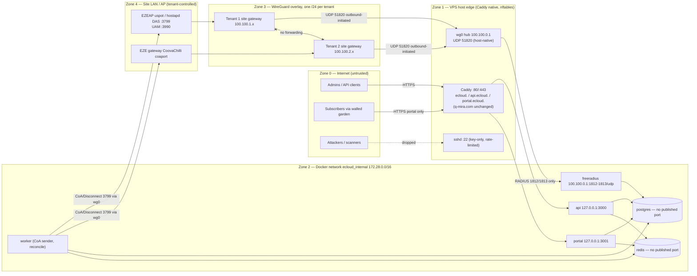

# ECLOUD Security Architecture (Phase 2 — A8 Security Agent)

Status: **PROPOSED** design and review. Nothing was installed, changed or tested on `vps`, `controller`, `dev-controller` or any EZEAP. Every control below is to be applied in Phase 3+ only after owner approval (Q17, Q21). Labels: **VERIFIED ON VPS (read-only, Phase 1)**, **VERIFIED FROM EXISTING CODE**, **VERIFIED FROM OFFICIAL DOCUMENTATION**, **PROPOSED**, **UNKNOWN**, **REQUIRES DEVICE TEST**. Secrets appear only as `<PLACEHOLDER>`.

Inputs reviewed: SECURITY.md, DISCOVERY_REPORT.md §2.6 (F-35..F-45), REMOTE_ENVIRONMENT.md §3–5, NETWORK_INTEGRATION.md (A2), CAPTIVE_PORTAL_ARCHITECTURE.md (A4), DATABASE_DESIGN.md + MULTITENANCY.md (A6), WIREGUARD_ARCHITECTURE.md (A1), DEPLOYMENT_ARCHITECTURE.md (A5), a7_frontend.md (A7), DECISIONS.md D-001..D-012. **Dependency:** AAA_ARCHITECTURE.md, POLICY_ENGINE.md and API_ARCHITECTURE.md did not exist when this document was written; their intended design is taken from BRIEF.md and DECISIONS.md D-004 (FreeRADIUS 3.2.x front-end, rlm_rest authorize, rlm_sql insert-only accounting) and D-011 (TypeScript/Node 22 modular monolith). Sections 4, 6 and 11 must be re-checked against those artifacts once published.

---

## 1. Threat model (STRIDE-style)

Assets: **A1** admin accounts/sessions, **A2** subscriber credentials and vouchers, **A3** RADIUS shared secrets, **A4** UAM secrets, **A5** WireGuard keys, **A6** PostgreSQL data, **A7** API keys, **A8** captive portal, **A9** accounting integrity, **A10** tenant data (cross-tenant), **A11** platform host/services. S/T/R/I/D/E = Spoofing, Tampering, Repudiation, Information disclosure, Denial of service, Elevation of privilege.

| # | Threat (SECURITY.md item) | STRIDE | Asset | Attack path (specific to this design) | Mitigations (design references) | Residual risk | Owner |
|---|---|---|---|---|---|---|---|
| T1 | Admin account takeover | S, E | A1 | Password stuffing/phishing on `ecloud.ezelink.ai`; stolen session cookie; invitation-token theft; SSO misconfiguration | Argon2id (§6.1); TOTP mandatory for any `platform`-scope binding and per-org `require_mfa`; `__Host-` session cookie, server-side `admin_sessions.token_hash` revocation; login rate limit per account+IP and fail2ban `ecloud-admin` jail (§2.4); invitation tokens hashed, single-use, 72 h; audit of logins | Phishing of TOTP codes (real-time relay) → WebAuthn as Phase 10 upgrade | A8/A5 |
| T2 | Subscriber credential attacks | S | A2 | Brute force of username/password or voucher via portal; offline cracking after DB leak; voucher enumeration | Portal rate limits per `nasid+mac`, per client IP, per site (§5.4); voucher codes ≥ 8 chars from 32-symbol alphabet (≥ 40 bits) stored as HMAC-SHA-256 with pepper (`vouchers.code_hash`, A6 §3.6); subscriber `password_hash` Argon2id; lockout + CAPTCHA-free back-off (mini-browsers break CAPTCHAs); no enumeration in error text (A7 §4) | PAP over the AP LAN hop is XOR-MD5 only (UAM protocol limit) — 90 s single-use credential bounds the damage | A8/A4 |
| T3 | Portal spoofing / phishing | S, I | A8 | Evil-twin SSID redirecting to a look-alike portal; HTTP-only redirect chain intercepted; open redirect via `userurl` | HTTPS-only portal with HSTS; fixed known hostname `portal.ecloud.ezelink.ai` in device walled garden; per-site branding only from DB (no user-supplied HTML); `userurl` allow-list (§5.3); CSP `default-src 'self'` | Users cannot distinguish an evil twin before connecting — document to tenants; no technical fix at portal level | A8/A4 |
| T4 | RADIUS client impersonation | S | A3, A9 | Attacker sends Access-/Accounting-Requests from an IP that matches a `nas_clients.nas_ip`; spoofed UDP source | Tunnel-only RADIUS by default (FreeRADIUS bound to `100.100.0.1`), cryptokey routing prevents source spoofing inside the overlay (A1 W2); per-NAS secret (`nas_clients.secret_ref`); `require_message_authenticator = yes` (§4.2); unknown NAS → packet dropped by FreeRADIUS, logged to `auth_events` with `organization_id NULL` (A6 §3.3) | Public RADIUS fallback (topology C) relies on secret + allowlist only; RadSec required there | A8/A3 |
| T5 | Stolen / shared RADIUS secrets | S, T | A3 | Secret read from device config (uCentral JSON holds `auth-secret` in clear), from the EZE controller DB, from a backup, from FreeRADIUS logs | One secret per NAS, never per tenant/site; ≥ 32 chars; encrypted at rest with envelope encryption (§4.1); never in git, images, logs or dumps; rotation with dual-secret window; BlastRADIUS defence; a stolen secret only impersonates one NAS and only via its tunnel IP | Controller-side storage of the clear secret is outside ECLOUD (UNKNOWN how ezecontroller protects it) | A8/A3/owner |
| T6 | API abuse | D, I, E | A7 | Scraping, credential stuffing on `api.ecloud.ezelink.ai`, leaked API key in client code, mass export | API keys hashed (`key_prefix` + `key_hash`), role-scoped, `allowed_cidrs`, `expires_at`, revocation; per-key and per-tenant rate limits (Redis); exports are async jobs scoped and audited (`report:export`, `accounting:export`, G7); 404 not 403 for foreign objects (G9) | Redis optional in pilot → in-memory limiter per process until Redis is added | A5/A8 |
| T7 | Injection (SQL, header, template, command) | T, E | A6, A8 | Portal/UI input into SQL; `userurl`/`reply` reflected; `radclient` invoked with attacker-controlled attributes; FreeRADIUS SQL queries templated from RADIUS attributes | Parameterised `pg` queries only; JSON-schema validation (ajv precedent) on every route; templates auto-escape; `radclient` fed via stdin attribute list, values escaped per `radclient(1)` syntax, never shell-concatenated; FreeRADIUS `rlm_sql` safe-characters configuration; MAC via `macaddr` type (A6 §1) | `accounting_records.raw` JSONB keeps hostile strings — rendered escaped only | A5/A3/A8 |
| T8 | Privilege escalation | E | A1, A10 | Site Admin creates an API key with wider role; custom role edited to include platform keys; impersonating Support changes admins or secrets | Deny-by-default `authorize()` (MULTITENANCY §4.4); API key creation requires creator to hold every permission of the key's role; `is_platform_only` keys unreachable without platform binding; impersonation uses `org_admin` template, `platform_access` off, cannot touch `administrator:*`, `role:*`, `nas:secret:rotate`, `api_key:*` (PROPOSED guardrail, A7 §5); copy-on-write role templates | Logic bugs in permission evaluation → A9 tests T-11, T-14, plus §3.5 list | A6/A8 |
| T9 | Cross-tenant / cross-site exposure | I | A10 | Missing `WHERE organization_id`; webhook fan-out; voucher of tenant A on portal of B; NAS of A proxied as B; report aggregate without scope | App filter + PostgreSQL RLS with `FORCE`, `SET LOCAL app.current_org`, `ecloud_app` without `BYPASSRLS` (A6 §8); tenant from NAS identity, never from username; `vouchers.code_hash` global unique + tenant equality check (T-07); per-tenant WireGuard /24 + nftables no site-to-site (§3.2); guards G1–G10 | RLS "fails closed" to 0 rows — monitor for silent empty results (§8) | A6/A8 |
| T10 | Session hijacking | S | A1, A8 | Admin cookie theft via XSS; portal flow hijack by replaying `sessionid`/`challenge`; subscriber Wi-Fi session hijack by MAC spoofing after login | Cookie `HttpOnly; Secure; SameSite=Lax; Path=/; __Host-` prefix, no `Domain`; CSP without inline scripts; idle 30 min / absolute 12 h; portal flows bound to `mac+nasid+sessionid` with signed `state` (A4 §7.2); MAC spoofing on open SSIDs is inherent (§4.8) | Open-SSID MAC hijack cannot be prevented by ECLOUD — only detected (duplicate MAC on two NAS) | A8/A4 |
| T11 | Replay | S, T | A2, A9 | Replayed `/logon` URL with captured portal credential; replayed Accounting-Request; replayed Disconnect-Request to NAS | Portal credential single-use, TTL 90 s, ≤ 16 bytes (A4 §7.1); FreeRADIUS duplicate detection + `acct_unique_id` idempotency; CoA from hub only over tunnel; `Event-Timestamp` in Disconnect where NAS supports it (upstream uspot DAS NAKs it — A4 §3.5, VERIFIED in source) | NAS without Event-Timestamp support accepts replayed Disconnect inside the tunnel window — low impact (DoS of one client) | A4/A3 |
| T12 | Unauthorized policy modification | T, E | A10 | Operator edits policy intent; API key with `policy:update`; direct DB write; tampered `policy_translations` | `policy:*` permissions org-scoped; every mutation audited with `before/after`; `policy_translations` append-only shows what was actually sent; DB roles least privilege (§3.1); migrations only as `ecloud_owner` from CI | Insider with Org Admin role — mitigated only by audit + optional 4-eyes (future) | A6/A8 |
| T13 | Accounting tampering | T, R | A9 | NAS or MITM forges Accounting-Stop with low octets; operator deletes rows; worker bug rewrites counters | Per-NAS secret + Message-Authenticator; append-only `accounting_records` (INSERT-only role, trigger, partition-drop retention — A6 §3.5); `freeradius` DB role INSERT-only on `radius` schema; monotonic counters; nightly reconciliation logs discrepancies; optional hash chain (§4.6) | Accounting authenticator is MD5-based (RFC 2866) — integrity vs. a party holding the secret is nil; tunnel + RadSec are the real controls | A3/A6 |
| T14 | Denial of service | D | A11, A8 | SSH flood (17 200 attempts/7 days today — F-37); portal flood from a site; RADIUS UDP amplification/flood; WireGuard UDP flood; DB connection exhaustion; log disk fill (F-44) | nftables rate limits + fail2ban (§2.3–2.4); portal as separate process with memory limits (A5 §2.1–2.2); RADIUS tunnel-only (no public amplification surface) and `Status-Server` only from overlay; WireGuard silently drops unauthenticated packets (A1 W1–W2) but costs CPU — OVH anti-DDoS behaviour is Q17; Postgres `max_connections=60` + pool caps; Docker log caps + journald cap | Volumetric attacks on the single public IP are beyond host controls (Q17) | A5/A8 |
| T15 | Exposed databases / internal services | I, E | A6, A11 | PostgreSQL/Redis published on 0.0.0.0 (Docker bypasses ufw — F-36); Caddy admin API; monitoring UIs; `docker.sock` in cAdvisor | No `ports:` for postgres/redis; all TCP publishes to `127.0.0.1` only; Caddy admin stays `127.0.0.1:2019`; `DOCKER-USER` drop of non-loopback forwarded ingress (§2.3); monitoring UIs only via Caddy `basic_auth` + IP allowlist; cAdvisor deferred or read-only socket proxy | Host compromise = everything; see §10 | A5/A8 |
| T16 | Exposed internal services via overlay | I, E | A11 | Compromised site gateway scans hub: SSH, Postgres, Docker ports on `100.100.0.1` | `inet ecloud input iifname wg0` allows only 1812/1813 udp (+ICMP, optional 443), drops everything else; no site-to-site forwarding (§2.3) | Hub-side RADIUS bug reachable from any site | A1/A8 |
| T17 | Supply chain / dependencies | T, E | A11 | Malicious npm package; unpinned base image; compromised FreeRADIUS image | Lockfiles, `npm ci`, SCA (npm audit/Trivy) in CI, digests pinned, SBOM, Dependabot/Renovate cadence (§6.8) | Zero-days in runtime deps — patch SLA (§11) | A5 |
| T18 | Host operator compromise (F-40, F-42) | E, R | A11 | Stolen `ubuntu` SSH key = root + docker; developer token files on host; root cron script in user dir (F-43) | Per-person accounts, sudo with password or restricted rules, `AllowUsers`, no `docker` group for daily use, remove token files before Phase 3 (Q20), auditd (Q22) | Single-operator pilot accepted only until production gate | owner |

---

## 2. Trust boundaries and network security

### 2.1 Zones



Trust statements (PROPOSED): Zone 4 is **tenant-controlled and hostile to other tenants**; Zone 3 authenticates a site (key) but not the devices behind it; Zone 2 trusts only loopback-published ingress and the overlay for RADIUS; Zone 1 is the only TLS terminator; Zone 0 is untrusted. Subscriber traffic never enters Zone 3 (A1 §6: site AllowedIPs cover only the hub block).

### 2.2 Exposure policy per port/service

| Port / service | Bind | Exposure (pilot) | Exposure (production) | Label / note |
|---|---|---|---|---|
| 22/tcp sshd | public | allow, rate-limited (≤ 6 new conn/min/IP), key-only; `AllowUsers`, `PermitRootLogin no`, `X11Forwarding no`, `ClientAliveInterval 300` (fixes F-39) | bastion/allowlist or SSH over wg0 only | PROPOSED; current state VERIFIED ON VPS (F-38/F-39) |
| 80/443/tcp Caddy | public | allow (ACME HTTP-01 needs 80); HTTP only redirects | behind LB/WAF | VERIFIED ON VPS (Caddy owns 80/443) |
| 51820/udp WireGuard hub | public | allow (sites behind NAT initiate); IPv6 too | allow; per-tenant interfaces optional | PROPOSED (A1 §5) |
| 1812/1813/udp FreeRADIUS | `100.100.0.1` | **tunnel-only** default; public bind only if topology C approved, then `ip saddr @radius_allow` nftables set of site WAN IPs | RadSec 2083/tcp public (TLS, client certs); UDP never public | PROPOSED; RadSec listener VERIFIED FROM OFFICIAL DOCUMENTATION (`sites-available/tls`: `port = 2083`, `proto = tcp`, `clients = radsec`) |
| 2083/tcp RadSec | public (optional) | not in pilot unless a site has no gateway | yes, mTLS | PROPOSED; uCentral `service.radius-proxy` with `protocol: radsec` VERIFIED FROM EXISTING CODE (schema) — device behaviour REQUIRES DEVICE TEST |
| 3799/udp CoA/Disconnect | — | **outbound only** from hub (worker/FreeRADIUS) to NAS DAS via wg0; no listener on VPS | same | PROPOSED (A5 §2.1) |
| 3000/3001/tcp api/portal | `127.0.0.1` | via Caddy only | same | PROPOSED |
| 5432/tcp PostgreSQL | none | Docker internal network only | managed DB, private subnet | PROPOSED |
| 6379/tcp Redis | none | internal only, `requirepass` from secret file | same | PROPOSED |
| 2019/tcp Caddy admin | `127.0.0.1` | unchanged | unchanged | VERIFIED ON VPS |
| 9100/8080/3002 monitoring | `127.0.0.1` | via Caddy `basic_auth` + IP allowlist, or SSH tunnel | Prometheus over wg/private | PROPOSED |
| 15002 uCentral WSS | n/a on VPS | lives on EZE controller, not ECLOUD | — | VERIFIED FROM EXISTING CODE (ezecontroller) |
| Everything else | — | drop (v4 and v6), ICMP echo + ICMPv6 ND allowed | drop | PROPOSED |

### 2.3 Host firewall design (PROPOSED nftables outline — NOT to be applied before Q17/Q21 approval)

Facts: iptables-nft backend, Docker owns `FORWARD` (policy DROP) and the `DOCKER-USER` chain exists but is empty; ufw inactive; saved ufw rules omit port 22 (VERIFIED ON VPS, REMOTE_ENVIRONMENT.md §3–4, F-35/F-36). Design rule: do **not** enable ufw; add a separate nftables table `inet ecloud` and insert host rules into `DOCKER-USER` only for forwarded container traffic, leaving Docker's own chains untouched (Docker docs on packet filtering: https://docs.docker.com/engine/network/packet-filtering-firewalls/ — page is JavaScript-rendered and could not be text-fetched in this session; the `DOCKER-USER` chain's existence is VERIFIED ON VPS, its semantics are cited from Docker documentation as UNVERIFIED-this-session).

```nft
# /etc/nftables.conf (OUTLINE — placeholders; apply only via the sequence in 2.5)
table inet ecloud {
  set ssh_admins   { type ipv4_addr; flags interval; }       # optional operator allowlist
  set radius_allow { type ipv4_addr; flags interval; }       # topology C only: site WAN IPs
  set wg_tenants   { type ipv4_addr; flags interval; elements = { 100.100.0.0/16 } }

  chain input {
    type filter hook input priority 0; policy drop;
    iif lo accept
    ct state established,related accept
    ct state invalid drop
    ip protocol icmp icmp type { echo-request, destination-unreachable, time-exceeded } limit rate 20/second accept
    ip6 nexthdr icmpv6 accept
    # 1) SSH FIRST (lock-out guard): rate-limited new connections
    tcp dport 22 ct state new limit rate 6/minute burst 10 packets accept
    tcp dport 22 ct state new counter drop
    # 2) Web edge
    tcp dport { 80, 443 } accept
    # 3) WireGuard hub
    udp dport 51820 accept
    # 4) From the overlay only: RADIUS to the hub address, ICMP; nothing else (no SSH, no 5432)
    iifname "wg0" ip saddr @wg_tenants ip daddr 100.100.0.1 udp dport { 1812, 1813 } accept
    iifname "wg0" ip saddr @wg_tenants ip daddr 100.100.0.1 tcp dport 443 accept   # optional, only if APs/gateways must call the API
    iifname "wg0" counter drop
    # 5) Topology C fallback (disabled by default): public RADIUS from allow-listed site WAN IPs
    # ip saddr @radius_allow udp dport { 1812, 1813 } accept
    counter drop
  }
  chain forward {
    type filter hook forward priority -10; policy accept;     # runs before Docker's FORWARD (priority 0)
    iifname "wg0" oifname "wg0" counter drop                   # no site-to-site / cross-tenant
    iifname "wg0" oifname "ens3" counter drop                  # overlay must not use VPS as internet gateway
    iifname "ens3" oifname "wg0" ct state new counter drop     # Internet cannot originate into the overlay
    # per-tenant: hub-originated traffic to a tenant block may only come from worker/freeradius container IPs
    # oifname "wg0" ip saddr != { 172.28.0.10, 172.28.0.11 } ip daddr 100.100.0.0/16 counter drop   (static container IPs — PROPOSED)
    oifname "wg0" tcp flags syn tcp option maxseg size set rt mtu                     # MSS clamp (A1 W8)
  }
  chain output {
    type filter hook output priority 0; policy accept;
    # Optional egress hygiene (production): restrict host-originated traffic to DNS/NTP/apt/registry/ACME/webhook targets
  }
}
# DOCKER-USER (iptables-nft, managed by Docker): block any forwarded ingress from the public NIC to containers
# that is not a reply — containers must only be reachable via 127.0.0.1 publishes or wg0 for RADIUS.
#   iptables  -I DOCKER-USER -i ens3 -m conntrack --ctstate NEW -j DROP
#   ip6tables -I DOCKER-USER -i ens3 -m conntrack --ctstate NEW -j DROP
#   iptables  -I DOCKER-USER -i wg0 -p udp -m multiport --dports 1812,1813 -d 100.100.0.1 -j RETURN
#   iptables  -I DOCKER-USER -i wg0 -j DROP
```

Compose rule that makes the above sufficient: every TCP `ports:` entry is `127.0.0.1:<port>:<port>`; FreeRADIUS publishes `100.100.0.1:1812-1813:1812-1813/udp`; `postgres`/`redis` have no `ports:` (A5 §2.1). IPv6: Docker IPv6 is off by default; the `inet` family table already covers v6 for host ports.

### 2.4 fail2ban jails (PROPOSED)

| Jail | Log source | Trigger | Ban | Note |
|---|---|---|---|---|
| `sshd` | journald `sshd` | 5 failures / 10 min | 1 h, recidive 1 week | addresses F-37 (17 200 attempts/7 days) |
| `ecloud-admin` | api JSON log `event=admin_login_failed ip=<x>` | 10 / 15 min per IP | 30 min | app also enforces per-account back-off |
| `ecloud-portal` | portal JSON log `event=portal_auth_failed ip=<x> nasid=<n>` | 30 / 10 min per IP | 15 min | NAT at sites means one IP = many subscribers → short bans, and primary limiter is per `nasid+mac` inside the app |
| `caddy-badbots` | Caddy access logs | 50 × 4xx / min | 10 min | optional |
| `recidive` | fail2ban log | 3 bans / day | 1 week | |

fail2ban must action via the `inet ecloud` table (`nftables-multiport` action) so bans apply before Docker chains. Client IP for portal/admin comes from `X-Forwarded-For` set by Caddy (`header_up X-Forwarded-For {remote_host}` in A5 §3.2) and the app must trust only `127.0.0.1` as proxy.

### 2.5 Sequencing to avoid SSH lock-out (Phase 3, after Q17/Q21)

1. Confirm OVH KVM console access works (Q17) and that a second operator SSH key is registered (Q22).
2. Fix sshd first (`AllowUsers`, `PermitRootLogin no`), `sshd -t`, reload, **open a second session and verify**.
3. Write `/etc/nftables.conf` with the SSH rule first; `nft -c -f` (syntax check) then `nft -f` from an `at now + 10 minutes` job that runs `nft flush ruleset` **unless cancelled** (dead-man switch); verify SSH from a new session, then cancel the job and `systemctl enable nftables`.
4. Add `DOCKER-USER` rules only after verifying `curl -sI https://q-mira.com` still works (Caddy → 127.0.0.1:8088 is loopback, unaffected).
5. Install fail2ban with `ignoreip` = operator IPs; start `sshd` jail only; add app jails when logs exist.
6. Reboot test (pending kernel upgrade, A5 §2.3) and confirm rules persist.

---

## 3. Tenant isolation controls

### 3.1 Database roles and RLS (from A6, security review)

| Role | Grants | Rationale |
|---|---|---|
| `ecloud_owner` | table owner; runs migrations; `SET app.platform_access` allowed only from CI/migrate job | `FORCE ROW LEVEL SECURITY` keeps RLS even for the owner |
| `ecloud_app` | DML on `public`; **no `BYPASSRLS`**, no `CREATE`, no `SUPERUSER`; INSERT+SELECT only on append tables | runtime identity for api/worker/portal |
| `freeradius` | `INSERT` on `radius.radacct_raw`, `radius.radpostauth_raw`; `SELECT` on `radius.nas_v` only if A3 picks `rlm_sql` clients | FreeRADIUS never sees `public` |
| `ecloud_readonly` (optional) | `SELECT` under RLS for reporting | analysts without write path |

Review findings: (1) `SET LOCAL` inside a transaction is mandatory; the pool wrapper must reject queries outside `withTenant()`/`withPlatform()` (lint rule + runtime assertion). (2) `withPlatform(reason)` writes an `audit_logs` row — keep, and alert on volume (§8). (3) Rows with `organization_id NULL` (unresolved NAS) must never be exposed to tenants — covered by the policy expression. (4) Add a CI test that enumerates all tables with an `organization_id` column and fails if RLS is not enabled+forced on each (prevents drift). (5) `radius.nas_v` clear-secret view, if used, must be in a schema with `REVOKE ALL FROM PUBLIC` and audited `SELECT` via `pgaudit` or application rendering instead (prefer rendered `clients.conf`, §4.1).

### 3.2 Network-level isolation

- One `/24` per tenant in `100.100.0.0/16`; `AllowedIPs` per peer = `/32` (+ site LAN prefixes for topology A). Cryptokey routing rejects packets whose source is outside the peer's AllowedIPs (A1 W2, VERIFIED FROM OFFICIAL DOCUMENTATION) → a compromised site cannot spoof another tenant's NAS IP.
- `forward iifname wg0 oifname wg0 drop` (§2.3) → no site-to-site traffic at all.
- `nas_clients.nas_ip` globally unique (A6) → the RADIUS trust anchor (secret) and the tenant key are the same object (MULTITENANCY §3.3). Open risk: topology A with gateway NAT collapses all APs of a site to one IP; `NAS-Identifier` then distinguishes APs **inside** the same tenant only — never across tenants.
- Production: one `wgN` interface per tenant or netns/VRF (A1 §11) for hard separation and per-tenant rate limits.

### 3.3 Application-level bindings (review of MULTITENANCY §5 guards)

| Binding | Control | Added by A8 |
|---|---|---|
| NAS → tenant | `nas_clients.nas_ip` → `organization_id`; FreeRADIUS drops unknown clients | Alert "unknown NAS" (§8); reject Access-Requests whose `NAS-Identifier` does not match the record for that IP when both are set |
| Portal host → site | `captive_portals.public_slug` / `nasid` → site → org; `md` check (A4 §7.3) | `md` is `MD5(url+uamsecret)`: treat as **integrity hint, not authentication** (MD5, secret shared with device). Tenant resolution must use `nasid` lookup first and only accept `md`-valid requests for credential issuance; log `md` failures per NAS |
| Voucher → tenant | global unique `code_hash`; portal tenant must equal voucher tenant (T-07) | constant-time compare; attempt counter per `nasid+mac` |
| Webhooks/report/export | scoped by event `organization_id`; export jobs carry `organization_id` (G5–G7) | webhook payloads contain only opaque UUIDs, no subscriber PII beyond what the event needs; signing secret per webhook (HMAC-SHA-256, `X-ECloud-Signature`, timestamp to prevent replay) |
| Impersonation | `admin_sessions.impersonating_organization_id`, `impersonator_id` on every audit row, 60 min cap, tenant-visible | forbid secret-revealing and admin/role mutations while impersonating (T8) |
| Object references in writes | FK re-check in tenant, 404 on miss (G9) | property-level allow-lists in schemas so `organization_id` can never be set from a request body |

### 3.4 Isolation test list for A9 (adds to MULTITENANCY T-01..T-15)

| ID | Test | Expected |
|---|---|---|
| S-01 | From a lab peer in tenant 1 block, `nmap -sU -p 1812,1813 100.100.0.1` and `nmap -p 22,5432,6379,3000` | only 1812/1813 open |
| S-02 | From tenant 1 peer, ping/connect `100.100.2.1` | no reply (forward drop) |
| S-03 | Tenant 1 peer sends packets with source `100.100.2.5` | dropped by WireGuard (not seen in tcpdump on wg0) |
| S-04 | Access-Request from tenant 1 NAS IP with tenant 2 NAS secret | Access-Reject / silent drop; `auth_events` row `error` |
| S-05 | `withPlatform()` call count in audit log during a normal tenant request suite | 0 |
| S-06 | CI RLS coverage test (§3.1 item 4) | all `organization_id` tables have RLS forced |
| S-07 | Webhook replay with old `X-ECloud-Timestamp` | receiver reference implementation rejects (> 5 min) |
| S-08 | Impersonating Support attempts `PATCH /administrators/{id}` and `POST /nas/{id}/secret:rotate` | 403, audit row with `impersonator_id` |
| S-09 | Portal request with valid `nasid` of site A but `md` computed with site B's secret | generic error, no credential issued, `portal_login_attempts` reason `md_mismatch` |
| S-10 | Disconnect-Request from the worker for a session of tenant 2 while scoped to tenant 1 | refused before send; `session_actions` not created |

---

## 4. AAA security

### 4.1 RADIUS shared secrets

| Topic | Design (PROPOSED) |
|---|---|
| Generation | 32–48 chars from `[A-Za-z0-9]` via CSPRNG (`crypto.randomBytes`), one per NAS; never reused across NAS, sites or tenants |
| Storage | Envelope encryption: a per-record data key (XChaCha20-Poly1305 or AES-256-GCM via libsodium `crypto_secretbox`/`crypto_aead`) wrapped by the master key read from `ENCRYPTION_KEY_FILE` (`/run/secrets/data_encryption_key`, A5 §4.1). `nas_clients.secret_ref` points at the ciphertext row in `secret_blobs(id, kid, nonce, ciphertext, created_at)`; `kid` allows master-key rotation. Production: master key in cloud KMS / Vault transit (same `*_FILE` contract via an agent). |
| Where the clear secret exists | (a) in FreeRADIUS memory and the rendered `clients.conf` (0600, tmpfs or `fr_config` ro volume, re-rendered by worker on change, `radmin`/HUP reload); (b) on the NAS; (c) transiently in the admin UI at creation/rotation (`nas:secret:rotate`, `voucher:reveal`-style permission, audited). Never in logs, API responses (write-only field), backups (only ciphertext), or the uCentral config stored by ECLOUD (A2 §7.3: injected at push time). |
| Rotation (dual-secret window) | 1) admin triggers rotate → new secret generated, status `pending`; 2) worker renders **two** `client` entries if the NAS keeps its IP: FreeRADIUS 3.x allows only one secret per client IP, so the window is implemented by pointing the NAS at the **secondary RADIUS server entry** (`interface.ssid.radius.server.secondary`, schema key VERIFIED FROM EXISTING CODE; behaviour REQUIRES DEVICE TEST) bound to a second FreeRADIUS listener IP (`100.100.0.2`) rendered with the new secret; 3) push new secret to NAS via controller/config; 4) observe first Access-Accept on new listener → mark `active`, remove old entry; 5) if no success within 24 h, roll back. For CoovaChilli: `radiusserver1/2` + `radiussecret` is single — rotate via maintenance window. |
| Cadence | yearly, on staff change, on any suspected exposure, after device RMA |
| CoA secret | `interface.ssid.radius.dynamic-authorization.secret` (hostapd DAS) and chilli `coaport` share the NAS record's secret unless the device supports a distinct one (schema has its own `secret` field → ECLOUD stores `coa_secret_ref` separately, same encryption) |

### 4.2 Message-Authenticator / BlastRADIUS (CVE-2024-3596)

- Facts (VERIFIED FROM OFFICIAL DOCUMENTATION): FreeRADIUS security page https://www.freeradius.org/security/ ("2024.07.09 BlastRADIUS Vulnerability": protocol flaw, all versions affected, fixed packages 3.0.27 and 3.2.5); `raddb/radiusd.conf.in` on v3.2.x ships `security { require_message_authenticator = yes; limit_proxy_state = auto }` with values `yes|no|auto`, overridable per `client` (`raddb/clients.conf` lines 138–176); the flag is ignored for TLS transports. BlastRADIUS site https://www.blastradius.fail/ : short-term mitigation = require Message-Authenticator in all requests/responses; long-term = RADIUS over (D)TLS; attack impractical for EAP-only and for RadSec.
- Design (PROPOSED): run FreeRADIUS ≥ 3.2.5 image; global `require_message_authenticator = yes`; `nas_clients.require_message_authenticator` (A6, default `true`) renders a per-client override only when a device test proves the NAS does not send it — then set the client to `no` **and keep `limit_proxy_state = yes`** for that client (radiusd.conf.in: at least one of the two must be `yes`). Alert when a client runs with `no` (§8).
- NAS support: CoovaChilli sends `Message-Authenticator` (A4 §4, `config_radius_session` — VERIFIED in source); uspot T/U attribute list in A4 §3.4 does **not** list it → **REQUIRES DEVICE TEST** on EZEAP for both hostapd (802.1X path normally includes it with EAP) and uspot radcli path. Capture with `tcpdump -i wg0 udp port 1812` and check attribute 80.

### 4.3 Transport protection

| Path | Pilot | Production |
|---|---|---|
| NAS → RADIUS via tunnel | WireGuard (ChaCha20-Poly1305, authenticated) — UDP RADIUS inside is acceptable | same, or RadSec inside tunnel for defence in depth |
| NAS → RADIUS public | not enabled unless topology C approved; if enabled: `radius_allow` set + secrets + MA required | RadSec 2083 only (`sites-available/tls`, VERIFIED FROM OFFICIAL DOCUMENTATION) with per-NAS client certificates issued by ECLOUD CA; `service.radius-proxy` on OpenWiFi (schema VERIFIED; REQUIRES DEVICE TEST) |
| Amplification/DoS | FreeRADIUS not reachable from Internet; `Status-Server` only from overlay/loopback; nftables rate limit on any public UDP listener | same + provider DDoS |

### 4.4 CoA / Disconnect

Hub originates CoA from the worker (`radclient`) or FreeRADIUS `originate-coa` to `dynamic-authorization.host:port` over wg0 (A1 §6). Controls: destination must be inside the session's tenant block (S-10); include `Event-Timestamp` and `Message-Authenticator` where the NAS accepts them — upstream uspot DAS NAKs both (A4 §3.5, VERIFIED in source), TIP hostapd DAS behaviour REQUIRES DEVICE TEST; no DAS listener on the VPS; `session_actions` records every attempt with requester and result (non-repudiation).

### 4.5 EAP / 802.1X certificates (only if WPA-Enterprise SSIDs are in scope — Q from A2 §10.1)

FreeRADIUS `mods-available/eap` `tls-config tls-common { private_key_file, certificate_file, ca_file }` (VERIFIED FROM OFFICIAL DOCUMENTATION, v3.2.x). Options: (a) public CA (Let's Encrypt) — 90-day renewals break supplicant trust pinning on many clients and any cert from that CA is accepted by supplicants configured with "trust CA" only; (b) **private ECLOUD RADIUS CA** (PROPOSED): offline root 10 y, server cert 2–3 y, SAN `radius.ecloud.ezelink.ai`, distributed to clients through onboarding profiles; per-tenant intermediate optional. Client trust implication: subscribers must accept/import the CA once; document for tenants. `default_eap_type` must be set to `peap`/`ttls` with MSCHAPv2/PAP inner methods, TLS ≥ 1.2, `md5` never.

### 4.6 Accounting integrity

Append-only enforced three ways (A6 §3.5); FreeRADIUS role INSERT-only; `acct_unique_id` idempotency; monotonic counters; nightly reconciliation with discrepancies logged. **Optional hash chain (PROPOSED, Phase 8):** `accounting_records.chain_hash = sha256(prev_chain_hash || canonical_json(row_without_raw))` per partition, computed by the drain worker; a daily anchor (`partition, max_id, chain_hash`) is written to `audit_logs` and included in the encrypted off-site backup, so deletion or rewrite inside a month is detectable. Cost: one hash per row.

### 4.7 Dictionaries and attribute hygiene

Only verified attributes are emitted per adapter (A4 §7.5, A2 §7.2); unknown/unsupported intent is recorded in `policy_translations.unsupported`, never guessed. Reply attributes are built from typed policy values, never from strings supplied by portal users.

### 4.8 MAC authentication limits (document to tenants)

MAC is spoofable on open SSIDs; `mac-auth` (uspot) / `mac-filter` (hostapd) provide convenience, not identity. Rules (PROPOSED): MAC-only identities may receive only policies flagged `low_assurance_ok`; concurrent sessions for one MAC on two NAS → alert + optional Disconnect; MAC-auth never grants admin or self-care access; `client_devices.mac_auth_enabled` is per tenant and audited. Username/password format used by hostapd for MAC-auth: REQUIRES DEVICE TEST (A2 §11.7).

---

## 5. Captive portal security

| # | Control (PROPOSED) | Detail / evidence |
|---|---|---|
| 5.1 HTTPS + captive detection | Portal served only over HTTPS with HSTS (`max-age=31536000`); HTTP → 302 only. CPD hijack is TCP/80 on the AP (A4 §3.6), the AP's own `/hotspot` page is HTTP on a LAN IP — ECLOUD cannot change that. `portal.ecloud.ezelink.ai` + its IPs in `walled-garden-fqdn/ipaddr` (wildcards skipped by renderer, A4 §3.1). Separate origin from admin (A5 §3.1) so admin cookies never reach the portal. |
| 5.2 UAM secret / CHAP | `uam-secret` mandatory for uspot NAS records (else PAP is cleartext over LAN); per NAS, encrypted like RADIUS secrets (`captive_portals.uam_secret_ref`). Prefer CHAP (`response=`) where the device path supports it (CoovaChilli yes; uspot CHAP VERIFIED in handler); PAP XOR path keeps credential ≤ 16 bytes (A4 §3.3). `challenge` is per client and stable until re-render (uspot) — do not treat it as a nonce. |
| 5.3 Open redirect on `userurl` | Accept only `http(s)://`, host not equal to `uamip`/private ranges, no credentials in URL, length ≤ 2 KB, else replace with tenant landing page; uspot T sends `userurl` **not URL-encoded** (A4 §3.2) → parse `md` as the last parameter first, then treat the remainder as hostile. Never reflect `reply=` unescaped. |
| 5.4 Brute force / rate limits | Sliding windows in Redis (or in-process in pilot): 5 failures per `nasid+mac` / 5 min then exponential back-off to 15 min; 60 attempts per client IP / 10 min (site NAT); 2 000 attempts per site / 10 min → alert; identical limits on `/json/*` and form endpoints; per-flow attempt counter in `portal_flows`. |
| 5.5 Voucher enumeration resistance | Alphabet without `0/O/1/I` (32 symbols), length ≥ 8 → ≥ 40 bits; batches ≤ 10 000 so the hit probability per guess is ≤ 10⁴/2⁴⁰ ≈ 10⁻⁸; HMAC-SHA-256 with pepper from secret store (`code_hash`), constant-time compare; `code_hint` last 3 chars only; `code_enc` only if owner answers A6 Q4 "yes", protected by `voucher:reveal` + audit; lockout per `nasid+mac` as 5.4. |
| 5.6 Replay of logon URLs | Portal credential `pc-<16 hex>` + ≤ 16-byte password, TTL 90 s, single-use, bound to `nasid+mac+sessionid`; AAA rejects when `Calling-Station-Id`/`NAS-Identifier` differ from the binding (A4 §7.1/§7.7); `res=success` callback accepted only for flows in `LOGON_SENT`. |
| 5.7 Phishing resistance | Single known hostname; branding only from DB tokens (colors, logo asset hash) — no tenant HTML/JS; theme `custom_css` sanitised (no `url()` to external hosts, no `@import`); portal shows the site name from the NAS record, not from the query string. |
| 5.8 CSP and assets | `Content-Security-Policy: default-src 'self'; img-src 'self' data:; style-src 'self'; script-src 'self'; frame-ancestors 'none'; form-action 'self' http://<uamip>:<uamport>` — the `form-action`/redirect to the NAS logon URL is HTTP by protocol; implement the hand-off as a 302 (allowed by CSP) rather than a form post where possible. No third-party fonts/analytics (A7 §4). `Referrer-Policy: no-referrer`, `X-Content-Type-Options: nosniff`, `X-Frame-Options: DENY`. |
| 5.9 Social login | OIDC with `state` = signed flow id, PKCE, `nonce`; IdP hosts must be in the walled garden (A4 §9.4); IdP client secrets as `client_secret_ref`; redirect URIs fixed per portal. |
| 5.10 Privacy | Collect only MAC, client IP, username/voucher prefix, `nasid`, result; `portal_login_attempts` 90 days, `auth_events` 90 days, `sessions` 13 months (A6 §5) — owner to confirm (Q5); MAC hashed in platform logs (G10); no fingerprinting; consent text per tenant (`terms_version`). |

---

## 6. Admin platform security

| # | Control (PROPOSED) |
|---|---|
| 6.1 Password hashing | Argon2id `m=19456 (19 MiB), t=2, p=1` minimum, or `m=47104, t=1, p=1` (OWASP Password Storage Cheat Sheet — VERIFIED FROM OFFICIAL DOCUMENTATION https://cheatsheetseries.owasp.org/cheatsheets/Password_Storage_Cheat_Sheet.html); applies to `administrators.password_hash` and subscriber `users.password_hash`; pepper optional; rehash on login when params change. Pilot memory check: ≤ 20 concurrent logins × 19 MiB fits the api limit (384 MiB, A5 §2.2). |
| 6.2 MFA | TOTP (RFC 6238, 30 s, ±1 step) **mandatory** for any administrator holding a `platform` binding; enforced per organization via `organizations.settings.require_mfa` (MULTITENANCY §3.1); 10 one-time recovery codes hashed; TOTP secret encrypted (same envelope as §4.1); precedent `totpService.ts` (VERIFIED FROM EXISTING CODE, A7 §0). WebAuthn in Phase 10. |
| 6.3 Sessions | Opaque 256-bit token, stored as `token_hash` (`admin_sessions`); cookie `__Host-ecloud_sid`, `HttpOnly; Secure; SameSite=Lax; Path=/`, no `Domain`; admin SPA served from `ecloud.ezelink.ai` and calls **same-origin `/api/*`** (Caddy proxies — A5 §3.1 option kept); `api.ecloud.ezelink.ai` accepts **Bearer API keys only, never cookies**; idle 30 min, absolute 12 h, re-auth for sensitive actions (secret reveal, admin/role changes); logout revokes server-side; "revoke all sessions" on password/MFA change. |
| 6.4 CSRF | SameSite=Lax + mandatory `Origin`/`Sec-Fetch-Site` check on every state-changing request (reject when absent or foreign) + per-session CSRF token in a custom header (`X-CSRF-Token`) for defence in depth; portal forms carry a signed `state`/CSRF token (A7 §4). |
| 6.5 RBAC | Deny-by-default `authorize()` (MULTITENANCY §4.4); permission strings are the only contract between UI and API (A7 §2 — **note**: A7 uses dotted names `policy.write` while A6 uses `policy:update`; both accepted by the parser for one release, canonical form `resource:action` — A5 to publish the catalogue). |
| 6.6 API keys | 32 random bytes → `ek_<prefix8>_<base64url>`; shown once; `key_hash = sha256` (high-entropy input, no slow hash needed); `key_prefix` lookup; role + scope binding; `allowed_cidrs`; `expires_at` ≤ 1 y; `last_used_at`; rotation = create new, overlap, revoke old; platform keys cannot impersonate (MULTITENANCY §4.6). |
| 6.7 Audit coverage | All mutations (`before/after`), admin logins success/failure, MFA enrol/reset, session revocations, invitations, role/binding changes, API key create/revoke, impersonation start/end and every action within it, secret create/rotate/reveal (`nas`, `uam`, `coa`, `wireguard` keys, IdP secrets, webhook secrets), exports, `withPlatform()` calls, CoA/Disconnect requests, backup/restore runs, config pushes. Retention 24 months (A6 Q5). Audit rows never contain secret values. |
| 6.8 IDOR, validation, SSRF | Tenant-scoped repository layer: every query goes through `repo.forTenant(orgId)`; raw `pool.query` forbidden by lint. ajv schemas with `additionalProperties: false` on every body/query. SSRF for webhooks/IdPs/`web-root-url`: `https://` only, DNS resolved by the app and rejected if any A/AAAA is loopback, RFC 1918, link-local, `100.64.0.0/10` (our overlay!), `172.28.0.0/16`, IPv6 ULA/link-local, or `169.254.169.254`; connect to the resolved IP (pin, prevents rebinding); no redirects; 5 s timeout; 1 MiB response cap; egress from containers to `100.100.0.0/16` limited to worker/freeradius by nftables (§2.3). |
| 6.9 Dependency management | `package-lock.json` committed, `npm ci`; `npm audit`/Trivy/`osv-scanner` in CI, fail on high; Renovate weekly; base images by digest; SBOM (CycloneDX) per image; gitleaks pre-push (A5 §4.2). |
| 6.10 Container hardening | `USER node` (precedent, VERIFIED FROM EXISTING CODE ezecontroller Dockerfile); `read_only: true` + `tmpfs: /tmp`; `cap_drop: [ALL]`; `security_opt: [no-new-privileges:true]`; default seccomp + AppArmor `docker-default` (enforcing — F-41 CONFIRMED); `pids_limit`; memory/cpu limits (A5 §2.2); no `NET_ADMIN` anywhere — WireGuard is host-native (A1 §7) and the peer reconciler runs as a **host-side** minimal systemd service reading desired state from the DB (PROPOSED change vs A1 §8 "worker via sudoers helper": keeps containers unprivileged and avoids `docker exec`/sudo bridges). FreeRADIUS image: run as `freerad` user if the official image permits (UNKNOWN — check `freeradius/freeradius-server` entrypoint in Phase 5); bind 1812/1813 needs no root. cAdvisor (docker.sock) deferred. |
| 6.11 Secrets never in images/env/logs | Secrets via `/run/secrets/*` files (`*_FILE` vars); `docker inspect`/`env` show no values; logger redaction middleware for keys matching `/secret|password|token|key/i`; FreeRADIUS `auth_badpass/auth_goodpass = no`; portal never logs `password=`/`response=` query strings (Caddy access log for the portal vhost: `log { ... }` with request query redaction or `uri` path only — PROPOSED `format` filter). |

---

## 7. WireGuard security

| Topic | Control (PROPOSED; WireGuard facts VERIFIED FROM OFFICIAL DOCUMENTATION per A1 §1) |
|---|---|
| Hub key | `wg genkey` on the host, `/etc/systemd/network/wg0.key` 0600 root (A1 §7); never in DB, backups encrypted with `age` (A5 §5); rotation via dual interface `wg0`/`wg1` migration window (A1 §8) |
| Peer keys | Preferred: site generates its keypair, uploads public key only; hub never holds private keys. Fallback: server-generated, shown once, not stored. Topology B would force the controller to hold AP private keys → store encrypted per §4.1, flagged as elevated risk (A1 §8) |
| Provisioning channel | One-time bundle download link (signed, 15 min, single-use) from the admin UI over HTTPS, or QR; bundle contains hub pubkey, endpoint, AllowedIPs, PSK; delivery to site staff is out-of-band (not e-mail with secrets); audit `wireguard_peer:create` |
| PSK | `PresharedKey` per peer (post-quantum hedge, wg(8)); generated by ECLOUD, stored as `preshared_key_ref` (encrypted), included in the bundle once |
| AllowedIPs minimal | Hub: peer `/32` + explicit site LAN prefixes only (topology A); site: `100.100.0.0/24` only, never `0.0.0.0/0` (A1 §7) |
| Forwarding | default-deny between tenants and to Internet (§2.3) |
| Revocation | `wg set wg0 peer <pub> remove` + `.netdev` re-render + `revoked_at`; also disable NAS record and rotate its RADIUS/UAM/CoA secrets (§10.2) |
| Keepalive exposure | `PersistentKeepalive=25` only on the site side; hub silent to unknown peers (A1 W5) |
| Monitoring | `wg show wg0 dump` latest-handshake per peer → `wireguard_peers.last_handshake_at`; alert > 3 min for peers expected online; alert on handshake from a **new endpoint country/ASN** (roaming is legitimate, but sudden endpoint change on a revoked/rotated peer is a signal) |
| Host | `wireguard-tools` from Ubuntu noble (A1 W12); `net.ipv6.conf.all.forwarding` stays 0 unless IPv6 overlay chosen; `rp_filter=2` keep |

---

## 8. Logging, monitoring and alerting

| What to log (JSON, no secrets, `request_id`, `organization_id`) | Where | Retention |
|---|---|---|
| Admin auth events, authorization denials, all mutations (audit) | `audit_logs` + app log | 24 months / 90 days |
| RADIUS Access-Accept/Reject per NAS with reason, MA presence flag | `auth_events`, FreeRADIUS `linelog` | 90 days |
| Accounting raw | `accounting_records` | 13 months |
| Portal attempts (MAC hashed in app log, clear in DB table) | `portal_login_attempts` | 90 days |
| CoA/Disconnect results | `session_actions` | 13 months |
| `withPlatform()` and RLS-bypass usage | `audit_logs` | 24 months |
| nftables counters/drops (`log prefix "ecloud-drop "` sampled), fail2ban bans, sshd | journald (cap 300 MB, F-44) | 30 days |
| Caddy access logs per vhost (query string redacted on portal) | `/var/log/caddy/*` rotated (A5 §3.2) | 30 days |
| Docker container logs | json-file `max-size 10m`, `max-file 3` (F-21, A5 §2.3) | rolling |
| WireGuard handshakes/endpoints | `wireguard_peers` + exporter | 13 months |

Alert rules (PROPOSED; routed via webhook, no MTA on host): auth failures > 50/5 min per tenant or > 20 per admin account; portal failures > 500/10 min per site; **unknown NAS** (`auth_events.organization_id IS NULL`) > 0; CoA NAK/timeout rate > 20 % per NAS; any client configured with `require_message_authenticator = no`; `withPlatform()` calls > baseline; RLS "0 rows" anomalies (tenant request returning empty for an object that exists platform-wide — instrument in repository layer); privilege changes (`role_binding:*`, `role:*`, platform binding created); impersonation started; new API key created; fail2ban ban rate spike; wg peer handshake stale > 3 min; backup push monitor missed 26 h; disk > 80 %; Postgres connections > 50/60.

---

## 9. Secrets management plan

| Stage | Mechanism | Secrets covered |
|---|---|---|
| Pilot (Phase 3–6) | `/opt/ecloud/secrets/*` 0600 root → Compose file `secrets:` → `/run/secrets/<name>`; `.env` 0600 holds only non-secret config and `*_FILE` paths; `sops` + `age` for the encrypted copy kept in a private ops repo (public key in repo, private key on operator hardware token/offline) | `postgres_password`, `radius_sql_password`, `jwt_key`, `session_secret`, `data_encryption_key`, `redis_password`, `voucher_pepper`, `webhook_master`, IdP client secrets, `wg0.key` (host path, not Compose), Caddy none (ACME auto) |
| Pre-production (Phase 10) | same files, rendered on deploy from `sops` by CI runner; per-environment keys; secret scanning in CI | same |
| Production | cloud secrets manager / Vault with agent writing the same `*_FILE` paths; KMS-backed master key for envelope encryption (`kid` rotation without re-encrypting data keys more than once); DB credentials short-lived (Vault DB engine) | same + per-tenant KMS keys optional |

Rotation table (PROPOSED):

| Secret | Cadence | How | Downtime |
|---|---|---|---|
| RADIUS per-NAS secret | yearly / on exposure | §4.1 dual-listener window | none |
| UAM secret | yearly / with NAS secret | config push + portal record update (same transaction) | portal logins fail during device re-render (uspot resets sessions — A4 §3.6) |
| CoA secret | with NAS secret | same push | none |
| `data_encryption_key` (master) | yearly | add new `kid`, re-wrap data keys in background, retire old | none |
| JWT/session signing key | 90 days | key ring with `kid`, overlap 12 h | none |
| Postgres app password | 180 days | `ALTER ROLE` + secret file + rolling restart (A5 §4.2) | seconds |
| API keys | ≤ 1 y expiry | create/overlap/revoke | none |
| WireGuard peer key | yearly / staff change | site re-key, hub reconcile (A1 §8) | seconds per site |
| WireGuard hub key | 2 years / compromise | `wg1` migration window | none |
| TLS (Caddy ACME) | automatic 60–90 days | Caddy | none |
| RADIUS EAP server cert | 2–3 y | re-issue from private CA, staged | none (clients pinned to CA) |
| Backup `age` key | 2 years | new recipient added, old kept for restores | none |
| Admin passwords/TOTP | on compromise; no forced rotation | user flow | none |

---

## 10. Backup security and incident response

### 10.1 Backups

`pg_dump -Fc` nightly + config tar, encrypted client-side with `age -r <BACKUP_PUBKEY>` before leaving the host; private key offline; files 0600 under `/var/backups/ecloud` with 7 daily/4 weekly; off-site target REQUIRES CLARIFICATION (Q18); dumps contain only hashes and `*_ref` ciphertext by construction (A6 §10); `wg0.key`, `secrets/` tar encrypted separately with a different recipient (ops key); monthly restore drill into a scratch Compose project with smoke SQL and a **negative test** that `ecloud_app` without `SET LOCAL` sees 0 rows (T-10) — proves RLS survived restore; backup job identity has `pg_read_all_data` only; uptime-kuma push monitor for completion.

### 10.2 Revocation runbooks (PROPOSED)

| Incident | Steps (in order) | Detect |
|---|---|---|
| Compromised NAS secret | 1) rotate via §4.1 immediately (skip dual window if NAS reachable: push first, then render); 2) if NAS unreachable, set `nas_clients.status='quarantined'` → FreeRADIUS client removed; 3) Disconnect all active sessions of that NAS; 4) review `auth_events`/`accounting_records` from that `nas_ip` since suspected time; 5) audit entry + tenant notification | unknown-NAS alerts, accept spikes, accounting anomalies |
| Compromised API key | 1) `revoked_at` now (immediate — keys validated per request); 2) list actions by `actor_id` in `audit_logs`; 3) revert mutations if needed; 4) issue new key; 5) notify tenant | key used from outside `allowed_cidrs`, rate alerts |
| Compromised admin account | 1) `administrators.status='disabled'` (kills all bindings); 2) revoke `admin_sessions`; 3) reset password + MFA re-enrol; 4) review audit trail incl. API keys created by the account (revoke them); 5) if platform-scope: rotate master secrets they could reveal (`nas`, `uam`, `coa`) | impossible travel, MFA reset events, privilege-change alerts |
| Compromised WireGuard peer / site gateway | 1) `wg set wg0 peer <pub> remove` + DB revoke; 2) quarantine all NAS of that site and rotate their secrets; 3) Disconnect sessions; 4) inspect hub nftables counters/drops from that `/32`; 5) re-provision with new keys out-of-band | handshake from unexpected endpoint, drops from wg0 to forbidden ports |
| Hub private key exposure | `wg1` with new key, migrate all sites, retire `wg0`; treat all site peers as needing re-bundle (hub pubkey changes) | — |
| Database credential exposure | `ALTER ROLE ecloud_app PASSWORD '<NEW>'`, redeploy; verify no public exposure (5432 never published); review `pg_stat_activity`/logs | connection attempts in PG log |
| Host compromise | rebuild from images + encrypted backups on a fresh VPS (RTO 2 h, A5 §5); rotate **every** secret in §9; re-issue all peer bundles and NAS secrets | IDS/auditd (F-45 MISSING → Phase 10) |

---

## 11. Production gate checklist (SECURITY.md) → phase mapping

| Gate item (SECURITY.md) | Control in this document | Phase | Verification |
|---|---|---|---|
| TLS for web/API | Caddy ACME, HSTS, HTTP redirect only | 3 | `curl -sI`, SSL Labs A |
| Strong password hashing | Argon2id §6.1 | 4 | unit test params; `administrators.password_hash` prefix `$argon2id$` |
| RBAC / least privilege | §3, §6.5, DB roles §3.1 | 4 | A9 T-01..T-15, S-01..S-10 |
| Secure admin sessions/tokens | §6.3 | 4 | cookie attribute test, revoke test |
| CSRF | §6.4 | 4 | cross-origin POST test |
| Strict input validation | ajv `additionalProperties:false` §6.8 | 4–6 | schema coverage report |
| Parameterised DB access | repository layer §6.8 | 4 | lint rule, SQLi test suite |
| Brute-force / abuse controls | §5.4, §2.4, §6.1 | 4, 6 | rate-limit tests, fail2ban ban observed |
| Secrets outside source control | §9, gitleaks | 3 | CI scan clean; `docker inspect` shows no secret values |
| Protect RADIUS secrets | §4.1–4.3 | 5 | ciphertext in DB; `clients.conf` 0600; MA required; tcpdump shows attribute 80 |
| Restrict DB exposure | no `ports:`; nftables | 3 | `ss -lntup` on host; external `nmap` |
| Minimal public ports | §2.2 | 3 | external `nmap -sS -sU` shows 22, 80, 443, 51820 only |
| Audit privileged actions | §6.7 | 4–8 | audit coverage test per route |
| Dependency & patch management | §6.9; host unattended-upgrades (present, VERIFIED ON VPS) | 3, 10 | CI SCA report; `apt list --upgradable` empty |
| Backup encryption/access | §10.1 | 3, 8 | restore drill record |
| Log rotation and retention | §8, daemon.json, journald cap | 3 | `journalctl --disk-usage`, Docker log sizes |
| Threat model items covered | §1 T1–T18 | 2 (this doc) | owner sign-off |
| Host hardening F-35..F-45 | §2.3–2.5, §6.10, auditd/AIDE (F-45) | 3, 10 | Lynis score, `nft list ruleset` review |
| Security review of all external services and auth paths | A8 review before Phase 11 against the live `ss -lntup`, Caddyfile, nftables, FreeRADIUS config, RLS catalogue | 11 | signed checklist in STATUS.md |

Compliance notes (PROPOSED; jurisdiction REQUIRES CLARIFICATION): subscriber PII = MAC, IP, username/email/phone, voucher use, usage volumes, timestamps. Data minimisation: store MAC as `macaddr` only where needed (sessions/devices), hash MAC in platform logs, no DHCP hostname/UA storage by default, no location beyond site. Retention defaults as A6 §5 with per-tenant override later; subject access/erasure via per-tenant export and `users.deleted_at` + pseudonymisation of `accounting_records.username` after retention (append-only tables are pseudonymised by partition rewrite only at retention boundaries — document this limit). Tenants are data controllers; ECLOUD operator is processor → DPA template needed. Lawful-intercept/data-retention obligations for hotspot operators differ by country (owner to confirm).

---

## 12. Evidence index · Open questions · Device tests

### Evidence index

| Source | Label |
|---|---|
| /Users/danny/Project/EZECLOUD/SECURITY.md, DISCOVERY_REPORT.md §2.6 (F-35..F-45), REMOTE_ENVIRONMENT.md §3–5, QUESTIONS.md Q17–Q22, DECISIONS.md D-001..D-012 | Phase 1 VERIFIED ON VPS / requirements |
| NETWORK_INTEGRATION.md (A2), CAPTIVE_PORTAL_ARCHITECTURE.md (A4), DATABASE_DESIGN.md + MULTITENANCY.md (A6), WIREGUARD_ARCHITECTURE.md (A1), DEPLOYMENT_ARCHITECTURE.md (A5), /Users/danny/.claude/jobs/6ede8b14/tmp/p2/a7_frontend.md (A7) | Phase 2 PROPOSED companion designs (facts inside them carry their own labels) |
| /Users/danny/.claude/jobs/6ede8b14/tmp/p2/BRIEF.md | owner requirements; D-004/D-011 intended AAA/API design (AAA_ARCHITECTURE.md, POLICY_ENGINE.md, API_ARCHITECTURE.md not yet available) |
| https://www.freeradius.org/security/ ("2024.07.09 BlastRADIUS Vulnerability"; fixed packages 3.0.27, 3.2.5) | VERIFIED FROM OFFICIAL DOCUMENTATION (fetched 2026-10-07) |
| https://raw.githubusercontent.com/FreeRADIUS/freeradius-server/v3.2.x/raddb/radiusd.conf.in (`security { require_message_authenticator = yes`, `limit_proxy_state = auto }`, semantics of yes/no/auto, "ignored for TLS") | VERIFIED FROM OFFICIAL DOCUMENTATION (fetched) |
| https://raw.githubusercontent.com/FreeRADIUS/freeradius-server/v3.2.x/raddb/clients.conf (per-client `require_message_authenticator`, `limit_proxy_state`, lines 138–176) | VERIFIED FROM OFFICIAL DOCUMENTATION (fetched) |
| https://raw.githubusercontent.com/FreeRADIUS/freeradius-server/v3.2.x/raddb/sites-available/tls (RadSec `port = 2083`, `proto = tcp`, `clients = radsec`, `tls {}` block) | VERIFIED FROM OFFICIAL DOCUMENTATION (fetched) |
| https://raw.githubusercontent.com/FreeRADIUS/freeradius-server/v3.2.x/raddb/mods-available/eap (`tls-config tls-common`, `private_key_file`, `certificate_file`, `ca_file`, `default_eap_type = md5` default) | VERIFIED FROM OFFICIAL DOCUMENTATION (fetched) |
| https://www.blastradius.fail/ (CVE-2024-3596, VU#456537; mitigations: require Message-Authenticator, RADIUS/TLS; EAP-only and RadSec not practically affected) | VERIFIED FROM OFFICIAL DOCUMENTATION (fetched) |
| https://cheatsheetseries.owasp.org/cheatsheets/Password_Storage_Cheat_Sheet.html (Argon2id minimum `m=19456,t=2,p=1`; alternatives listed) | VERIFIED FROM OFFICIAL DOCUMENTATION (fetched) |
| https://docs.docker.com/engine/network/packet-filtering-firewalls/ (`DOCKER-USER` chain semantics) | cited; page is JS-rendered and could not be text-verified in this session — chain existence VERIFIED ON VPS |
| https://www.wireguard.com/ , wg(8) (cryptokey routing, preshared-key, keepalive) via WIREGUARD_ARCHITECTURE.md W1–W14 | VERIFIED FROM OFFICIAL DOCUMENTATION (by A1) |
| RFC 2865/2866/5176/6614 (RADIUS, accounting, DAC/CoA, RadSec) — https://www.rfc-editor.org/rfc/rfc5176 , …/rfc6614 | standards text cited, not fetched this session |
| /Users/danny/Project/ezecontroller/{Dockerfile, src/lib/permissions.ts, src/services/auth/totpService.ts, migrations/001_auth_session_engine.sql} | VERIFIED FROM EXISTING CODE (via A5/A6/A7 citations) |
| nftables ruleset, fail2ban jails, secrets/rotation plan, runbooks, hash chain, SSRF rules, cookie/CSRF scheme | PROPOSED |
| Tooling note | `ctx_fetch_and_index` unavailable (missing `turndown`); sources fetched with curl into `/Users/danny/.claude/jobs/6ede8b14/tmp/p2/a8_src/` and grepped |

### Open questions for owner

1. **Q17**: OVH edge firewall/anti-DDoS in front of 57.129.69.122 and KVM console availability — prerequisite for §2.5.
2. **Q21/Q22**: approve host hardening sequence; create per-person operator accounts and a second SSH key before the firewall change; remove developer token files (Q20, F-42) before any auth service runs on the host.
3. RADIUS exposure: tunnel-only in pilot (recommended) or public UDP with allowlist? If any site cannot run WireGuard, approve RadSec work in Phase 5.
4. Is WPA-Enterprise (EAP) in pilot scope? Decides whether the private RADIUS CA (§4.5) is built in Phase 5.
5. Jurisdiction and regulatory retention for hotspot operators (affects A6 Q5 and §11 compliance notes); who is data controller per tenant.
6. Voucher re-print (`code_enc`) yes/no (A6 Q4) — security prefers hash-only.
7. Platform Support impersonation without tenant consent (MULTITENANCY M3) — security recommends tenant-enabled flag with expiry for production.
8. Accept that MAC-auth is low assurance and restrict it to flagged policies (§4.8)?
9. Accept the host-side peer reconciler (unprivileged containers) instead of a sudo helper driven from the worker (§6.10)?
10. Alert channel (webhook target) for security alerts (§8); no MTA exists.

### Items requiring a real device test

| # | Test | Decides |
|---|---|---|
| ST1 | Capture Access-Request/Accounting from EZEAP (uspot UAM path and hostapd 802.1X/MAC-auth path) — is attribute 80 `Message-Authenticator` present? | whether `require_message_authenticator = yes` can be enforced per NAS or must fall back to `no` + `limit_proxy_state = yes` |
| ST2 | CoovaChilli 1.2.9 on EZE gateway: Message-Authenticator in Access-Request (source says yes for master; 1.2.9 UNKNOWN) | same for gateway NAS |
| ST3 | Disconnect-Request with `Event-Timestamp` and `Message-Authenticator` to hostapd DAS (TIP build) and to CoovaChilli `coaport` — ACK or NAK? | replay protection on CoA path |
| ST4 | NAS `secondary` RADIUS server used for the dual-secret rotation window (switch primary off, observe failover and return) | rotation procedure §4.1 |
| ST5 | RadSec via `service.radius-proxy` (`protocol: radsec`, 2083) from an EZEAP to FreeRADIUS `tls` listener with ECLOUD-issued client cert | topology C security fallback |
| ST6 | Portal under CSP `default-src 'self'` inside iOS CNA / Android captive sign-in, with 302 hand-off to `http://uamip:3990/logon` | CSP/HSTS compatibility with mini-browsers |
| ST7 | `uam-secret` set: verify `md` validation and PAP XOR with ≤ 16-byte credential on T and U uspot; CHAP path where available | §5.2 |
| ST8 | MAC-auth username/password format from hostapd and uspot | §4.8 policy restrictions |
| ST9 | From a site gateway peer: S-01..S-03 overlay isolation probes against the hub | §3.4 |
| ST10 | Clear-secret exposure on device: where uCentral stores `auth-secret`/`uam-secret` on the AP filesystem and whether `ubus`/`state` reports leak them to the controller | residual risk T5 |
