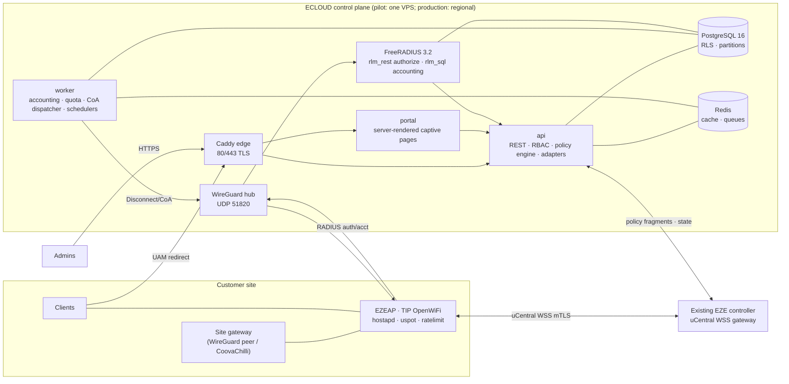
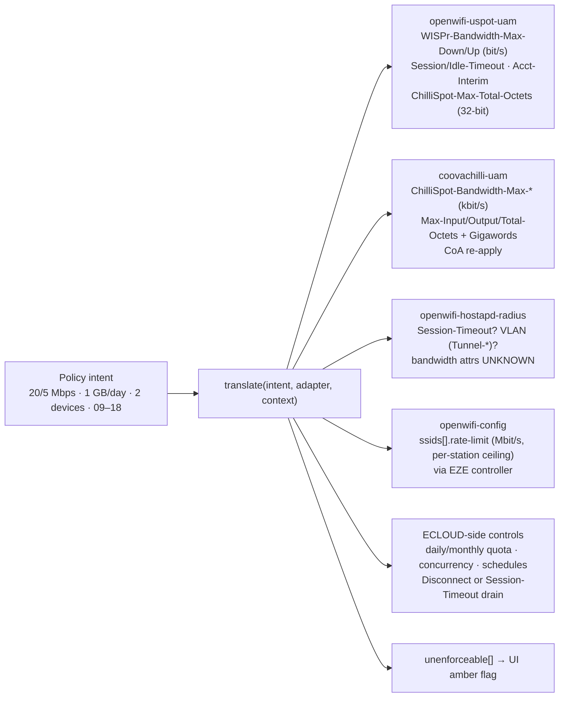

# ECLOUD — Target Architecture (Phase 2)

Status: **PROPOSED — awaiting owner approval before Phase 3.** Nothing has been installed, deployed or changed on any host, device or DNS zone. This document is the top-level synthesis; each section points to the detailed artifact that holds the evidence, diagrams and open items.

Evidence labels used across all Phase 2 artifacts: **VERIFIED FROM EXISTING CODE** (local path), **VERIFIED FROM OFFICIAL DOCUMENTATION** (upstream URL), **VERIFIED ON VPS** (read-only check), **PROPOSED**, **UNKNOWN**, **REQUIRES DEVICE TEST**.

| Area | Detailed artifact |
|---|---|
| EZEAP / TIP OpenWiFi integration and enforcement | [NETWORK_INTEGRATION.md](NETWORK_INTEGRATION.md) |
| Captive portal (uspot, CoovaChilli) | [CAPTIVE_PORTAL_ARCHITECTURE.md](CAPTIVE_PORTAL_ARCHITECTURE.md) |
| AAA / RADIUS | [AAA_ARCHITECTURE.md](AAA_ARCHITECTURE.md) |
| Policy engine, translation, adapters | [POLICY_ENGINE.md](POLICY_ENGINE.md) |
| Multi-tenancy and RBAC | [MULTITENANCY.md](MULTITENANCY.md) |
| Database / ERD | [DATABASE_DESIGN.md](DATABASE_DESIGN.md) |
| WireGuard site connectivity | [WIREGUARD_ARCHITECTURE.md](WIREGUARD_ARCHITECTURE.md) |
| API and services | [API_ARCHITECTURE.md](API_ARCHITECTURE.md) |
| Admin / portal UI | [ADMIN_UI_ARCHITECTURE.md](ADMIN_UI_ARCHITECTURE.md) |
| Security | [SECURITY_ARCHITECTURE.md](SECURITY_ARCHITECTURE.md) |
| Deployment (pilot and production) | [DEPLOYMENT_ARCHITECTURE.md](DEPLOYMENT_ARCHITECTURE.md) |
| Validation ledger and device test plan | [PHASE2_VALIDATION.md](PHASE2_VALIDATION.md) |
| Decisions / status / questions | [DECISIONS.md](DECISIONS.md), [STATUS.md](STATUS.md), [QUESTIONS.md](QUESTIONS.md) |

---

## 1. Cloud control plane

ECLOUD is a multi-tenant control plane. It owns **policy intent**, identities, sessions and accounting; it never carries subscriber traffic. Enforcement happens on the site device (EZEAP or gateway) through mechanisms that have been verified, with ECLOUD-side controls covering what devices cannot do.

Three processes from one TypeScript codebase (`api`, `worker`, `portal`), FreeRADIUS as a protocol front-end, PostgreSQL and Redis as shared state, Caddy as the only public HTTP entry. Details: API_ARCHITECTURE.md §1–2, DEPLOYMENT_ARCHITECTURE.md §2.

## 2. Multi-tenant architecture

- Hierarchy: Platform → Organization → Site → NetworkDevice / NAS / CaptivePortal / WireGuardPeer → Users, UserGroups, ClientDevices → Sessions → AccountingRecords; Policies attach at user, client-device, group, site and temporary scopes. (CONFIRMED requirement; model PROPOSED.)
- Isolation: shared database and schema, `organization_id` on every tenant-scoped table as the leading index column, PostgreSQL Row-Level Security forced on with `SET LOCAL app.current_org` per request as a second lock; a per-tenant export path keeps a future dedicated-database tier possible.
- Tenant resolution on the RADIUS path: NAS identity (source IP over the tunnel, then NAS-Identifier) is primary; Called-Station-Id refinement is REQUIRES DEVICE TEST; realm suffixes optional.
- Guarded cross-tenant paths (portal host → site, RADIUS, webhooks, reports, exports, impersonation) each have an explicit control and a test case. Details: MULTITENANCY.md §1–§7.

## 3. Database model

PostgreSQL 16, UUID v7 application-generated ids for entities, bigint identity for partitioned append-only tables, `timestamptz`, native `macaddr`/`inet`, `text` + CHECK instead of enums, JSONB limited to non-hot-path documents, secrets stored only as references or hashes. Roughly 35 tables in three ERDs (tenancy/admin/RBAC; network/policy; sessions/accounting/portal). Accounting and audit are monthly-partitioned and append-only; usage rollups are materialised counters reconciled from accounting. Plain forward-only SQL migrations run by a runner ported from the existing controller. Sizing: about 5.5 GB per 13 months at 1,000 sessions/day; 10,000 sessions/day does not fit the pilot VPS. Details: DATABASE_DESIGN.md.

## 4. AAA architecture

FreeRADIUS 3.2.x is a pure protocol front-end. Every Access-Request is posted by rlm_rest to the internal authorize endpoint; ECLOUD resolves tenant, NAS adapter and effective policy and returns the decision plus adapter-specific reply attributes. API unavailable means Reject (no fail-open). Accounting is written insert-only by rlm_sql into an isolated `radius` schema and drained by the worker. Subscriber passwords never reach RADIUS: portal logins use a single-use broker credential, so Argon2id hashing stays intact. 802.1X defaults to EAP-TTLS/PAP with PEAP-MSCHAPv2 as a tenant opt-in because it needs NT-hash storage. BlastRADIUS (CVE-2024-3596) mitigations are on by default in 3.2.x; RadSec is mandatory for any NAS reached over the public internet. Dynamic authorization is a worker-driven `radclient` dispatcher from the hub address; every CoA/Disconnect path is REQUIRES DEVICE TEST, with capped Session-Timeout re-auth as the fallback. Details: AAA_ARCHITECTURE.md.

```mermaid
sequenceDiagram
  participant C as Client
  participant AP as EZEAP (uspot)
  participant P as portal.ecloud
  participant A as api
  participant R as FreeRADIUS
  C->>AP: HTTP probe
  AP-->>C: 302 uam-server?res=notyet&challenge&nasid&mac&sessionid&md
  C->>P: GET landing (site resolved from nasid/called, md verified)
  C->>P: credentials / voucher / social
  P->>A: authenticate subscriber, resolve policy
  A-->>P: single-use portal credential (≤16 bytes, 90 s)
  P-->>C: redirect to uamip:uamport/logon (PAP/CHAP encoding)
  AP->>R: Access-Request (User-Name=portal credential)
  R->>A: POST /internal/aaa/authorize
  A-->>R: Accept + reply attributes for adapter uspot-uam
  R-->>AP: Access-Accept (WISPr/ChilliSpot bandwidth, timeouts, octets, Class)
  AP-->>C: res=success · ratelimit client_set
  AP->>R: Accounting Start/Interim/Stop
  R->>A: accounting rows → worker → session, usage counters
```

## 5. Captive portal architecture

One portal service at `portal.ecloud.ezelink.ai` serves tenant/site-branded login, error, success, expired and logout pages (server-rendered, under 50 KB, no third-party assets because the walled garden only admits listed hosts). Both uspot variants and CoovaChilli implement the ChilliSpot UAM redirect protocol, so the page layer is shared while two adapters (`uspot-uam`, `coovachilli-uam`) handle the differences: reply attributes honoured, password-encoding block size, quota attributes, MAC-auth formats and the disconnect path. An identity broker turns username/password, voucher, MAC and social logins into the single-use credential presented through the NAS's native login URL. Verified constraint: uspot runs only on a downstream (AP-routed) interface, so an open-plus-portal SSID always gets an AP-owned subnet even at bridge-mode sites. Details: CAPTIVE_PORTAL_ARCHITECTURE.md.

## 6. Policy engine

Canonical intent fields with fixed units (kbps, bytes, seconds, site-timezone schedules), scopes (temporary, client-device, user, group, site, organization default) and explicit priority. Resolution picks a single winning assignment by `assignment.priority, policy.priority, scope layer, effective_from`, then falls through field by field; schedules, quotas and concurrency are evaluated at authorize time and continuously from accounting. The effective policy is snapshotted on the session. Burst is stored but unsupported by every current adapter. Fail-closed when the database is unavailable, with a cached-allow option. Details: POLICY_ENGINE.md §1–§2, §7.

## 7. Policy translation and adapters

Each adapter declares `AdapterCapabilities` with a verification status per field; the UI renders an enforceability preview from the same declaration. Only attributes verified by A2/A4 appear in a plan; VLAN and hostapd bandwidth are REQUIRES DEVICE TEST, burst is UNSUPPORTED. Default degradation is fallback to ECLOUD-side enforcement with an operator flag. Details: POLICY_ENGINE.md §3–§4, NETWORK_INTEGRATION.md §2.

## 8. Session management

Session lifecycle: authorized → active → interim updates → quota warning → disconnected/expired. Sessions are keyed by `Acct-Session-Id`, which equals the UAM `sessionid` on uspot and CoovaChilli. Concurrency is enforced at authorize time (reject by default until Disconnect is device-verified). Missing Accounting-Stop (uspot kicks without one) is reconciled by a stale-session job and Accounting-On/Off handling. Details: POLICY_ENGINE.md §5, AAA_ARCHITECTURE.md accounting section.

## 9. Accounting pipeline

Start/Interim/Stop → rlm_sql insert-only with idempotency on a unique session key → worker drains into `sessions`, daily/monthly `usage counters` and quota events → Disconnect or Session-Timeout sizing on breach. Gigawords folded; NAS-local interim interval overrides RADIUS on uspot; raw retention 13 months proposed. Details: AAA_ARCHITECTURE.md, DATABASE_DESIGN.md.

## 10. WireGuard site connectivity

Topology A (hub on the VPS, one peer per site gateway) is primary; topology C (RadSec through uCentral `service.radius-proxy`) is the mandatory fallback; topology B (each EZEAP as a peer) is REQUIRES DEVICE TEST because uCentral has no plain WireGuard tunnel type and `service.wireguard-overlay` drives unetd. Overlay proposed from CGNAT space with a per-tenant /24, keepalive 25 s for peers behind NAT, hub UDP 51820, host-native WireGuard via systemd-networkd, per-tenant forwarding default-deny on the hub. The tunnel gives stable NAS IPs for `clients.conf`, a fixed hub IP for `dynamic-authorization.host`, and a path for Disconnect to reach NAT-ed devices. Kernel module is present on the VPS; tools are not installed. Details: WIREGUARD_ARCHITECTURE.md.

## 11. EZEAP / TIP OpenWiFi integration

Verified device facts: per-SSID `rate-limit` is a per-station HTB ceiling in both modes; uspot honours WISPr/ChilliSpot bandwidth, Session/Idle-Timeout, Acct-Interim-Interval and Max-Total-Octets; `dynamic-authorization` maps to hostapd DAS and opens a CoA firewall rule; RADIUS MAC-auth and dynamic VLAN are configurable; the existing EZE controller already runs the uCentral gateway and emits all of these keys. Unknowns: whether hostapd (802.1X/MAC-auth) clients honour any bandwidth attribute, CoA attribute changes, aggregate WAN QoS semantics. Pilot path is Option C (ECLOUD as RADIUS/UAM/DAE target, SSIDs configured in the EZE controller), evolving to Option A (narrow policy-fragment API on the controller). No second OpenWiFi gateway. Details: NETWORK_INTEGRATION.md.

## 12. Admin management

Admin app at `ecloud.ezelink.ai` as a single-build React/TypeScript/Tailwind SPA served statically by Caddy (one React runtime, zero server CPU per page on the pilot VPS; the controller's include-partials-plus-islands pattern is not repeated). Permission-driven navigation for platform, organization, site and operator scopes. Key screens: dashboard, devices/NAS health, users/groups/client devices, voucher batches with print export, policy editor with per-adapter enforceability preview, assignments with priority and effective window, captive portal designer with preview, active sessions with a Disconnect action gated on verified CoA capability, reports, audit viewer, admins/roles. Branding assets in S3-compatible object storage. Details: [ADMIN_UI_ARCHITECTURE.md](ADMIN_UI_ARCHITECTURE.md), API_ARCHITECTURE.md (UI data needs).

## 13. RBAC

Permission catalogue of about 60 `resource:action` keys, role templates for Platform Super Admin, Platform Support, Organization Admin, Site Admin, Operator/Support and Read Only, custom roles per organization (schema-ready, templates only at pilot), role bindings scoped to platform/organization/site, denial by default, audited impersonation ("assume tenant") with guardrails, API keys bound to one role and scope. No role names in authorization code. Details: MULTITENANCY.md §4–§5, API_ARCHITECTURE.md §4.

## 14. Audit logging

Append-only, monthly-partitioned `audit_log` with actor, tenant, action, target, before/after JSONB, IP and request id. Every mutating API call, login, impersonation, secret access and policy change is logged; 24-month retention proposed. Details: DATABASE_DESIGN.md, SECURITY_ARCHITECTURE.md.

## 15. Monitoring

Pilot: node_exporter, cAdvisor, PostgreSQL and FreeRADIUS exporters with a small Prometheus/Grafana or uptime-kuma, Caddy access logs, Docker log caps and a journald cap; alerts via webhook because the host has no mail transport. Security alerts: auth-failure spikes, unknown NAS, CoA failures, RLS violations, privilege changes. Details: DEPLOYMENT_ARCHITECTURE.md, SECURITY_ARCHITECTURE.md.

## 16. Backup and restore

Daily `pg_dump` plus configuration backup, encrypted, to an offsite target that is still REQUIRES CLARIFICATION (OVH snapshots or object storage); restore drill procedure and RTO/RPO proposal included; WAL/PITR deferred to production. Details: DEPLOYMENT_ARCHITECTURE.md.

## 17. API architecture

Versioned REST under `/api/v1/orgs/{orgId}/…` and `/api/v1/platform/…`, about 120 endpoints, permission string per route, cursor pagination, idempotency keys, `If-Match`, RFC 9457 problem+json, Redis rate limits. Internal listener (unpublished) for `/internal/aaa/*` (FreeRADIUS), `/internal/portal/*` (portal process) and `/internal/adapters/openwifi/*` (controller integration). Opaque server-side sessions in `__Host-` cookies, Argon2id, TOTP, prefixed hashed API keys. Express 5, zod → OpenAPI 3.1, pg + Kysely, pino. Event catalogue with an outbox table and eight BullMQ queues. Details: API_ARCHITECTURE.md.

## 18. Development / pilot deployment architecture

Single VPS: native Caddy keeps `q-mira.com` untouched and gains three site blocks; a Docker Compose project (`api`, `portal`, `worker`, `freeradius`, `postgres`, `redis`, exporters) publishes HTTP only to loopback and RADIUS only on the tunnel IP; a memory budget fits 3.7 GiB with swap added. Environment-driven configuration (`.env` 0600, never committed), pinned images, migrations as part of deploy, CI builds and deploys over SSH with rollback. Prerequisites before any deployment are listed in DECISIONS.md D-020 and need Q21 approval. Details: DEPLOYMENT_ARCHITECTURE.md §2–§6.

## 19. Future production scaling architecture

Separate the control plane (stateless `api`/`portal` replicas behind a load balancer, managed PostgreSQL with PITR, Redis cluster) from the AAA edge (FreeRADIUS pairs per region, each NAS with primary and secondary servers, WireGuard hubs per region with redundancy), object storage for backups and assets, a secrets manager, and per-tenant dedicated-database tier when required. Nothing in the pilot design depends on the current VPS. Details: DEPLOYMENT_ARCHITECTURE.md §7, WIREGUARD_ARCHITECTURE.md portability section.

---

## What is verified, what is not

| Category | Verified (code or official docs) | Requires device test or unknown |
|---|---|---|
| Bandwidth | per-SSID `rate-limit` per-station HTB; uspot honours WISPr/ChilliSpot bandwidth attributes | hostapd 802.1X/MAC-auth bandwidth attributes; burst (no mechanism); WAN QoS semantics |
| Timeouts/quota | uspot Session/Idle-Timeout, Acct-Interim, Max-Total-Octets (32-bit on TIP fork); CoovaChilli full octet set | `acct-interval` default precedence; terminate causes |
| Dynamic control | schema → hostapd DAS; uspot kick on `coa` event; CoovaChilli coaport | end-to-end Disconnect, Acct-Stop presence, CoA attribute changes, uspot own DAS |
| Portal | UAM protocol shared by uspot and CoovaChilli; downstream-only constraint; walled-garden keys | uspot variant on EZEAP; bridge-mode uamip reachability; wildcard FQDN behaviour |
| Connectivity | WireGuard semantics; kernel module on VPS; no plain WG tunnel type in uCentral | AP as WireGuard peer (unetd interop); NAT keepalive behaviour on real gateways |
| AAA | FreeRADIUS rlm_rest/rlm_sql semantics; dictionaries; BlastRADIUS defaults | NAS Message-Authenticator support; RadSec via `radius-gw-proxy` |

Full ledger, conflicts and the real-device test plan: PHASE2_VALIDATION.md.
