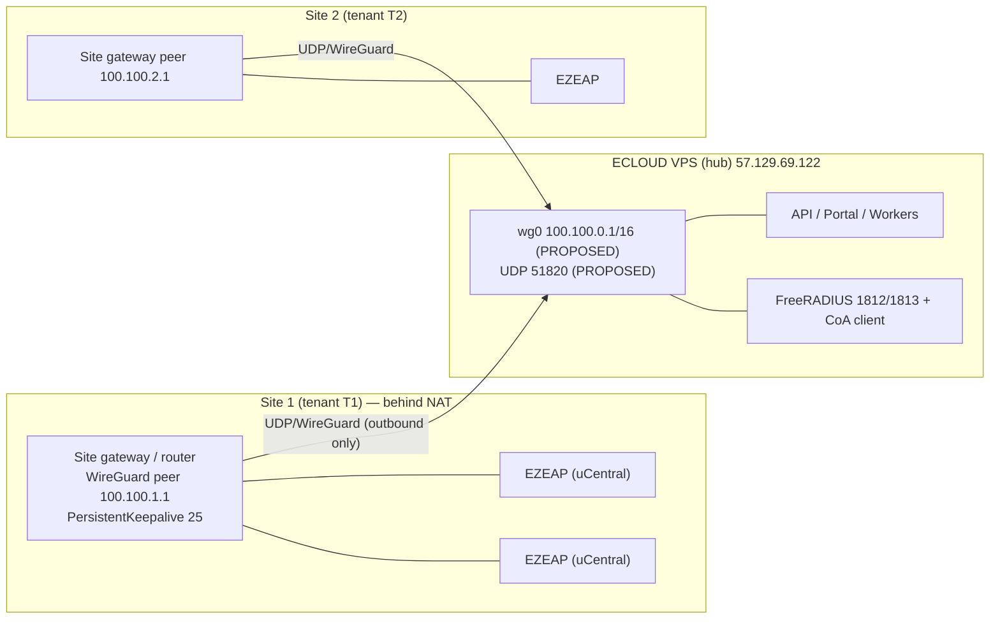
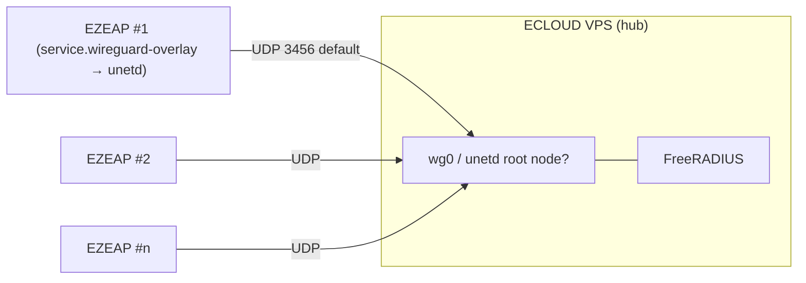
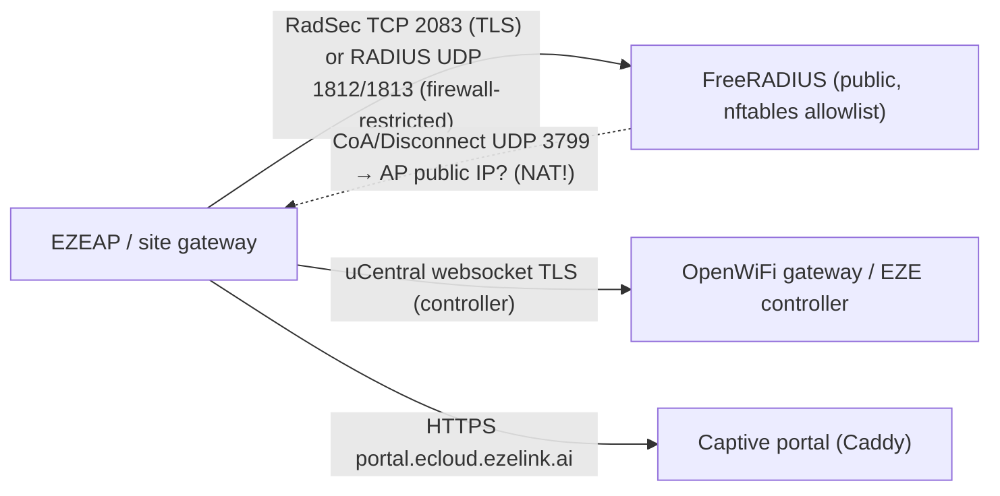
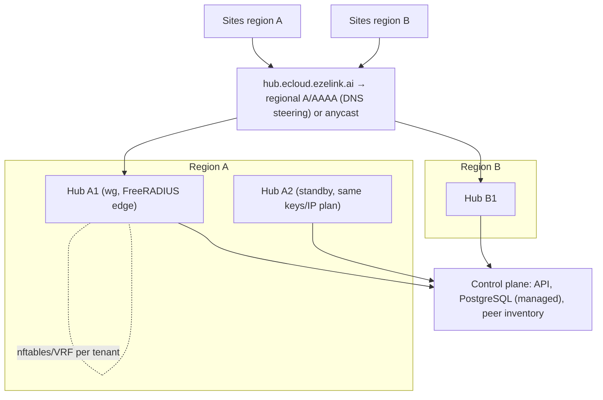

# WireGuard Architecture — ECLOUD ↔ Site Connectivity (Phase 2 design, nothing installed)

Status: PROPOSED design, Phase 2 (design + protocol validation only). No WireGuard has been installed, configured or loaded on any host. Every capability statement carries a label: **VERIFIED FROM EXISTING CODE**, **VERIFIED FROM OFFICIAL DOCUMENTATION**, **VERIFIED ON VPS (read-only)**, **PROPOSED**, **UNKNOWN**, **REQUIRES DEVICE TEST**.

Owner requirement (BRIEF.md): "Cloud-to-site connectivity: WireGuard VPN between ECLOUD VPS and site networks. Investigate/propose topology (VPS hub → site peers?) and its effect on RADIUS, CoA, device management, monitoring, API. Do not install WireGuard."

---

## 1. WireGuard facts this design relies on

| # | Fact | Label | Source |
|---|---|---|---|
| W1 | WireGuard encapsulates IP packets over **UDP**; an interface has one private key and a list of peers, each identified by a public key. | VERIFIED FROM OFFICIAL DOCUMENTATION | https://www.wireguard.com/ ("Cryptokey Routing", "Simple & Easy-to-use") |
| W2 | **Cryptokey routing**: each peer's public key is bound to a list of tunnel IPs/CIDRs (`AllowedIPs`). Incoming decrypted packets are accepted only if their source is in the sending peer's AllowedIPs; outgoing packets are routed to the peer whose AllowedIPs match the destination. | VERIFIED FROM OFFICIAL DOCUMENTATION | https://www.wireguard.com/ ; wg(8) "AllowedIPs — … from which incoming traffic for this peer is allowed and to which outgoing traffic for this peer is directed" https://man7.org/linux/man-pages/man8/wg.8.html |
| W3 | **Built-in roaming**: a peer's `Endpoint` is updated automatically to the most recent source IP:port of correctly authenticated packets. | VERIFIED FROM OFFICIAL DOCUMENTATION | wg(8) "Endpoint … will be updated automatically to the most recent source IP address and port of correctly authenticated packets" |
| W4 | **No dynamic peer management / key distribution**: "All issues of key distribution and pushed configurations are out of scope of WireGuard." Peers must be added/removed by an external system (ECLOUD). | VERIFIED FROM OFFICIAL DOCUMENTATION | https://www.wireguard.com/ |
| W5 | **NAT traversal**: WireGuard is silent when idle; a peer behind NAT/stateful firewall must send `PersistentKeepalive` packets to keep the mapping alive; the quickstart recommends a 25-second interval. | VERIFIED FROM OFFICIAL DOCUMENTATION | https://www.wireguard.com/quickstart/ ("NAT and Firewall Traversal Persistence") |
| W6 | `ListenPort` is optional; if unspecified a random port is chosen. The hub must therefore fix a port and open it in its firewall. | VERIFIED FROM OFFICIAL DOCUMENTATION | wg(8) |
| W7 | **No TCP mode** (UDP only); if a site blocks outbound UDP, WireGuard will not work without an external UDP-over-TCP wrapper. | VERIFIED FROM OFFICIAL DOCUMENTATION | https://www.wireguard.com/known-limitations/ ("TCP Mode") |
| W8 | **MTU**: the kernel device defaults to `ETH_DATA_LEN - overhead`; wg-quick computes `MTU = (route MTU or 1500) - 80`, i.e. **1420** on a 1500-byte path. | VERIFIED FROM OFFICIAL DOCUMENTATION | https://git.zx2c4.com/wireguard-linux/plain/drivers/net/wireguard/device.c (line `dev->mtu = ETH_DATA_LEN - overhead`); https://git.zx2c4.com/wireguard-tools/plain/src/wg-quick/linux.bash (`set_mtu_up`, `mtu=1500`, `mtu - 80`) |
| W9 | **In-tree since Linux 5.6** (released 2020-03-29); the module reports version 1.0.0. | VERIFIED FROM OFFICIAL DOCUMENTATION | https://lists.zx2c4.com/pipermail/wireguard/2020-March/005206.html ("WireGuard 1.0.0 for Linux 5.6 Released"); https://kernelnewbies.org/Linux_5.6 |
| W10 | **Network namespaces / containers**: a WireGuard interface remembers the namespace it was created in and can be moved into another namespace (the basis of running it for/inside containers). | VERIFIED FROM OFFICIAL DOCUMENTATION | https://www.wireguard.com/netns/ |
| W11 | systemd-networkd can create WireGuard interfaces natively via `.netdev` files (`[WireGuard]` PrivateKey/ListenPort, `[WireGuardPeer]` AllowedIPs/Endpoint/PersistentKeepalive). | VERIFIED FROM OFFICIAL DOCUMENTATION | https://man7.org/linux/man-pages/man5/systemd.netdev.5.html |
| W12 | Ubuntu: `apt install wireguard` (module + tools); package `wireguard-tools` exists in Ubuntu 24.04 "noble". | VERIFIED FROM OFFICIAL DOCUMENTATION | https://www.wireguard.com/install/ ; https://packages.ubuntu.com/noble/wireguard-tools |
| W13 | OpenWrt ships `kmod-wireguard` (depends on kmod-crypto-lib-chacha20poly1305, curve25519, udptunnel4/6), `wireguard-tools` (depends on kmod-wireguard) and `luci-proto-wireguard` in its official 23.05 package feeds. | VERIFIED FROM OFFICIAL DOCUMENTATION | https://downloads.openwrt.org/releases/23.05.5/targets/x86/64/packages/Packages ; https://downloads.openwrt.org/releases/23.05.5/packages/x86_64/base/Packages ; …/luci/Packages |
| W14 | Roaming happens without an extra round trip, so an active MITM can replace source addresses ("Roaming Mischief") — data stays confidential; relevant to monitoring, not to secrecy. | VERIFIED FROM OFFICIAL DOCUMENTATION | https://www.wireguard.com/known-limitations/ |

## 2. Pilot VPS facts (read-only check performed 2026-10-07)

Command run (read-only): `ssh -o BatchMode=yes vps 'uname -r; modinfo wireguard | head -5; lsmod | grep -i wireguard; which wg wg-quick; dpkg -l wireguard wireguard-tools; ls -la /etc/wireguard; ip -brief addr'`

| Item | Result | Label |
|---|---|---|
| Kernel | `6.8.0-136-generic` (reboot pending to 6.8.0-142, DISCOVERY_REPORT F-04) | VERIFIED ON VPS |
| Module file | `/lib/modules/6.8.0-136-generic/kernel/drivers/net/wireguard/wireguard.ko.zst`, `version: 1.0.0`, author Jason A. Donenfeld | VERIFIED ON VPS (`modinfo wireguard`) |
| Module loaded | **No** (`lsmod` shows nothing); loads on first `ip link add … type wireguard` | VERIFIED ON VPS |
| Userspace tools | `wg`, `wg-quick` **absent**; `dpkg -l wireguard wireguard-tools` → no packages | VERIFIED ON VPS |
| `/etc/wireguard` | does not exist | VERIFIED ON VPS |
| NIC | single public `ens3` 57.129.69.122/32 + 2001:41d0:701:1100::21c9/128; `docker0` 172.17.0.1/16; no LAN leg | VERIFIED ON VPS; REMOTE_ENVIRONMENT.md §3 |
| Firewall | ufw inactive, iptables INPUT ACCEPT, FORWARD DROP (Docker), DOCKER-USER empty, iptables-nft backend | REMOTE_ENVIRONMENT.md §3–4 |
| Forwarding | `net.ipv4.ip_forward=1` (Docker), `net.ipv6.conf.all.forwarding=0`, `rp_filter=2` | REMOTE_ENVIRONMENT.md §3 |
| Network stack | systemd-networkd + systemd-resolved (netplan) | REMOTE_ENVIRONMENT.md §3 |

Re-verification required after the pending reboot (module path changes with the kernel): `modinfo wireguard | head -3` (read-only). Phase 3 install command (NOT run): `apt install wireguard-tools` — requires owner approval (Q21).

## 3. Can EZEAP / OpenWiFi devices be WireGuard peers?

### 3.1 What the uCentral schema in use (4.2.0) offers

Source: `/Users/danny/Project/ezecontroller/src/schemas/ucentral.full.json` — the schema the EZE controller validates against; `src/ap_config_engine.ts:13-19` pins it to upstream branch `main-v4.2.0-LTS` because "the APs report capabilities.version.schema = 4.2.0" and notes that 4.2.0 "defines six services main later dropped (mdns, wifi-steering, http, rtty, facebook-wifi, **wireguard-overlay**)". **VERIFIED FROM EXISTING CODE.**

`$defs/interface.tunnel` is `oneOf` **mesh, vxlan, l2tp, gre, gre6** — there is **no plain "wireguard" interface tunnel type**. **VERIFIED FROM EXISTING CODE.**

`$defs/service.wireguard-overlay` (full definition, descriptions from upstream `schema/service.wireguard-overlay.yml` on `main-v4.2.0-LTS`; the same file is **404 on `main`**, confirming it was dropped upstream):

| Property | Type / default | Upstream description |
|---|---|---|
| `proto` | const `wireguard-overlay` | "This field must be set to wireguard-overlay." |
| `private-key` | string | "The private key of the device. This key is used to lookup the host entry inside the config." |
| `peer-port` | integer 1–65535, default **3456** | "The network port that shall be used to establish the wireguard tunnel." |
| `peer-exchange-port` | integer, default **3458** | "The network port that shall be used to exchange peer data inside the tunnel." |
| `root-node.key` | string | "The public key of the host." |
| `root-node.endpoint` | `uc-ip` | "The public IP of the host (optional)." |
| `root-node.ipaddr[]` | `uc-ip` | "The list of private IPs that a host is reachable on inside the overlay." |
| `hosts[].name` | string | "The unique name of the host." |
| `hosts[].key` | string | "The public key of the host." |
| `hosts[].endpoint` | `uc-ip` | "The public IP of the host (optional)." |
| `hosts[].subnet[]` | `uc-cidr` | "The list of subnets that shall be routed to this host." |
| `hosts[].ipaddr[]` | `uc-ip` | "The list of private IPs that a host is reachable on inside the overlay." |
| `vxlan.port` | integer, default 4789 | "The network port that shall be used to establish the vxlan overlay." |
| `vxlan.mtu` | integer 256–65535, default **1420** | "The MTU that shall be used by the vxlan tunnel." |
| `vxlan.isolate` | boolean, default true | hosts only talk to the gateway |

Labels: schema structure **VERIFIED FROM EXISTING CODE** (local file) and **VERIFIED FROM OFFICIAL DOCUMENTATION** (https://raw.githubusercontent.com/Telecominfraproject/wlan-ucentral-schema/main-v4.2.0-LTS/schema/service.wireguard-overlay.yml).

### 3.2 What the firmware does with it (upstream renderer)

`renderer/templates/services/wireguard_overlay.uc` on `main-v4.2.0-LTS` (https://raw.githubusercontent.com/Telecominfraproject/wlan-ucentral-schema/main-v4.2.0-LTS/renderer/templates/services/wireguard_overlay.uc) — **VERIFIED FROM OFFICIAL DOCUMENTATION**:
- Enables the **`unetd`** service (`services.set_enabled("unetd", true)`); it is **not** plain `wg`/`wg-quick`. unetd is "WireGuard based VPN connection manager for OpenWrt" (https://git.openwrt.org/project/unetd.git).
- Requires `root-node.key`, `root-node.endpoint` and `root-node.ipaddr`, names the root node **"gateway"** and gives it `subnet = ['0.0.0.0/0']` (default route into the overlay), `keepalive: 10`.
- Derives the AP's public key with `wg pubkey` (so `wireguard-tools` must exist on the AP), writes `/tmp/unet.<time>.json`, and configures UCI `network.unet` with `proto=unet`, `ip4table=<routing table>`; optional VXLAN L2 tunnel over the overlay.
- Only one wireguard/vxlan overlay is allowed per device.
- The wlan-ap feed `feeds/ucentral/unetd/Makefile` depends on `+kmod-wireguard +wireguard-tools` and excludes `TARGET_mediatek` and `TARGET_ipq53xx` (https://raw.githubusercontent.com/Telecominfraproject/wlan-ap/main/feeds/ucentral/unetd/Makefile).
- The default AP image profile `profiles/ucentral-ap.yml` (both `main` and `release/v4.2.0`) lists `gre`, `vxlan`, `radsecproxy`, `radius-gw-proxy`, `uspot` … but **does not list `unetd` or `wireguard-tools`** (https://raw.githubusercontent.com/Telecominfraproject/wlan-ap/release/v4.2.0/profiles/ucentral-ap.yml).

### 3.3 Conclusions for topology selection

| Question | Answer | Label |
|---|---|---|
| Can an EZEAP terminate a *plain* WireGuard tunnel to a wg-quick/networkd hub via the uCentral schema? | No schema object for it. `service.wireguard-overlay` drives **unetd**, whose root node is expected to run unetd too (peer exchange on `peer-exchange-port` inside the tunnel). Interoperability of a unetd AP with a plain WireGuard hub (which would not answer peer-exchange) is **UNKNOWN**. | UNKNOWN / REQUIRES DEVICE TEST |
| Is `unetd` / `wg` present on the EZEAP firmware image? | Not in the default TIP profile; EZE build unknown. Device check (read-only): `opkg list-installed | grep -iE 'wireguard|unetd'`, `ls /sys/module/wireguard`, `ubus list | grep unet`. | REQUIRES DEVICE TEST |
| Could `config-raw` (UCI set/add/delete arrays, `$defs/config-raw`) push a plain `proto=wireguard` interface? | Mechanically possible only if `kmod-wireguard` + `wireguard-tools` + netifd proto handler exist on the image; otherwise rejected. Fragile and bypasses schema validation. | REQUIRES DEVICE TEST; PROPOSED as last resort only |
| Does the existing EZE controller manage WireGuard today? | No. Only 3 files mention it: the schema JSON, a comment in `src/ap_config_engine.ts:16`, and a comment in `src/ucentral_formats.ts:25` ("4.2.0 uses this in service.wireguard-overlay"). No code emits a wireguard-overlay config. | VERIFIED FROM EXISTING CODE |
| Does EZEGATE (gateway firmware material) contain WireGuard precedent? | No file in `/Users/danny/Project/EZEGATE` mentions wireguard/wg-quick/wg0 (grep count 0). | VERIFIED FROM EXISTING CODE |
| Can a generic OpenWrt-based **site gateway** (not an AP) be a plain WireGuard peer? | Yes, via `kmod-wireguard` + `wireguard-tools` (+ `luci-proto-wireguard`) from official OpenWrt feeds, or any Linux box (kernel ≥ 5.6). | VERIFIED FROM OFFICIAL DOCUMENTATION (W13, W9); the specific gateway model is UNKNOWN (Q3) |

**Design consequence:** Topology **A (site gateway peer)** is implementable with verified components today. Topology **B (every AP a peer)** depends on device tests. Topology **C (no VPN)** is the fallback and must work regardless, because the schema has verified RADIUS/RadSec primitives (`service.radius-proxy` with `protocol: radsec`, port default 2083; `interface.ssid.radius.server`; `service.captive.radius`) — **VERIFIED FROM EXISTING CODE** (schema), device behaviour **REQUIRES DEVICE TEST** (owned by A2/A3).

---

## 4. Topology options

### 4.1 Option A — VPS hub ↔ one site gateway peer per site (RECOMMENDED for pilot)



- One tunnel per site; APs reach ECLOUD through the site LAN and the gateway's route to the overlay (`AllowedIPs` on the hub for that peer = gateway tunnel IP **plus the site LAN prefix(es)** that must be reachable from the hub, e.g. for CoA to an AP).
- Works with any Linux/OpenWrt gateway (W13). EZEGATE/EZEOS gateways: WireGuard availability **UNKNOWN** (no precedent in repo).
- RADIUS from APs: NAS source address as seen by FreeRADIUS is the AP's LAN IP (if the gateway routes, no NAT) or the gateway tunnel IP (if the gateway NATs into the tunnel). **Design rule (PROPOSED):** gateway must route, not NAT, so each AP keeps a stable NAS-IP; otherwise `clients.conf` must use the gateway tunnel IP as the shared client entry and `NAS-Identifier` to tell APs apart.

Pros: smallest peer count (= sites), independent of AP firmware, ordinary OpenWrt/Linux tooling, keeps RADIUS/CoA/management/monitoring off the public internet. Cons: needs a gateway device at each site (UNKNOWN whether all sites have one — Q3/Q4); site LAN ranges must be known and non-overlapping across tenants for routing (Q16); single point of failure per site.

### 4.2 Option B — VPS hub ↔ each EZEAP as a peer



- Via `service.wireguard-overlay` the AP side is **unetd**, which expects a unetd root node ("gateway"). Whether a plain WireGuard hub works, or whether the hub must also run unetd (OpenWrt project; Linux build on Ubuntu not verified), is **UNKNOWN / REQUIRES DEVICE TEST**.
- Whether EZEAP images include `unetd`/`wireguard-tools`: **REQUIRES DEVICE TEST** (not in the TIP default profile).
- Scaling: peers = APs (hundreds/thousands). WireGuard itself handles many peers (W2 is a lookup, no per-peer daemon), but the hub's key inventory, AllowedIPs table and keepalive traffic (1 small packet / 25 s / AP) scale linearly; ECLOUD must provision one keypair per AP.
- Pros: no gateway dependency; each AP has a stable tunnel IP (ideal NAS-IP); per-AP isolation by AllowedIPs. Cons: unverified on this firmware; hub becomes critical for *all* AP↔cloud traffic including the uCentral websocket if routed through it; one overlay per device only.

### 4.3 Option C — No VPN: public RADIUS/RadSec + OpenWiFi gateway websocket



- Schema primitives exist (`service.radius-proxy` realms with `protocol: radsec`, port 2083, certificates; plain `radius` realm; `interface.ssid.radius.server.secondary`) — **VERIFIED FROM EXISTING CODE**; device behaviour **REQUIRES DEVICE TEST**.
- **CoA/Disconnect toward a NAS behind NAT is not reachable** without port-forwarding at the site or a NAS-initiated channel (A2 to verify what uCentral offers, e.g. `dynamic-authorization {host, port, secret}` on `interface.ssid.radius` — the AP's DAS listener config, **VERIFIED FROM EXISTING CODE**, semantics REQUIRES DEVICE TEST). This is the main functional argument for a tunnel.
- Pros: nothing to install; no overlay addressing; scales with DNS/anycast. Cons: RADIUS UDP exposed (secret-only protection; RadSec mitigates), CoA blocked by NAT, SNMP/ping monitoring of site devices impossible, firewall allowlists must track dynamic site WAN IPs.

### 4.4 Comparison

| Criterion | A: site gateway peer | B: AP peer (unetd) | C: no VPN |
|---|---|---|---|
| Implementable with verified components now | Yes (W9, W13) if a Linux/OpenWrt gateway exists at the site | No — REQUIRES DEVICE TEST | Yes (schema) — device behaviour REQUIRES DEVICE TEST |
| Peers on hub | = sites (tens) | = APs (hundreds+) | 0 |
| NAT traversal | Site initiates; `PersistentKeepalive=25`; hub needs public UDP port (W5, W6) | same | n/a (but CoA to NAS blocked) |
| RADIUS NAS-IP stability | Stable if gateway routes (no NAT) | Stable (tunnel IP) | Dynamic WAN IP; use RadSec or NAS-Identifier |
| CoA/Disconnect reachability | Yes, hub → site LAN via route in AllowedIPs | Yes | Blocked by NAT unless forwarded |
| Device management (uCentral websocket) | Public (today) or via tunnel | via tunnel or public | Public |
| Monitoring (ping/SNMP/telemetry) | Over tunnel | Over tunnel | Only cloud-side telemetry |
| Tenant isolation primitive | AllowedIPs + nftables per tenant block | AllowedIPs per AP | None network-level; application-level only |
| Blast radius if hub down | Site RADIUS/CoA/monitoring lost; Wi-Fi data plane unaffected (hub is not inline) | same + management if routed through tunnel | RADIUS down anyway |

**Recommendation (PROPOSED):** Pilot with **A** where a site gateway exists; keep **C** fully functional as baseline (RadSec preferred) so sites without a gateway work; evaluate **B** only after a device test proves `unetd`/`wg` presence and hub interoperability. The CoA requirement (D-006) is the decisive factor: if device tests show CoA is needed and the NAS is behind NAT, a tunnel (A or B) is mandatory.

---

## 5. Address plan (PROPOSED — no real site ranges known; Q16 open)

Constraints: avoid Docker `172.17.0.0/16` (VERIFIED ON VPS), avoid the Compose project subnet (DEPLOYMENT_ARCHITECTURE.md proposes `172.28.0.0/16`), and avoid unknown site LANs (Q16). Using RFC 6598 CGNAT space `100.64.0.0/10` for the overlay minimises collision with typical RFC 1918 site LANs (10/8, 172.16/12, 192.168/16) — PROPOSED, not a vendor fact.

| Scope | Prefix (example) | Notes |
|---|---|---|
| Overlay, pilot hub | `100.100.0.0/16` | one /16 per hub (future hubs: `100.101.0.0/16`, …) |
| Hub address | `100.100.0.1/16` | `wg0` on VPS; also the RADIUS/CoA source address seen by sites |
| Reserved hub block | `100.100.0.0/24` | hub, HA peer, monitoring probes |
| Tenant T (1–254) | `100.100.T.0/24` | /24 per tenant = up to 253 site/AP peers per tenant; tenant ID = third octet makes nftables rules trivial |
| Site peer | `100.100.T.S/32` | AllowedIPs on hub: `100.100.T.S/32` (+ site LAN prefixes for option A) |
| Large tenants | allocate several /24s or re-plan with /20 per tenant | re-plan before production |
| IPv6 overlay | ULA `fdXX:XXXX:XXXX::/48` per hub (random per RFC 4193), `/64` per tenant | optional; IPv6 inside tunnel requires `net.ipv6.conf.all.forwarding=1` on hub (currently 0) |
| Site LAN prefixes (option A) | **UNKNOWN** (Q16) | must be unique per tenant for hub routing; if two tenants reuse 192.168.1.0/24, option A needs NAT at the gateway or option B |

Underlay: hub endpoint `57.129.69.122:51820/udp` (port PROPOSED; any free UDP port; 51820 is the conventional wg port). IPv6 endpoint `[2001:41d0:701:1100::21c9]:51820` optional — dual-stack endpoint is a resilience bonus for sites that only have IPv6.

---

## 6. Impact on each ECLOUD function

| Function | With tunnel (A/B) | Without tunnel (C) | Label |
|---|---|---|---|
| **RADIUS auth/acct** | NAS IP = stable tunnel IP (B) or AP LAN IP (A). FreeRADIUS `clients.conf` entries can be CIDR (`ipaddr` accepts IPv4/IPv6 with CIDR — v3.2.x raddb/clients.conf line 53) → one `client` per tenant block `100.100.T.0/24` with a per-tenant secret, or per-NAS entries. FreeRADIUS `rlm_sql` can load clients from the `nas` table (`read_clients = yes`, `client_table = "nas"`, mods-available/sql lines 374–377) so ECLOUD provisions NAS records in PostgreSQL. | NAS IP = site WAN IP (dynamic); prefer RadSec (TLS, cert-based) via `service.radius-proxy`. | FreeRADIUS: VERIFIED FROM OFFICIAL DOCUMENTATION (https://raw.githubusercontent.com/FreeRADIUS/freeradius-server/v3.2.x/raddb/clients.conf , …/mods-available/sql). Per-NAS secret: PROPOSED (SECURITY.md "Protect RADIUS shared secrets"). |
| **CoA / Disconnect (RFC 5176)** | Hub sends CoA-Request/Disconnect-Request to the NAS DAS address:port over the tunnel. FreeRADIUS: `home_server { type = coa; port = 3799 }` + `originate-coa` virtual server, or `radclient … coa|disconnect` (default port 3799). **Route requirement:** the NAS DAS IP must be inside the peer's AllowedIPs on the hub and the site gateway must route it. Which address the AP listens on and which port is configured by `interface.ssid.radius.dynamic-authorization {host, port, secret}` (schema) — whether the AP honours CoA at all is **D-006 / REQUIRES DEVICE TEST** (A2). | Blocked by NAT unless port-forwarded; the NAS public IP changes. | FreeRADIUS CoA: VERIFIED FROM OFFICIAL DOCUMENTATION (https://raw.githubusercontent.com/FreeRADIUS/freeradius-server/v3.2.x/raddb/sites-available/originate-coa ; …/sites-available/coa ; …/man/man1/radclient.1). AP support: REQUIRES DEVICE TEST. |
| **Device management (uCentral websocket to controller)** | Today EZEAPs talk to the EZE controller (`ssh controller`) — not the VPS. Keep that path **public/unchanged** in the pilot; the tunnel carries only ECLOUD traffic. Later, controller endpoint could be given a tunnel address (unetd `root-node.ipaddr`). | Public TLS websocket (OWGW uses server + device certificates — https://raw.githubusercontent.com/Telecominfraproject/wlan-cloud-ucentralgw/main/README.md). | PROPOSED; OWGW: VERIFIED FROM OFFICIAL DOCUMENTATION |
| **Monitoring** | Hub can ICMP-ping gateways/APs, poll SNMP (`service.snmpd` exists in schema — VERIFIED FROM EXISTING CODE; enabling it on EZEAP REQUIRES DEVICE TEST), and read `wg show … latest-handshakes` as a per-site liveness signal (wg(8)). | Only cloud-side signals (RADIUS accounting liveness, controller telemetry). | PROPOSED |
| **API communication (site→cloud)** | Portal/API hostnames resolve publicly; captive clients must reach `portal.ecloud.ezelink.ai` via the walled garden — this is *subscriber* traffic and should **not** traverse the management tunnel (keeps hub bandwidth off the subscriber path and honours "VPS is not the enforcement point"). Only AP/gateway-originated API calls (if any) may use tunnel IPs. | Public HTTPS. | PROPOSED |
| **Multi-tenancy isolation** | Tenant = `/24` block. (1) AllowedIPs: a peer can only inject/receive its own prefixes (W2) — a compromised site cannot spoof another tenant's NAS IP. (2) nftables on hub: `FORWARD` from `wg0` to `wg0` **drop** (no site-to-site, no cross-tenant), `INPUT` from `wg0` limited to RADIUS/CoA-reply/ICMP/SNMP ports. (3) Production: one `wgN` interface + UDP port per tenant (or per-tenant VRF/netns per W10) for hard separation and per-tenant rate limits. | Application-level only. | PROPOSED |

---

## 7. Running WireGuard on the VPS: host-native vs container

| Aspect | Host-native (systemd-networkd `.netdev`/`.network` or `wg-quick@wg0`) | Container (`network_mode: host` or `cap_add: NET_ADMIN`, interface moved into container netns) |
|---|---|---|
| Kernel module | same host module either way (W9; module present — VERIFIED ON VPS) | same |
| Boot ordering | networkd creates `wg0` early → Docker can bind published ports to `100.100.0.1` reliably | `wg0` appears only when the container starts; services binding to its IP must wait |
| Secrets | `/etc/systemd/network/wg0.netdev` 0640 root:systemd-network (PrivateKey) or `/etc/wireguard/wg0.conf` 0600 | key inside container env/volume; container needs NET_ADMIN (wider privilege) |
| Peer changes at runtime | `wg set wg0 peer <pub> allowed-ips …` from the ECLOUD worker via a tiny root helper (sudoers-limited) or `networkctl reload` | `docker exec` into privileged container |
| Fit with existing host | VPS already uses systemd-networkd (REMOTE_ENVIRONMENT.md §3) → W11 is the natural fit | adds a privileged container to a host that today has only loopback-bound containers |
| Recommendation | **Use host-native systemd-networkd `.netdev`** (PROPOSED). Fallback: `wg-quick@wg0.service` from `wireguard-tools`. | Only if the hub must later move into Kubernetes/other orchestrators |

Prerequisites (Phase 3, all need approval): `apt install wireguard-tools` (W12); `sysctl net.ipv4.ip_forward=1` is already set by Docker; IPv6 forwarding only if IPv6 overlay chosen. **Verification commands (read-only):** `modinfo wireguard | head -3`, `wg show` (after install), `networkctl status wg0`.

Example `.netdev` (PROPOSED, placeholders only):
```ini
# /etc/systemd/network/50-wg0.netdev   (mode 0640 root:systemd-network)
[NetDev]
Name=wg0
Kind=wireguard
MTUBytes=1420
[WireGuard]
PrivateKeyFile=/etc/systemd/network/wg0.key   # 0600, never committed
ListenPort=51820
# one [WireGuardPeer] per site peer, generated by ECLOUD
[WireGuardPeer]
PublicKey=<SITE_T1_S1_PUBLIC_KEY>
AllowedIPs=100.100.1.1/32,<SITE_LAN_PREFIX_IF_OPTION_A>
# No Endpoint: the site initiates (behind NAT); hub learns endpoint by roaming (W3)
# No PersistentKeepalive on hub side; the SITE sets PersistentKeepalive=25 (W5)
```
```ini
# /etc/systemd/network/50-wg0.network
[Match]
Name=wg0
[Network]
Address=100.100.0.1/16
```
Site peer (any Linux/OpenWrt gateway, PROPOSED): `[Interface] Address=100.100.1.1/32, PrivateKey=<…>, MTU=1420` / `[Peer] PublicKey=<HUB_PUB>, Endpoint=57.129.69.122:51820, AllowedIPs=100.100.0.0/24, PersistentKeepalive=25`. AllowedIPs on the site side deliberately covers only the hub block, never `0.0.0.0/0`, so subscriber traffic is never pulled into the tunnel.

---

## 8. Key management and peer provisioning (PROPOSED)

```mermaid
sequenceDiagram
  participant Admin as Site Admin (ECLOUD UI)
  participant API as ECLOUD API
  participant DB as PostgreSQL
  participant W as Worker (hub host helper)
  participant GW as Site gateway / AP
  Admin->>API: Create site peer (tenant T, site S)
  API->>API: allocate 100.100.T.S/32 (+ LAN prefixes for option A)
  API->>DB: store public key placeholder, allowed_ips, status=pending
  API-->>Admin: one-time bundle: site config with hub pubkey+endpoint; site generates its own private key (preferred) OR server-generated key shown once
  Admin->>GW: apply config (wg-quick / LuCI / uCentral wireguard-overlay)
  GW->>W: first handshake (UDP 51820)
  W->>W: wg set wg0 peer <pub> allowed-ips …  (idempotent reconcile from DB)
  W->>DB: status=active, last_handshake
```

| Topic | Design |
|---|---|
| Key generation | Preferred: site generates its own keypair and uploads only the public key (hub never sees private keys). Fallback: ECLOUD generates with `wg genkey`, shows once, stores only the public key + hash of the config bundle. For option B the AP's `private-key` must be in the uCentral config (schema requires it) — the controller therefore holds AP private keys; store encrypted at rest, per-tenant KMS key in production. |
| Storage | Table `vpn_peers(tenant_id, site_id, device_id?, public_key UNIQUE, tunnel_ip UNIQUE, allowed_ips[], psk_ref?, status, created_at, rotated_at, revoked_at, last_handshake_at)`; private keys never stored except as described above. (Schema ownership: A6.) |
| Reconciliation | Worker renders the desired peer set from DB and applies the diff with `wg set` (add/remove peers without bouncing the interface); also writes the `.netdev` so a reboot restores the full set. Runs on change and every N minutes. |
| Rotation | Per-peer: add new public key as a second peer entry with the same AllowedIPs is **not** possible (AllowedIPs are unique per interface — moving an IP to a new key removes it from the old one, W2) → rotation = site switches key, hub's reconcile swaps the key atomically; schedule yearly or on staff change. Hub key rotation = all sites update `[Peer] PublicKey` → do via dual hub interfaces (`wg0` old, `wg1` new port) during a migration window. |
| Revocation | `wg set wg0 peer <pub> remove` + DB `revoked_at`; effective immediately (no session to tear down). Also revoke the site's RADIUS client entry/secret. |
| Pre-shared keys | Optional `PresharedKey` per peer for post-quantum hedging (wg(8) `preshared-key`); store as secret ref, not plain. |
| Audit | every peer create/rotate/revoke is a privileged action → audit log (SECURITY.md). |

---

## 9. Firewall rules required on the hub (PROPOSED nftables; Docker uses iptables-nft, so add a separate table and keep Docker's chains untouched)

| Chain | Rule | Why |
|---|---|---|
| `inet ecloud input` | `udp dport 51820 accept` | WireGuard listen port (W6); add IPv6 too |
| `inet ecloud input` | `iifname "wg0" udp dport {1812,1813} ip saddr 100.100.0.0/16 accept` | RADIUS only from overlay |
| `inet ecloud input` | `iifname "wg0" icmp type echo-request accept`; `udp sport 3799` replies are stateful (`ct state established`) | monitoring; CoA replies |
| `inet ecloud input` | `iifname "wg0" tcp dport {80,443} accept` (optional) | only if gateways/APs must call the API via tunnel |
| `inet ecloud input` | `iifname "wg0" drop` (default) | nothing else from sites (no SSH, no Postgres, no Docker ports) |
| `inet ecloud forward` | `iifname "wg0" oifname "wg0" drop` | **no site-to-site / cross-tenant** |
| `inet ecloud forward` | `iifname "wg0" oifname "ens3" drop` | overlay must not use the VPS as an internet gateway |
| `inet ecloud output` | allow `oifname "wg0" udp dport 3799` and ICMP/SNMP(161) to `100.100.0.0/16` (+ site LANs for option A) | CoA, monitoring |
| Docker interaction | Publish FreeRADIUS on `100.100.0.1:1812-1813/udp` **and** (option C) on the public IP behind an allowlist set; `DOCKER-USER` chain is where Docker expects extra filtering (REMOTE_ENVIRONMENT.md §4: empty today) | avoids exposing RADIUS to 0.0.0.0 |
| Host baseline | SSH allow first, then default-deny; console fallback (Q17) | DISCOVERY_REPORT §7.4 lock-out hazard |
| MSS clamp | `oifname "wg0" tcp flags syn tcp option maxseg size set rt mtu` | if any TCP crosses the tunnel; avoids MTU blackholes (W8) |

---

## 10. Failure modes

| Failure | Effect | Mitigation (PROPOSED) |
|---|---|---|
| Hub host/VPS down | All sites lose RADIUS/CoA/monitoring over tunnel; Wi-Fi data plane unaffected (hub not inline) | Option C fallback: configure NAS `secondary` RADIUS server (schema `interface.ssid.radius.server.secondary` — VERIFIED FROM EXISTING CODE) pointing to public RadSec/RADIUS; production: 2 hubs (§11) |
| Site blocks outbound UDP | Tunnel never comes up (W7) | Detect via "never handshaked"; fall back to option C for that site |
| NAT mapping expires | Hub cannot reach site until site sends again | `PersistentKeepalive=25` on site side (W5); alert if `latest-handshake` > 3 min |
| Hub public IP changes | Sites keep sending to old IP; `Endpoint` on sites is resolved from config | Use a DNS name for the hub endpoint and a documented re-resolve procedure; pilot uses the static /32 |
| MTU blackhole (PPPoE/LTE uplinks < 1500) | Large RADIUS packets (EAP) or TCP stalls | MTU 1420 default (W8); lower to 1280 per site if needed; MSS clamp |
| Key compromise at a site | Attacker can source only that peer's AllowedIPs (W2) | Per-tenant RADIUS secrets, nftables input filter, revoke peer, rotate RADIUS secret |
| Overlapping site LANs (option A) | Hub routing ambiguity | Enforce uniqueness per tenant in ECLOUD allocator; or gateway NAT; or option B |
| Pending kernel upgrade (6.8.0-136 → 142) | Module path changes; nothing breaks (in-tree) | Re-run `modinfo wireguard` after reboot |
| Clock/time | WireGuard handshakes carry a timestamp for replay protection (protocol page) — a device with badly wrong time after cold boot may fail to re-handshake until NTP syncs | Ensure NTP on APs/gateways (`service.ntp` in schema) |

---

## 11. Portability to production



| Concern | Production design (PROPOSED) |
|---|---|
| Multiple hubs | One /16 overlay per hub; peer inventory in the central DB tagged with `hub_id`; same reconcile worker runs on each hub |
| Hub HA | Active/standby pair sharing the hub private key and listen port behind a floating IP (provider-dependent) **or** sites configured with two `[Peer]`s (two hub keys, disjoint AllowedIPs /25 halves) — simplest: two independent hubs + NAS secondary RADIUS |
| Anycast/DNS | DNS-steered regional endpoints; anycast UDP works with WireGuard only if a site consistently reaches the same hub (handshake state is per hub) — prefer DNS |
| RADIUS at edge | FreeRADIUS co-located with each hub (tunnel IP = NAS's RADIUS server), proxying/looking up into central PostgreSQL or regional replica |
| Isolation | Per-tenant `wgN` interfaces or netns/VRF (W10), per-tenant nftables sets, per-tenant UDP port or shared port |
| Secrets | Hub private keys and per-tenant RADIUS secrets in a secrets manager; peer public keys in DB |
| Observability | `wg show wg0 dump` exporter → Prometheus (`latest-handshake`, `transfer-rx/tx` per peer) |
| Exit from WireGuard | Because the design treats the tunnel as "transport for management/AAA" only, option C remains viable; no ECLOUD core model couples to tunnel IPs (adapters map NAS identity → policy) |

---

## Evidence index

| Source | Label |
|---|---|
| https://www.wireguard.com/ (Cryptokey Routing, roaming, UDP, key distribution out of scope) | VERIFIED FROM OFFICIAL DOCUMENTATION |
| https://www.wireguard.com/quickstart/ (NAT and Firewall Traversal Persistence, PersistentKeepalive 25 s) | VERIFIED FROM OFFICIAL DOCUMENTATION |
| https://www.wireguard.com/known-limitations/ (TCP Mode, Roaming Mischief) | VERIFIED FROM OFFICIAL DOCUMENTATION |
| https://www.wireguard.com/netns/ (namespace integration, containerization) | VERIFIED FROM OFFICIAL DOCUMENTATION |
| https://www.wireguard.com/install/ ; https://packages.ubuntu.com/noble/wireguard-tools | VERIFIED FROM OFFICIAL DOCUMENTATION |
| https://man7.org/linux/man-pages/man8/wg.8.html (AllowedIPs, Endpoint, ListenPort, persistent-keepalive, preshared-key) | VERIFIED FROM OFFICIAL DOCUMENTATION |
| https://man7.org/linux/man-pages/man8/wg-quick.8.html ; https://git.zx2c4.com/wireguard-tools/plain/src/wg-quick/linux.bash (`set_mtu_up`: 1500−80=1420) | VERIFIED FROM OFFICIAL DOCUMENTATION |
| https://git.zx2c4.com/wireguard-linux/plain/drivers/net/wireguard/device.c (`dev->mtu = ETH_DATA_LEN - overhead`) | VERIFIED FROM OFFICIAL DOCUMENTATION |
| https://lists.zx2c4.com/pipermail/wireguard/2020-March/005206.html ; https://kernelnewbies.org/Linux_5.6 (in-tree since 5.6) | VERIFIED FROM OFFICIAL DOCUMENTATION |
| https://man7.org/linux/man-pages/man5/systemd.netdev.5.html ([WireGuard]/[WireGuardPeer]) | VERIFIED FROM OFFICIAL DOCUMENTATION |
| https://downloads.openwrt.org/releases/23.05.5/… Packages indexes (kmod-wireguard 5.15.167-1, wireguard-tools 1.0.20210914-2, luci-proto-wireguard) | VERIFIED FROM OFFICIAL DOCUMENTATION |
| /Users/danny/Project/ezecontroller/src/schemas/ucentral.full.json (`$defs/service.wireguard-overlay`, `$defs/interface.tunnel`, `$defs/config-raw`, `interface.ssid.radius.{server,dynamic-authorization}`, `service.radius-proxy`, `service.snmpd`, `service.ntp`) | VERIFIED FROM EXISTING CODE |
| /Users/danny/Project/ezecontroller/src/ap_config_engine.ts:13-19 ; src/ucentral_formats.ts:25 (only references to wireguard; schema pinned to main-v4.2.0-LTS) | VERIFIED FROM EXISTING CODE |
| https://raw.githubusercontent.com/Telecominfraproject/wlan-ucentral-schema/main-v4.2.0-LTS/schema/service.wireguard-overlay.yml (descriptions) ; same path on `main` → 404 | VERIFIED FROM OFFICIAL DOCUMENTATION |
| https://raw.githubusercontent.com/Telecominfraproject/wlan-ucentral-schema/main-v4.2.0-LTS/renderer/templates/services/wireguard_overlay.uc (unetd, root node "gateway", keepalive 10, `wg pubkey`) | VERIFIED FROM OFFICIAL DOCUMENTATION |
| https://raw.githubusercontent.com/Telecominfraproject/wlan-ap/main/feeds/ucentral/unetd/Makefile (depends kmod-wireguard + wireguard-tools; excludes mediatek/ipq53xx) | VERIFIED FROM OFFICIAL DOCUMENTATION |
| https://raw.githubusercontent.com/Telecominfraproject/wlan-ap/release/v4.2.0/profiles/ucentral-ap.yml (default package list without unetd/wireguard-tools) | VERIFIED FROM OFFICIAL DOCUMENTATION |
| https://git.openwrt.org/project/unetd.git ("WireGuard based VPN connection manager for OpenWrt") | VERIFIED FROM OFFICIAL DOCUMENTATION |
| https://raw.githubusercontent.com/FreeRADIUS/freeradius-server/v3.2.x/raddb/clients.conf ; …/mods-available/sql ; …/sites-available/coa ; …/sites-available/originate-coa ; …/raddb/proxy.conf ; …/man/man1/radclient.1 | VERIFIED FROM OFFICIAL DOCUMENTATION |
| https://raw.githubusercontent.com/Telecominfraproject/wlan-cloud-ucentralgw/main/README.md (certificates for AP↔gateway websocket) | VERIFIED FROM OFFICIAL DOCUMENTATION |
| `ssh vps` read-only inventory 2026-10-07 (modinfo/lsmod/which/dpkg/ls/ip) | VERIFIED ON VPS |
| /Users/danny/Project/EZECLOUD/REMOTE_ENVIRONMENT.md §2–4, §7, §14 ; DISCOVERY_REPORT.md §7 ; QUESTIONS.md Q3–Q8, Q16, Q17, Q21 | Phase 1 verified facts |
| /Users/danny/Project/EZEGATE (grep wireguard: 0 files) | VERIFIED FROM EXISTING CODE |

## Open questions for owner

1. **Q16 (blocking for option A):** site LAN ranges per site/tenant; are they unique across tenants? Any existing use of 100.64.0.0/10 or 172.28.0.0/16?
2. **Q3/Q4:** does every site have a Linux/OpenWrt-capable gateway (EZEGATE/EZEOS?) that can run WireGuard, or are some sites AP-only (forcing option B or C)?
3. **Q8:** approval of the tunnel approach versus public RadSec; and the hub UDP port (51820 proposed).
4. Is CoA/Disconnect a must-have for the pilot (D-006)? If yes and NAS are behind NAT, a tunnel is mandatory.
5. Who owns site gateway configuration (ECLOUD-generated bundle applied by site staff vs ECLOUD-managed)?
6. May the EZE controller (future) emit `service.wireguard-overlay` for APs, i.e. is topology B desired, given it requires the controller to hold AP private keys?
7. Monitoring over tunnel: is SNMP on EZEAP acceptable, or telemetry-only?
8. Q17: OVH edge firewall/anti-DDoS behaviour for UDP 51820/1812/1813/3799.

## Items requiring a real device test

| # | Test | Decides |
|---|---|---|
| T1 | On an EZEAP: `opkg list-installed | grep -iE 'wireguard|unetd'`; `ls /sys/module/wireguard`; `ubus list | grep unet`; check `capabilities.version.schema` | Whether option B is possible at all |
| T2 | Push a `services.wireguard-overlay` config (lab AP) toward a lab hub running unetd and toward a plain WireGuard hub; observe `wg show`, handshake, routes in `ip4table` | unetd↔plain-wg interoperability; root-node requirements |
| T3 | Option A lab: OpenWrt/Linux gateway peer behind NAT, `PersistentKeepalive=25`; measure handshake persistence over 30 min idle; MTU/PMTU on the site uplink | Keepalive/MTU defaults |
| T4 | RADIUS Access-Request from AP via tunnel: observe NAS-IP-Address / source IP at FreeRADIUS with gateway routing vs NAT | `clients.conf` strategy |
| T5 | CoA/Disconnect from hub to AP DAS address over tunnel (`radclient … disconnect`), with `dynamic-authorization` configured | D-006; route/AllowedIPs requirements |
| T6 | `service.snmpd` enabled on AP; poll from hub tunnel IP | Monitoring over tunnel |
| T7 | Site with UDP egress blocked: confirm failure signature and fallback to RadSec realm (`service.radius-proxy`) | Option C fallback behaviour |
| T8 | Hub failover drill: stop `wg0` on hub; verify NAS `secondary` RADIUS server takes over | Failure mode §10 |
